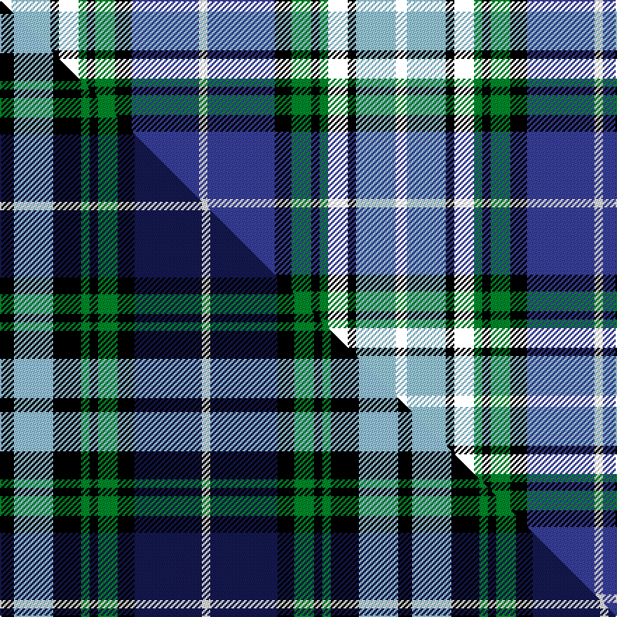

This page is one **sett** — a single exact thread-count. It belongs to the [tartan](/setts/k4lb14k10g3k3g7k6db24w3/)
(the same proportion at any scale), whose colour order is pattern [KWKKGKGKBW](/stripes/kwkkgkgkbw/).

Part of the [Kagame](/tartans/kagame/) tartan — the named design grouping this sett with its other cloths.

Sourced from house-of-tartan.  It is a [10 stripe tartan](/stripes/stripes10/).

Original link [http://www.house-of-tartan.scotland.net/house/TartanViewjs.asp?colr=Def&tnam=7077](http://www.house-of-tartan.scotland.net/house/TartanViewjs.asp?colr=Def&tnam=7077)

## Provenance

Earliest known date: 2006 Presented to President Kagame of Rwanda, by Tom Hunter, christmas 2006

Dataset <small>— provenance for this record, inherited from the source manifest</small>

<dl class="dataset-prov">
<dt>source</dt><dd><a href="/sources/house-of-tartan/">House of Tartan</a></dd>
<dt>data captured from</dt><dd><a href="https://github.com/thetartan/tartan-database/blob/master/data/house-of-tartan/data.csv">https://github.com/thetartan/tartan-database/blob/master/data/house-of-tartan/data.csv</a></dd>
<dt>data date</dt><dd>2017-01-10 <small>(dataset default)</small></dd>
<dt>licence</dt><dd><a href="https://creativecommons.org/licenses/by-nc-nd/4.0/">CC BY-NC-ND 4.0</a></dd>
</dl>

Capture chain <small>— the hands this data passed through, oldest first; each capture carries its own licence</small>

<ol class="capture-chain">
<li><a href="http://www.house-of-tartan.scotland.net/">House of Tartan</a> <small>the weaver/retailer's database — the site is now offline; the URL is kept as the ultimate source's identity</small></li>
<li><a href="https://github.com/thetartan/tartan-database">thetartan/tartan-database</a> <small>2016-2017</small> · <a href="https://creativecommons.org/licenses/by-nc-nd/4.0/">CC BY-NC-ND 4.0</a> <small>Levko Kravets's frozen compilation — the capture we vendored, and where its CC licence text came from</small></li>
<li>this dictionary <small>captured 2026-06-10 · commit 5bf86c7566</small> <small>each re-capture is a git commit to data/sources</small></li>
</ol>

## Thread count
K/8 LB28 K6 K14 G6 K6 G14 K12 DB48 W/6

One full sett is **282 threads**.

## Palette
<table><thead><tr><th>Colour</th><th>Shade</th><th>OKLCh</th></tr></thead><tbody><tr><td>DB</td><td><code style="background-color:#38409C;">#38409C</code> <small style="color:#888">#38409C</small></td><td><small style="color:#888">oklch(42.1% 0.148 274.4)</small></td></tr><tr><td>T</td><td><code style="background-color:#2888C4;">#2888C4</code> <small style="color:#888">#2888C4</small></td><td><small style="color:#888">oklch(60.1% 0.125 241.5)</small></td></tr><tr><td>DB</td><td><code style="background-color:#2C2C80;">#2C2C80</code> <small style="color:#888">#2C2C80</small></td><td><small style="color:#888">oklch(35.0% 0.138 276.6)</small></td></tr><tr><td>G</td><td><code style="background-color:#008B2A;">#008B2A</code> <small style="color:#888">#008B2A</small></td><td><small style="color:#888">oklch(55.4% 0.170 145.9)</small></td></tr><tr><td>K</td><td><code style="background-color:#000000;">#000000</code> <small style="color:#888">#000000</small></td><td><small style="color:#888">oklch(0.0% 0.000 0.0)</small></td></tr><tr><td>LB</td><td><code style="background-color:#98C8E8;">#98C8E8</code> <small style="color:#888">#98C8E8</small></td><td><small style="color:#888">oklch(81.0% 0.068 237.9)</small></td></tr><tr><td>W</td><td><code style="background-color:#F7F7F7;">#F7F7F7</code> <small style="color:#888">#F7F7F7</small></td><td><small style="color:#888">oklch(97.6% 0.000 89.9)</small></td></tr></tbody></table>

# Sample pattern

## Compared to the master

This cloth is one sett of its design; the master sett (the exemplar the design is anchored on) is below for comparison.

Its **ΔTartan distance** from the master is **2.68** — the same measure the nearest-tartans table ranks by (0 is identical; a re-scale of the same cloth is near 0, a recolour or a different proportion further).

<figure class="master-compare" style="margin:0">

this sett
master sett ★

<figcaption style="color:#888;font-size:smaller">One weave of this sett against the <a href="/setts/k5lb14k10g3k3g7k6db24w3/">master sett ★</a>, split on the diagonal: a shared proportion runs seamlessly across it with only the shades shifting; a different proportion breaks on it.</figcaption>
</figure>

## Nearest tartan variants

The nearest existing variants by ΔTartan distance, with this cloth at the top so the swatches line up against it.

ΔTartan

Threads

Variant

Sett

—

282

<a href="/variants/s9/k4lb14k10g3k3g7k6db24w3~x2~lb3203246-db1706275/">Kagame Personal Tartan</a>

<a href="/ttd/edit/#slug=k5lb14k10g3k3g7k6db24w3~x2~lb3203246-db1004274&amp;base=k4lb14k10g3k3g7k6db24w3~x2~lb3203246-db1706275" title="compare in the TTD">0.12</a>

284

<a href="/variants/s9/k5lb14k10g3k3g7k6db24w3~x2~lb3203246-db1004274/">Kagame (Personal)</a>

<a href="/ttd/edit/#slug=ly5lb14k3ly7g3k3g7k6db24w3~x2&amp;base=k4lb14k10g3k3g7k6db24w3~x2~lb3203246-db1706275" title="compare in the TTD">1.85</a>

284

<a href="/variants/s10/ly5lb14k3ly7g3k3g7k6db24w3~x2/">Kagame (Personal)</a>

<a href="/ttd/edit/#slug=k5lb10n10k4n4k4n4k30db21b4db4b24r4~db1404245-b2308259&amp;base=k4lb14k10g3k3g7k6db24w3~x2~lb3203246-db1706275" title="compare in the TTD">1.95</a>

247

<a href="/variants/s13/k5lb10n10k4n4k4n4k30db21t4db4t24r4~db1404245-t2308259/">Anderson-Moffat (Personal)</a>

<a href="/ttd/edit/#slug=gi20r2g3db12k20r2lb3db4lb3~x2~gi2203152-g1903114&amp;base=k4lb14k10g3k3g7k6db24w3~x2~lb3203246-db1706275" title="compare in the TTD">2.11</a>

230

<a href="/variants/s9/gi20r2g3db12k20r2lb3db4lb3~x2~gi2203152-g1903114/">Ithilien Heather (Personal)</a>

<a href="/ttd/edit/#slug=k2w1dp7k1g6k1db7lb1k1~x4&amp;base=k4lb14k10g3k3g7k6db24w3~x2~lb3203246-db1706275" title="compare in the TTD">2.12</a>

204

<a href="/variants/s9/k2w1dp7k1g6k1db7lb1k1~x4/">South Lanarkshire (2002) (District)</a>

<a href="/ttd/edit/#slug=w3db1w1db3k1y1k8g3dp2~x2&amp;base=k4lb14k10g3k3g7k6db24w3~x2~lb3203246-db1706275" title="compare in the TTD">2.34</a>

82

<a href="/variants/s9/w3db1w1db3k1y1k8g3dp2~x2/">Scottish Cultural Society Ltd</a>

<a href="/ttd/edit/#slug=dp2g4k8lo1k1db4lb1db1lb2~x8&amp;base=k4lb14k10g3k3g7k6db24w3~x2~lb3203246-db1706275" title="compare in the TTD">2.36</a>

352

<a href="/variants/s9/dp2g4k8lo1k1db4lb1db1lb2~x8/">Scottish Cultural Society (Corporate</a>

<a href="/ttd/edit/#slug=k5lb5y2lb5k5db25k5lb3dg5r2dg5lb3k5~x2&amp;base=k4lb14k10g3k3g7k6db24w3~x2~lb3203246-db1706275" title="compare in the TTD">2.51</a>

280

<a href="/variants/s13/k5lb5y2lb5k5db25k5lb3dg5r2dg5lb3k5~x2/">Liberton</a>

<a href="/ttd/edit/#slug=r4y3w12k16g5db20k4w2~x2&amp;base=k4lb14k10g3k3g7k6db24w3~x2~lb3203246-db1706275" title="compare in the TTD">2.56</a>

252

<a href="/variants/s8/r4y3w12k16g5db20k4w2~x2/">Iowa Dress</a>

<a href="/ttd/edit/#slug=w2db14lo3k6g2k2w2k2g8dy6k2dy3w2~x4&amp;base=k4lb14k10g3k3g7k6db24w3~x2~lb3203246-db1706275" title="compare in the TTD">2.58</a>

416

<a href="/variants/s13/w2db14lo3k6g2k2w2k2g8dy6k2dy3w2~x4/">Bowling (Clan)</a>

## Neighbour map

Every grey dot is one of 13621 variants placed by the first two principal components of the ΔTartan feature space (42% of its variance). Red is this tartan; blue dots are its nearest — click one to open its page.

<svg viewBox="0 0 640 380" role="img" style="max-width:100%;height:auto;border:1px solid #e0e0e0;border-radius:4px;display:block" xmlns="http://www.w3.org/2000/svg"><image href="/nn/cloud.v1.png" width="640" height="380"/><a href="/variants/s9/k5lb14k10g3k3g7k6db24w3~x2~lb3203246-db1004274/"><circle cx="42.5" cy="148.6" r="4" fill="#3465a4"><title>Kagame (Personal)</title></circle></a><a href="/variants/s10/ly5lb14k3ly7g3k3g7k6db24w3~x2/"><circle cx="47.3" cy="153.8" r="4" fill="#3465a4"><title>Kagame (Personal)</title></circle></a><a href="/variants/s13/k5lb10n10k4n4k4n4k30db21t4db4t24r4~db1404245-t2308259/"><circle cx="65.1" cy="142.7" r="4" fill="#3465a4"><title>Anderson-Moffat (Personal)</title></circle></a><a href="/variants/s9/gi20r2g3db12k20r2lb3db4lb3~x2~gi2203152-g1903114/"><circle cx="76.8" cy="145.1" r="4" fill="#3465a4"><title>Ithilien Heather (Personal)</title></circle></a><a href="/variants/s9/k2w1dp7k1g6k1db7lb1k1~x4/"><circle cx="52.5" cy="163.6" r="4" fill="#3465a4"><title>South Lanarkshire (2002) (District)</title></circle></a><a href="/variants/s9/w3db1w1db3k1y1k8g3dp2~x2/"><circle cx="75.6" cy="153.3" r="4" fill="#3465a4"><title>Scottish Cultural Society Ltd</title></circle></a><a href="/variants/s9/dp2g4k8lo1k1db4lb1db1lb2~x8/"><circle cx="81.5" cy="157.9" r="4" fill="#3465a4"><title>Scottish Cultural Society (Corporate</title></circle></a><a href="/variants/s13/k5lb5y2lb5k5db25k5lb3dg5r2dg5lb3k5~x2/"><circle cx="87.2" cy="113.5" r="4" fill="#3465a4"><title>Liberton</title></circle></a><a href="/variants/s8/r4y3w12k16g5db20k4w2~x2/"><circle cx="48.3" cy="141.1" r="4" fill="#3465a4"><title>Iowa Dress</title></circle></a><a href="/variants/s13/w2db14lo3k6g2k2w2k2g8dy6k2dy3w2~x4/"><circle cx="16.1" cy="151.8" r="4" fill="#3465a4"><title>Bowling (Clan)</title></circle></a><circle cx="45.2" cy="147.7" r="5" fill="#c00000"/><text x="320" y="376" text-anchor="middle" font-size="11" fill="#999">ground</text><text x="11" y="190" text-anchor="middle" font-size="11" fill="#999" transform="rotate(-90 11 190)">complexity</text></svg>

ID: /variants/s9/k4lb14k10g3k3g7k6db24w3~x2~lb3203246-db1706275/
