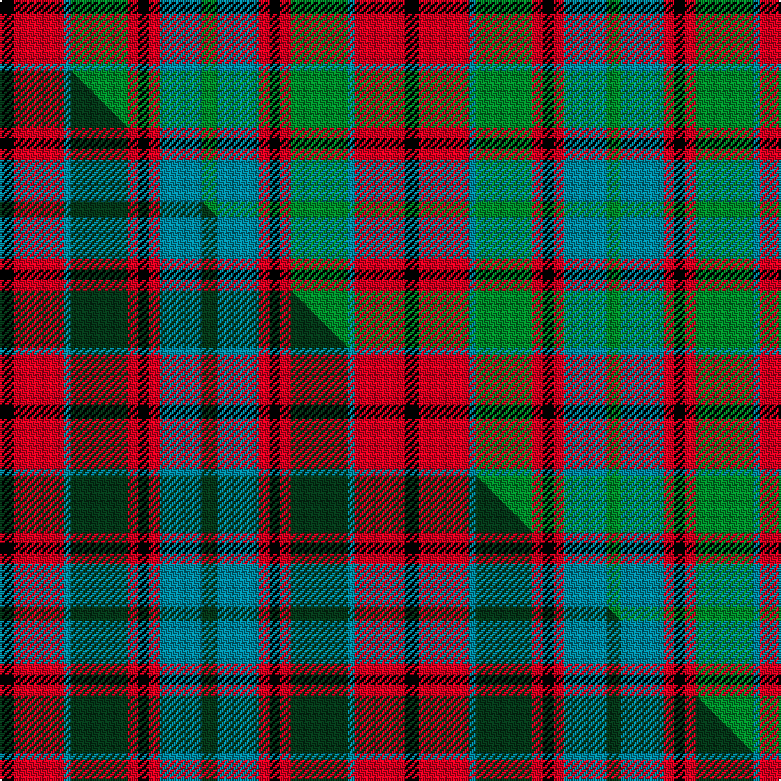

This is one **variant** — a specific cloth: this exact thread count and colourway, with its own
provenance below. It is one weaving of the [sett](/setts/k4r14t2g16r3k3r3t12g4/) (the scale-free proportion — the
same cloth at any scale or shade), whose colour order is pattern [GBRKRGBRK](/stripes/gbrkrgbrk/).

Part of the [Crook](/tartans/c/cr/crook/) tartan — the named design grouping this sett with its other cloths.

Sourced from tartans-authority.  It is a [9 stripe tartan](/stripes/stripes9/).

Original link [https://www.tartanregister.gov.uk/tartanDetails.aspx?ref=4616](https://www.tartanregister.gov.uk/tartanDetails.aspx?ref=4616)

Dataset <small>— provenance for this record, inherited from the source manifest</small>

<dl class="dataset-prov">
<dt>source</dt><dd><a href="/sources/tartans-authority/">Scottish Tartans Authority</a></dd>
<dt>data captured from</dt><dd><a href="https://github.com/thetartan/tartan-database/blob/master/data/tartans-authority/data.csv">https://github.com/thetartan/tartan-database/blob/master/data/tartans-authority/data.csv</a></dd>
<dt>data date</dt><dd>1995 <small>(this record)</small></dd>
<dt>licence</dt><dd><a href="https://creativecommons.org/licenses/by-nc-nd/4.0/">CC BY-NC-ND 4.0</a></dd>
</dl>

Capture chain <small>— the hands this data passed through, oldest first; each capture carries its own licence</small>

<ol class="capture-chain">
<li><a href="https://www.tartansauthority.com/">Scottish Tartans Authority</a> <small>the heritage body's archive — its tartan-ferret record browser is retired (links repaired to the SRT, above)</small></li>
<li><a href="https://github.com/thetartan/tartan-database">thetartan/tartan-database</a> <small>2016-2017</small> · <a href="https://creativecommons.org/licenses/by-nc-nd/4.0/">CC BY-NC-ND 4.0</a> <small>Levko Kravets's frozen compilation — the capture we vendored, and where its CC licence text came from</small></li>
<li>this dictionary <small>captured 2026-06-10 · commit 5bf86c7566</small> <small>each re-capture is a git commit to data/sources</small></li>
</ol>

## Register references

External register numbers recorded for this tartan.

- Scottish Tartans Authority (ITI): 4616

## Thread count
K/8 R28 T4 G32 R6 K6 R6 T24 G/8

One full sett is **228 threads**.

## Palette
<table><thead><tr><th>Colour</th><th>Shade</th><th>OKLCh</th></tr></thead><tbody><tr><td>T</td><td><code style="background-color:#00879F;">#00879F</code> <small style="color:#888">#00879F</small></td><td><small style="color:#888">oklch(57.4% 0.102 216.1)</small></td></tr><tr><td>K</td><td><code style="background-color:#000000;">#000000</code> <small style="color:#888">#000000</small></td><td><small style="color:#888">oklch(0.0% 0.000 0.0)</small></td></tr><tr><td>G</td><td><code style="background-color:#008B2A;">#008B2A</code> <small style="color:#888">#008B2A</small></td><td><small style="color:#888">oklch(55.4% 0.170 145.9)</small></td></tr><tr><td>R</td><td><code style="background-color:#D60020;">#D60020</code> <small style="color:#888">#D60020</small></td><td><small style="color:#888">oklch(55.2% 0.224 25.5)</small></td></tr></tbody></table>

# Sample pattern

## Compared to the master

This cloth is one sett of its design; the master sett (the exemplar the design is anchored on) is below for comparison.

Its **ΔTartan distance** from the master is **0.15** — the same measure the nearest-tartans table ranks by (0 is identical; a re-scale of the same cloth is near 0, a recolour or a different proportion further).

<figure class="master-compare" style="margin:0">

this sett
master sett ★

<figcaption style="color:#888;font-size:smaller">One weave of this sett against the <a href="/setts/k4r14t2dg16r3k3r3t12dg4/">master sett ★</a>, split on the diagonal: a shared proportion runs seamlessly across it with only the shades shifting; a different proportion breaks on it.</figcaption>
</figure>

## Nearest tartan variants

The nearest existing variants by ΔTartan distance, with this cloth at the top so the swatches line up against it.

ΔTartan

Threads

Variant

Sett

—

228

<a href="/variants/s9/k4r14t2g16r3k3r3t12g4~x2/">Crook (Name)</a>

<a href="/ttd/edit/#slug=k4r14t2dg16r3k3r3t12dg4~x2&amp;base=k4r14t2g16r3k3r3t12g4~x2" title="compare in the TTD">0.15</a>

228

<a href="/variants/s9/k4r14t2dg16r3k3r3t12dg4~x2/">Crook</a>

<a href="/ttd/edit/#slug=g14k5db2r21g18k4db18r9k2r12&amp;base=k4r14t2g16r3k3r3t12g4~x2" title="compare in the TTD">1.50</a>

184

<a href="/variants/s10/g14k5db2r21g18k4db18r9k2r12/">Ruben Delanghe (Personal)</a>

<a href="/ttd/edit/#slug=g6k1r1lb2r2~x4~r2109032&amp;base=k4r14t2g16r3k3r3t12g4~x2" title="compare in the TTD">1.79</a>

64

<a href="/variants/s5/g6k1r1lb2r2~x4~r2109032/">Wilson's No.193</a>

<a href="/ttd/edit/#slug=r2g4db8r9g9k2r2~x4&amp;base=k4r14t2g16r3k3r3t12g4~x2" title="compare in the TTD">2.14</a>

272

<a href="/variants/s7/r2g4db8r9g9k2r2~x4/">Stewart (Artefact)</a>

<a href="/ttd/edit/#slug=r2g4db8r9g9k2r2~x2&amp;base=k4r14t2g16r3k3r3t12g4~x2" title="compare in the TTD">2.14</a>

136

<a href="/variants/s7/r2g4db8r9g9k2r2~x2/">Stewart, Plaid</a>

<a href="/ttd/edit/#slug=db3k5r2g2r3g12r6k1r3~x4&amp;base=k4r14t2g16r3k3r3t12g4~x2" title="compare in the TTD">2.52</a>

272

<a href="/variants/s9/db3k5r2g2r3g12r6k1r3~x4/">Fulton (1999) (Name)</a>

<a href="/ttd/edit/#slug=r33g17db50g17r11g17r9k7&amp;base=k4r14t2g16r3k3r3t12g4~x2" title="compare in the TTD">2.56</a>

282

<a href="/variants/s8/r33g17db50g17r11g17r9k7/">Carnegie #3</a>

<a href="/ttd/edit/#slug=w2r7g7k7r2g2k2w1~x5&amp;base=k4r14t2g16r3k3r3t12g4~x2" title="compare in the TTD">2.66</a>

285

<a href="/variants/s8/w2r7g7k7r2g2k2w1~x5/">Al Suwaidi of Abu Dhabi (Personal)</a>

<a href="/ttd/edit/#slug=y5k5g17k6n24k6y3~x2&amp;base=k4r14t2g16r3k3r3t12g4~x2" title="compare in the TTD">2.67</a>

248

<a href="/variants/s7/y5k5g17k6n24k6y3~x2/">Cape Breton District Tartan</a>

<a href="/ttd/edit/#slug=o3g1lb6k1g6o4k1lo1~x4&amp;base=k4r14t2g16r3k3r3t12g4~x2" title="compare in the TTD">2.70</a>

168

<a href="/variants/s8/o3g1lb6k1g6o4k1lo1~x4/">Orkney District Tartan</a>

## Neighbour map

Every grey dot is one of 13621 variants placed by the first two principal components of the ΔTartan feature space (42% of its variance). Red is this tartan; blue dots are its nearest — click one to open its page. The map is a flat projection of a many-dimensional space — [how to read it](/posts/neighbourhood-maps/).

<svg viewBox="0 0 640 380" role="img" style="max-width:100%;height:auto;border:1px solid #e0e0e0;border-radius:4px;display:block" xmlns="http://www.w3.org/2000/svg"><image href="/nn/cloud.v1.png" width="640" height="380"/><a href="/variants/s9/k4r14t2dg16r3k3r3t12dg4~x2/"><circle cx="138.7" cy="194.8" r="4" fill="#3465a4"><title>Crook</title></circle></a><a href="/variants/s10/g14k5db2r21g18k4db18r9k2r12/"><circle cx="153.5" cy="187.6" r="4" fill="#3465a4"><title>Ruben Delanghe (Personal)</title></circle></a><a href="/variants/s5/g6k1r1lb2r2~x4~r2109032/"><circle cx="129.9" cy="206.3" r="4" fill="#3465a4"><title>Wilson's No.193</title></circle></a><a href="/variants/s7/r2g4db8r9g9k2r2~x4/"><circle cx="132.0" cy="241.3" r="4" fill="#3465a4"><title>Stewart (Artefact)</title></circle></a><a href="/variants/s7/r2g4db8r9g9k2r2~x2/"><circle cx="132.0" cy="241.3" r="4" fill="#3465a4"><title>Stewart, Plaid</title></circle></a><a href="/variants/s9/db3k5r2g2r3g12r6k1r3~x4/"><circle cx="162.9" cy="174.5" r="4" fill="#3465a4"><title>Fulton (1999) (Name)</title></circle></a><a href="/variants/s8/r33g17db50g17r11g17r9k7/"><circle cx="138.3" cy="213.8" r="4" fill="#3465a4"><title>Carnegie #3</title></circle></a><a href="/variants/s8/w2r7g7k7r2g2k2w1~x5/"><circle cx="86.3" cy="203.5" r="4" fill="#3465a4"><title>Al Suwaidi of Abu Dhabi (Personal)</title></circle></a><a href="/variants/s7/y5k5g17k6n24k6y3~x2/"><circle cx="150.4" cy="210.1" r="4" fill="#3465a4"><title>Cape Breton District Tartan</title></circle></a><a href="/variants/s8/o3g1lb6k1g6o4k1lo1~x4/"><circle cx="97.8" cy="208.0" r="4" fill="#3465a4"><title>Orkney District Tartan</title></circle></a><circle cx="135.0" cy="197.5" r="5" fill="#c00000"/><text x="320" y="376" text-anchor="middle" font-size="11" fill="#999">ground</text><text x="11" y="190" text-anchor="middle" font-size="11" fill="#999" transform="rotate(-90 11 190)">complexity</text></svg>

ID: /variants/s9/k4r14t2g16r3k3r3t12g4~x2/
