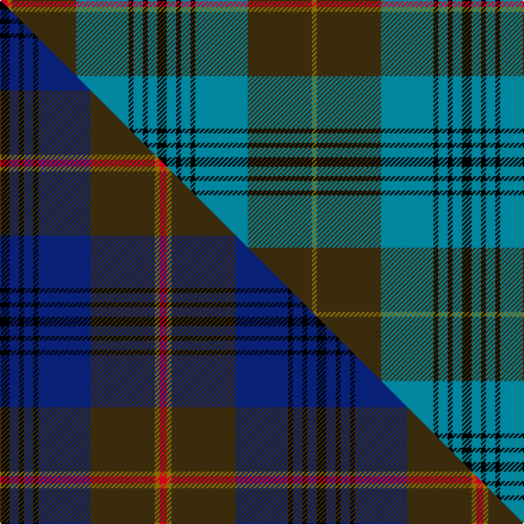

This is one **variant** — a specific cloth: this exact thread count and colourway, with its own
provenance below. It is one weaving of the [sett](/setts/k4t4k2t4k2t22dy27y2r3/) (the scale-free proportion — the
same cloth at any scale or shade), whose colour order is pattern [GGBKBKBKBKBKBGGR](/stripes/ggbkbkbkbkbkbggr/).

Part of the [Falkirk](/tartans/falkirk-2/) tartan — the named design grouping this sett with its other cloths.

Sourced from house-of-tartan.  It is a [16 stripe tartan](/stripes/stripes16/).

Original link [http://www.house-of-tartan.scotland.net/house/TartanViewjs.asp?colr=Def&tnam=2347](http://www.house-of-tartan.scotland.net/house/TartanViewjs.asp?colr=Def&tnam=2347)

## Provenance

Earliest known date: 1989 The original Falkirk "Tartan" , now in the National Museum of Scotland, has a place in history as one of the earliest examples of Scottish cloth in existence. It is a direct link back to the Roman occupation of the area around 250 A.D.and was found stuffed into a pot filled with over 2000 silver coins. This early Celtic tweed used undyed yarn to give a herringbone pattern in brown hues and is considered to be a "poor man's plaid". The Falkirk District Tartan is alive with vibrant colour to reflect that part of Scotland as it is seen today. It was the winning entry by Jim McGeorge (aided by Tony Murray of Stirling) in a public competition run by Falkirk Town Centre Management to create a new image for an area that was rising from the ashes of its former industrial glory. Brown - represents the dominant colour of the original cloth; blue - links Falkirk district with sea via the River Forth and the canals. It is also the colour of the Falkirk "Bairns." Red - is the colour of the blast furnace flames from the Falkirk foundries and yellow - signifies wealth and prosperity. Black - the black lines intersect on blue to show Falkirk at the crossroads of all roads through the region.

Dataset <small>— provenance for this record, inherited from the source manifest</small>

<dl class="dataset-prov">
<dt>source</dt><dd><a href="/sources/house-of-tartan/">House of Tartan</a></dd>
<dt>data captured from</dt><dd><a href="https://github.com/thetartan/tartan-database/blob/master/data/house-of-tartan/data.csv">https://github.com/thetartan/tartan-database/blob/master/data/house-of-tartan/data.csv</a></dd>
<dt>data date</dt><dd>1989 <small>(this record)</small></dd>
<dt>licence</dt><dd><a href="https://creativecommons.org/licenses/by-nc-nd/4.0/">CC BY-NC-ND 4.0</a></dd>
</dl>

Capture chain <small>— the hands this data passed through, oldest first; each capture carries its own licence</small>

<ol class="capture-chain">
<li><a href="http://www.house-of-tartan.scotland.net/">House of Tartan</a> <small>the weaver/retailer's database — the site is now offline; the URL is kept as the ultimate source's identity</small></li>
<li><a href="https://github.com/thetartan/tartan-database">thetartan/tartan-database</a> <small>2016-2017</small> · <a href="https://creativecommons.org/licenses/by-nc-nd/4.0/">CC BY-NC-ND 4.0</a> <small>Levko Kravets's frozen compilation — the capture we vendored, and where its CC licence text came from</small></li>
<li>this dictionary <small>captured 2026-06-10 · commit 5bf86c7566</small> <small>each re-capture is a git commit to data/sources</small></li>
</ol>

## Thread count
R/6 Y4 DY54 T44 K4 T8 K4 T8 K8 T8 K4 T8 K4 T44 DY54 Y/4

One full sett is **522 threads**.

## Palette
<table><thead><tr><th>Colour</th><th>Shade</th><th>OKLCh</th></tr></thead><tbody><tr><td>T</td><td><code style="background-color:#00879F;">#00879F</code> <small style="color:#888">#00879F</small></td><td><small style="color:#888">oklch(57.4% 0.102 216.1)</small></td></tr><tr><td>DB</td><td><code style="background-color:#082077;">#082077</code> <small style="color:#888">#082077</small></td><td><small style="color:#888">oklch(30.0% 0.149 265.1)</small></td></tr><tr><td>DR</td><td><code style="background-color:#55120C;">#55120C</code> <small style="color:#888">#55120C</small></td><td><small style="color:#888">oklch(30.0% 0.099 29.3)</small></td></tr><tr><td>LO</td><td><code style="background-color:#FF9C34;">#FF9C34</code> <small style="color:#888">#FF9C34</small></td><td><small style="color:#888">oklch(77.9% 0.161 61.8)</small></td></tr><tr><td>K</td><td><code style="background-color:#000000;">#000000</code> <small style="color:#888">#000000</small></td><td><small style="color:#888">oklch(0.0% 0.000 0.0)</small></td></tr><tr><td>R</td><td><code style="background-color:#D60020;">#D60020</code> <small style="color:#888">#D60020</small></td><td><small style="color:#888">oklch(55.2% 0.224 25.5)</small></td></tr><tr><td>DY</td><td><code style="background-color:#3A2B0D;">#3A2B0D</code> <small style="color:#888">#3A2B0D</small></td><td><small style="color:#888">oklch(30.0% 0.049 82.0)</small></td></tr><tr><td>Y</td><td><code style="background-color:#8B6E00;">#8B6E00</code> <small style="color:#888">#8B6E00</small></td><td><small style="color:#888">oklch(55.1% 0.113 90.4)</small></td></tr></tbody></table>

# Sample pattern

## Compared to the master

This cloth is one sett of its design; the master sett (the exemplar the design is anchored on) is below for comparison.

Its **ΔTartan distance** from the master is **0.18** — the same measure the nearest-tartans table ranks by (0 is identical; a re-scale of the same cloth is near 0, a recolour or a different proportion further).

<figure class="master-compare" style="margin:0">

this sett
master sett ★

<figcaption style="color:#888;font-size:smaller">One weave of this sett against the <a href="/setts/k4db4k2db4k2db22dy27y2r3/">master sett ★</a>, split on the diagonal: a shared proportion runs seamlessly across it with only the shades shifting; a different proportion breaks on it.</figcaption>
</figure>

## Nearest tartan variants

The nearest existing variants by ΔTartan distance, with this cloth at the top so the swatches line up against it.

ΔTartan

Threads

Variant

Sett

—

522

<a href="/variants/s9/k4t4k2t4k2t22dy27y2r3~x2/">Falkirk District Tartan</a>

<a href="/ttd/edit/#slug=dg24dp4dg3dp8k3lb8dp2lb2dp4lb2dp2lb8k3dp8dg3dp4dg24g2~x2~dg1806142-g2408144&amp;base=k4t4k2t4k2t22dy27y2r3~x2" title="compare in the TTD">1.93</a>

404

<a href="/variants/s18/dg24dp4dg3dp8k3lb8dp2lb2dp4lb2dp2lb8k3dp8dg3dp4dg24g2~x2~dg1806142-g2408144/">Jones Hunting</a>

<a href="/ttd/edit/#slug=db10g5db5g60db13g10dt67g5k5g5k5g13y10~db1106275-dt1204274&amp;base=k4t4k2t4k2t22dy27y2r3~x2" title="compare in the TTD">1.95</a>

406

<a href="/variants/s13/db10g5db5g60db13g10dbi67g5k5g5k5g13y10~db1106275-dbi1204274/">Princess Beatrice Hunting</a>

<a href="/ttd/edit/#slug=g3db2ri1db17r2g8r4lb1db8r2g17r2ri1db3lb1~x2~ri2806019-r2109032&amp;base=k4t4k2t4k2t22dy27y2r3~x2" title="compare in the TTD">2.41</a>

280

<a href="/variants/s15/g3db2ri1db17r2g8r4lb1db8r2g17r2ri1db3lb1~x2~ri2806019-r2109032/">Glenorchy - National Archives</a>

<a href="/ttd/edit/#slug=dg8dr3dg8k10dp5g32dg5g32dp5k10dg8dr3dg8dp3~x2~dg1603171-g2203152&amp;base=k4t4k2t4k2t22dy27y2r3~x2" title="compare in the TTD">2.43</a>

538

<a href="/variants/s14/dg8dr3dg8k10dp5g32dg5g32dp5k10dg8dr3dg8dp3~x2~dg1603171-g2203152/">Scottish Power Corporate Tartan</a>

<a href="/ttd/edit/#slug=g5db20g2db2g2db2g25dr2g2dr17k8g2w2~x2&amp;base=k4t4k2t4k2t22dy27y2r3~x2" title="compare in the TTD">2.47</a>

350

<a href="/variants/s13/g5db20g2db2g2db2g25dr2g2dr17k8g2w2~x2/">Cameron Boyle, The (Personal)</a>

<a href="/ttd/edit/#slug=db36g10dr2g10lb2g10dr2g10k14dr2db12dr3db2dr2db4lb2~x2&amp;base=k4t4k2t4k2t22dy27y2r3~x2" title="compare in the TTD">2.49</a>

416

<a href="/variants/s16/db36g10dr2g10lb2g10dr2g10k14dr2db12dr3db2dr2db4lb2~x2/">Rankin (1998) (Name)</a>

<a href="/ttd/edit/#slug=b15g5b5g60b13g10db67g5k5g5k5g13y10&amp;base=k4t4k2t4k2t22dy27y2r3~x2" title="compare in the TTD">2.51</a>

411

<a href="/variants/s13/b15g5b5g60b13g10db67g5k5g5k5g13y10/">Beatrice, Princess.. (hunting)</a>

<a href="/ttd/edit/#slug=db30lo2db2lo2db5g5k15db5g20dr2k3dr2g20db5k15g5db20lo2db2~x2~db1403246&amp;base=k4t4k2t4k2t22dy27y2r3~x2" title="compare in the TTD">2.56</a>

584

<a href="/variants/s19/db30lo2db2lo2db5g5k15db5g20dr2k3dr2g20db5k15g5db20lo2db2~x2~db1403246/">Pennsylvania American District Tartan</a>

<a href="/ttd/edit/#slug=db10r5g5r5g60db13g10dt67g5k5g5k5g13y10~db1106275-dt1204274&amp;base=k4t4k2t4k2t22dy27y2r3~x2" title="compare in the TTD">2.59</a>

416

<a href="/variants/s14/db10r5g5r5g60db13g10dbi67g5k5g5k5g13y10~db1106275-dbi1204274/">Beatrice Princess.. (Hunting) Royal Family Tartan</a>

<a href="/ttd/edit/#slug=lb4o4k4o18k3n36w3n36k3o18k4o4lb4o3~x2~o2500000-n1900000&amp;base=k4t4k2t4k2t22dy27y2r3~x2" title="compare in the TTD">2.64</a>

562

<a href="/variants/s14/lb4o4k4o18k3n36w3n36k3o18k4o4lb4o3~x2~o2500000-n1900000/">Hebridean Granite</a>

## Neighbour map

Every grey dot is one of 13621 variants placed by the first two principal components of the ΔTartan feature space (42% of its variance). Red is this tartan; blue dots are its nearest — click one to open its page.

<svg viewBox="0 0 640 380" role="img" style="max-width:100%;height:auto;border:1px solid #e0e0e0;border-radius:4px;display:block" xmlns="http://www.w3.org/2000/svg"><image href="/nn/cloud.v1.png" width="640" height="380"/><a href="/variants/s18/dg24dp4dg3dp8k3lb8dp2lb2dp4lb2dp2lb8k3dp8dg3dp4dg24g2~x2~dg1806142-g2408144/"><circle cx="201.7" cy="124.0" r="4" fill="#3465a4"><title>Jones Hunting</title></circle></a><a href="/variants/s13/db10g5db5g60db13g10dbi67g5k5g5k5g13y10~db1106275-dbi1204274/"><circle cx="226.2" cy="125.7" r="4" fill="#3465a4"><title>Princess Beatrice Hunting</title></circle></a><a href="/variants/s15/g3db2ri1db17r2g8r4lb1db8r2g17r2ri1db3lb1~x2~ri2806019-r2109032/"><circle cx="227.3" cy="128.5" r="4" fill="#3465a4"><title>Glenorchy - National Archives</title></circle></a><a href="/variants/s14/dg8dr3dg8k10dp5g32dg5g32dp5k10dg8dr3dg8dp3~x2~dg1603171-g2203152/"><circle cx="208.8" cy="157.0" r="4" fill="#3465a4"><title>Scottish Power Corporate Tartan</title></circle></a><a href="/variants/s13/g5db20g2db2g2db2g25dr2g2dr17k8g2w2~x2/"><circle cx="180.5" cy="131.5" r="4" fill="#3465a4"><title>Cameron Boyle, The (Personal)</title></circle></a><a href="/variants/s16/db36g10dr2g10lb2g10dr2g10k14dr2db12dr3db2dr2db4lb2~x2/"><circle cx="200.9" cy="110.3" r="4" fill="#3465a4"><title>Rankin (1998) (Name)</title></circle></a><a href="/variants/s13/b15g5b5g60b13g10db67g5k5g5k5g13y10/"><circle cx="219.7" cy="130.0" r="4" fill="#3465a4"><title>Beatrice, Princess.. (hunting)</title></circle></a><a href="/variants/s19/db30lo2db2lo2db5g5k15db5g20dr2k3dr2g20db5k15g5db20lo2db2~x2~db1403246/"><circle cx="177.6" cy="118.9" r="4" fill="#3465a4"><title>Pennsylvania American District Tartan</title></circle></a><a href="/variants/s14/db10r5g5r5g60db13g10dbi67g5k5g5k5g13y10~db1106275-dbi1204274/"><circle cx="196.9" cy="105.5" r="4" fill="#3465a4"><title>Beatrice Princess.. (Hunting) Royal Family Tartan</title></circle></a><a href="/variants/s14/lb4o4k4o18k3n36w3n36k3o18k4o4lb4o3~x2~o2500000-n1900000/"><circle cx="255.2" cy="131.4" r="4" fill="#3465a4"><title>Hebridean Granite</title></circle></a><circle cx="240.1" cy="124.9" r="5" fill="#c00000"/><text x="320" y="376" text-anchor="middle" font-size="11" fill="#999">ground</text><text x="11" y="190" text-anchor="middle" font-size="11" fill="#999" transform="rotate(-90 11 190)">complexity</text></svg>

ID: /variants/s9/k4t4k2t4k2t22dy27y2r3~x2/
