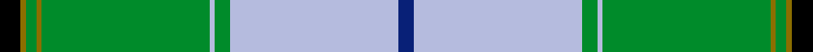

This is one **variant** — a specific cloth: this exact thread count and colourway, with its own
provenance below. It is one weaving of the [sett](/setts/k4y1g2y1g32lb1g3lb32db3/) (the scale-free proportion — the
same cloth at any scale or shade), whose colour order is pattern [BWGWGGGGK](/stripes/bwgwggggk/).

Part of the [McClurg, William Thomas](/tartans/m/mc/mcclurg-william-thomas/) tartan — the named design grouping this sett with its other cloths.

Sourced from register-of-tartans.  It is a [9 stripe tartan](/stripes/stripes9/).

Original link [https://www.tartanregister.gov.uk/tartanDetails.aspx?ref=6016](https://www.tartanregister.gov.uk/tartanDetails.aspx?ref=6016)

2 attestations — the source records this cloth was collapsed from (oldest owns this page)

<ul>
<li>01/01/2009 — McClurg, William Thomas (Personal) (register-of-tartans, <a href="https://www.tartanregister.gov.uk/tartanDetails.aspx?ref=6016">record</a>)  <em>A variation of the McClurg tartan designed for William Thomas McClurg, family genealogist. Designed by Matthew Newsome and commissioned by Kathleen McClurg, whose ancestors migrated from Ulster to Pensylvania and later spread across the USA as far as California.</em></li>
<li>2009 — McClurg, William Thomas (Personal) (tartans-authority, <a href="https://www.tartanregister.gov.uk/tartanDetails.aspx?ref=7912">record</a>)  <em>A variation of the McClurg tartan designed for William Thomas McClurg, family genealogist. Designed by Matthew Newsome and commissioned by Kathleen McClurg, whose anscestors migrated from Ulster to Penssylvania and later spread across the USA as far as California.</em></li>
</ul>

Dataset <small>— provenance for this record, inherited from the source manifest</small>

<dl class="dataset-prov">
<dt>source</dt><dd><a href="/sources/register-of-tartans/">Scottish Register of Tartans</a></dd>
<dt>data captured from</dt><dd><a href="https://github.com/thetartan/tartan-database/blob/master/data/register-of-tartans/data.csv">https://github.com/thetartan/tartan-database/blob/master/data/register-of-tartans/data.csv</a></dd>
<dt>data date</dt><dd>2009 <small>(this record)</small></dd>
<dt>licence</dt><dd><a href="https://www.tartanregister.gov.uk/copyright">Crown copyright</a></dd>
</dl>

Capture chain <small>— the hands this data passed through, oldest first; each capture carries its own licence</small>

<ol class="capture-chain">
<li><a href="https://www.tartanregister.gov.uk/">Scottish Register of Tartans</a> · <a href="https://www.tartanregister.gov.uk/copyright">Crown copyright</a> <small>the living register — still published by National Records of Scotland</small></li>
<li><a href="https://github.com/thetartan/tartan-database">thetartan/tartan-database</a> <small>2016-2017</small> · <a href="https://creativecommons.org/licenses/by-nc-nd/4.0/">CC BY-NC-ND 4.0</a> <small>Levko Kravets's frozen compilation — the capture we vendored, and where its CC licence text came from</small></li>
<li>this dictionary <small>captured 2026-06-10 · commit 5bf86c7566</small> <small>each re-capture is a git commit to data/sources</small></li>
</ol>

## Register references

External register numbers recorded for this tartan.

- Scottish Register of Tartans: [7912](https://www.tartanregister.gov.uk/tartanDetails?ref=7912)
- Scottish Tartans Authority (ITI): 7912

## Thread count
K/8 Y2 G4 Y2 G64 LB2 G6 LB64 DB/6

One full sett is **302 threads**.

## Palette
<table><thead><tr><th>Colour</th><th>Shade</th><th>OKLCh</th></tr></thead><tbody><tr><td>DB</td><td><code style="background-color:#082077;">#082077</code> <small style="color:#888">#082077</small></td><td><small style="color:#888">oklch(30.0% 0.149 265.1)</small></td></tr><tr><td>G</td><td><code style="background-color:#008B2A;">#008B2A</code> <small style="color:#888">#008B2A</small></td><td><small style="color:#888">oklch(55.4% 0.170 145.9)</small></td></tr><tr><td>K</td><td><code style="background-color:#000000;">#000000</code> <small style="color:#888">#000000</small></td><td><small style="color:#888">oklch(0.0% 0.000 0.0)</small></td></tr><tr><td>LB</td><td><code style="background-color:#B5BBDE;">#B5BBDE</code> <small style="color:#888">#B5BBDE</small></td><td><small style="color:#888">oklch(79.9% 0.050 277.6)</small></td></tr><tr><td>Y</td><td><code style="background-color:#8B6E00;">#8B6E00</code> <small style="color:#888">#8B6E00</small></td><td><small style="color:#888">oklch(55.1% 0.113 90.4)</small></td></tr></tbody></table>

# Sample pattern

## Nearest tartan variants

The nearest existing variants by ΔTartan distance, with this cloth at the top so the swatches line up against it.

ΔTartan

Threads

Variant

Sett

—

302

<a href="/variants/s9/k4y1g2y1g32lb1g3lb32db3~x2/">McClurg, William Thomas (Personal)</a>

<a href="/ttd/edit/#slug=k4y1g2y1g32lb1g3db32lb3~x2&amp;base=k4y1g2y1g32lb1g3lb32db3~x2" title="compare in the TTD">1.70</a>

302

<a href="/variants/s9/k4y1g2y1g32lb1g3db32lb3~x2/">McClurg</a>

<a href="/ttd/edit/#slug=lb2dr2lb30g20lb3g7k2y1~x2&amp;base=k4y1g2y1g32lb1g3lb32db3~x2" title="compare in the TTD">1.97</a>

262

<a href="/variants/s8/lb2dr2lb30g20lb3g7k2y1~x2/">L'Abeille du Cercle de Fermières Sainte-Geneviève-de-Sainte-Foy</a>

<a href="/ttd/edit/#slug=w3k1r4g20k3t30w4r2~x2&amp;base=k4y1g2y1g32lb1g3lb32db3~x2" title="compare in the TTD">2.40</a>

258

<a href="/variants/s8/w3k1r4g20k3t30w4r2~x2/">Scottish Prison Service (Corporate)</a>

<a href="/ttd/edit/#slug=w4t30k3g20r4k1w3k1r4g20k3t30w4r2~x2~g2408144&amp;base=k4y1g2y1g32lb1g3lb32db3~x2" title="compare in the TTD">2.90</a>

504

<a href="/variants/s14/w4t30k3g20r4k1w3k1r4g20k3t30w4r2~x2~g2408144/">Scottish Prison Service</a>

<a href="/ttd/edit/#slug=ly15k2ly3k2t50k2ly3k2w10k4~x2&amp;base=k4y1g2y1g32lb1g3lb32db3~x2" title="compare in the TTD">3.12</a>

334

<a href="/variants/s10/ly15k2ly3k2t50k2ly3k2w10k4~x2/">D.E.B.S. (Fashion)</a>

<a href="/ttd/edit/#slug=k3w1g29n8m2n2m2n2m8g7k2~x2&amp;base=k4y1g2y1g32lb1g3lb32db3~x2" title="compare in the TTD">3.15</a>

254

<a href="/variants/s11/k3w1g29n8m2n2m2n2m8g7k2~x2/">Gray Htg (Name)</a>

<a href="/ttd/edit/#slug=lb24k2r2lb2db12g28r4g5lb3g3~x2&amp;base=k4y1g2y1g32lb1g3lb32db3~x2" title="compare in the TTD">3.18</a>

286

<a href="/variants/s10/lb24k2r2lb2db12g28r4g5lb3g3~x2/">Downie (Name)</a>

<a href="/ttd/edit/#slug=k3ly3k2t40w3t10g10ly3g21k1dr3w3~x2&amp;base=k4y1g2y1g32lb1g3lb32db3~x2" title="compare in the TTD">3.20</a>

396

<a href="/variants/s12/k3ly3k2t40w3t10g10ly3g21k1dr3w3~x2/">State Seal of Maryland (Fashion)</a>

<a href="/ttd/edit/#slug=g3dg32g36o12k2w68dg3k2~x2~g2003152-dg1806142&amp;base=k4y1g2y1g32lb1g3lb32db3~x2" title="compare in the TTD">3.32</a>

622

<a href="/variants/s8/g3dg32g36o12k2w68dg3k2~x2~g2003152-dg1806142/">Kintail Dress</a>

<a href="/ttd/edit/#slug=k1g23k1y3k1w8r1lb5k1~x2&amp;base=k4y1g2y1g32lb1g3lb32db3~x2" title="compare in the TTD">3.37</a>

172

<a href="/variants/s9/k1g23k1y3k1w8r1lb5k1~x2/">Nor Westers Commemorative Tartan</a>

## Neighbour map

Every grey dot is one of 13621 variants placed by the first two principal components of the ΔTartan feature space (42% of its variance). Red is this tartan; blue dots are its nearest — click one to open its page. The map is a flat projection of a many-dimensional space — [how to read it](/posts/neighbourhood-maps/).

<svg viewBox="0 0 640 380" role="img" style="max-width:100%;height:auto;border:1px solid #e0e0e0;border-radius:4px;display:block" xmlns="http://www.w3.org/2000/svg"><image href="/nn/cloud.v1.png" width="640" height="380"/><a href="/variants/s9/k4y1g2y1g32lb1g3db32lb3~x2/"><circle cx="279.2" cy="96.2" r="4" fill="#3465a4"><title>McClurg</title></circle></a><a href="/variants/s8/lb2dr2lb30g20lb3g7k2y1~x2/"><circle cx="315.9" cy="118.4" r="4" fill="#3465a4"><title>L'Abeille du Cercle de Fermières Sainte-Geneviève-de-Sainte-Foy</title></circle></a><a href="/variants/s8/w3k1r4g20k3t30w4r2~x2/"><circle cx="237.0" cy="115.8" r="4" fill="#3465a4"><title>Scottish Prison Service (Corporate)</title></circle></a><a href="/variants/s14/w4t30k3g20r4k1w3k1r4g20k3t30w4r2~x2~g2408144/"><circle cx="231.7" cy="98.5" r="4" fill="#3465a4"><title>Scottish Prison Service</title></circle></a><a href="/variants/s10/ly15k2ly3k2t50k2ly3k2w10k4~x2/"><circle cx="279.8" cy="100.2" r="4" fill="#3465a4"><title>D.E.B.S. (Fashion)</title></circle></a><a href="/variants/s11/k3w1g29n8m2n2m2n2m8g7k2~x2/"><circle cx="284.8" cy="92.6" r="4" fill="#3465a4"><title>Gray Htg (Name)</title></circle></a><a href="/variants/s10/lb24k2r2lb2db12g28r4g5lb3g3~x2/"><circle cx="194.8" cy="139.2" r="4" fill="#3465a4"><title>Downie (Name)</title></circle></a><a href="/variants/s12/k3ly3k2t40w3t10g10ly3g21k1dr3w3~x2/"><circle cx="264.2" cy="79.0" r="4" fill="#3465a4"><title>State Seal of Maryland (Fashion)</title></circle></a><a href="/variants/s8/g3dg32g36o12k2w68dg3k2~x2~g2003152-dg1806142/"><circle cx="205.9" cy="105.5" r="4" fill="#3465a4"><title>Kintail Dress</title></circle></a><a href="/variants/s9/k1g23k1y3k1w8r1lb5k1~x2/"><circle cx="217.7" cy="84.0" r="4" fill="#3465a4"><title>Nor Westers Commemorative Tartan</title></circle></a><circle cx="281.4" cy="97.1" r="5" fill="#c00000"/><text x="320" y="376" text-anchor="middle" font-size="11" fill="#999">ground</text><text x="11" y="190" text-anchor="middle" font-size="11" fill="#999" transform="rotate(-90 11 190)">complexity</text></svg>

ID: /variants/s9/k4y1g2y1g32lb1g3lb32db3~x2/
