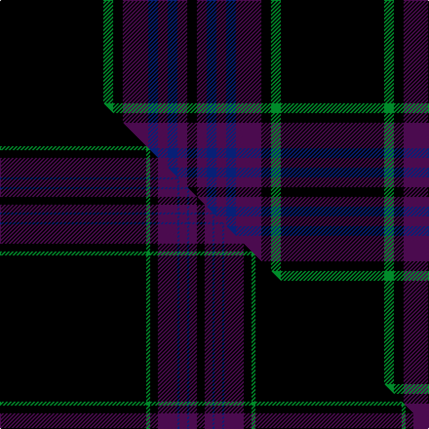

This is one **variant** — a specific cloth: this exact thread count and colourway, with its own
provenance below. It is one weaving of the [sett](/setts/k53g5k5dp13db5dp5db5dp5k5/) (the scale-free proportion — the
same cloth at any scale or shade), whose colour order is pattern [KBBBBBKGK](/stripes/kbbbbbkgk/).

Part of the [Laird](/tartans/l/la/laird/) tartan — the named design grouping this sett with its other cloths.

Sourced from tartans-authority.  It is a [9 stripe tartan](/stripes/stripes9/).

Original link [https://www.tartanregister.gov.uk/tartanDetails.aspx?ref=7856](https://www.tartanregister.gov.uk/tartanDetails.aspx?ref=7856)

Dataset <small>— provenance for this record, inherited from the source manifest</small>

<dl class="dataset-prov">
<dt>source</dt><dd><a href="/sources/tartans-authority/">Scottish Tartans Authority</a></dd>
<dt>data captured from</dt><dd><a href="https://github.com/thetartan/tartan-database/blob/master/data/tartans-authority/data.csv">https://github.com/thetartan/tartan-database/blob/master/data/tartans-authority/data.csv</a></dd>
<dt>data date</dt><dd>Dec. 2008 <small>(this record)</small></dd>
<dt>licence</dt><dd><a href="https://creativecommons.org/licenses/by-nc-nd/4.0/">CC BY-NC-ND 4.0</a></dd>
</dl>

Capture chain <small>— the hands this data passed through, oldest first; each capture carries its own licence</small>

<ol class="capture-chain">
<li><a href="https://www.tartansauthority.com/">Scottish Tartans Authority</a> <small>the heritage body's archive — its tartan-ferret record browser is retired (links repaired to the SRT, above)</small></li>
<li><a href="https://github.com/thetartan/tartan-database">thetartan/tartan-database</a> <small>2016-2017</small> · <a href="https://creativecommons.org/licenses/by-nc-nd/4.0/">CC BY-NC-ND 4.0</a> <small>Levko Kravets's frozen compilation — the capture we vendored, and where its CC licence text came from</small></li>
<li>this dictionary <small>captured 2026-06-10 · commit 5bf86c7566</small> <small>each re-capture is a git commit to data/sources</small></li>
</ol>

## Register references

External register numbers recorded for this tartan.

- Scottish Tartans Authority (ITI): 7856

## Thread count
K/106 G10 K10 DP26 DB10 DP10 DB10 DP10 K/10

One full sett is **288 threads**.

## Palette
<table><thead><tr><th>Colour</th><th>Shade</th><th>OKLCh</th></tr></thead><tbody><tr><td>DB</td><td><code style="background-color:#082077;">#082077</code> <small style="color:#888">#082077</small></td><td><small style="color:#888">oklch(30.0% 0.149 265.1)</small></td></tr><tr><td>G</td><td><code style="background-color:#008B2A;">#008B2A</code> <small style="color:#888">#008B2A</small></td><td><small style="color:#888">oklch(55.4% 0.170 145.9)</small></td></tr><tr><td>K</td><td><code style="background-color:#000000;">#000000</code> <small style="color:#888">#000000</small></td><td><small style="color:#888">oklch(0.0% 0.000 0.0)</small></td></tr><tr><td>DP</td><td><code style="background-color:#4B0B4F;">#4B0B4F</code> <small style="color:#888">#4B0B4F</small></td><td><small style="color:#888">oklch(30.1% 0.125 325.4)</small></td></tr></tbody></table>

# Sample pattern

## Compared to the master

This cloth is one sett of its design; the master sett (the exemplar the design is anchored on) is below for comparison.

Its **ΔTartan distance** from the master is **0.85** — the same measure the nearest-tartans table ranks by (0 is identical; a re-scale of the same cloth is near 0, a recolour or a different proportion further).

<figure class="master-compare" style="margin:0">

this sett
master sett ★

<figcaption style="color:#888;font-size:smaller">One weave of this sett against the <a href="/setts/k75g2k4dp10db1dp4db1dp4k4/">master sett ★</a>, split on the diagonal: a shared proportion runs seamlessly across it with only the shades shifting; a different proportion breaks on it.</figcaption>
</figure>

## Nearest tartan variants

The nearest existing variants by ΔTartan distance, with this cloth at the top so the swatches line up against it.

ΔTartan

Threads

Variant

Sett

—

288

<a href="/variants/s9/k53g5k5dp13db5dp5db5dp5k5~x2/">Laird (Name)</a>

<a href="/ttd/edit/#slug=db23k2db2k2db2k28dr2k4t2~x2&amp;base=k53g5k5dp13db5dp5db5dp5k5~x2" title="compare in the TTD">2.70</a>

218

<a href="/variants/s9/db23k2db2k2db2k28dr2k4t2~x2/">Trotter (Personal)</a>

<a href="/ttd/edit/#slug=k30r3k3r3k6db32dg3db3~x2&amp;base=k53g5k5dp13db5dp5db5dp5k5~x2" title="compare in the TTD">3.38</a>

266

<a href="/variants/s8/k30r3k3r3k6db32dg3db3~x2/">Holmes (Clan?)</a>

<a href="/ttd/edit/#slug=dr12lo6k88db45k6db6y6&amp;base=k53g5k5dp13db5dp5db5dp5k5~x2" title="compare in the TTD">3.40</a>

320

<a href="/variants/s7/dr12lo6k88db45k6db6y6/">City of Rome Pipe Band (Corporate)</a>

<a href="/ttd/edit/#slug=k17n2k3g2k3g2k24db8g4db4g3db8~x2&amp;base=k53g5k5dp13db5dp5db5dp5k5~x2" title="compare in the TTD">3.49</a>

270

<a href="/variants/s12/k17n2k3g2k3g2k24db8g4db4g3db8~x2/">Kells Irish Pubs</a>

<a href="/ttd/edit/#slug=dr12lo6k88db45k6db6y6~db1406275&amp;base=k53g5k5dp13db5dp5db5dp5k5~x2" title="compare in the TTD">3.55</a>

320

<a href="/variants/s7/dr12lo6k88db45k6db6y6~db1406275/">City of Rome Pipe Band</a>

<a href="/ttd/edit/#slug=r4db4k2db31k10y3db5k11db6k3~x2&amp;base=k53g5k5dp13db5dp5db5dp5k5~x2" title="compare in the TTD">3.56</a>

302

<a href="/variants/s10/r4db4k2db31k10y3db5k11db6k3~x2/">MacArthur Fox Green (Personal)</a>

<a href="/ttd/edit/#slug=k10db4k34dt2k2dt30w3~x2~db1106275-dt1401240&amp;base=k53g5k5dp13db5dp5db5dp5k5~x2" title="compare in the TTD">3.60</a>

314

<a href="/variants/s7/k10db4k34dt2k2dt30w3~x2~db1106275-dt1401240/">Patriot, The (Fashion)</a>

<a href="/ttd/edit/#slug=r4k21w2k20db21k2db2~x2&amp;base=k53g5k5dp13db5dp5db5dp5k5~x2" title="compare in the TTD">3.61</a>

276

<a href="/variants/s7/r4k21w2k20db21k2db2~x2/">St. Georges, Edgbaston</a>

<a href="/ttd/edit/#slug=dg3k3db2k16db2k2db24lb2~x2&amp;base=k53g5k5dp13db5dp5db5dp5k5~x2" title="compare in the TTD">3.65</a>

206

<a href="/variants/s8/dg3k3db2k16db2k2db24lb2~x2/">Auckland (Fashion)</a>

<a href="/ttd/edit/#slug=r6k55db8g6db10g6db6g4~x2&amp;base=k53g5k5dp13db5dp5db5dp5k5~x2" title="compare in the TTD">3.69</a>

384

<a href="/variants/s8/r6k55db8g6db10g6db6g4~x2/">Frederiction Police Force</a>

## Neighbour map

Every grey dot is one of 13656 variants placed by the first two principal components of the ΔTartan feature space (42% of its variance). Red is this tartan; blue dots are its nearest — click one to open its page. The map is a flat projection of a many-dimensional space — [how to read it](/posts/neighbourhood-maps/).

<svg viewBox="0 0 640 380" role="img" style="max-width:100%;height:auto;border:1px solid #e0e0e0;border-radius:4px;display:block" xmlns="http://www.w3.org/2000/svg"><image href="/nn/cloud.v1.png" width="640" height="380"/><a href="/variants/s9/db23k2db2k2db2k28dr2k4t2~x2/"><circle cx="344.5" cy="145.7" r="4" fill="#3465a4"><title>Trotter (Personal)</title></circle></a><a href="/variants/s8/k30r3k3r3k6db32dg3db3~x2/"><circle cx="272.2" cy="159.9" r="4" fill="#3465a4"><title>Holmes (Clan?)</title></circle></a><a href="/variants/s7/dr12lo6k88db45k6db6y6/"><circle cx="295.4" cy="135.8" r="4" fill="#3465a4"><title>City of Rome Pipe Band (Corporate)</title></circle></a><a href="/variants/s12/k17n2k3g2k3g2k24db8g4db4g3db8~x2/"><circle cx="284.3" cy="146.5" r="4" fill="#3465a4"><title>Kells Irish Pubs</title></circle></a><a href="/variants/s7/dr12lo6k88db45k6db6y6~db1406275/"><circle cx="290.5" cy="133.2" r="4" fill="#3465a4"><title>City of Rome Pipe Band</title></circle></a><a href="/variants/s10/r4db4k2db31k10y3db5k11db6k3~x2/"><circle cx="325.7" cy="145.3" r="4" fill="#3465a4"><title>MacArthur Fox Green (Personal)</title></circle></a><a href="/variants/s7/k10db4k34dt2k2dt30w3~x2~db1106275-dt1401240/"><circle cx="309.5" cy="153.5" r="4" fill="#3465a4"><title>Patriot, The (Fashion)</title></circle></a><a href="/variants/s7/r4k21w2k20db21k2db2~x2/"><circle cx="297.9" cy="176.2" r="4" fill="#3465a4"><title>St. Georges, Edgbaston</title></circle></a><a href="/variants/s8/dg3k3db2k16db2k2db24lb2~x2/"><circle cx="306.1" cy="160.6" r="4" fill="#3465a4"><title>Auckland (Fashion)</title></circle></a><a href="/variants/s8/r6k55db8g6db10g6db6g4~x2/"><circle cx="271.6" cy="134.9" r="4" fill="#3465a4"><title>Frederiction Police Force</title></circle></a><circle cx="350.9" cy="142.4" r="5" fill="#c00000"/><text x="320" y="376" text-anchor="middle" font-size="11" fill="#999">ground</text><text x="11" y="190" text-anchor="middle" font-size="11" fill="#999" transform="rotate(-90 11 190)">complexity</text></svg>

ID: /variants/s9/k53g5k5dp13db5dp5db5dp5k5~x2/
