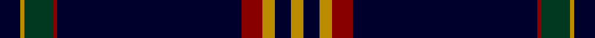

This page is one **sett** — a single exact thread-count. It belongs to the [tartan](/setts/k5lo1dg7r1k45r5lo3k4lo3/)
(the same proportion at any scale), whose colour order is pattern [KYGRKRYKY](/stripes/kygrkryky/).

Sourced from tartans-authority.  It is a [9 stripe tartan](/stripes/stripes9/).

Original link http://www.tartansauthority.com/tartan-ferret/display/10652/

## Register references

External register numbers recorded for this tartan.

- Scottish Register of Tartans: [10652](https://www.tartanregister.gov.uk/tartanDetails?ref=10652)
- Scottish Tartans Authority (ITI): 10652

## Thread count
DB/10 DY2 DG14 DR2 DB90 DR10 DY6 DB8 DY/6

One full sett is **280 threads**.

## Palette

Palette: <strong>Tartan Register</strong> <small style="color:#888">(3 of 4 colours)</small>
<table><thead><tr><th>Colour</th><th>Threads</th><th>Shade</th><th>Base</th><th>OKLCh</th></tr></thead><tbody><tr><td>DB/</td><td style="text-align:right;font-variant-numeric:tabular-nums">10</td><td><code style="background-color:#00002C;">#00002C</code> <small style="color:#888">#00002C</small></td><td>K <code style="background-color:#000000;">#000000</code></td><td><small style="color:#888">oklch(13.2% 0.092 264.1)</small></td></tr><tr><td>DY</td><td style="text-align:right;font-variant-numeric:tabular-nums">2</td><td><code style="background-color:#BC8C00;">#BC8C00</code> <small style="color:#888">#BC8C00</small></td><td>Y <code style="background-color:#F2BF00;">#F2BF00</code></td><td><small style="color:#888">oklch(66.8% 0.137 84.1)</small></td></tr><tr><td>DG</td><td style="text-align:right;font-variant-numeric:tabular-nums">14</td><td><code style="background-color:#003820;">#003820</code> <small style="color:#888">#003820</small></td><td>G <code style="background-color:#006100;">#006100</code></td><td><small style="color:#888">oklch(30.0% 0.070 158.3)</small></td></tr><tr><td>DR</td><td style="text-align:right;font-variant-numeric:tabular-nums">2</td><td><code style="background-color:#880000;">#880000</code> <small style="color:#888">#880000</small></td><td>R <code style="background-color:#CC0000;">#CC0000</code></td><td><small style="color:#888">oklch(39.4% 0.162 29.2)</small></td></tr><tr><td>DB</td><td style="text-align:right;font-variant-numeric:tabular-nums">90</td><td><code style="background-color:#00002C;">#00002C</code> <small style="color:#888">#00002C</small></td><td>K <code style="background-color:#000000;">#000000</code></td><td><small style="color:#888">oklch(13.2% 0.092 264.1)</small></td></tr><tr><td>DR</td><td style="text-align:right;font-variant-numeric:tabular-nums">10</td><td><code style="background-color:#880000;">#880000</code> <small style="color:#888">#880000</small></td><td>R <code style="background-color:#CC0000;">#CC0000</code></td><td><small style="color:#888">oklch(39.4% 0.162 29.2)</small></td></tr><tr><td>DY</td><td style="text-align:right;font-variant-numeric:tabular-nums">6</td><td><code style="background-color:#BC8C00;">#BC8C00</code> <small style="color:#888">#BC8C00</small></td><td>Y <code style="background-color:#F2BF00;">#F2BF00</code></td><td><small style="color:#888">oklch(66.8% 0.137 84.1)</small></td></tr><tr><td>DB</td><td style="text-align:right;font-variant-numeric:tabular-nums">8</td><td><code style="background-color:#00002C;">#00002C</code> <small style="color:#888">#00002C</small></td><td>K <code style="background-color:#000000;">#000000</code></td><td><small style="color:#888">oklch(13.2% 0.092 264.1)</small></td></tr><tr><td>DY/</td><td style="text-align:right;font-variant-numeric:tabular-nums">6</td><td><code style="background-color:#BC8C00;">#BC8C00</code> <small style="color:#888">#BC8C00</small></td><td>Y <code style="background-color:#F2BF00;">#F2BF00</code></td><td><small style="color:#888">oklch(66.8% 0.137 84.1)</small></td></tr></tbody></table>

## Nearest tartans

The nearest existing variants by ΔTartan distance, with this tartan at the top so the swatches line up against it.

ΔTartan

Tartan

Sett

—

<a href="/ttd/edit/#slug=k5lo1dg7r1k45r5lo3k4lo3~x2">Brooks Brothers Signature (Corporate</a> <a class="nn-out" href="/variants/s9/k5lo1dg7r1k45r5lo3k4lo3~x2/" title="open its dictionary page">↗</a>

0.77

<a href="/ttd/edit/#slug=db10t2k2db1k6t1k45lo2~x2&amp;base=k5lo1dg7r1k45r5lo3k4lo3~x2">Marine Harvest (Scotland)</a> <a class="nn-out" href="/variants/s8/db10t2k2db1k6t1k45lo2~x2/" title="open its dictionary page">↗</a>

0.98

<a href="/ttd/edit/#slug=db8r1k6r1lo8r1k45lo1~x2&amp;base=k5lo1dg7r1k45r5lo3k4lo3~x2">degli Uberti, Baron of Cartsburn (Personal)</a> <a class="nn-out" href="/variants/s8/db8r1k6r1lo8r1k45lo1~x2/" title="open its dictionary page">↗</a>

1.08

<a href="/ttd/edit/#slug=db7k5lr6k5r7k2db2k70lr2&amp;base=k5lo1dg7r1k45r5lo3k4lo3~x2">United States</a> <a class="nn-out" href="/variants/s9/db7k5lr6k5r7k2db2k70lr2/" title="open its dictionary page">↗</a>

1.08

<a href="/ttd/edit/#slug=b10lb2k2b1k6lb1k45lo2~x2&amp;base=k5lo1dg7r1k45r5lo3k4lo3~x2">Marine Harvest Scotland (Corporate)</a> <a class="nn-out" href="/variants/s8/b10lb2k2b1k6lb1k45lo2~x2/" title="open its dictionary page">↗</a>

1.13

<a href="/ttd/edit/#slug=db5ly1g7r1db45r5ly3db4ly3~x2&amp;base=k5lo1dg7r1k45r5lo3k4lo3~x2">Brooks Brothers Signature</a> <a class="nn-out" href="/variants/s9/db5ly1g7r1db45r5ly3db4ly3~x2/" title="open its dictionary page">↗</a>

1.32

<a href="/ttd/edit/#slug=k5db15k5b1k35m1k2~x4&amp;base=k5lo1dg7r1k45r5lo3k4lo3~x2">Gibson, Robert (Personal)</a> <a class="nn-out" href="/variants/s7/k5db15k5b1k35m1k2~x4/" title="open its dictionary page">↗</a>

1.32

<a href="/ttd/edit/#slug=db32o4dt12db2dt4db2dt2y16db67o6&amp;base=k5lo1dg7r1k45r5lo3k4lo3~x2">Calum's Cabin</a> <a class="nn-out" href="/variants/s10/db32o4dt12db2dt4db2dt2y16db67o6/" title="open its dictionary page">↗</a>

1.33

<a href="/ttd/edit/#slug=w5k2db14k4r8k4db4k80r6k4r4&amp;base=k5lo1dg7r1k45r5lo3k4lo3~x2">American Heritage</a> <a class="nn-out" href="/variants/s11/w5k2db14k4r8k4db4k80r6k4r4/" title="open its dictionary page">↗</a>

1.37

<a href="/ttd/edit/#slug=k64y12n6k15o1y5lr1~x2&amp;base=k5lo1dg7r1k45r5lo3k4lo3~x2">McCann of Castlecraig (Personal)</a> <a class="nn-out" href="/variants/s7/k64y12n6k15o1y5lr1~x2/" title="open its dictionary page">↗</a>

1.37

<a href="/ttd/edit/#slug=dp3n2o2k60n2k3n12k1o3~x2&amp;base=k5lo1dg7r1k45r5lo3k4lo3~x2">Grassi (Personal)</a> <a class="nn-out" href="/variants/s9/dp3n2o2k60n2k3n12k1o3~x2/" title="open its dictionary page">↗</a>

## Neighbour map

Every grey dot is one of 14360 variants placed by the first two principal components of the ΔTartan feature space (44% of its variance). Red is this tartan; blue dots are its nearest — click one to open its page.

<svg viewBox="0 0 640 380" role="img" style="max-width:100%;height:auto;border:1px solid #e0e0e0;border-radius:4px;display:block" xmlns="http://www.w3.org/2000/svg"><image href="/nn/cloud.v1.png" width="640" height="380"/><a href="/variants/s8/db10t2k2db1k6t1k45lo2~x2/"><circle cx="550.4" cy="125.7" r="4" fill="#3465a4"><title>Marine Harvest (Scotland)</title></circle></a><a href="/variants/s8/db8r1k6r1lo8r1k45lo1~x2/"><circle cx="498.9" cy="118.5" r="4" fill="#3465a4"><title>degli Uberti, Baron of Cartsburn (Personal)</title></circle></a><a href="/variants/s9/db7k5lr6k5r7k2db2k70lr2/"><circle cx="534.2" cy="120.9" r="4" fill="#3465a4"><title>United States</title></circle></a><a href="/variants/s8/b10lb2k2b1k6lb1k45lo2~x2/"><circle cx="538.7" cy="118.2" r="4" fill="#3465a4"><title>Marine Harvest Scotland (Corporate)</title></circle></a><a href="/variants/s9/db5ly1g7r1db45r5ly3db4ly3~x2/"><circle cx="481.0" cy="103.7" r="4" fill="#3465a4"><title>Brooks Brothers Signature</title></circle></a><a href="/variants/s7/k5db15k5b1k35m1k2~x4/"><circle cx="524.4" cy="167.8" r="4" fill="#3465a4"><title>Gibson, Robert (Personal)</title></circle></a><a href="/variants/s10/db32o4dt12db2dt4db2dt2y16db67o6/"><circle cx="461.7" cy="138.1" r="4" fill="#3465a4"><title>Calum's Cabin</title></circle></a><a href="/variants/s11/w5k2db14k4r8k4db4k80r6k4r4/"><circle cx="494.8" cy="107.7" r="4" fill="#3465a4"><title>American Heritage</title></circle></a><a href="/variants/s7/k64y12n6k15o1y5lr1~x2/"><circle cx="535.0" cy="132.8" r="4" fill="#3465a4"><title>McCann of Castlecraig (Personal)</title></circle></a><a href="/variants/s9/dp3n2o2k60n2k3n12k1o3~x2/"><circle cx="551.7" cy="115.5" r="4" fill="#3465a4"><title>Grassi (Personal)</title></circle></a><circle cx="509.0" cy="120.2" r="5" fill="#c00000"/></svg>

ID: /variants/s9/k5lo1dg7r1k45r5lo3k4lo3~x2/
