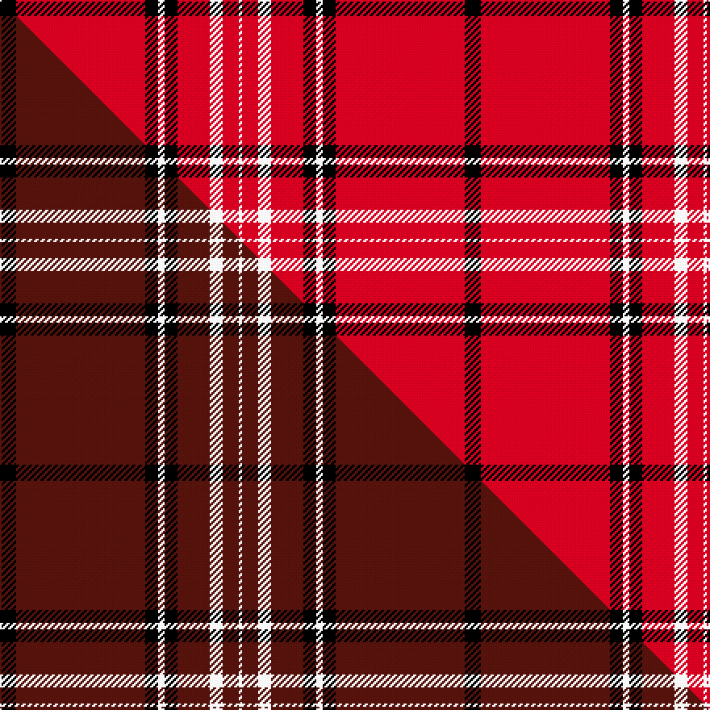

This is one **variant** — a specific cloth: this exact thread count and colourway, with its own
provenance below. It is one weaving of the [sett](/setts/k5r40k4w2k4r10w4r5w1/) (the scale-free proportion — the
same cloth at any scale or shade), whose colour order is pattern [KRKWKRWRW](/stripes/krkwkrwrw/).

Part of the [Southern Illinois University](/tartans/s/so/southern-illinois-university/) tartan — the named design grouping this sett with its other cloths.

Sourced from tartans-authority.  It is a [9 stripe tartan](/stripes/stripes9/).

Original link [https://www.tartanregister.gov.uk/tartanDetails.aspx?ref=10519](https://www.tartanregister.gov.uk/tartanDetails.aspx?ref=10519)

Dataset <small>— provenance for this record, inherited from the source manifest</small>

<dl class="dataset-prov">
<dt>source</dt><dd><a href="/sources/tartans-authority/">Scottish Tartans Authority</a></dd>
<dt>data captured from</dt><dd><a href="https://github.com/thetartan/tartan-database/blob/master/data/tartans-authority/data.csv">https://github.com/thetartan/tartan-database/blob/master/data/tartans-authority/data.csv</a></dd>
<dt>data date</dt><dd>1st March 2011 <small>(this record)</small></dd>
<dt>licence</dt><dd><a href="https://creativecommons.org/licenses/by-nc-nd/4.0/">CC BY-NC-ND 4.0</a></dd>
</dl>

Capture chain <small>— the hands this data passed through, oldest first; each capture carries its own licence</small>

<ol class="capture-chain">
<li><a href="https://www.tartansauthority.com/">Scottish Tartans Authority</a> <small>the heritage body's archive — its tartan-ferret record browser is retired (links repaired to the SRT, above)</small></li>
<li><a href="https://github.com/thetartan/tartan-database">thetartan/tartan-database</a> <small>2016-2017</small> · <a href="https://creativecommons.org/licenses/by-nc-nd/4.0/">CC BY-NC-ND 4.0</a> <small>Levko Kravets's frozen compilation — the capture we vendored, and where its CC licence text came from</small></li>
<li>this dictionary <small>captured 2026-06-10 · commit 5bf86c7566</small> <small>each re-capture is a git commit to data/sources</small></li>
</ol>

## Register references

External register numbers recorded for this tartan.

- Scottish Register of Tartans: [10519](https://www.tartanregister.gov.uk/tartanDetails?ref=10519)
- Scottish Tartans Authority (ITI): 10519

## Thread count
K/10 R80 K8 W4 K8 R20 W8 R10 W/2

One full sett is **288 threads**.

## Palette
<table><thead><tr><th>Colour</th><th>Shade</th><th>OKLCh</th></tr></thead><tbody><tr><td>R</td><td><code style="background-color:#D60020;">#D60020</code> <small style="color:#888">#D60020</small></td><td><small style="color:#888">oklch(55.2% 0.224 25.5)</small></td></tr><tr><td>K</td><td><code style="background-color:#000000;">#000000</code> <small style="color:#888">#000000</small></td><td><small style="color:#888">oklch(0.0% 0.000 0.0)</small></td></tr><tr><td>W</td><td><code style="background-color:#F7F7F7;">#F7F7F7</code> <small style="color:#888">#F7F7F7</small></td><td><small style="color:#888">oklch(97.6% 0.000 89.9)</small></td></tr></tbody></table>

# Sample pattern

## Compared to the master

This cloth is one sett of its design; the master sett (the exemplar the design is anchored on) is below for comparison.

Its **ΔTartan distance** from the master is **0.22** — the same measure the nearest-tartans table ranks by (0 is identical; a re-scale of the same cloth is near 0, a recolour or a different proportion further).

<figure class="master-compare" style="margin:0">

this sett
master sett ★

<figcaption style="color:#888;font-size:smaller">One weave of this sett against the <a href="/setts/k5dr40k4w2k4dr10w4dr5w1/">master sett ★</a>, split on the diagonal: a shared proportion runs seamlessly across it with only the shades shifting; a different proportion breaks on it.</figcaption>
</figure>

## Nearest tartan variants

The nearest existing variants by ΔTartan distance, with this cloth at the top so the swatches line up against it.

ΔTartan

Threads

Variant

Sett

—

288

<a href="/variants/s9/k5r40k4w2k4r10w4r5w1~x2/">Southern Illinois University (Corp.)</a>

<a href="/ttd/edit/#slug=k5dr40k4w2k4dr10w4dr5w1~x2&amp;base=k5r40k4w2k4r10w4r5w1~x2" title="compare in the TTD">0.22</a>

288

<a href="/variants/s9/k5dr40k4w2k4dr10w4dr5w1~x2/">Southern Illinois University - Carbondale</a>

<a href="/ttd/edit/#slug=r51n2r6k10r2k4n3k3~x2&amp;base=k5r40k4w2k4r10w4r5w1~x2" title="compare in the TTD">0.96</a>

216

<a href="/variants/s8/r51n2r6k10r2k4n3k3~x2/">Virgin (Corporate)</a>

<a href="/ttd/edit/#slug=r51n2r6k10r2k4n3k3~x2~r2310029&amp;base=k5r40k4w2k4r10w4r5w1~x2" title="compare in the TTD">0.97</a>

216

<a href="/variants/s8/r51n2r6k10r2k4n3k3~x2~r2310029/">Virgin</a>

<a href="/ttd/edit/#slug=r80w7k2w2k2r3k7r2b12k2~x2&amp;base=k5r40k4w2k4r10w4r5w1~x2" title="compare in the TTD">1.37</a>

312

<a href="/variants/s10/r80w7k2w2k2r3k7r2b12k2~x2/">Masai Shuka 05 (Artefact)</a>

<a href="/ttd/edit/#slug=k4r4ly2r41k4r4k12w2~x2&amp;base=k5r40k4w2k4r10w4r5w1~x2" title="compare in the TTD">1.46</a>

280

<a href="/variants/s8/k4r4ly2r41k4r4k12w2~x2/">Aberdeen F. C. (2002) (Sports)</a>

<a href="/ttd/edit/#slug=k4r4y2r41k4r4k12w2~x2&amp;base=k5r40k4w2k4r10w4r5w1~x2" title="compare in the TTD">1.46</a>

280

<a href="/variants/s8/k4r4y2r41k4r4k12w2~x2/">Aberdeen Football Club (2002)</a>

<a href="/ttd/edit/#slug=k2r1k2r14w1r1w1~x8&amp;base=k5r40k4w2k4r10w4r5w1~x2" title="compare in the TTD">1.87</a>

328

<a href="/variants/s7/k2r1k2r14w1r1w1~x8/">White Stripes Dress, (Corporate)</a>

<a href="/ttd/edit/#slug=r40w1r1k8r1w1r6w1r1k8~x2&amp;base=k5r40k4w2k4r10w4r5w1~x2" title="compare in the TTD">2.01</a>

176

<a href="/variants/s10/r40w1r1k8r1w1r6w1r1k8~x2/">Miyuki, Check Red, 1002A</a>

<a href="/ttd/edit/#slug=k4r40k1r3k1w3k4~x2&amp;base=k5r40k4w2k4r10w4r5w1~x2" title="compare in the TTD">2.20</a>

208

<a href="/variants/s7/k4r40k1r3k1w3k4~x2/">Salt Lake County (District)</a>

<a href="/ttd/edit/#slug=r20k1ly3k1r60k30r48k4~x2&amp;base=k5r40k4w2k4r10w4r5w1~x2" title="compare in the TTD">2.27</a>

620

<a href="/variants/s8/r20k1ly3k1r60k30r48k4~x2/">Barkwell (Personal)</a>

## Neighbour map

Every grey dot is one of 13621 variants placed by the first two principal components of the ΔTartan feature space (42% of its variance). Red is this tartan; blue dots are its nearest — click one to open its page.

<svg viewBox="0 0 640 380" role="img" style="max-width:100%;height:auto;border:1px solid #e0e0e0;border-radius:4px;display:block" xmlns="http://www.w3.org/2000/svg"><image href="/nn/cloud.v1.png" width="640" height="380"/><a href="/variants/s9/k5dr40k4w2k4dr10w4dr5w1~x2/"><circle cx="459.5" cy="93.6" r="4" fill="#3465a4"><title>Southern Illinois University - Carbondale</title></circle></a><a href="/variants/s8/r51n2r6k10r2k4n3k3~x2/"><circle cx="453.5" cy="94.8" r="4" fill="#3465a4"><title>Virgin (Corporate)</title></circle></a><a href="/variants/s8/r51n2r6k10r2k4n3k3~x2~r2310029/"><circle cx="448.1" cy="92.7" r="4" fill="#3465a4"><title>Virgin</title></circle></a><a href="/variants/s10/r80w7k2w2k2r3k7r2b12k2~x2/"><circle cx="438.1" cy="42.8" r="4" fill="#3465a4"><title>Masai Shuka 05 (Artefact)</title></circle></a><a href="/variants/s8/k4r4ly2r41k4r4k12w2~x2/"><circle cx="372.9" cy="96.3" r="4" fill="#3465a4"><title>Aberdeen F. C. (2002) (Sports)</title></circle></a><a href="/variants/s8/k4r4y2r41k4r4k12w2~x2/"><circle cx="374.8" cy="96.7" r="4" fill="#3465a4"><title>Aberdeen Football Club (2002)</title></circle></a><a href="/variants/s7/k2r1k2r14w1r1w1~x8/"><circle cx="418.1" cy="125.1" r="4" fill="#3465a4"><title>White Stripes Dress, (Corporate)</title></circle></a><a href="/variants/s10/r40w1r1k8r1w1r6w1r1k8~x2/"><circle cx="454.4" cy="62.5" r="4" fill="#3465a4"><title>Miyuki, Check Red, 1002A</title></circle></a><a href="/variants/s7/k4r40k1r3k1w3k4~x2/"><circle cx="492.7" cy="74.3" r="4" fill="#3465a4"><title>Salt Lake County (District)</title></circle></a><a href="/variants/s8/r20k1ly3k1r60k30r48k4~x2/"><circle cx="479.7" cy="96.2" r="4" fill="#3465a4"><title>Barkwell (Personal)</title></circle></a><circle cx="447.7" cy="79.3" r="5" fill="#c00000"/><text x="320" y="376" text-anchor="middle" font-size="11" fill="#999">ground</text><text x="11" y="190" text-anchor="middle" font-size="11" fill="#999" transform="rotate(-90 11 190)">complexity</text></svg>

ID: /variants/s9/k5r40k4w2k4r10w4r5w1~x2/
