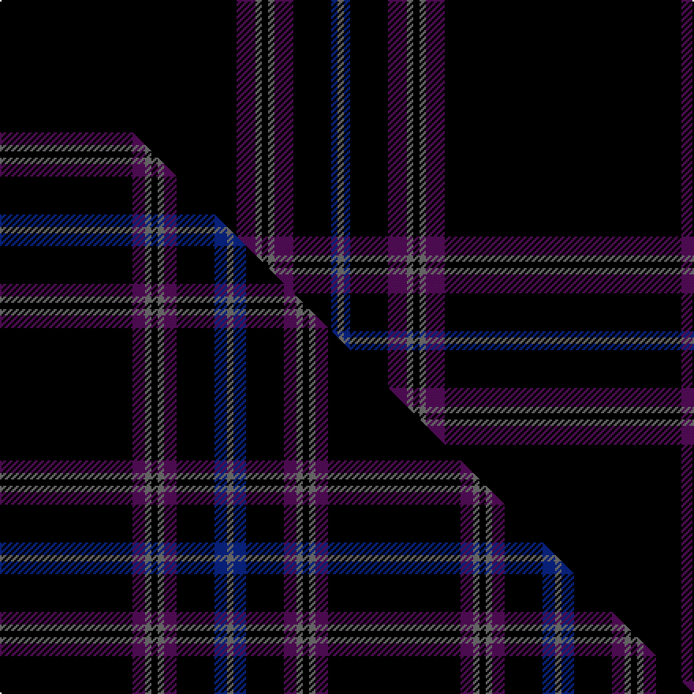

This is one **variant** — a specific cloth: this exact thread count and colourway, with its own
provenance below. It is one weaving of the [sett](/setts/k75dp6n2k2n2dp6k12db2n2/) (the scale-free proportion — the
same cloth at any scale or shade), whose colour order is pattern [BBKBBKBBK](/stripes/bbkbbkbbk/).

Part of the [Clan Inebriated](/tartans/c/cl/clan-inebriated/) tartan — the named design grouping this sett with its other cloths.

Sourced from tartans-authority.  It is a [9 stripe tartan](/stripes/stripes9/).

Original link [https://www.tartanregister.gov.uk/tartanDetails.aspx?ref=7692](https://www.tartanregister.gov.uk/tartanDetails.aspx?ref=7692)

Dataset <small>— provenance for this record, inherited from the source manifest</small>

<dl class="dataset-prov">
<dt>source</dt><dd><a href="/sources/tartans-authority/">Scottish Tartans Authority</a></dd>
<dt>data captured from</dt><dd><a href="https://github.com/thetartan/tartan-database/blob/master/data/tartans-authority/data.csv">https://github.com/thetartan/tartan-database/blob/master/data/tartans-authority/data.csv</a></dd>
<dt>data date</dt><dd>pre 2008 <small>(this record)</small></dd>
<dt>licence</dt><dd><a href="https://creativecommons.org/licenses/by-nc-nd/4.0/">CC BY-NC-ND 4.0</a></dd>
</dl>

Capture chain <small>— the hands this data passed through, oldest first; each capture carries its own licence</small>

<ol class="capture-chain">
<li><a href="https://www.tartansauthority.com/">Scottish Tartans Authority</a> <small>the heritage body's archive — its tartan-ferret record browser is retired (links repaired to the SRT, above)</small></li>
<li><a href="https://github.com/thetartan/tartan-database">thetartan/tartan-database</a> <small>2016-2017</small> · <a href="https://creativecommons.org/licenses/by-nc-nd/4.0/">CC BY-NC-ND 4.0</a> <small>Levko Kravets's frozen compilation — the capture we vendored, and where its CC licence text came from</small></li>
<li>this dictionary <small>captured 2026-06-10 · commit 5bf86c7566</small> <small>each re-capture is a git commit to data/sources</small></li>
</ol>

## Register references

External register numbers recorded for this tartan.

- Scottish Tartans Authority (ITI): 7692

## Thread count
K/150 DP12 N4 K4 N4 DP12 K24 DB4 N/4

One full sett is **282 threads**.

## Palette
<table><thead><tr><th>Colour</th><th>Shade</th><th>OKLCh</th></tr></thead><tbody><tr><td>DB</td><td><code style="background-color:#082077;">#082077</code> <small style="color:#888">#082077</small></td><td><small style="color:#888">oklch(30.0% 0.149 265.1)</small></td></tr><tr><td>K</td><td><code style="background-color:#000000;">#000000</code> <small style="color:#888">#000000</small></td><td><small style="color:#888">oklch(0.0% 0.000 0.0)</small></td></tr><tr><td>N</td><td><code style="background-color:#636363;">#636363</code> <small style="color:#888">#636363</small></td><td><small style="color:#888">oklch(50.0% 0.000 89.9)</small></td></tr><tr><td>DP</td><td><code style="background-color:#4B0B4F;">#4B0B4F</code> <small style="color:#888">#4B0B4F</small></td><td><small style="color:#888">oklch(30.1% 0.125 325.4)</small></td></tr></tbody></table>

# Sample pattern

## Compared to the master

This cloth is one sett of its design; the master sett (the exemplar the design is anchored on) is below for comparison.

Its **ΔTartan distance** from the master is **0.40** — the same measure the nearest-tartans table ranks by (0 is identical; a re-scale of the same cloth is near 0, a recolour or a different proportion further).

<figure class="master-compare" style="margin:0">

this sett
master sett ★

<figcaption style="color:#888;font-size:smaller">One weave of this sett against the <a href="/setts/k21dp2n1k1n1dp2k6db2n1/">master sett ★</a>, split on the diagonal: a shared proportion runs seamlessly across it with only the shades shifting; a different proportion breaks on it.</figcaption>
</figure>

## Nearest tartan variants

The nearest existing variants by ΔTartan distance, with this cloth at the top so the swatches line up against it.

ΔTartan

Threads

Variant

Sett

—

282

<a href="/variants/s9/k75dp6n2k2n2dp6k12db2n2~x2/">Clan Inebriated (Corporate)</a>

<a href="/ttd/edit/#slug=k100dp8n4k4n4dp8k25db10n4&amp;base=k75dp6n2k2n2dp6k12db2n2~x2" title="compare in the TTD">0.35</a>

230

<a href="/variants/s9/k100dp8n4k4n4dp8k25db10n4/">CI (Corporate)</a>

<a href="/ttd/edit/#slug=k21dp2n1k1n1dp2k6db2n1~x4&amp;base=k75dp6n2k2n2dp6k12db2n2~x2" title="compare in the TTD">0.40</a>

208

<a href="/variants/s9/k21dp2n1k1n1dp2k6db2n1~x4/">Clan Inebriated</a>

<a href="/ttd/edit/#slug=dt4k2dt4k45n2k3n2~x2&amp;base=k75dp6n2k2n2dp6k12db2n2~x2" title="compare in the TTD">1.66</a>

236

<a href="/variants/s7/dt4k2dt4k45n2k3n2~x2/">STLTH</a>

<a href="/ttd/edit/#slug=k31r2k10db1k1w1~x4&amp;base=k75dp6n2k2n2dp6k12db2n2~x2" title="compare in the TTD">1.80</a>

240

<a href="/variants/s6/k31r2k10db1k1w1~x4/">NewGeneration Alchemy (NGA) Inc</a>

<a href="/ttd/edit/#slug=k50db2k13w1k13db5g15r2~x2&amp;base=k75dp6n2k2n2dp6k12db2n2~x2" title="compare in the TTD">1.96</a>

300

<a href="/variants/s8/k50db2k13w1k13db5g15r2~x2/">Center</a>

<a href="/ttd/edit/#slug=dp3n2o2k60n2k3n12k1o3~x2~n1900000-o2500000&amp;base=k75dp6n2k2n2dp6k12db2n2~x2" title="compare in the TTD">2.00</a>

340

<a href="/variants/s9/dp3n2o2k60n2k3n12k1o3~x2~n1900000-o2500000/">Grassi (Personal)</a>

<a href="/ttd/edit/#slug=k75g2k4dp10db1dp4db1dp4k4~x2&amp;base=k75dp6n2k2n2dp6k12db2n2~x2" title="compare in the TTD">2.02</a>

262

<a href="/variants/s9/k75g2k4dp10db1dp4db1dp4k4~x2/">Laird (Restricted)</a>

<a href="/ttd/edit/#slug=k25w1dt3w1k31dt3k31w2r9~x2~dt1700000&amp;base=k75dp6n2k2n2dp6k12db2n2~x2" title="compare in the TTD">2.04</a>

356

<a href="/variants/s9/k25w1n3w1k31n3k31w2r9~x2~n1700000/">Savannah Harley Davidson</a>

<a href="/ttd/edit/#slug=k25w1n3w1k31n3k31w2r9~x2&amp;base=k75dp6n2k2n2dp6k12db2n2~x2" title="compare in the TTD">2.04</a>

356

<a href="/variants/s9/k25w1n3w1k31n3k31w2r9~x2/">Savannah Harley Davidson (Corporate)</a>

<a href="/ttd/edit/#slug=k20db2k2db4dg4y2k40r2w3~x2&amp;base=k75dp6n2k2n2dp6k12db2n2~x2" title="compare in the TTD">2.05</a>

270

<a href="/variants/s9/k20db2k2db4dg4y2k40r2w3~x2/">McCuaig (Glenelg and the Western Isles) Hunting</a>

## Neighbour map

Every grey dot is one of 13621 variants placed by the first two principal components of the ΔTartan feature space (42% of its variance). Red is this tartan; blue dots are its nearest — click one to open its page.

<svg viewBox="0 0 640 380" role="img" style="max-width:100%;height:auto;border:1px solid #e0e0e0;border-radius:4px;display:block" xmlns="http://www.w3.org/2000/svg"><image href="/nn/cloud.v1.png" width="640" height="380"/><a href="/variants/s9/k100dp8n4k4n4dp8k25db10n4/"><circle cx="510.0" cy="106.0" r="4" fill="#3465a4"><title>CI (Corporate)</title></circle></a><a href="/variants/s9/k21dp2n1k1n1dp2k6db2n1~x4/"><circle cx="485.3" cy="115.5" r="4" fill="#3465a4"><title>Clan Inebriated</title></circle></a><a href="/variants/s7/dt4k2dt4k45n2k3n2~x2/"><circle cx="572.6" cy="133.4" r="4" fill="#3465a4"><title>STLTH</title></circle></a><a href="/variants/s6/k31r2k10db1k1w1~x4/"><circle cx="604.6" cy="103.7" r="4" fill="#3465a4"><title>NewGeneration Alchemy (NGA) Inc</title></circle></a><a href="/variants/s8/k50db2k13w1k13db5g15r2~x2/"><circle cx="427.8" cy="74.3" r="4" fill="#3465a4"><title>Center</title></circle></a><a href="/variants/s9/dp3n2o2k60n2k3n12k1o3~x2~n1900000-o2500000/"><circle cx="460.5" cy="55.1" r="4" fill="#3465a4"><title>Grassi (Personal)</title></circle></a><a href="/variants/s9/k75g2k4dp10db1dp4db1dp4k4~x2/"><circle cx="570.1" cy="65.2" r="4" fill="#3465a4"><title>Laird (Restricted)</title></circle></a><a href="/variants/s9/k25w1n3w1k31n3k31w2r9~x2~n1700000/"><circle cx="471.5" cy="104.0" r="4" fill="#3465a4"><title>Savannah Harley Davidson</title></circle></a><a href="/variants/s9/k25w1n3w1k31n3k31w2r9~x2/"><circle cx="469.6" cy="103.5" r="4" fill="#3465a4"><title>Savannah Harley Davidson (Corporate)</title></circle></a><a href="/variants/s9/k20db2k2db4dg4y2k40r2w3~x2/"><circle cx="417.0" cy="77.9" r="4" fill="#3465a4"><title>McCuaig (Glenelg and the Western Isles) Hunting</title></circle></a><circle cx="580.1" cy="82.9" r="5" fill="#c00000"/><text x="320" y="376" text-anchor="middle" font-size="11" fill="#999">ground</text><text x="11" y="190" text-anchor="middle" font-size="11" fill="#999" transform="rotate(-90 11 190)">complexity</text></svg>

ID: /variants/s9/k75dp6n2k2n2dp6k12db2n2~x2/
