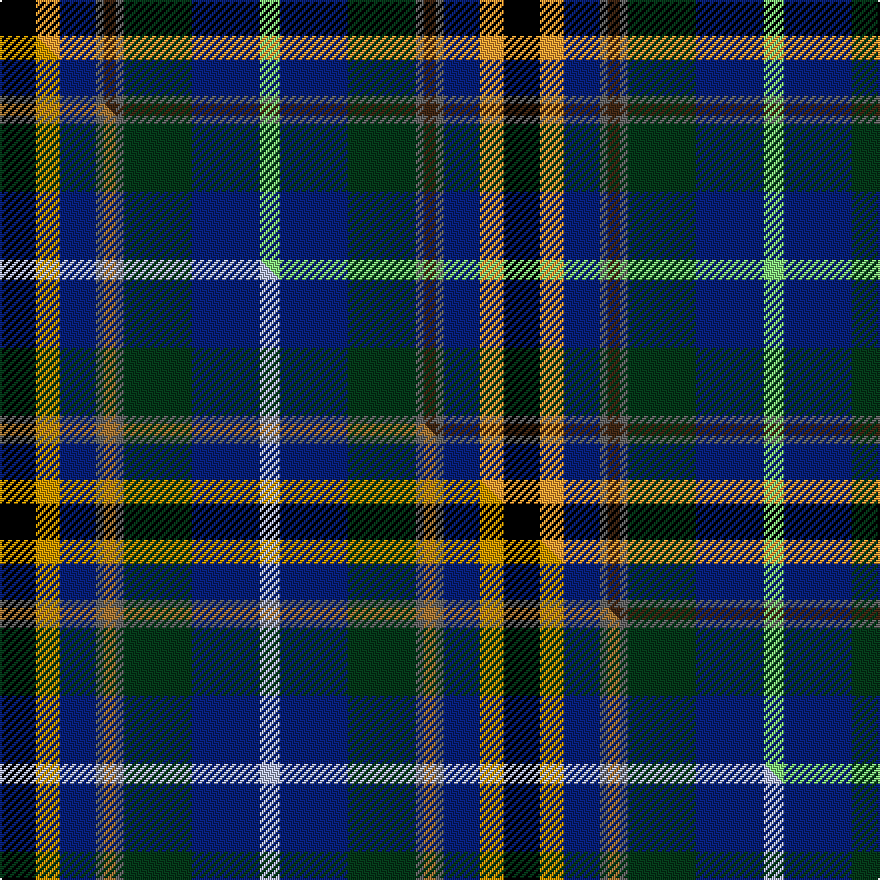

This page is one **sett** — a single exact thread-count. It belongs to the [tartan](/setts/k9lo6db9n2do3n2dg17db17lg5/)
(the same proportion at any scale), whose colour order is pattern [KYBBBBGBY](/stripes/kybbbbgby/).

Part of the [Coats](/tartans/coats/) tartan — the named design grouping this sett with its other cloths.

Sourced from tartans-authority.  It is a [9 stripe tartan](/stripes/stripes9/).

Original link http://www.tartansauthority.com/tartan-ferret/display/10871/

## Register references

External register numbers recorded for this tartan.

- Scottish Register of Tartans: [10871](https://www.tartanregister.gov.uk/tartanDetails?ref=10871)
- Scottish Tartans Authority (ITI): 10871

## Thread count
K/18 LO12 DB18 N4 DO6 N4 DG34 DB34 LG/10

One full sett is **252 threads**.

## Palette
<table><thead><tr><th>Colour</th><th>Shade</th><th>OKLCh</th></tr></thead><tbody><tr><td>LG</td><td><code style="background-color:#82D67A;">#82D67A</code> <small style="color:#888">#82D67A</small></td><td><small style="color:#888">oklch(80.1% 0.150 142.2)</small></td></tr><tr><td>DB</td><td><code style="background-color:#082077;">#082077</code> <small style="color:#888">#082077</small></td><td><small style="color:#888">oklch(30.0% 0.149 265.1)</small></td></tr><tr><td>DG</td><td><code style="background-color:#053819;">#053819</code> <small style="color:#888">#053819</small></td><td><small style="color:#888">oklch(30.0% 0.075 151.3)</small></td></tr><tr><td>DO</td><td><code style="background-color:#412714;">#412714</code> <small style="color:#888">#412714</small></td><td><small style="color:#888">oklch(30.1% 0.050 55.7)</small></td></tr><tr><td>LO</td><td><code style="background-color:#FF9C34;">#FF9C34</code> <small style="color:#888">#FF9C34</small></td><td><small style="color:#888">oklch(77.9% 0.161 61.8)</small></td></tr><tr><td>K</td><td><code style="background-color:#000000;">#000000</code> <small style="color:#888">#000000</small></td><td><small style="color:#888">oklch(0.0% 0.000 0.0)</small></td></tr><tr><td>N</td><td><code style="background-color:#636363;">#636363</code> <small style="color:#888">#636363</small></td><td><small style="color:#888">oklch(50.0% 0.000 89.9)</small></td></tr></tbody></table>

# Sample pattern

## Compared to the master

This cloth is one sett of its design; the master sett (the exemplar the design is anchored on) is below for comparison.

Its **ΔTartan distance** from the master is **0.22** — the same measure the nearest-tartans table ranks by (0 is identical; a re-scale of the same cloth is near 0, a recolour or a different proportion further).

<figure class="master-compare" style="margin:0">

this sett
master sett ★

<figcaption style="color:#888;font-size:smaller">One weave of this sett against the <a href="/setts/k9ly6db9n2o3n2dg17db17lb5/">master sett ★</a>, split on the diagonal: a shared proportion runs seamlessly across it with only the shades shifting; a different proportion breaks on it.</figcaption>
</figure>

## Nearest variants

The nearest existing variants by ΔTartan distance, with this cloth at the top so the swatches line up against it.

ΔTartan

Threads

Variant

Sett

—

252

<a href="/variants/s9/k9lo6db9n2do3n2dg17db17lg5~x2/">Coats (New Zealand)</a>

0.60

—

<a href="/variants/s9/k9ly6db9n2o3n2dg17db17lb5~x2~ly2806085-o2404072/">Coats (New Zealand)</a>

<a href="/ttd/edit/#slug=dy4g13k8db25lb8db2dp4~x2&amp;base=k9lo6db9n2do3n2dg17db17lg5~x2" title="compare in the TTD">2.71</a>

240

<a href="/variants/s7/dy4g13k8db25lb8db2dp4~x2/">Renfrewshire</a>

<a href="/ttd/edit/#slug=dp4db2lb8db25k8g13y4~x2&amp;base=k9lo6db9n2do3n2dg17db17lg5~x2" title="compare in the TTD">2.71</a>

240

<a href="/variants/s7/dp4db2lb8db25k8g13y4~x2/">Renfrewshire Tartan</a>

<a href="/ttd/edit/#slug=dr4db2lb7db20k7g10y4~x2&amp;base=k9lo6db9n2do3n2dg17db17lg5~x2" title="compare in the TTD">2.74</a>

200

<a href="/variants/s7/dr4db2lb7db20k7g10y4~x2/">Renfrewshire District Tartan</a>

## Neighbour map

Every grey dot is one of 13620 variants placed by the first two principal components of the ΔTartan feature space (42% of its variance). Red is this tartan; blue dots are its nearest — click one to open its page.

<svg viewBox="0 0 640 380" role="img" style="max-width:100%;height:auto;border:1px solid #e0e0e0;border-radius:4px;display:block" xmlns="http://www.w3.org/2000/svg"><image href="/nn/cloud.v1.png" width="640" height="380"/><a href="/variants/s9/k9ly6db9n2o3n2dg17db17lb5~x2~ly2806085-o2404072/"><circle cx="90.4" cy="168.3" r="4" fill="#3465a4"><title>Coats (New Zealand)</title></circle></a><a href="/variants/s7/dy4g13k8db25lb8db2dp4~x2/"><circle cx="139.6" cy="161.1" r="4" fill="#3465a4"><title>Renfrewshire</title></circle></a><a href="/variants/s7/dp4db2lb8db25k8g13y4~x2/"><circle cx="137.1" cy="160.4" r="4" fill="#3465a4"><title>Renfrewshire Tartan</title></circle></a><a href="/variants/s7/dr4db2lb7db20k7g10y4~x2/"><circle cx="114.8" cy="175.3" r="4" fill="#3465a4"><title>Renfrewshire District Tartan</title></circle></a><circle cx="86.5" cy="167.4" r="5" fill="#c00000"/><text x="320" y="376" text-anchor="middle" font-size="11" fill="#999">ground</text><text x="11" y="190" text-anchor="middle" font-size="11" fill="#999" transform="rotate(-90 11 190)">complexity</text></svg>

ID: /variants/s9/k9lo6db9n2do3n2dg17db17lg5~x2/
