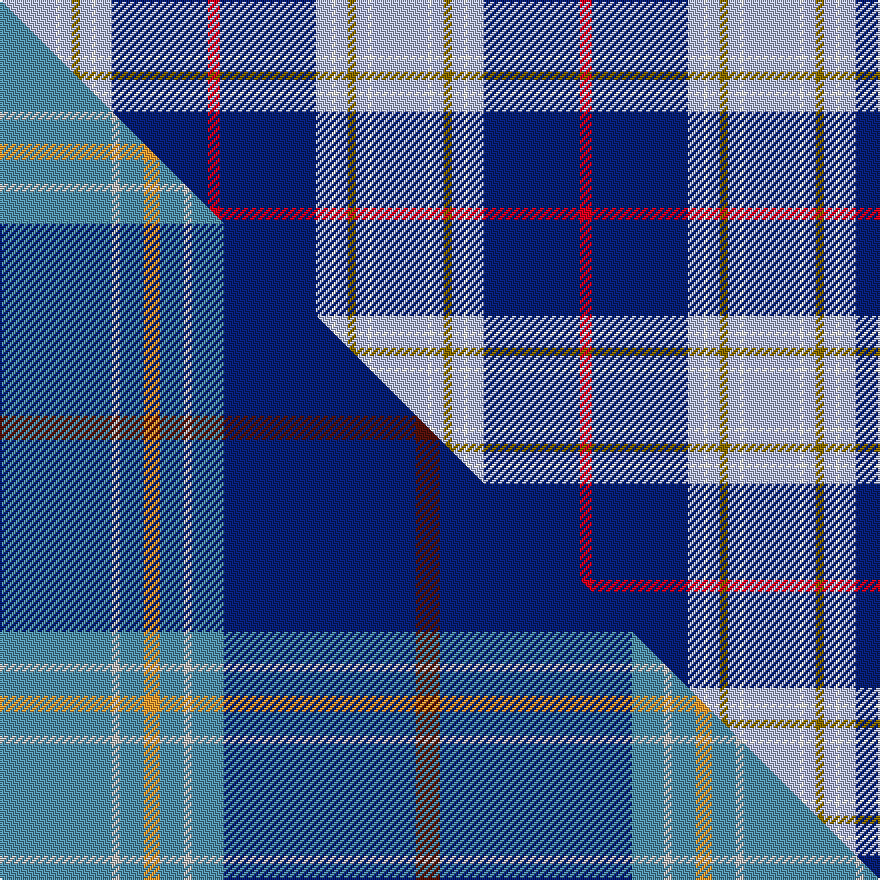

This page is one **sett** — a single exact thread-count. It belongs to the [tartan](/setts/lb14w1lb3y2lb3w1lb4db24r3/)
(the same proportion at any scale), whose colour order is pattern [RBWWWGWWW](/stripes/rbwwwgwww/).

Part of the [Musselburgh](/tartans/musselburgh/) tartan — the named design grouping this sett with its other cloths.

Sourced from weddslist.  It is a [9 stripe tartan](/stripes/stripes9/).

Original link http://www.weddslist.com/cgi-bin/tartans/pg.pl?source=sts

## Provenance

Earliest known date: 1958 Designed for the town celebrations of 1958-59 by G. Lawson of the Musselburgh Co-operative Society.

2 attestations — the source records this cloth was collapsed from (oldest owns this page)

<ul>
<li>undated — Musselburgh (weddslist, <a href="http://www.weddslist.com/cgi-bin/tartans/pg.pl?source=sts">record</a>) </li>
<li>undated — Musselburgh District Tartan (house-of-tartan, <a href="http://www.house-of-tartan.scotland.net/house/TartanViewjs.asp?colr=Def&tnam=620">record</a>) </li>
</ul>

## Thread count
LB/28 W2 LB6 Y4 LB6 W2 LB8 DB48 R/6

One full sett is **186 threads**.

## Palette
<table><thead><tr><th>Colour</th><th>Shade</th><th>OKLCh</th></tr></thead><tbody><tr><td>DB</td><td><code style="background-color:#082077;">#082077</code> <small style="color:#888">#082077</small></td><td><small style="color:#888">oklch(30.0% 0.149 265.1)</small></td></tr><tr><td>LB</td><td><code style="background-color:#B5BBDE;">#B5BBDE</code> <small style="color:#888">#B5BBDE</small></td><td><small style="color:#888">oklch(79.9% 0.050 277.6)</small></td></tr><tr><td>W</td><td><code style="background-color:#F7F7F7;">#F7F7F7</code> <small style="color:#888">#F7F7F7</small></td><td><small style="color:#888">oklch(97.6% 0.000 89.9)</small></td></tr><tr><td>R</td><td><code style="background-color:#D60020;">#D60020</code> <small style="color:#888">#D60020</small></td><td><small style="color:#888">oklch(55.2% 0.224 25.5)</small></td></tr><tr><td>Y</td><td><code style="background-color:#8B6E00;">#8B6E00</code> <small style="color:#888">#8B6E00</small></td><td><small style="color:#888">oklch(55.1% 0.113 90.4)</small></td></tr></tbody></table>

# Sample pattern

## Compared to the master

This cloth is one sett of its design; the master sett (the exemplar the design is anchored on) is below for comparison.

Its **ΔTartan distance** from the master is **0.41** — the same measure the nearest-tartans table ranks by (0 is identical; a re-scale of the same cloth is near 0, a recolour or a different proportion further).

<figure class="master-compare" style="margin:0">

this sett
master sett ★

<figcaption style="color:#888;font-size:smaller">One weave of this sett against the <a href="/setts/t14lb1t3lo2t3lb1t4db24dr3/">master sett ★</a>, split on the diagonal: a shared proportion runs seamlessly across it with only the shades shifting; a different proportion breaks on it.</figcaption>
</figure>

## Nearest tartan variants

The nearest existing variants by ΔTartan distance, with this cloth at the top so the swatches line up against it.

ΔTartan

Threads

Variant

Sett

—

186

<a href="/variants/s9/lb14w1lb3y2lb3w1lb4db24r3~x2/">Musselburgh</a>

<a href="/ttd/edit/#slug=w8db4y2db36lb48db2lb4r5~x2&amp;base=lb14w1lb3y2lb3w1lb4db24r3~x2" title="compare in the TTD">1.49</a>

410

<a href="/variants/s8/w8db4y2db36lb48db2lb4r5~x2/">MacRaes of America</a>

<a href="/ttd/edit/#slug=k3lb6k4dr6lb18db53lb18k8lb6k3lo2~x2&amp;base=lb14w1lb3y2lb3w1lb4db24r3~x2" title="compare in the TTD">1.88</a>

498

<a href="/variants/s11/k3lb6k4dr6lb18db53lb18k8lb6k3lo2~x2/">Australia 2000 (Fashion)</a>

<a href="/ttd/edit/#slug=db10w3db3w3db5w8db38lb8db8lb61r6&amp;base=lb14w1lb3y2lb3w1lb4db24r3~x2" title="compare in the TTD">2.18</a>

290

<a href="/variants/s11/db10w3db3w3db5w8db38lb8db8lb61r6/">Caleys Windsor (Corporate)</a>

<a href="/ttd/edit/#slug=db3w1db1w1db2w3db15lb2db2lb22r2~x2&amp;base=lb14w1lb3y2lb3w1lb4db24r3~x2" title="compare in the TTD">2.20</a>

206

<a href="/variants/s11/db3w1db1w1db2w3db15lb2db2lb22r2~x2/">Commonwealth Games 1986 #2</a>

<a href="/ttd/edit/#slug=db6w2db2w2db4w6db28lb4db4lb45r4&amp;base=lb14w1lb3y2lb3w1lb4db24r3~x2" title="compare in the TTD">2.25</a>

204

<a href="/variants/s11/db6w2db2w2db4w6db28lb4db4lb45r4/">Edinburgh '86</a>

<a href="/ttd/edit/#slug=dt4w2dt1lb24dt10w1db2w5db3r2~x2~dt1204274-db1106275&amp;base=lb14w1lb3y2lb3w1lb4db24r3~x2" title="compare in the TTD">2.42</a>

204

<a href="/variants/s10/dbi4w2dbi1lb24dbi10w1db2w5db3r2~x2~dbi1204274-db1106275/">Rikaco Morning Dew 1 (Fashion)</a>

<a href="/ttd/edit/#slug=db42r2lb2r2db5b12lb32db4~x2&amp;base=lb14w1lb3y2lb3w1lb4db24r3~x2" title="compare in the TTD">2.81</a>

312

<a href="/variants/s8/db42r2lb2r2db5b12lb32db4~x2/">Longniddry Lavender (Dance)</a>

<a href="/ttd/edit/#slug=y2db26lb3db3r1db3lb7db6lb15w1lb2~x2&amp;base=lb14w1lb3y2lb3w1lb4db24r3~x2" title="compare in the TTD">2.82</a>

268

<a href="/variants/s11/y2db26lb3db3r1db3lb7db6lb15w1lb2~x2/">Vilaro-Thomas (Personal)</a>

<a href="/ttd/edit/#slug=w6r2w24db12b3db2b2db2b12y1b1y3~x2~db1108266-b1611266&amp;base=lb14w1lb3y2lb3w1lb4db24r3~x2" title="compare in the TTD">2.89</a>

262

<a href="/variants/s12/w6r2w24db12b3db2b2db2b12y1b1y3~x2~db1108266-b1511266/">Payeur, François (Personal)</a>

<a href="/ttd/edit/#slug=db12lb2db2t6db4lb3db4lb18r1~x4~db1406275-t2405244&amp;base=lb14w1lb3y2lb3w1lb4db24r3~x2" title="compare in the TTD">3.01</a>

364

<a href="/variants/s9/db12lb2db2t6db4lb3db4lb18r1~x4~db1406275-t2405244/">Thorburn #1 (Name)</a>

## Neighbour map

Every grey dot is one of 13620 variants placed by the first two principal components of the ΔTartan feature space (42% of its variance). Red is this tartan; blue dots are its nearest — click one to open its page.

<svg viewBox="0 0 640 380" role="img" style="max-width:100%;height:auto;border:1px solid #e0e0e0;border-radius:4px;display:block" xmlns="http://www.w3.org/2000/svg"><image href="/nn/cloud.v1.png" width="640" height="380"/><a href="/variants/s8/w8db4y2db36lb48db2lb4r5~x2/"><circle cx="281.8" cy="129.6" r="4" fill="#3465a4"><title>MacRaes of America</title></circle></a><a href="/variants/s11/k3lb6k4dr6lb18db53lb18k8lb6k3lo2~x2/"><circle cx="207.4" cy="93.8" r="4" fill="#3465a4"><title>Australia 2000 (Fashion)</title></circle></a><a href="/variants/s11/db10w3db3w3db5w8db38lb8db8lb61r6/"><circle cx="273.2" cy="131.0" r="4" fill="#3465a4"><title>Caleys Windsor (Corporate)</title></circle></a><a href="/variants/s11/db3w1db1w1db2w3db15lb2db2lb22r2~x2/"><circle cx="277.0" cy="123.9" r="4" fill="#3465a4"><title>Commonwealth Games 1986 #2</title></circle></a><a href="/variants/s11/db6w2db2w2db4w6db28lb4db4lb45r4/"><circle cx="282.5" cy="122.4" r="4" fill="#3465a4"><title>Edinburgh '86</title></circle></a><a href="/variants/s10/dbi4w2dbi1lb24dbi10w1db2w5db3r2~x2~dbi1204274-db1106275/"><circle cx="231.8" cy="115.7" r="4" fill="#3465a4"><title>Rikaco Morning Dew 1 (Fashion)</title></circle></a><a href="/variants/s8/db42r2lb2r2db5b12lb32db4~x2/"><circle cx="305.2" cy="151.1" r="4" fill="#3465a4"><title>Longniddry Lavender (Dance)</title></circle></a><a href="/variants/s11/y2db26lb3db3r1db3lb7db6lb15w1lb2~x2/"><circle cx="317.9" cy="113.5" r="4" fill="#3465a4"><title>Vilaro-Thomas (Personal)</title></circle></a><a href="/variants/s12/w6r2w24db12b3db2b2db2b12y1b1y3~x2~db1108266-b1511266/"><circle cx="206.7" cy="116.2" r="4" fill="#3465a4"><title>Payeur, François (Personal)</title></circle></a><a href="/variants/s9/db12lb2db2t6db4lb3db4lb18r1~x4~db1406275-t2405244/"><circle cx="280.0" cy="175.2" r="4" fill="#3465a4"><title>Thorburn #1 (Name)</title></circle></a><circle cx="262.8" cy="124.2" r="5" fill="#c00000"/><text x="320" y="376" text-anchor="middle" font-size="11" fill="#999">ground</text><text x="11" y="190" text-anchor="middle" font-size="11" fill="#999" transform="rotate(-90 11 190)">complexity</text></svg>

ID: /variants/s9/lb14w1lb3y2lb3w1lb4db24r3~x2/
