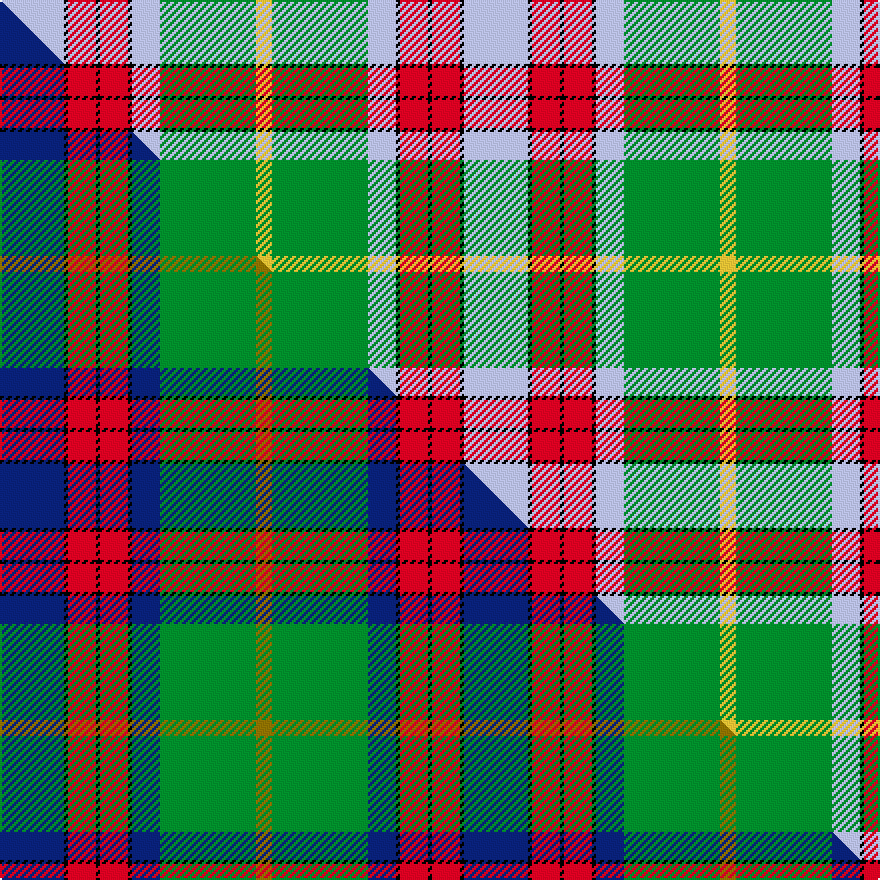

This is one **variant** — a specific cloth: this exact thread count and colourway, with its own
provenance below. It is one weaving of the [sett](/tartans/k/kn/knockando-woolmill/) (the scale-free proportion — the
same cloth at any scale or shade), whose colour order is pattern [WKRKRKWGY](/stripes/wkrkrkwgy/).

Part of the [Knockando Woolmill](/tartans/k/kn/knockando-woolmill/) tartan — the named design grouping this sett with its other cloths.

Sourced from tartans-authority.  It is a [9 stripe tartan](/stripes/stripes9/).

Original link <code>http://www.tartansauthority.com/tartan-ferret/display/10256/</code> — retired · [Internet Archive copy](https://web.archive.org/web/*/http://www.tartansauthority.com/tartan-ferret/display/10256/*)

Dataset <small>— provenance for this record, inherited from the source manifest</small>

<dl class="dataset-prov">
<dt>source</dt><dd><a href="/sources/tartans-authority/">Scottish Tartans Authority</a></dd>
<dt>data captured from</dt><dd><a href="https://github.com/thetartan/tartan-database/blob/master/data/tartans-authority/data.csv">https://github.com/thetartan/tartan-database/blob/master/data/tartans-authority/data.csv</a></dd>
<dt>data date</dt><dd>1st June 2010 <small>(this record)</small></dd>
<dt>licence</dt><dd><a href="https://creativecommons.org/licenses/by-nc-nd/4.0/">CC BY-NC-ND 4.0</a></dd>
</dl>

Capture chain <small>— the hands this data passed through, oldest first; each capture carries its own licence</small>

<ol class="capture-chain">
<li><a href="https://www.tartansauthority.com/">Scottish Tartans Authority</a> <small>the heritage body’s archive — its tartan-ferret record browser is retired; dead record links are shown unlinked, with an Internet Archive copy (ITI numbers are not SRT references)</small></li>
<li><a href="https://github.com/thetartan/tartan-database">thetartan/tartan-database</a> <small>2016-2017</small> · <a href="https://creativecommons.org/licenses/by-nc-nd/4.0/">CC BY-NC-ND 4.0</a> <small>Levko Kravets's frozen compilation — the capture we vendored, and where its CC licence text came from</small></li>
<li>this dictionary <small>captured 2026-06-10 · commit 5bf86c7566</small> <small>each re-capture is a git commit to data/sources</small></li>
</ol>

## Register references

External register numbers recorded for this tartan.

- Scottish Register of Tartans: [10256](https://www.tartanregister.gov.uk/tartanDetails?ref=10256)
- Scottish Tartans Authority (ITI): 10256

## Thread count
LB/32 K2 R14 K2 R14 K2 LB14 G48 LY/8

One full sett is **232 threads**.

## Palette
<table><thead><tr><th>Colour</th><th>Shade</th><th>OKLCh</th></tr></thead><tbody><tr><td>LB</td><td><code style="background-color:#B5BBDE;">#B5BBDE</code> <small style="color:#888">#B5BBDE</small></td><td><small style="color:#888">oklch(79.9% 0.050 277.6)</small></td></tr><tr><td>R</td><td><code style="background-color:#D60020;">#D60020</code> <small style="color:#888">#D60020</small></td><td><small style="color:#888">oklch(55.2% 0.224 25.5)</small></td></tr><tr><td>LY</td><td><code style="background-color:#DCBC32;">#DCBC32</code> <small style="color:#888">#DCBC32</small></td><td><small style="color:#888">oklch(80.0% 0.150 95.2)</small></td></tr><tr><td>G</td><td><code style="background-color:#008B2A;">#008B2A</code> <small style="color:#888">#008B2A</small></td><td><small style="color:#888">oklch(55.4% 0.170 145.9)</small></td></tr><tr><td>K</td><td><code style="background-color:#000000;">#000000</code> <small style="color:#888">#000000</small></td><td><small style="color:#888">oklch(0.0% 0.000 0.0)</small></td></tr></tbody></table>

# Sample pattern

## Compared to the master

This cloth is one sett of its design; the master sett (the exemplar the design is anchored on) is below for comparison.

Its **ΔTartan distance** from the master is **0.21** — the same measure the nearest-tartans table ranks by (0 is identical; a re-scale of the same cloth is near 0, a recolour or a different proportion further).

<figure class="master-compare" style="margin:0">

this sett
master sett ★

<figcaption style="color:#888;font-size:smaller">One weave of this sett against the <a href="/setts/db16k1r7k1r7k1db7g24y4/">master sett ★</a>, split on the diagonal: a shared proportion runs seamlessly across it with only the shades shifting; a different proportion breaks on it.</figcaption>
</figure>

## Nearest tartan variants

The nearest existing variants by ΔTartan distance, with this cloth at the top so the swatches line up against it.

ΔTartan

Threads

Variant

Sett

—

232

<a href="/variants/s9/lb16k1r7k1r7k1lb7g24ly4~x2/">Knockando Woolmill (Corporate)</a>

<a href="/ttd/edit/#slug=db16k1r7k1r7k1db7g24y4~x2&amp;base=lb16k1r7k1r7k1lb7g24ly4~x2" title="compare in the TTD">0.21</a>

232

<a href="/variants/s9/db16k1r7k1r7k1db7g24y4~x2/">Knockando Woolmill</a>

<a href="/ttd/edit/#slug=k3r1y1lb11g13lb5r1y1~x4&amp;base=lb16k1r7k1r7k1lb7g24ly4~x2" title="compare in the TTD">1.86</a>

272

<a href="/variants/s8/k3r1y1lb11g13lb5r1y1~x4/">Snodgrass (Clan)</a>

<a href="/ttd/edit/#slug=g3dg32g36o12k2w68dg3k2~x2~g2003152-dg1806142&amp;base=lb16k1r7k1r7k1lb7g24ly4~x2" title="compare in the TTD">2.87</a>

622

<a href="/variants/s8/g3dg32g36o12k2w68dg3k2~x2~g2003152-dg1806142/">Kintail Dress</a>

<a href="/ttd/edit/#slug=k3w1r16k1g21t9k6w1~x4&amp;base=lb16k1r7k1r7k1lb7g24ly4~x2" title="compare in the TTD">2.97</a>

448

<a href="/variants/s8/k3w1r16k1g21t9k6w1~x4/">Ford &amp; Etal</a>

<a href="/ttd/edit/#slug=lb37k12ly17r3ly17k1y3~x2&amp;base=lb16k1r7k1r7k1lb7g24ly4~x2" title="compare in the TTD">3.01</a>

280

<a href="/variants/s7/lb37k12ly17r3ly17k1y3~x2/">Berger-MacLaren</a>

<a href="/ttd/edit/#slug=w3lb25dr3r3dr3r8g21dr3k2~x2&amp;base=lb16k1r7k1r7k1lb7g24ly4~x2" title="compare in the TTD">3.16</a>

274

<a href="/variants/s9/w3lb25dr3r3dr3r8g21dr3k2~x2/">Dunedin (USA) (District)</a>

<a href="/ttd/edit/#slug=r4g5w2g5r4g14r10w30k1r2g4~x2&amp;base=lb16k1r7k1r7k1lb7g24ly4~x2" title="compare in the TTD">3.16</a>

308

<a href="/variants/s11/r4g5w2g5r4g14r10w30k1r2g4~x2/">Scott Dress Tartan</a>

<a href="/ttd/edit/#slug=w3k1r4g20k3t30w4r2~x2&amp;base=lb16k1r7k1r7k1lb7g24ly4~x2" title="compare in the TTD">3.18</a>

258

<a href="/variants/s8/w3k1r4g20k3t30w4r2~x2/">Scottish Prison Service (Corporate)</a>

<a href="/ttd/edit/#slug=db4k1g18do2g11do11lb18k1r4~x2&amp;base=lb16k1r7k1r7k1lb7g24ly4~x2" title="compare in the TTD">3.22</a>

264

<a href="/variants/s9/db4k1g18do2g11do11lb18k1r4~x2/">Morgan in Maryland (USA)</a>

<a href="/ttd/edit/#slug=k4lb4k2lb4k2lb22ly27y2r3~x2&amp;base=lb16k1r7k1r7k1lb7g24ly4~x2" title="compare in the TTD">3.23</a>

266

<a href="/variants/s9/k4lb4k2lb4k2lb22ly27y2r3~x2/">Falkirk</a>

## Neighbour map

Every grey dot is one of 13656 variants placed by the first two principal components of the ΔTartan feature space (42% of its variance). Red is this tartan; blue dots are its nearest — click one to open its page. The map is a flat projection of a many-dimensional space — [how to read it](/posts/neighbourhood-maps/).

<svg viewBox="0 0 640 380" role="img" style="max-width:100%;height:auto;border:1px solid #e0e0e0;border-radius:4px;display:block" xmlns="http://www.w3.org/2000/svg"><image href="/nn/cloud.v1.png" width="640" height="380"/><a href="/variants/s9/db16k1r7k1r7k1db7g24y4~x2/"><circle cx="177.9" cy="127.8" r="4" fill="#3465a4"><title>Knockando Woolmill</title></circle></a><a href="/variants/s8/k3r1y1lb11g13lb5r1y1~x4/"><circle cx="198.5" cy="150.9" r="4" fill="#3465a4"><title>Snodgrass (Clan)</title></circle></a><a href="/variants/s8/g3dg32g36o12k2w68dg3k2~x2~g2003152-dg1806142/"><circle cx="206.1" cy="105.1" r="4" fill="#3465a4"><title>Kintail Dress</title></circle></a><a href="/variants/s8/k3w1r16k1g21t9k6w1~x4/"><circle cx="152.6" cy="130.3" r="4" fill="#3465a4"><title>Ford &amp; Etal</title></circle></a><a href="/variants/s7/lb37k12ly17r3ly17k1y3~x2/"><circle cx="207.0" cy="120.9" r="4" fill="#3465a4"><title>Berger-MacLaren</title></circle></a><a href="/variants/s9/w3lb25dr3r3dr3r8g21dr3k2~x2/"><circle cx="134.9" cy="135.0" r="4" fill="#3465a4"><title>Dunedin (USA) (District)</title></circle></a><a href="/variants/s11/r4g5w2g5r4g14r10w30k1r2g4~x2/"><circle cx="216.1" cy="111.5" r="4" fill="#3465a4"><title>Scott Dress Tartan</title></circle></a><a href="/variants/s8/w3k1r4g20k3t30w4r2~x2/"><circle cx="237.0" cy="115.7" r="4" fill="#3465a4"><title>Scottish Prison Service (Corporate)</title></circle></a><a href="/variants/s9/db4k1g18do2g11do11lb18k1r4~x2/"><circle cx="155.7" cy="137.4" r="4" fill="#3465a4"><title>Morgan in Maryland (USA)</title></circle></a><a href="/variants/s9/k4lb4k2lb4k2lb22ly27y2r3~x2/"><circle cx="197.4" cy="129.2" r="4" fill="#3465a4"><title>Falkirk</title></circle></a><circle cx="177.5" cy="128.8" r="5" fill="#c00000"/><text x="320" y="376" text-anchor="middle" font-size="11" fill="#999">ground</text><text x="11" y="190" text-anchor="middle" font-size="11" fill="#999" transform="rotate(-90 11 190)">complexity</text></svg>

ID: /variants/s9/lb16k1r7k1r7k1lb7g24ly4~x2/
