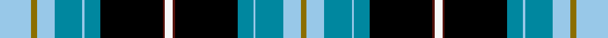

This is one **variant** — a specific cloth: this exact thread count and colourway, with its own
provenance below. It is one weaving of the [sett](/tartans/w/wr/wrens/) (the scale-free proportion — the
same cloth at any scale or shade), whose colour order is pattern [WBKBWBWGW](/stripes/wbkbwbwgw/).

Part of the [Wrens](/tartans/w/wr/wrens/) tartan — the named design grouping this sett with its other cloths.

Sourced from house-of-tartan.  It is a [9 stripe tartan](/stripes/stripes9/).

Original link [http://www.house-of-tartan.scotland.net/house/TartanViewjs.asp?colr=Def&tnam=2345](http://www.house-of-tartan.scotland.net/house/TartanViewjs.asp?colr=Def&tnam=2345)

## Provenance

Earliest known date: 1995 Popularly known as the Wrens. Lochcarron swatch.

2 attestations — the source records this cloth was collapsed from (oldest owns this page)

<ul>
<li>1995 — Wrens Corporate Tartan (house-of-tartan, <a href="http://www.house-of-tartan.scotland.net/house/TartanViewjs.asp?colr=Def&tnam=2345">record</a>) </li>
<li>01/01/1997 — Wrens (WRNS) (register-of-tartans, <a href="https://www.tartanregister.gov.uk/tartanDetails.aspx?ref=4785">record</a>)  <em>Popularly known as the Wrens. Lochcarron swatch. For the Womens Royal Naval Service Association, (The WRENS). Woven by D.C. Dalgliesh.c1997.</em></li>
</ul>

Dataset <small>— provenance for this record, inherited from the source manifest</small>

<dl class="dataset-prov">
<dt>source</dt><dd><a href="/sources/house-of-tartan/">House of Tartan</a></dd>
<dt>data captured from</dt><dd><a href="https://github.com/thetartan/tartan-database/blob/master/data/house-of-tartan/data.csv">https://github.com/thetartan/tartan-database/blob/master/data/house-of-tartan/data.csv</a></dd>
<dt>data date</dt><dd>1995 <small>(this record)</small></dd>
<dt>licence</dt><dd><a href="https://creativecommons.org/licenses/by-nc-nd/4.0/">CC BY-NC-ND 4.0</a></dd>
</dl>

Capture chain <small>— the hands this data passed through, oldest first; each capture carries its own licence</small>

<ol class="capture-chain">
<li><a href="http://www.house-of-tartan.scotland.net/">House of Tartan</a> <small>the weaver/retailer's database — the site is now offline; the URL is kept as the ultimate source's identity</small></li>
<li><a href="https://github.com/thetartan/tartan-database">thetartan/tartan-database</a> <small>2016-2017</small> · <a href="https://creativecommons.org/licenses/by-nc-nd/4.0/">CC BY-NC-ND 4.0</a> <small>Levko Kravets's frozen compilation — the capture we vendored, and where its CC licence text came from</small></li>
<li>this dictionary <small>captured 2026-06-10 · commit 5bf86c7566</small> <small>each re-capture is a git commit to data/sources</small></li>
</ol>

## Register references

External register numbers recorded for this tartan.

- Scottish Register of Tartans: [4785](https://www.tartanregister.gov.uk/tartanDetails.aspx?ref=4785)
- Scottish Tartans Authority (ITI): 2345
- Scottish Tartans World Register: 2345

## Thread count
LB/32 Y6 LB18 T28 LB2 T16 K64 DR2 W/8

One full sett is **312 threads**.

The source recorded this cloth as LB/32 Y6 LB18 T28 LB2 T16 K64 DR2 W8 DR2 K64 T16 LB2 T28 LB18 Y/6 — 586 threads; it folds to the canonical 312-thread sett above.

## Palette
<table><thead><tr><th>Colour</th><th>Shade</th><th>OKLCh</th></tr></thead><tbody><tr><td>B</td><td><code style="background-color:#788CB4;">#788CB4</code> <small style="color:#888">#788CB4</small></td><td><small style="color:#888">oklch(63.9% 0.065 264.0)</small></td></tr><tr><td>T</td><td><code style="background-color:#00879F;">#00879F</code> <small style="color:#888">#00879F</small></td><td><small style="color:#888">oklch(57.4% 0.102 216.1)</small></td></tr><tr><td>DB</td><td><code style="background-color:#082077;">#082077</code> <small style="color:#888">#082077</small></td><td><small style="color:#888">oklch(30.0% 0.149 265.1)</small></td></tr><tr><td>DR</td><td><code style="background-color:#55120C;">#55120C</code> <small style="color:#888">#55120C</small></td><td><small style="color:#888">oklch(30.0% 0.099 29.3)</small></td></tr><tr><td>G</td><td><code style="background-color:#008B2A;">#008B2A</code> <small style="color:#888">#008B2A</small></td><td><small style="color:#888">oklch(55.4% 0.170 145.9)</small></td></tr><tr><td>K</td><td><code style="background-color:#000000;">#000000</code> <small style="color:#888">#000000</small></td><td><small style="color:#888">oklch(0.0% 0.000 0.0)</small></td></tr><tr><td>LB</td><td><code style="background-color:#98C8E8;">#98C8E8</code> <small style="color:#888">#98C8E8</small></td><td><small style="color:#888">oklch(81.0% 0.068 237.9)</small></td></tr><tr><td>DP</td><td><code style="background-color:#4B0B4F;">#4B0B4F</code> <small style="color:#888">#4B0B4F</small></td><td><small style="color:#888">oklch(30.1% 0.125 325.4)</small></td></tr><tr><td>W</td><td><code style="background-color:#F7F7F7;">#F7F7F7</code> <small style="color:#888">#F7F7F7</small></td><td><small style="color:#888">oklch(97.6% 0.000 89.9)</small></td></tr><tr><td>DY</td><td><code style="background-color:#3A2B0D;">#3A2B0D</code> <small style="color:#888">#3A2B0D</small></td><td><small style="color:#888">oklch(30.0% 0.049 82.0)</small></td></tr><tr><td>Y</td><td><code style="background-color:#8B6E00;">#8B6E00</code> <small style="color:#888">#8B6E00</small></td><td><small style="color:#888">oklch(55.1% 0.113 90.4)</small></td></tr></tbody></table>

# Sample pattern

## Nearest tartan variants

The nearest existing variants by ΔTartan distance, with this cloth at the top so the swatches line up against it.

ΔTartan

Threads

Variant

Sett

—

586

<a href="/variants/s9/lb16y3lb9t14lb1t8k32dr1w4~x2~lb3203246/">Wrens Corporate Tartan</a>

<a href="/ttd/edit/#slug=lb16y3lb9t14lb1t8k32dr1w4~x2&amp;base=lb16y3lb9t14lb1t8k32dr1w4~x2~lb3203246" title="compare in the TTD">0.03</a>

312

<a href="/variants/s9/lb16y3lb9t14lb1t8k32dr1w4~x2/">Wrens (WRNS) (Military)</a>

<a href="/ttd/edit/#slug=db28y6k2y1k2y6w6g2w1g2w6db28n4k5g8k5n4~x2&amp;base=lb16y3lb9t14lb1t8k32dr1w4~x2~lb3203246" title="compare in the TTD">2.40</a>

400

<a href="/variants/s17/db28y6k2y1k2y6w6g2w1g2w6db28n4k5g8k5n4~x2/">Bog Myrtle Corner</a>

<a href="/ttd/edit/#slug=db7k1r3k1db24k1w3k3dg3k3dg3g19k2w4~x2&amp;base=lb16y3lb9t14lb1t8k32dr1w4~x2~lb3203246" title="compare in the TTD">2.48</a>

286

<a href="/variants/s14/db7k1r3k1db24k1w3k3dg3k3dg3g19k2w4~x2/">Strathclyde, University of</a>

<a href="/ttd/edit/#slug=w4k1db24k1r8w2g8w2db8k1y2k8y2k1~x2&amp;base=lb16y3lb9t14lb1t8k32dr1w4~x2~lb3203246" title="compare in the TTD">2.50</a>

278

<a href="/variants/s14/w4k1db24k1r8w2g8w2db8k1y2k8y2k1~x2/">South Africa</a>

<a href="/ttd/edit/#slug=db5r2ly7r2db42g28k5db10k15g5w3r3&amp;base=lb16y3lb9t14lb1t8k32dr1w4~x2~lb3203246" title="compare in the TTD">2.50</a>

246

<a href="/variants/s12/db5r2ly7r2db42g28k5db10k15g5w3r3/">Heritage Sequane</a>

<a href="/ttd/edit/#slug=r3db14k12lb24k1w3k1lb24k12db2k2db2k2db8y1r3~x2&amp;base=lb16y3lb9t14lb1t8k32dr1w4~x2~lb3203246" title="compare in the TTD">2.54</a>

444

<a href="/variants/s16/r3db14k12lb24k1w3k1lb24k12db2k2db2k2db8y1r3~x2/">Royal Scottish Country Dance Society</a>

<a href="/ttd/edit/#slug=y4k1g10r2g10r4g10r2g10k16db28k1b4~x2&amp;base=lb16y3lb9t14lb1t8k32dr1w4~x2~lb3203246" title="compare in the TTD">2.60</a>

392

<a href="/variants/s13/y4k1g10r2g10r4g10r2g10k16db28k1b4~x2/">California</a>

<a href="/ttd/edit/#slug=db7k1r3k1db24k1w3k3g3k3g3dg19k2w4~x2~g1903114-dg1806142&amp;base=lb16y3lb9t14lb1t8k32dr1w4~x2~lb3203246" title="compare in the TTD">2.64</a>

286

<a href="/variants/s14/db7k1r3k1db24k1w3k3g3k3g3dg19k2w4~x2~g1903114-dg1806142/">Strathclyde, University of Corporate Tartan</a>

<a href="/ttd/edit/#slug=g4y2g24dr2k12db3k2db2k2db12w1db1w3~x2&amp;base=lb16y3lb9t14lb1t8k32dr1w4~x2~lb3203246" title="compare in the TTD">2.67</a>

266

<a href="/variants/s13/g4y2g24dr2k12db3k2db2k2db12w1db1w3~x2/">Baron of Greencastle (Personal)</a>

<a href="/ttd/edit/#slug=db4lb1db2lb16y2k8y2g16k1db24k1w4~x2&amp;base=lb16y3lb9t14lb1t8k32dr1w4~x2~lb3203246" title="compare in the TTD">2.70</a>

308

<a href="/variants/s12/db4lb1db2lb16y2k8y2g16k1db24k1w4~x2/">Tanzania</a>

## Neighbour map

Every grey dot is one of 13657 variants placed by the first two principal components of the ΔTartan feature space (42% of its variance). Red is this tartan; blue dots are its nearest — click one to open its page. The map is a flat projection of a many-dimensional space — [how to read it](/posts/neighbourhood-maps/).

<svg viewBox="0 0 640 380" role="img" style="max-width:100%;height:auto;border:1px solid #e0e0e0;border-radius:4px;display:block" xmlns="http://www.w3.org/2000/svg"><image href="/nn/cloud.v1.png" width="640" height="380"/><a href="/variants/s9/lb16y3lb9t14lb1t8k32dr1w4~x2/"><circle cx="140.2" cy="98.5" r="4" fill="#3465a4"><title>Wrens (WRNS) (Military)</title></circle></a><a href="/variants/s17/db28y6k2y1k2y6w6g2w1g2w6db28n4k5g8k5n4~x2/"><circle cx="179.9" cy="63.0" r="4" fill="#3465a4"><title>Bog Myrtle Corner</title></circle></a><a href="/variants/s14/db7k1r3k1db24k1w3k3dg3k3dg3g19k2w4~x2/"><circle cx="143.2" cy="73.3" r="4" fill="#3465a4"><title>Strathclyde, University of</title></circle></a><a href="/variants/s14/w4k1db24k1r8w2g8w2db8k1y2k8y2k1~x2/"><circle cx="154.4" cy="72.7" r="4" fill="#3465a4"><title>South Africa</title></circle></a><a href="/variants/s12/db5r2ly7r2db42g28k5db10k15g5w3r3/"><circle cx="174.4" cy="93.5" r="4" fill="#3465a4"><title>Heritage Sequane</title></circle></a><a href="/variants/s16/r3db14k12lb24k1w3k1lb24k12db2k2db2k2db8y1r3~x2/"><circle cx="147.6" cy="73.2" r="4" fill="#3465a4"><title>Royal Scottish Country Dance Society</title></circle></a><a href="/variants/s13/y4k1g10r2g10r4g10r2g10k16db28k1b4~x2/"><circle cx="148.4" cy="96.9" r="4" fill="#3465a4"><title>California</title></circle></a><a href="/variants/s14/db7k1r3k1db24k1w3k3g3k3g3dg19k2w4~x2~g1903114-dg1806142/"><circle cx="149.5" cy="74.3" r="4" fill="#3465a4"><title>Strathclyde, University of Corporate Tartan</title></circle></a><a href="/variants/s13/g4y2g24dr2k12db3k2db2k2db12w1db1w3~x2/"><circle cx="154.2" cy="83.2" r="4" fill="#3465a4"><title>Baron of Greencastle (Personal)</title></circle></a><a href="/variants/s12/db4lb1db2lb16y2k8y2g16k1db24k1w4~x2/"><circle cx="125.0" cy="90.3" r="4" fill="#3465a4"><title>Tanzania</title></circle></a><circle cx="148.3" cy="73.3" r="5" fill="#c00000"/><text x="320" y="376" text-anchor="middle" font-size="11" fill="#999">ground</text><text x="11" y="190" text-anchor="middle" font-size="11" fill="#999" transform="rotate(-90 11 190)">complexity</text></svg>

ID: /variants/s9/lb16y3lb9t14lb1t8k32dr1w4~x2~lb3203246/
