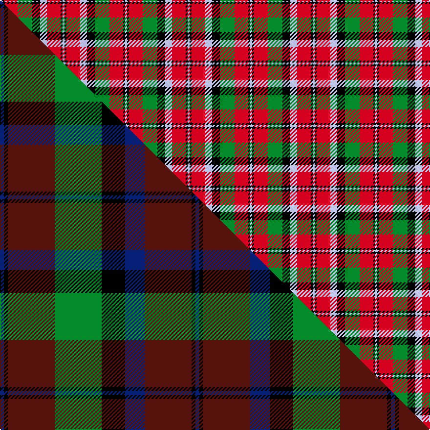

This is one **variant** — a specific cloth: this exact thread count and colourway, with its own
provenance below. It is one weaving of the [sett](/setts/lb2k2r14g15k8lb7r14k2lb2/) (the scale-free proportion — the
same cloth at any scale or shade), whose colour order is pattern [WKRGKWRKW](/stripes/wkrgkwrkw/).

Part of the [Montrose](/tartans/montrose/) tartan — the named design grouping this sett with its other cloths.

Sourced from weddslist.  It is a [9 stripe tartan](/stripes/stripes9/).

Original link [http://www.weddslist.com/cgi-bin/tartans/pg.pl?source=x](http://www.weddslist.com/cgi-bin/tartans/pg.pl?source=x)

Dataset <small>— provenance for this record, inherited from the source manifest</small>

<dl class="dataset-prov">
<dt>source</dt><dd><a href="/sources/weddslist/">Weddslist</a></dd>
<dt>data captured from</dt><dd><a href="https://github.com/thetartan/tartan-database/blob/master/data/weddslist/data.csv">https://github.com/thetartan/tartan-database/blob/master/data/weddslist/data.csv</a></dd>
<dt>data date</dt><dd>2016-11-17 <small>(dataset default)</small></dd>
<dt>licence</dt><dd><a href="https://creativecommons.org/licenses/by-nc-nd/4.0/">CC BY-NC-ND 4.0</a></dd>
</dl>

Capture chain <small>— the hands this data passed through, oldest first; each capture carries its own licence</small>

<ol class="capture-chain">
<li><a href="https://www.weddslist.com/tartans/">Weddslist</a> <small>the living privately compiled reference</small></li>
<li><a href="https://github.com/thetartan/tartan-database">thetartan/tartan-database</a> <small>2016-2017</small> · <a href="https://creativecommons.org/licenses/by-nc-nd/4.0/">CC BY-NC-ND 4.0</a> <small>Levko Kravets's frozen compilation — the capture we vendored, and where its CC licence text came from</small></li>
<li>this dictionary <small>captured 2026-06-10 · commit 5bf86c7566</small> <small>each re-capture is a git commit to data/sources</small></li>
</ol>

## Thread count
LB/2 K2 R14 G15 K8 LB7 R14 K2 LB/2

One full sett is **128 threads**.

## Palette
<table><thead><tr><th>Colour</th><th>Shade</th><th>OKLCh</th></tr></thead><tbody><tr><td>LB</td><td><code style="background-color:#B5BBDE;">#B5BBDE</code> <small style="color:#888">#B5BBDE</small></td><td><small style="color:#888">oklch(79.9% 0.050 277.6)</small></td></tr><tr><td>G</td><td><code style="background-color:#008B2A;">#008B2A</code> <small style="color:#888">#008B2A</small></td><td><small style="color:#888">oklch(55.4% 0.170 145.9)</small></td></tr><tr><td>R</td><td><code style="background-color:#D60020;">#D60020</code> <small style="color:#888">#D60020</small></td><td><small style="color:#888">oklch(55.2% 0.224 25.5)</small></td></tr><tr><td>K</td><td><code style="background-color:#000000;">#000000</code> <small style="color:#888">#000000</small></td><td><small style="color:#888">oklch(0.0% 0.000 0.0)</small></td></tr></tbody></table>

# Sample pattern

## Compared to the master

This cloth is one sett of its design; the master sett (the exemplar the design is anchored on) is below for comparison.

Its **ΔTartan distance** from the master is **0.56** — the same measure the nearest-tartans table ranks by (0 is identical; a re-scale of the same cloth is near 0, a recolour or a different proportion further).

<figure class="master-compare" style="margin:0">

this sett
master sett ★

<figcaption style="color:#888;font-size:smaller">One weave of this sett against the <a href="/setts/db1k1dr12g12k6db5dr12k1db1/">master sett ★</a>, split on the diagonal: a shared proportion runs seamlessly across it with only the shades shifting; a different proportion breaks on it.</figcaption>
</figure>

## Nearest tartan variants

The nearest existing variants by ΔTartan distance, with this cloth at the top so the swatches line up against it.

ΔTartan

Threads

Variant

Sett

—

128

<a href="/variants/s9/lb2k2r14g15k8lb7r14k2lb2/">Montrose</a>

<a href="/ttd/edit/#slug=lb2k2r14g15k8lb7r14k2lb2~x2&amp;base=lb2k2r14g15k8lb7r14k2lb2" title="compare in the TTD">0.00</a>

256

<a href="/variants/s9/lb2k2r14g15k8lb7r14k2lb2~x2/">Montrose</a>

<a href="/ttd/edit/#slug=lb1k1r10g10k5lb5r10k1lb1~x4&amp;base=lb2k2r14g15k8lb7r14k2lb2" title="compare in the TTD">0.34</a>

344

<a href="/variants/s9/lb1k1r10g10k5lb5r10k1lb1~x4/">Graham Red</a>

<a href="/ttd/edit/#slug=lb2k2r27g27k12lb12r27k2lb2~x2&amp;base=lb2k2r14g15k8lb7r14k2lb2" title="compare in the TTD">0.48</a>

444

<a href="/variants/s9/lb2k2r27g27k12lb12r27k2lb2~x2/">MacNaughton</a>

<a href="/ttd/edit/#slug=db1k1r12g12k6db5r12k1db1~x2&amp;base=lb2k2r14g15k8lb7r14k2lb2" title="compare in the TTD">0.51</a>

200

<a href="/variants/s9/db1k1r12g12k6db5r12k1db1~x2/">Montrose Clan Tartan</a>

<a href="/ttd/edit/#slug=w2k2r14g15k8w7r14k2w2&amp;base=lb2k2r14g15k8lb7r14k2lb2" title="compare in the TTD">2.00</a>

128

<a href="/variants/s9/w2k2r14g15k8w7r14k2w2/">Montrose</a>

<a href="/ttd/edit/#slug=n28k3r22k8w3k8r22k3n28k3~x2&amp;base=lb2k2r14g15k8lb7r14k2lb2" title="compare in the TTD">2.32</a>

450

<a href="/variants/s10/n28k3r22k8w3k8r22k3n28k3~x2/">Henkel</a>

<a href="/ttd/edit/#slug=o3k7o2w2oi12k2oi2o3~x2~o2102055-oi2104058&amp;base=lb2k2r14g15k8lb7r14k2lb2" title="compare in the TTD">2.33</a>

120

<a href="/variants/s8/o3k7o2w2oi12k2oi2o3~x2~o2102055-oi2104058/">Daks</a>

<a href="/ttd/edit/#slug=g3r22lb5g10k10g2~x2&amp;base=lb2k2r14g15k8lb7r14k2lb2" title="compare in the TTD">2.33</a>

198

<a href="/variants/s6/g3r22lb5g10k10g2~x2/">Strathspey, Check</a>

<a href="/ttd/edit/#slug=r4o30k6w13k13w3~x2&amp;base=lb2k2r14g15k8lb7r14k2lb2" title="compare in the TTD">2.39</a>

262

<a href="/variants/s6/r4o30k6w13k13w3~x2/">Thom(p)son camel</a>

<a href="/ttd/edit/#slug=db3k5r2g2r3g12r6k1r3~x4&amp;base=lb2k2r14g15k8lb7r14k2lb2" title="compare in the TTD">2.49</a>

272

<a href="/variants/s9/db3k5r2g2r3g12r6k1r3~x4/">Fulton (1999) (Name)</a>

## Neighbour map

Every grey dot is one of 13621 variants placed by the first two principal components of the ΔTartan feature space (42% of its variance). Red is this tartan; blue dots are its nearest — click one to open its page.

<svg viewBox="0 0 640 380" role="img" style="max-width:100%;height:auto;border:1px solid #e0e0e0;border-radius:4px;display:block" xmlns="http://www.w3.org/2000/svg"><image href="/nn/cloud.v1.png" width="640" height="380"/><a href="/variants/s9/lb2k2r14g15k8lb7r14k2lb2~x2/"><circle cx="145.2" cy="188.2" r="4" fill="#3465a4"><title>Montrose</title></circle></a><a href="/variants/s9/lb1k1r10g10k5lb5r10k1lb1~x4/"><circle cx="177.2" cy="171.1" r="4" fill="#3465a4"><title>Graham Red</title></circle></a><a href="/variants/s9/lb2k2r27g27k12lb12r27k2lb2~x2/"><circle cx="206.9" cy="154.6" r="4" fill="#3465a4"><title>MacNaughton</title></circle></a><a href="/variants/s9/db1k1r12g12k6db5r12k1db1~x2/"><circle cx="200.1" cy="161.1" r="4" fill="#3465a4"><title>Montrose Clan Tartan</title></circle></a><a href="/variants/s9/w2k2r14g15k8w7r14k2w2/"><circle cx="136.4" cy="185.8" r="4" fill="#3465a4"><title>Montrose</title></circle></a><a href="/variants/s10/n28k3r22k8w3k8r22k3n28k3~x2/"><circle cx="195.1" cy="172.6" r="4" fill="#3465a4"><title>Henkel</title></circle></a><a href="/variants/s8/o3k7o2w2oi12k2oi2o3~x2~o2102055-oi2104058/"><circle cx="161.0" cy="198.4" r="4" fill="#3465a4"><title>Daks</title></circle></a><a href="/variants/s6/g3r22lb5g10k10g2~x2/"><circle cx="178.8" cy="189.4" r="4" fill="#3465a4"><title>Strathspey, Check</title></circle></a><a href="/variants/s6/r4o30k6w13k13w3~x2/"><circle cx="166.2" cy="184.2" r="4" fill="#3465a4"><title>Thom(p)son camel</title></circle></a><a href="/variants/s9/db3k5r2g2r3g12r6k1r3~x4/"><circle cx="162.9" cy="174.5" r="4" fill="#3465a4"><title>Fulton (1999) (Name)</title></circle></a><circle cx="145.2" cy="188.2" r="5" fill="#c00000"/><text x="320" y="376" text-anchor="middle" font-size="11" fill="#999">ground</text><text x="11" y="190" text-anchor="middle" font-size="11" fill="#999" transform="rotate(-90 11 190)">complexity</text></svg>

ID: /variants/s9/lb2k2r14g15k8lb7r14k2lb2/
