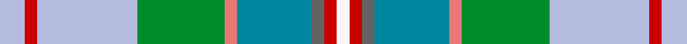

This is one **variant** — a specific cloth: this exact thread count and colourway, with its own
provenance below. It is one weaving of the [sett](/tartans/k/ka/kansai2/) (the scale-free proportion — the
same cloth at any scale or shade), whose colour order is pattern [WRBBRGWRW](/stripes/wrbbrgwrw/).

Part of the [Kansai2](/tartans/k/ka/kansai2/) tartan — the named design grouping this sett with its other cloths.

Sourced from register-of-tartans.  It is a [9 stripe tartan](/stripes/stripes9/).

Original link [https://www.tartanregister.gov.uk/tartanDetails.aspx?ref=1930](https://www.tartanregister.gov.uk/tartanDetails.aspx?ref=1930)

Dataset <small>— provenance for this record, inherited from the source manifest</small>

<dl class="dataset-prov">
<dt>source</dt><dd><a href="/sources/register-of-tartans/">Scottish Register of Tartans</a></dd>
<dt>data captured from</dt><dd><a href="https://github.com/thetartan/tartan-database/blob/master/data/register-of-tartans/data.csv">https://github.com/thetartan/tartan-database/blob/master/data/register-of-tartans/data.csv</a></dd>
<dt>data date</dt><dd>2004 <small>(this record)</small></dd>
<dt>licence</dt><dd><a href="https://www.tartanregister.gov.uk/copyright">Crown copyright</a></dd>
</dl>

Capture chain <small>— the hands this data passed through, oldest first; each capture carries its own licence</small>

<ol class="capture-chain">
<li><a href="https://www.tartanregister.gov.uk/">Scottish Register of Tartans</a> · <a href="https://www.tartanregister.gov.uk/copyright">Crown copyright</a> <small>the living register — still published by National Records of Scotland</small></li>
<li><a href="https://github.com/thetartan/tartan-database">thetartan/tartan-database</a> <small>2016-2017</small> · <a href="https://creativecommons.org/licenses/by-nc-nd/4.0/">CC BY-NC-ND 4.0</a> <small>Levko Kravets's frozen compilation — the capture we vendored, and where its CC licence text came from</small></li>
<li>this dictionary <small>captured 2026-06-10 · commit 5bf86c7566</small> <small>each re-capture is a git commit to data/sources</small></li>
</ol>

## Register references

External register numbers recorded for this tartan.

- Scottish Register of Tartans: [1930](https://www.tartanregister.gov.uk/tartanDetails.aspx?ref=1930)
- Scottish Tartans Authority (ITI): 6279

## Thread count
LB/8 R4 LB32 G28 Ri4 T24 N4 R4 W/4

One full sett is **212 threads**.

The source recorded this cloth as LB/8 R4 LB32 G28 Ri4 T24 N4 R4 W4 R4 N4 T24 Ri4 G28 LB32 R/4 — 412 threads; it folds to the canonical 212-thread sett above.

## Palette
<table><thead><tr><th>Colour</th><th>Shade</th><th>OKLCh</th></tr></thead><tbody><tr><td>T</td><td><code style="background-color:#00879F;">#00879F</code> <small style="color:#888">#00879F</small></td><td><small style="color:#888">oklch(57.4% 0.102 216.1)</small></td></tr><tr><td>LB</td><td><code style="background-color:#B5BBDE;">#B5BBDE</code> <small style="color:#888">#B5BBDE</small></td><td><small style="color:#888">oklch(79.9% 0.050 277.6)</small></td></tr><tr><td>DB</td><td><code style="background-color:#082077;">#082077</code> <small style="color:#888">#082077</small></td><td><small style="color:#888">oklch(30.0% 0.149 265.1)</small></td></tr><tr><td>G</td><td><code style="background-color:#008B2A;">#008B2A</code> <small style="color:#888">#008B2A</small></td><td><small style="color:#888">oklch(55.4% 0.170 145.9)</small></td></tr><tr><td>R</td><td><code style="background-color:#E87878;">#E87878</code> <small style="color:#888">#E87878</small></td><td><small style="color:#888">oklch(70.0% 0.139 21.2)</small></td></tr><tr><td>N</td><td><code style="background-color:#636363;">#636363</code> <small style="color:#888">#636363</small></td><td><small style="color:#888">oklch(50.0% 0.000 89.9)</small></td></tr><tr><td>R</td><td><code style="background-color:#C80000;">#C80000</code> <small style="color:#888">#C80000</small></td><td><small style="color:#888">oklch(52.3% 0.215 29.2)</small></td></tr><tr><td>W</td><td><code style="background-color:#F7F7F7;">#F7F7F7</code> <small style="color:#888">#F7F7F7</small></td><td><small style="color:#888">oklch(97.6% 0.000 89.9)</small></td></tr></tbody></table>

# Sample pattern

[Sample sheet (PDF)](swatch.pdf) — the woven sample, thread count and palette on one printable A4, rendered on demand (the same sheet the TTD print page downloads).

## Nearest tartan variants

The nearest existing variants by ΔTartan distance, with this cloth at the top so the swatches line up against it.

ΔTartan

Threads

Variant

Sett

—

412

<a href="/variants/s9/lb2r1lb8g7ri1t6n1r1w1~x4~r5221030-ri6914021/">Kansai2</a>

<a href="/ttd/edit/#slug=r2lb22ly4w3g7lyi2g4w2g9o6lyi2o4w2~x2~ly6307084-lyi8517093&amp;base=lb2r1lb8g7ri1t6n1r1w1~x4~r5221030-ri6914021" title="compare in the TTD">2.75</a>

268

<a href="/variants/s13/r2lb22ly4w3g7lyi2g4w2g9o6lyi2o4w2~x2~ly6307084-lyi8517093/">Isle of Man (District)</a>

<a href="/ttd/edit/#slug=t22ly4w3g7lyi2g4w2g9o6lyi2o4w2o4lyi2o6g9w2g4lyi2g7w3ly4t22r2~x2~t6107234-ly6307084-lyi8517093&amp;base=lb2r1lb8g7ri1t6n1r1w1~x4~r5221030-ri6914021" title="compare in the TTD">2.78</a>

488

<a href="/variants/s24/t22ly4w3g7lyi2g4w2g9o6lyi2o4w2o4lyi2o6g9w2g4lyi2g7w3ly4t22r2~x2~t6107234-ly6307084-lyi8517093/">Isle of Man</a>

<a href="/ttd/edit/#slug=t8r12g2ly5g2lb9y3t8w1t3w1t3w1~x4~t5912243-lb80&amp;base=lb2r1lb8g7ri1t6n1r1w1~x4~r5221030-ri6914021" title="compare in the TTD">2.99</a>

428

<a href="/variants/s13/t8r12g2ly5g2lb9y3t8w1t3w1t3w1~x4~t5912243-lb80/">Saint Joseph de Sorel #2</a>

<a href="/ttd/edit/#slug=r5db3t20db3dg5g20y3g20dg5db3t20db3w5~db2609279-t5912243&amp;base=lb2r1lb8g7ri1t6n1r1w1~x4~r5221030-ri6914021" title="compare in the TTD">3.07</a>

220

<a href="/variants/s13/r5db3t20db3dg5g20y3g20dg5db3t20db3w5~db2609279-t5912243/">Hosey</a>

<a href="/ttd/edit/#slug=g40db4lb39db4n4y4n4r4n34dp4n4w4&amp;base=lb2r1lb8g7ri1t6n1r1w1~x4~r5221030-ri6914021" title="compare in the TTD">3.34</a>

254

<a href="/variants/s12/g40db4lb39db4n4y4n4r4n34dp4n4w4/">Glasgow Tattoo</a>

<a href="/ttd/edit/#slug=dt8n3lb3n3o28lb4o8n12dt3n3dt3n3dt8dg3dt3dg3dt3dg12g4~n50-o63&amp;base=lb2r1lb8g7ri1t6n1r1w1~x4~r5221030-ri6914021" title="compare in the TTD">3.57</a>

222

<a href="/variants/s19/dt8n3lb3n3o28lb4o8n12dt3n3dt3n3dt8dg3dt3dg3dt3dg12g4~n50-o63/">Glenlea</a>

<a href="/ttd/edit/#slug=r5db3lb20db3dg5g20y3g20dg5db3lb20db3w5&amp;base=lb2r1lb8g7ri1t6n1r1w1~x4~r5221030-ri6914021" title="compare in the TTD">3.68</a>

220

<a href="/variants/s13/r5db3lb20db3dg5g20y3g20dg5db3lb20db3w5/">Hosey (Name)</a>

<a href="/ttd/edit/#slug=w3r10o6y8lb8g32b8r10b6w3~x4&amp;base=lb2r1lb8g7ri1t6n1r1w1~x4~r5221030-ri6914021" title="compare in the TTD">3.72</a>

728

<a href="/variants/s10/w3r10o6y8lb8g32b8r10b6w3~x4/">Unidentified, Silk scarf</a>

<a href="/ttd/edit/#slug=b16w3b2dy4g24r2g4r5g4r2t8~x2&amp;base=lb2r1lb8g7ri1t6n1r1w1~x4~r5221030-ri6914021" title="compare in the TTD">3.80</a>

248

<a href="/variants/s11/b16w3b2dy4g24r2g4r5g4r2t8~x2/">Currie of Arran</a>

<a href="/ttd/edit/#slug=ly29lyi3t19w3t3r3g17t3g4w3~x2~ly6307084-lyi8517093&amp;base=lb2r1lb8g7ri1t6n1r1w1~x4~r5221030-ri6914021" title="compare in the TTD">3.99</a>

284

<a href="/variants/s10/ly29lyi3t19w3t3r3g17t3g4w3~x2~ly6307084-lyi8517093/">State Seal of California (Fashion)</a>

## Neighbour map

Every grey dot is one of 13662 variants placed by the first two principal components of the ΔTartan feature space (42% of its variance). Red is this tartan; blue dots are its nearest — click one to open its page. The map is a flat projection of a many-dimensional space — [how to read it](/posts/neighbourhood-maps/).

<svg viewBox="0 0 640 380" role="img" style="max-width:100%;height:auto;border:1px solid #e0e0e0;border-radius:4px;display:block" xmlns="http://www.w3.org/2000/svg"><image href="/nn/cloud.v1.png" width="640" height="380"/><a href="/variants/s13/r2lb22ly4w3g7lyi2g4w2g9o6lyi2o4w2~x2~ly6307084-lyi8517093/"><circle cx="142.9" cy="148.4" r="4" fill="#3465a4"><title>Isle of Man (District)</title></circle></a><a href="/variants/s24/t22ly4w3g7lyi2g4w2g9o6lyi2o4w2o4lyi2o6g9w2g4lyi2g7w3ly4t22r2~x2~t6107234-ly6307084-lyi8517093/"><circle cx="155.5" cy="136.5" r="4" fill="#3465a4"><title>Isle of Man</title></circle></a><a href="/variants/s13/t8r12g2ly5g2lb9y3t8w1t3w1t3w1~x4~t5912243-lb80/"><circle cx="148.9" cy="156.0" r="4" fill="#3465a4"><title>Saint Joseph de Sorel #2</title></circle></a><a href="/variants/s13/r5db3t20db3dg5g20y3g20dg5db3t20db3w5~db2609279-t5912243/"><circle cx="131.5" cy="178.9" r="4" fill="#3465a4"><title>Hosey</title></circle></a><a href="/variants/s12/g40db4lb39db4n4y4n4r4n34dp4n4w4/"><circle cx="138.0" cy="129.8" r="4" fill="#3465a4"><title>Glasgow Tattoo</title></circle></a><a href="/variants/s19/dt8n3lb3n3o28lb4o8n12dt3n3dt3n3dt8dg3dt3dg3dt3dg12g4~n50-o63/"><circle cx="168.6" cy="165.5" r="4" fill="#3465a4"><title>Glenlea</title></circle></a><a href="/variants/s13/r5db3lb20db3dg5g20y3g20dg5db3lb20db3w5/"><circle cx="107.4" cy="168.8" r="4" fill="#3465a4"><title>Hosey (Name)</title></circle></a><a href="/variants/s10/w3r10o6y8lb8g32b8r10b6w3~x4/"><circle cx="127.6" cy="162.2" r="4" fill="#3465a4"><title>Unidentified, Silk scarf</title></circle></a><a href="/variants/s11/b16w3b2dy4g24r2g4r5g4r2t8~x2/"><circle cx="216.0" cy="162.4" r="4" fill="#3465a4"><title>Currie of Arran</title></circle></a><a href="/variants/s10/ly29lyi3t19w3t3r3g17t3g4w3~x2~ly6307084-lyi8517093/"><circle cx="225.0" cy="192.2" r="4" fill="#3465a4"><title>State Seal of California (Fashion)</title></circle></a><circle cx="151.2" cy="167.5" r="5" fill="#c00000"/><text x="320" y="376" text-anchor="middle" font-size="11" fill="#999">ground</text><text x="11" y="190" text-anchor="middle" font-size="11" fill="#999" transform="rotate(-90 11 190)">complexity</text></svg>

ID: /variants/s9/lb2r1lb8g7ri1t6n1r1w1~x4~r5221030-ri6914021/
