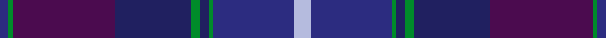

This is one **variant** — a specific cloth: this exact thread count and colourway, with its own
provenance below. It is one weaving of the [sett](/setts/lb4dbi19g1db2g2db18dp24g1dbi2/) (the scale-free proportion — the
same cloth at any scale or shade), whose colour order is pattern [BGBBGBGBWBGBGBBG](/stripes/bgbbgbgbwbgbgbbg/).

Part of the [Spirit of Alba](/tartans/s/sp/spirit-of-alba/) tartan — the named design grouping this sett with its other cloths.

Sourced from register-of-tartans.  It is a [16 stripe tartan](/stripes/stripes16/).

Original link [https://www.tartanregister.gov.uk/tartanDetails.aspx?ref=3862](https://www.tartanregister.gov.uk/tartanDetails.aspx?ref=3862)

## Provenance

Earliest known date: 2001 Designed by Claire Donaldson of the House of Edgar for Robert Nicol of Perth & Dunfermline.

3 attestations — the source records this cloth was collapsed from (oldest owns this page)

<ul>
<li>19/09/2001 — Spirit of Alba (register-of-tartans, <a href="https://www.tartanregister.gov.uk/tartanDetails.aspx?ref=3862">record</a>)  <em>Designed by Claire Donaldson of the House of Edgar for Robert Nicol of Perth & Dunfermline for kilt fabric.</em></li>
<li>Oct. 2001 — Spirit of Alba (Fashion) (tartans-authority, <a href="https://www.tartanregister.gov.uk/tartanDetails.aspx?ref=3904">record</a>)  <em>Designed by Claire Donaldson of the House of Edgar for Robert Nicol of Perth & Dunfermline.</em></li>
<li>2001 — Spirit of Alba Fashion Weavers Tartan (house-of-tartan, <a href="http://www.house-of-tartan.scotland.net/house/TartanViewjs.asp?colr=Def&tnam=3904">record</a>) </li>
</ul>

Dataset <small>— provenance for this record, inherited from the source manifest</small>

<dl class="dataset-prov">
<dt>source</dt><dd><a href="/sources/register-of-tartans/">Scottish Register of Tartans</a></dd>
<dt>data captured from</dt><dd><a href="https://github.com/thetartan/tartan-database/blob/master/data/register-of-tartans/data.csv">https://github.com/thetartan/tartan-database/blob/master/data/register-of-tartans/data.csv</a></dd>
<dt>data date</dt><dd>19/09/2001 <small>(this record)</small></dd>
<dt>licence</dt><dd><a href="https://www.tartanregister.gov.uk/copyright">Crown copyright</a></dd>
</dl>

Capture chain <small>— the hands this data passed through, oldest first; each capture carries its own licence</small>

<ol class="capture-chain">
<li><a href="https://www.tartanregister.gov.uk/">Scottish Register of Tartans</a> · <a href="https://www.tartanregister.gov.uk/copyright">Crown copyright</a> <small>the living register — still published by National Records of Scotland</small></li>
<li><a href="https://github.com/thetartan/tartan-database">thetartan/tartan-database</a> <small>2016-2017</small> · <a href="https://creativecommons.org/licenses/by-nc-nd/4.0/">CC BY-NC-ND 4.0</a> <small>Levko Kravets's frozen compilation — the capture we vendored, and where its CC licence text came from</small></li>
<li>this dictionary <small>captured 2026-06-10 · commit 5bf86c7566</small> <small>each re-capture is a git commit to data/sources</small></li>
</ol>

## Register references

External register numbers recorded for this tartan.

- Scottish Register of Tartans: [3862](https://www.tartanregister.gov.uk/tartanDetails.aspx?ref=3862)
- Scottish Tartans Authority (ITI): 3904
- Scottish Tartans World Register: 2846

## Thread count
DBi/4 G2 DP48 DB36 G4 DB4 G2 DBi38 LB8 DBi38 G2 DB4 G4 DB36 DP48 G/2

One full sett is **554 threads**.

## Palette
<table><thead><tr><th>Colour</th><th>Shade</th><th>OKLCh</th></tr></thead><tbody><tr><td>LB</td><td><code style="background-color:#B5BBDE;">#B5BBDE</code> <small style="color:#888">#B5BBDE</small></td><td><small style="color:#888">oklch(79.9% 0.050 277.6)</small></td></tr><tr><td>DB</td><td><code style="background-color:#202060;">#202060</code> <small style="color:#888">#202060</small></td><td><small style="color:#888">oklch(28.9% 0.111 276.9)</small></td></tr><tr><td>DB</td><td><code style="background-color:#2C2C80;">#2C2C80</code> <small style="color:#888">#2C2C80</small></td><td><small style="color:#888">oklch(35.0% 0.138 276.6)</small></td></tr><tr><td>G</td><td><code style="background-color:#008B2A;">#008B2A</code> <small style="color:#888">#008B2A</small></td><td><small style="color:#888">oklch(55.4% 0.170 145.9)</small></td></tr><tr><td>DP</td><td><code style="background-color:#4B0B4F;">#4B0B4F</code> <small style="color:#888">#4B0B4F</small></td><td><small style="color:#888">oklch(30.1% 0.125 325.4)</small></td></tr></tbody></table>

# Sample pattern

ID: /variants/s9/lb4dbi19g1db2g2db18dp24g1dbi2~x2~dbi1406275-db1204274/
