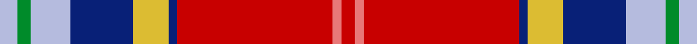

This page is one **sett** — a single exact thread-count. It belongs to the [tartan](/setts/lb4g3lb9db14ly8db2r35ri2r3/)
(the same proportion at any scale), whose colour order is pattern [RRRBYBWGW](/stripes/rrrbybwgw/).

Sourced from tartans-authority.  It is a [9 stripe tartan](/stripes/stripes9/).

Original link http://www.tartansauthority.com/tartan-ferret/display/10634/

## Register references

External register numbers recorded for this tartan.

- Scottish Register of Tartans: [10634](https://www.tartanregister.gov.uk/tartanDetails?ref=10634)
- Scottish Tartans Authority (ITI): 10634

## Thread count
LB/8 G6 LB18 DB28 LY16 DB4 R70 Ri4 R/6

One full sett is **306 threads**.

## Palette
<table><thead><tr><th>Colour</th><th>Shade</th><th>OKLCh</th></tr></thead><tbody><tr><td>B</td><td><code style="background-color:#B5BBDE;">#B5BBDE</code> <small style="color:#888">#B5BBDE</small></td><td><small style="color:#888">oklch(79.9% 0.050 277.6)</small></td></tr><tr><td>DB</td><td><code style="background-color:#082077;">#082077</code> <small style="color:#888">#082077</small></td><td><small style="color:#888">oklch(30.0% 0.149 265.1)</small></td></tr><tr><td>G</td><td><code style="background-color:#008B2A;">#008B2A</code> <small style="color:#888">#008B2A</small></td><td><small style="color:#888">oklch(55.4% 0.170 145.9)</small></td></tr><tr><td>LR</td><td><code style="background-color:#E87878;">#E87878</code> <small style="color:#888">#E87878</small></td><td><small style="color:#888">oklch(70.0% 0.139 21.2)</small></td></tr><tr><td>R</td><td><code style="background-color:#C80000;">#C80000</code> <small style="color:#888">#C80000</small></td><td><small style="color:#888">oklch(52.3% 0.215 29.2)</small></td></tr><tr><td>Y</td><td><code style="background-color:#DCBC32;">#DCBC32</code> <small style="color:#888">#DCBC32</small></td><td><small style="color:#888">oklch(80.0% 0.150 95.2)</small></td></tr></tbody></table>

# Sample pattern

## Nearest variants

The nearest existing variants by ΔTartan distance, with this cloth at the top so the swatches line up against it.

ΔTartan

Threads

Variant

Sett

—

306

<a href="/variants/s9/lb4g3lb9db14ly8db2r35ri2r3~x2~r2109032-ri2806019/">Hogeboom (Personal)</a>

<a href="/ttd/edit/#slug=gi4g3gi9b14y8b2r35lp2r3~x2~gi2203208-b1813263-r2208029-lp3004317&amp;base=lb4g3lb9db14ly8db2r35ri2r3~x2~r2109032-ri2806019" title="compare in the TTD">0.30</a>

306

<a href="/variants/s9/gi4g3gi9b14y8b2r35lp2r3~x2~gi2203208-b1813263-r2208029-lp3004317/">Hogeboom (Toronto) (Personal)</a>

<a href="/ttd/edit/#slug=db4y3db17b6w2do6w2r24do3r4~x2&amp;base=lb4g3lb9db14ly8db2r35ri2r3~x2~r2109032-ri2806019" title="compare in the TTD">2.77</a>

268

<a href="/variants/s10/db4y3db17b6w2do6w2r24do3r4~x2/">Asman Family</a>

## Neighbour map

Every grey dot is one of 13620 variants placed by the first two principal components of the ΔTartan feature space (42% of its variance). Red is this tartan; blue dots are its nearest — click one to open its page.

<svg viewBox="0 0 640 380" role="img" style="max-width:100%;height:auto;border:1px solid #e0e0e0;border-radius:4px;display:block" xmlns="http://www.w3.org/2000/svg"><image href="/nn/cloud.v1.png" width="640" height="380"/><a href="/variants/s9/gi4g3gi9b14y8b2r35lp2r3~x2~gi2203208-b1813263-r2208029-lp3004317/"><circle cx="255.9" cy="130.8" r="4" fill="#3465a4"><title>Hogeboom (Toronto) (Personal)</title></circle></a><a href="/variants/s10/db4y3db17b6w2do6w2r24do3r4~x2/"><circle cx="181.3" cy="144.1" r="4" fill="#3465a4"><title>Asman Family</title></circle></a><circle cx="230.1" cy="118.0" r="5" fill="#c00000"/><text x="320" y="376" text-anchor="middle" font-size="11" fill="#999">ground</text><text x="11" y="190" text-anchor="middle" font-size="11" fill="#999" transform="rotate(-90 11 190)">complexity</text></svg>

ID: /variants/s9/lb4g3lb9db14ly8db2r35ri2r3~x2~r2109032-ri2806019/
