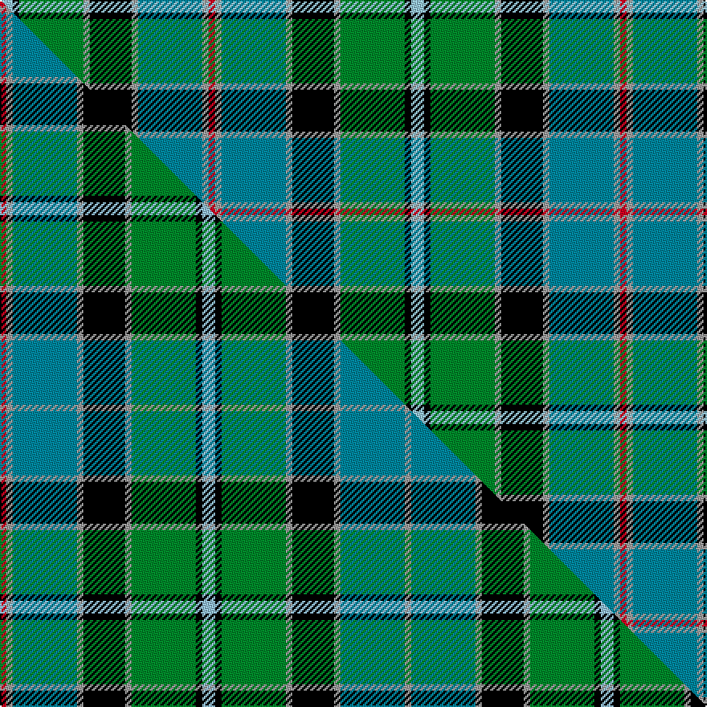

This page is one **sett** — a single exact thread-count. It belongs to the [tartan](/setts/lb4k2g20lr2k13lr2t20lr2r2/)
(the same proportion at any scale), whose colour order is pattern [RYBYKYGKW](/stripes/rybykygkw/).

Part of the [Stirling](/tartans/stirling/) tartan — the named design grouping this sett with its other cloths.

Sourced from tartans-authority.  It is a [9 stripe tartan](/stripes/stripes9/).

Original link http://www.tartansauthority.com/tartan-ferret/display/6759/

## Register references

External register numbers recorded for this tartan.

- Scottish Tartans Authority (ITI): 6759

## Thread count
LB/8 K4 G40 LR4 K26 LR4 T40 LR4 R/4

One full sett is **256 threads**.

## Palette
<table><thead><tr><th>Colour</th><th>Shade</th><th>OKLCh</th></tr></thead><tbody><tr><td>T</td><td><code style="background-color:#00879F;">#00879F</code> <small style="color:#888">#00879F</small></td><td><small style="color:#888">oklch(57.4% 0.102 216.1)</small></td></tr><tr><td>G</td><td><code style="background-color:#008B2A;">#008B2A</code> <small style="color:#888">#008B2A</small></td><td><small style="color:#888">oklch(55.4% 0.170 145.9)</small></td></tr><tr><td>K</td><td><code style="background-color:#000000;">#000000</code> <small style="color:#888">#000000</small></td><td><small style="color:#888">oklch(0.0% 0.000 0.0)</small></td></tr><tr><td>LB</td><td><code style="background-color:#98C8E8;">#98C8E8</code> <small style="color:#888">#98C8E8</small></td><td><small style="color:#888">oklch(81.0% 0.068 237.9)</small></td></tr><tr><td>LR</td><td><code style="background-color:#A0A0A0;">#A0A0A0</code> <small style="color:#888">#A0A0A0</small></td><td><small style="color:#888">oklch(70.6% 0.000 89.9)</small></td></tr><tr><td>R</td><td><code style="background-color:#D60020;">#D60020</code> <small style="color:#888">#D60020</small></td><td><small style="color:#888">oklch(55.2% 0.224 25.5)</small></td></tr></tbody></table>

# Sample pattern

## Compared to the master

This cloth is one sett of its design; the master sett (the exemplar the design is anchored on) is below for comparison.

Its **ΔTartan distance** from the master is **0.00** — the same measure the nearest-tartans table ranks by (0 is identical; a re-scale of the same cloth is near 0, a recolour or a different proportion further).

<figure class="master-compare" style="margin:0">

this sett
master sett ★

<figcaption style="color:#888;font-size:smaller">One weave of this sett against the <a href="/setts/r2lr2t20lr2k13lr2g20k2lb4k2g20lr2k13lr2t20lr2/">master sett ★</a>, split on the diagonal: a shared proportion runs seamlessly across it with only the shades shifting; a different proportion breaks on it.</figcaption>
</figure>

## Nearest tartan variants

The nearest existing variants by ΔTartan distance, with this cloth at the top so the swatches line up against it.

ΔTartan

Threads

Variant

Sett

—

256

<a href="/variants/s9/lb4k2g20lr2k13lr2t20lr2r2~x2~lb3203246-lr2800000/">Stirling (Clan)</a>

<a href="/ttd/edit/#slug=r3k2g20k10t20y2~x2&amp;base=lb4k2g20lr2k13lr2t20lr2r2~x2~lb3203246-lr2800000" title="compare in the TTD">1.30</a>

218

<a href="/variants/s6/r3k2g20k10t20y2~x2/">MacLeod of Assynt</a>

<a href="/ttd/edit/#slug=lb6g13k12t3k3ly3t30k3n11ly3n5~x2&amp;base=lb4k2g20lr2k13lr2t20lr2r2~x2~lb3203246-lr2800000" title="compare in the TTD">1.69</a>

346

<a href="/variants/s11/lb6g13k12t3k3ly3t30k3n11ly3n5~x2/">State Seal of Kentucky (Fashion)</a>

<a href="/ttd/edit/#slug=g7r2g3r5g17y2k15y2t22g3w2t7~x2&amp;base=lb4k2g20lr2k13lr2t20lr2r2~x2~lb3203246-lr2800000" title="compare in the TTD">1.93</a>

320

<a href="/variants/s12/g7r2g3r5g17y2k15y2t22g3w2t7~x2/">Paisley</a>

<a href="/ttd/edit/#slug=g9w9k2w2k2y2dg28g2db12g4~x2&amp;base=lb4k2g20lr2k13lr2t20lr2r2~x2~lb3203246-lr2800000" title="compare in the TTD">2.00</a>

262

<a href="/variants/s10/g9w9k2w2k2y2dg28g2db12g4~x2/">Order of Saint Lazarus</a>

<a href="/ttd/edit/#slug=w2db20r3k10g20lo2~x2&amp;base=lb4k2g20lr2k13lr2t20lr2r2~x2~lb3203246-lr2800000" title="compare in the TTD">2.13</a>

220

<a href="/variants/s6/w2db20r3k10g20lo2~x2/">Morris of Eddergoll (Personal)</a>

<a href="/ttd/edit/#slug=r3k1lb10k1g2k1db8g12k1y3~x2&amp;base=lb4k2g20lr2k13lr2t20lr2r2~x2~lb3203246-lr2800000" title="compare in the TTD">2.23</a>

156

<a href="/variants/s10/r3k1lb10k1g2k1db8g12k1y3~x2/">Sullivan (Estimated threadcount)</a>

<a href="/ttd/edit/#slug=r6g2r2g21k2w4k2db23y2db2y6~x2&amp;base=lb4k2g20lr2k13lr2t20lr2r2~x2~lb3203246-lr2800000" title="compare in the TTD">2.25</a>

264

<a href="/variants/s11/r6g2r2g21k2w4k2db23y2db2y6~x2/">Glasgow, City of Culture</a>

<a href="/ttd/edit/#slug=dy2lb14k1dg11k2r2g2k1~x4~dg1806142-g2203152&amp;base=lb4k2g20lr2k13lr2t20lr2r2~x2~lb3203246-lr2800000" title="compare in the TTD">2.38</a>

268

<a href="/variants/s8/dy2lb14k1dg11k2r2g2k1~x4~dg1806142-g2203152/">Mission</a>

<a href="/ttd/edit/#slug=w3b22r3k22g22y2~x2&amp;base=lb4k2g20lr2k13lr2t20lr2r2~x2~lb3203246-lr2800000" title="compare in the TTD">2.42</a>

286

<a href="/variants/s6/w3b22r3k22g22y2~x2/">Morris of Balgonie</a>

<a href="/ttd/edit/#slug=k6r3g30ly10db30w3~x2&amp;base=lb4k2g20lr2k13lr2t20lr2r2~x2~lb3203246-lr2800000" title="compare in the TTD">2.44</a>

310

<a href="/variants/s6/k6r3g30ly10db30w3~x2/">Turnbull of Thornton (Personal)</a>

## Neighbour map

Every grey dot is one of 13620 variants placed by the first two principal components of the ΔTartan feature space (42% of its variance). Red is this tartan; blue dots are its nearest — click one to open its page.

<svg viewBox="0 0 640 380" role="img" style="max-width:100%;height:auto;border:1px solid #e0e0e0;border-radius:4px;display:block" xmlns="http://www.w3.org/2000/svg"><image href="/nn/cloud.v1.png" width="640" height="380"/><a href="/variants/s6/r3k2g20k10t20y2~x2/"><circle cx="139.2" cy="189.3" r="4" fill="#3465a4"><title>MacLeod of Assynt</title></circle></a><a href="/variants/s11/lb6g13k12t3k3ly3t30k3n11ly3n5~x2/"><circle cx="98.2" cy="145.7" r="4" fill="#3465a4"><title>State Seal of Kentucky (Fashion)</title></circle></a><a href="/variants/s12/g7r2g3r5g17y2k15y2t22g3w2t7~x2/"><circle cx="108.2" cy="141.2" r="4" fill="#3465a4"><title>Paisley</title></circle></a><a href="/variants/s10/g9w9k2w2k2y2dg28g2db12g4~x2/"><circle cx="125.8" cy="121.7" r="4" fill="#3465a4"><title>Order of Saint Lazarus</title></circle></a><a href="/variants/s6/w2db20r3k10g20lo2~x2/"><circle cx="109.7" cy="169.2" r="4" fill="#3465a4"><title>Morris of Eddergoll (Personal)</title></circle></a><a href="/variants/s10/r3k1lb10k1g2k1db8g12k1y3~x2/"><circle cx="89.2" cy="135.5" r="4" fill="#3465a4"><title>Sullivan (Estimated threadcount)</title></circle></a><a href="/variants/s11/r6g2r2g21k2w4k2db23y2db2y6~x2/"><circle cx="121.3" cy="122.7" r="4" fill="#3465a4"><title>Glasgow, City of Culture</title></circle></a><a href="/variants/s8/dy2lb14k1dg11k2r2g2k1~x4~dg1806142-g2203152/"><circle cx="144.4" cy="125.0" r="4" fill="#3465a4"><title>Mission</title></circle></a><a href="/variants/s6/w3b22r3k22g22y2~x2/"><circle cx="81.9" cy="168.9" r="4" fill="#3465a4"><title>Morris of Balgonie</title></circle></a><a href="/variants/s6/k6r3g30ly10db30w3~x2/"><circle cx="120.1" cy="168.4" r="4" fill="#3465a4"><title>Turnbull of Thornton (Personal)</title></circle></a><circle cx="86.4" cy="147.6" r="5" fill="#c00000"/><text x="320" y="376" text-anchor="middle" font-size="11" fill="#999">ground</text><text x="11" y="190" text-anchor="middle" font-size="11" fill="#999" transform="rotate(-90 11 190)">complexity</text></svg>

ID: /variants/s9/lb4k2g20lr2k13lr2t20lr2r2~x2~lb3203246-lr2800000/
