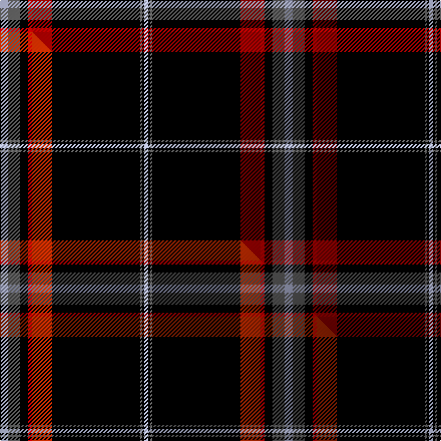

This is one **variant** — a specific cloth: this exact thread count and colourway, with its own
provenance below. It is one weaving of the [sett](/tartans/c/ca/calgary-hog/) (the scale-free proportion — the
same cloth at any scale or shade), whose colour order is pattern [WBKRRKBKW](/stripes/wbkrrkbkw/).

Part of the [Calgary HOG](/tartans/c/ca/calgary-hog/) tartan — the named design grouping this sett with its other cloths.

Sourced from tartans-authority.  It is a [9 stripe tartan](/stripes/stripes9/).

Original link <code>http://www.tartansauthority.com/tartan-ferret/display/10396/</code> — retired · [Internet Archive copy](https://web.archive.org/web/*/http://www.tartansauthority.com/tartan-ferret/display/10396/*)

Dataset <small>— provenance for this record, inherited from the source manifest</small>

<dl class="dataset-prov">
<dt>source</dt><dd><a href="/sources/tartans-authority/">Scottish Tartans Authority</a></dd>
<dt>data captured from</dt><dd><a href="https://github.com/thetartan/tartan-database/blob/master/data/tartans-authority/data.csv">https://github.com/thetartan/tartan-database/blob/master/data/tartans-authority/data.csv</a></dd>
<dt>data date</dt><dd>1st March 2011 <small>(this record)</small></dd>
<dt>licence</dt><dd><a href="https://creativecommons.org/licenses/by-nc-nd/4.0/">CC BY-NC-ND 4.0</a></dd>
</dl>

Capture chain <small>— the hands this data passed through, oldest first; each capture carries its own licence</small>

<ol class="capture-chain">
<li><a href="https://www.tartansauthority.com/">Scottish Tartans Authority</a> <small>the heritage body’s archive — its tartan-ferret record browser is retired; dead record links are shown unlinked, with an Internet Archive copy (ITI numbers are not SRT references)</small></li>
<li><a href="https://github.com/thetartan/tartan-database">thetartan/tartan-database</a> <small>2016-2017</small> · <a href="https://creativecommons.org/licenses/by-nc-nd/4.0/">CC BY-NC-ND 4.0</a> <small>Levko Kravets's frozen compilation — the capture we vendored, and where its CC licence text came from</small></li>
<li>this dictionary <small>captured 2026-06-10 · commit 5bf86c7566</small> <small>each re-capture is a git commit to data/sources</small></li>
</ol>

## Register references

External register numbers recorded for this tartan.

- Scottish Register of Tartans: [10396](https://www.tartanregister.gov.uk/tartanDetails?ref=10396)
- Scottish Tartans Authority (ITI): 10396

## Thread count
LB/8 N12 K8 Ri4 R20 K88 N2 K2 LB/4

One full sett is **284 threads**.

## Palette
<table><thead><tr><th>Colour</th><th>Shade</th><th>OKLCh</th></tr></thead><tbody><tr><td>R</td><td><code style="background-color:#A00000;">#A00000</code> <small style="color:#888">#A00000</small></td><td><small style="color:#888">oklch(44.3% 0.182 29.2)</small></td></tr><tr><td>K</td><td><code style="background-color:#000000;">#000000</code> <small style="color:#888">#000000</small></td><td><small style="color:#888">oklch(0.0% 0.000 0.0)</small></td></tr><tr><td>LB</td><td><code style="background-color:#B5BBDE;">#B5BBDE</code> <small style="color:#888">#B5BBDE</small></td><td><small style="color:#888">oklch(79.9% 0.050 277.6)</small></td></tr><tr><td>N</td><td><code style="background-color:#636363;">#636363</code> <small style="color:#888">#636363</small></td><td><small style="color:#888">oklch(50.0% 0.000 89.9)</small></td></tr><tr><td>R</td><td><code style="background-color:#C80000;">#C80000</code> <small style="color:#888">#C80000</small></td><td><small style="color:#888">oklch(52.3% 0.215 29.2)</small></td></tr></tbody></table>

# Sample pattern

## Compared to the master

This cloth is one sett of its design; the master sett (the exemplar the design is anchored on) is below for comparison.

Its **ΔTartan distance** from the master is **0.04** — the same measure the nearest-tartans table ranks by (0 is identical; a re-scale of the same cloth is near 0, a recolour or a different proportion further).

<figure class="master-compare" style="margin:0">

this sett
master sett ★

<figcaption style="color:#888;font-size:smaller">One weave of this sett against the <a href="/setts/lb4n6k4r2o10k44n1k1lb2/">master sett ★</a>, split on the diagonal: a shared proportion runs seamlessly across it with only the shades shifting; a different proportion breaks on it.</figcaption>
</figure>

## Nearest tartan variants

The nearest existing variants by ΔTartan distance, with this cloth at the top so the swatches line up against it.

ΔTartan

Threads

Variant

Sett

—

284

<a href="/variants/s9/lb4n6k4ri2r10k44n1k1lb2~x2~ri2109032-r1807033/">Calgary HOG (Corporate)</a>

<a href="/ttd/edit/#slug=lb4n6k4r2o10k44n1k1lb2~x2~r2410029-o2208036&amp;base=lb4n6k4ri2r10k44n1k1lb2~x2~ri2109032-r1807033" title="compare in the TTD">0.04</a>

284

<a href="/variants/s9/lb4n6k4r2o10k44n1k1lb2~x2~r2410029-o2208036/">Calgary HOG</a>

<a href="/ttd/edit/#slug=k31w1k2w2dt3k2n4w2~x4~dt1102249-n2203265&amp;base=lb4n6k4ri2r10k44n1k1lb2~x2~ri2109032-r1807033" title="compare in the TTD">1.56</a>

244

<a href="/variants/s8/k31w1k2w2dt3k2n4w2~x4~dt1102249-n2203265/">Capco</a>

<a href="/ttd/edit/#slug=dr35w8k85n6k4n14k2dp4&amp;base=lb4n6k4ri2r10k44n1k1lb2~x2~ri2109032-r1807033" title="compare in the TTD">1.63</a>

277

<a href="/variants/s8/dr35w8k85n6k4n14k2dp4/">MacEvil (Corporate)</a>

<a href="/ttd/edit/#slug=k2dr3k36n2k5n7ly3lb5g2~x2&amp;base=lb4n6k4ri2r10k44n1k1lb2~x2~ri2109032-r1807033" title="compare in the TTD">1.75</a>

252

<a href="/variants/s9/k2dr3k36n2k5n7ly3lb5g2~x2/">Victory</a>

<a href="/ttd/edit/#slug=k50t2k13w1k13t5g15r2~x2&amp;base=lb4n6k4ri2r10k44n1k1lb2~x2~ri2109032-r1807033" title="compare in the TTD">1.79</a>

300

<a href="/variants/s8/k50t2k13w1k13t5g15r2~x2/">Center (Name)</a>

<a href="/ttd/edit/#slug=r4k2db8r2k44g8k1ly2k1g4~x2&amp;base=lb4n6k4ri2r10k44n1k1lb2~x2~ri2109032-r1807033" title="compare in the TTD">1.79</a>

288

<a href="/variants/s10/r4k2db8r2k44g8k1ly2k1g4~x2/">Marsa Scout Group</a>

<a href="/ttd/edit/#slug=g3db16k3dp2k45r1k2lo3~x2~g2408144-db1607278-lo2907057&amp;base=lb4n6k4ri2r10k44n1k1lb2~x2~ri2109032-r1807033" title="compare in the TTD">1.85</a>

288

<a href="/variants/s8/g3db16k3dp2k45r1k2lo3~x2~g2408144-db1607278-lo2907057/">Cumnock District Tartan</a>

<a href="/ttd/edit/#slug=g3db16k3dp2k45r1k2lo3~x2&amp;base=lb4n6k4ri2r10k44n1k1lb2~x2~ri2109032-r1807033" title="compare in the TTD">1.85</a>

288

<a href="/variants/s8/g3db16k3dp2k45r1k2lo3~x2/">Cumnock</a>

<a href="/ttd/edit/#slug=g3db16k3dp2k45r1k2lr3~x2&amp;base=lb4n6k4ri2r10k44n1k1lb2~x2~ri2109032-r1807033" title="compare in the TTD">1.85</a>

288

<a href="/variants/s8/g3db16k3dp2k45r1k2lr3~x2/">Cumnock (District)</a>

<a href="/ttd/edit/#slug=db10w1g10k40n8k40r10w1k10w1n10w1~x2&amp;base=lb4n6k4ri2r10k44n1k1lb2~x2~ri2109032-r1807033" title="compare in the TTD">1.95</a>

546

<a href="/variants/s12/db10w1g10k40n8k40r10w1k10w1n10w1~x2/">EthosEnergy</a>

## Neighbour map

Every grey dot is one of 13656 variants placed by the first two principal components of the ΔTartan feature space (42% of its variance). Red is this tartan; blue dots are its nearest — click one to open its page. The map is a flat projection of a many-dimensional space — [how to read it](/posts/neighbourhood-maps/).

<svg viewBox="0 0 640 380" role="img" style="max-width:100%;height:auto;border:1px solid #e0e0e0;border-radius:4px;display:block" xmlns="http://www.w3.org/2000/svg"><image href="/nn/cloud.v1.png" width="640" height="380"/><a href="/variants/s9/lb4n6k4r2o10k44n1k1lb2~x2~r2410029-o2208036/"><circle cx="352.2" cy="47.1" r="4" fill="#3465a4"><title>Calgary HOG</title></circle></a><a href="/variants/s8/k31w1k2w2dt3k2n4w2~x4~dt1102249-n2203265/"><circle cx="425.7" cy="81.3" r="4" fill="#3465a4"><title>Capco</title></circle></a><a href="/variants/s8/dr35w8k85n6k4n14k2dp4/"><circle cx="314.8" cy="75.3" r="4" fill="#3465a4"><title>MacEvil (Corporate)</title></circle></a><a href="/variants/s9/k2dr3k36n2k5n7ly3lb5g2~x2/"><circle cx="305.5" cy="80.1" r="4" fill="#3465a4"><title>Victory</title></circle></a><a href="/variants/s8/k50t2k13w1k13t5g15r2~x2/"><circle cx="419.1" cy="72.2" r="4" fill="#3465a4"><title>Center (Name)</title></circle></a><a href="/variants/s10/r4k2db8r2k44g8k1ly2k1g4~x2/"><circle cx="336.4" cy="47.2" r="4" fill="#3465a4"><title>Marsa Scout Group</title></circle></a><a href="/variants/s8/g3db16k3dp2k45r1k2lo3~x2~g2408144-db1607278-lo2907057/"><circle cx="361.6" cy="47.0" r="4" fill="#3465a4"><title>Cumnock District Tartan</title></circle></a><a href="/variants/s8/g3db16k3dp2k45r1k2lo3~x2/"><circle cx="370.9" cy="50.8" r="4" fill="#3465a4"><title>Cumnock</title></circle></a><a href="/variants/s8/g3db16k3dp2k45r1k2lr3~x2/"><circle cx="371.0" cy="50.7" r="4" fill="#3465a4"><title>Cumnock (District)</title></circle></a><a href="/variants/s12/db10w1g10k40n8k40r10w1k10w1n10w1~x2/"><circle cx="291.0" cy="57.0" r="4" fill="#3465a4"><title>EthosEnergy</title></circle></a><circle cx="357.6" cy="48.7" r="5" fill="#c00000"/><text x="320" y="376" text-anchor="middle" font-size="11" fill="#999">ground</text><text x="11" y="190" text-anchor="middle" font-size="11" fill="#999" transform="rotate(-90 11 190)">complexity</text></svg>

ID: /variants/s9/lb4n6k4ri2r10k44n1k1lb2~x2~ri2109032-r1807033/
