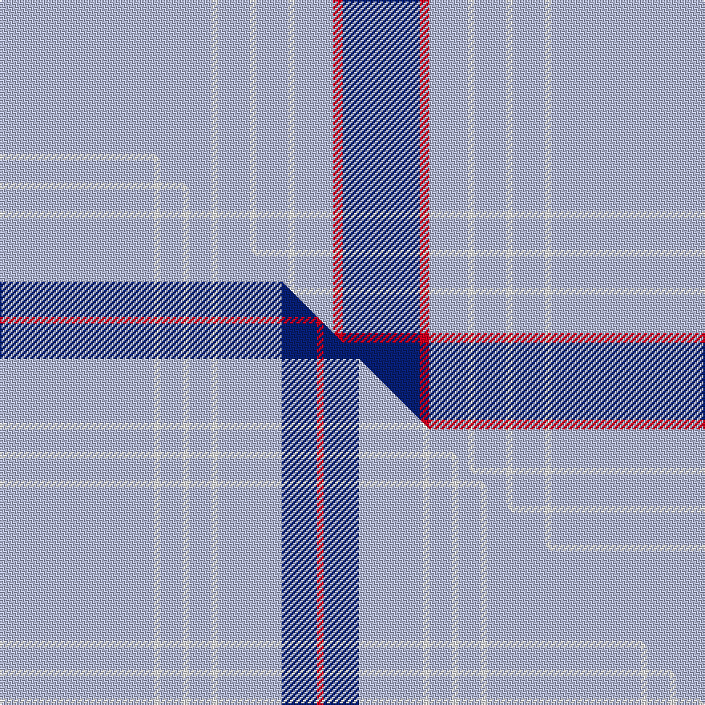

This is one **variant** — a specific cloth: this exact thread count and colourway, with its own
provenance below. It is one weaving of the [sett](/tartans/r/ra/raaf-2/) (the scale-free proportion — the
same cloth at any scale or shade), whose colour order is pattern [BRWWWWWWW](/stripes/brwwwwwww/).

Part of the [RAAF](/tartans/r/ra/raaf-2/) tartan — the named design grouping this sett with its other cloths.

Sourced from register-of-tartans.  It is a [9 stripe tartan](/stripes/stripes9/).

Original link [https://www.tartanregister.gov.uk/tartanDetails.aspx?ref=5379](https://www.tartanregister.gov.uk/tartanDetails.aspx?ref=5379)

Dataset <small>— provenance for this record, inherited from the source manifest</small>

<dl class="dataset-prov">
<dt>source</dt><dd><a href="/sources/register-of-tartans/">Scottish Register of Tartans</a></dd>
<dt>data captured from</dt><dd><a href="https://github.com/thetartan/tartan-database/blob/master/data/register-of-tartans/data.csv">https://github.com/thetartan/tartan-database/blob/master/data/register-of-tartans/data.csv</a></dd>
<dt>data date</dt><dd>2017-01-06 <small>(dataset default)</small></dd>
<dt>licence</dt><dd><a href="https://www.tartanregister.gov.uk/copyright">Crown copyright</a></dd>
</dl>

Capture chain <small>— the hands this data passed through, oldest first; each capture carries its own licence</small>

<ol class="capture-chain">
<li><a href="https://www.tartanregister.gov.uk/">Scottish Register of Tartans</a> · <a href="https://www.tartanregister.gov.uk/copyright">Crown copyright</a> <small>the living register — still published by National Records of Scotland</small></li>
<li><a href="https://github.com/thetartan/tartan-database">thetartan/tartan-database</a> <small>2016-2017</small> · <a href="https://creativecommons.org/licenses/by-nc-nd/4.0/">CC BY-NC-ND 4.0</a> <small>Levko Kravets's frozen compilation — the capture we vendored, and where its CC licence text came from</small></li>
<li>this dictionary <small>captured 2026-06-10 · commit 5bf86c7566</small> <small>each re-capture is a git commit to data/sources</small></li>
</ol>

## Register references

External register numbers recorded for this tartan.

- Scottish Register of Tartans: [5379](https://www.tartanregister.gov.uk/tartanDetails.aspx?ref=5379)
- Scottish Tartans Authority (ITI): 3146

## Thread count
LB/132 W4 LB20 W4 LB20 W4 LB24 R6 DB/48

One full sett is **344 threads**.

## Palette
<table><thead><tr><th>Colour</th><th>Shade</th><th>OKLCh</th></tr></thead><tbody><tr><td>LB</td><td><code style="background-color:#B5BBDE;">#B5BBDE</code> <small style="color:#888">#B5BBDE</small></td><td><small style="color:#888">oklch(79.9% 0.050 277.6)</small></td></tr><tr><td>DB</td><td><code style="background-color:#082077;">#082077</code> <small style="color:#888">#082077</small></td><td><small style="color:#888">oklch(30.0% 0.149 265.1)</small></td></tr><tr><td>W</td><td><code style="background-color:#F7F7F7;">#F7F7F7</code> <small style="color:#888">#F7F7F7</small></td><td><small style="color:#888">oklch(97.6% 0.000 89.9)</small></td></tr><tr><td>R</td><td><code style="background-color:#D60020;">#D60020</code> <small style="color:#888">#D60020</small></td><td><small style="color:#888">oklch(55.2% 0.224 25.5)</small></td></tr></tbody></table>

# Sample pattern

## Compared to the master

This cloth is one sett of its design; the master sett (the exemplar the design is anchored on) is below for comparison.

Its **ΔTartan distance** from the master is **0.70** — the same measure the nearest-tartans table ranks by (0 is identical; a re-scale of the same cloth is near 0, a recolour or a different proportion further).

<figure class="master-compare" style="margin:0">

this sett
master sett ★

<figcaption style="color:#888;font-size:smaller">One weave of this sett against the <a href="/setts/lb48w2lb7w2lb7w2lb20db11r2/">master sett ★</a>, split on the diagonal: a shared proportion runs seamlessly across it with only the shades shifting; a different proportion breaks on it.</figcaption>
</figure>

## Nearest tartan variants

The nearest existing variants by ΔTartan distance, with this cloth at the top so the swatches line up against it.

ΔTartan

Threads

Variant

Sett

—

344

<a href="/variants/s9/lb66w2lb10w2lb10w2lb12r3db24~x2/">RAAF #5</a>

<a href="/ttd/edit/#slug=lb48w2lb7w2lb7w2lb20db11r2~x2&amp;base=lb66w2lb10w2lb10w2lb12r3db24~x2" title="compare in the TTD">0.70</a>

304

<a href="/variants/s9/lb48w2lb7w2lb7w2lb20db11r2~x2/">RAAF #3</a>

<a href="/ttd/edit/#slug=lb70db5lb3lr5lb3w5lb3k5~x2&amp;base=lb66w2lb10w2lb10w2lb12r3db24~x2" title="compare in the TTD">1.69</a>

246

<a href="/variants/s8/lb70db5lb3lr5lb3w5lb3k5~x2/">Wyckoff, Ann Grainger Phillips Commemorative Tartan</a>

<a href="/ttd/edit/#slug=dy5lb3k1lb6n11lb3t3lb43w3~x2&amp;base=lb66w2lb10w2lb10w2lb12r3db24~x2" title="compare in the TTD">1.79</a>

296

<a href="/variants/s9/dy5lb3k1lb6n11lb3t3lb43w3~x2/">Royal College of Midwives</a>

<a href="/ttd/edit/#slug=lb70db5lb3w5lb3w5lb3r5lb8~x2&amp;base=lb66w2lb10w2lb10w2lb12r3db24~x2" title="compare in the TTD">1.96</a>

272

<a href="/variants/s9/lb70db5lb3w5lb3w5lb3r5lb8~x2/">Wyckoff, Ann Grainger Phillips</a>

<a href="/ttd/edit/#slug=t142db12b24w7b5w5b5r10~t2605232-db1108266-b1611266&amp;base=lb66w2lb10w2lb10w2lb12r3db24~x2" title="compare in the TTD">2.90</a>

268

<a href="/variants/s8/t142db12b24w7b5w5b5r10~t2605232-db1108266-b1511266/">Glen Innes (Australia)</a>

<a href="/ttd/edit/#slug=b72w12b2ly2b2r12b1w9~x2&amp;base=lb66w2lb10w2lb10w2lb12r3db24~x2" title="compare in the TTD">3.06</a>

286

<a href="/variants/s8/b72w12b2ly2b2r12b1w9~x2/">Tennessee Pioneer Blanket</a>

<a href="/ttd/edit/#slug=lb6r1lb17db3lb3db8lb1~x2&amp;base=lb66w2lb10w2lb10w2lb12r3db24~x2" title="compare in the TTD">3.15</a>

142

<a href="/variants/s7/lb6r1lb17db3lb3db8lb1~x2/">Dominion (Fashion)</a>

<a href="/ttd/edit/#slug=lb60db19w3db2r2db7~x2&amp;base=lb66w2lb10w2lb10w2lb12r3db24~x2" title="compare in the TTD">3.37</a>

238

<a href="/variants/s6/lb60db19w3db2r2db7~x2/">Federal Bureaux (FBI) Corporate Tartan</a>

<a href="/ttd/edit/#slug=lb10k2w5k4lb50t2~x2&amp;base=lb66w2lb10w2lb10w2lb12r3db24~x2" title="compare in the TTD">3.70</a>

268

<a href="/variants/s6/lb10k2w5k4lb50t2~x2/">London Fog Safari (Fashion)</a>

<a href="/ttd/edit/#slug=t4db3lb4db3t2db3lb4db2y2lb4db2lb52db2lb4&amp;base=lb66w2lb10w2lb10w2lb12r3db24~x2" title="compare in the TTD">3.96</a>

174

<a href="/variants/s14/t4db3lb4db3t2db3lb4db2y2lb4db2lb52db2lb4/">Unidentified #1</a>

## Neighbour map

Every grey dot is one of 13657 variants placed by the first two principal components of the ΔTartan feature space (42% of its variance). Red is this tartan; blue dots are its nearest — click one to open its page. The map is a flat projection of a many-dimensional space — [how to read it](/posts/neighbourhood-maps/).

<svg viewBox="0 0 640 380" role="img" style="max-width:100%;height:auto;border:1px solid #e0e0e0;border-radius:4px;display:block" xmlns="http://www.w3.org/2000/svg"><image href="/nn/cloud.v1.png" width="640" height="380"/><a href="/variants/s9/lb48w2lb7w2lb7w2lb20db11r2~x2/"><circle cx="540.1" cy="141.2" r="4" fill="#3465a4"><title>RAAF #3</title></circle></a><a href="/variants/s8/lb70db5lb3lr5lb3w5lb3k5~x2/"><circle cx="491.0" cy="93.1" r="4" fill="#3465a4"><title>Wyckoff, Ann Grainger Phillips Commemorative Tartan</title></circle></a><a href="/variants/s9/dy5lb3k1lb6n11lb3t3lb43w3~x2/"><circle cx="432.0" cy="77.2" r="4" fill="#3465a4"><title>Royal College of Midwives</title></circle></a><a href="/variants/s9/lb70db5lb3w5lb3w5lb3r5lb8~x2/"><circle cx="600.8" cy="136.5" r="4" fill="#3465a4"><title>Wyckoff, Ann Grainger Phillips</title></circle></a><a href="/variants/s8/t142db12b24w7b5w5b5r10~t2605232-db1108266-b1511266/"><circle cx="435.1" cy="112.8" r="4" fill="#3465a4"><title>Glen Innes (Australia)</title></circle></a><a href="/variants/s8/b72w12b2ly2b2r12b1w9~x2/"><circle cx="468.5" cy="97.7" r="4" fill="#3465a4"><title>Tennessee Pioneer Blanket</title></circle></a><a href="/variants/s7/lb6r1lb17db3lb3db8lb1~x2/"><circle cx="427.5" cy="192.3" r="4" fill="#3465a4"><title>Dominion (Fashion)</title></circle></a><a href="/variants/s6/lb60db19w3db2r2db7~x2/"><circle cx="411.3" cy="134.9" r="4" fill="#3465a4"><title>Federal Bureaux (FBI) Corporate Tartan</title></circle></a><a href="/variants/s6/lb10k2w5k4lb50t2~x2/"><circle cx="511.4" cy="125.5" r="4" fill="#3465a4"><title>London Fog Safari (Fashion)</title></circle></a><a href="/variants/s14/t4db3lb4db3t2db3lb4db2y2lb4db2lb52db2lb4/"><circle cx="512.0" cy="102.5" r="4" fill="#3465a4"><title>Unidentified #1</title></circle></a><circle cx="481.7" cy="119.1" r="5" fill="#c00000"/><text x="320" y="376" text-anchor="middle" font-size="11" fill="#999">ground</text><text x="11" y="190" text-anchor="middle" font-size="11" fill="#999" transform="rotate(-90 11 190)">complexity</text></svg>

ID: /variants/s9/lb66w2lb10w2lb10w2lb12r3db24~x2/
