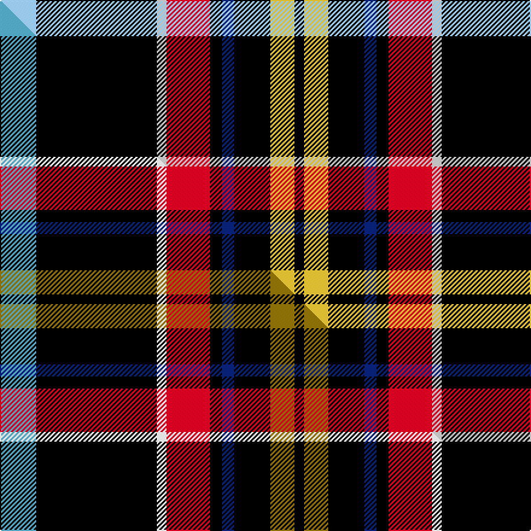

This is one **variant** — a specific cloth: this exact thread count and colourway, with its own
provenance below. It is one weaving of the [sett](/tartans/c/ca/care-leaver/) (the scale-free proportion — the
same cloth at any scale or shade), whose colour order is pattern [KYKBKRWKW](/stripes/kykbkrwkw/).

Part of the [Care Leaver](/tartans/c/ca/care-leaver/) tartan — the named design grouping this sett with its other cloths.

Sourced from tartans-authority.  It is a [9 stripe tartan](/stripes/stripes9/).

Original link <code>http://www.tartansauthority.com/tartan-ferret/display/11184/</code> — retired · [Internet Archive copy](https://web.archive.org/web/*/http://www.tartansauthority.com/tartan-ferret/display/11184/*)

Dataset <small>— provenance for this record, inherited from the source manifest</small>

<dl class="dataset-prov">
<dt>source</dt><dd><a href="/sources/tartans-authority/">Scottish Tartans Authority</a></dd>
<dt>data captured from</dt><dd><a href="https://github.com/thetartan/tartan-database/blob/master/data/tartans-authority/data.csv">https://github.com/thetartan/tartan-database/blob/master/data/tartans-authority/data.csv</a></dd>
<dt>data date</dt><dd>2014 <small>(this record)</small></dd>
<dt>licence</dt><dd><a href="https://creativecommons.org/licenses/by-nc-nd/4.0/">CC BY-NC-ND 4.0</a></dd>
</dl>

Capture chain <small>— the hands this data passed through, oldest first; each capture carries its own licence</small>

<ol class="capture-chain">
<li><a href="https://www.tartansauthority.com/">Scottish Tartans Authority</a> <small>the heritage body’s archive — its tartan-ferret record browser is retired; dead record links are shown unlinked, with an Internet Archive copy (ITI numbers are not SRT references)</small></li>
<li><a href="https://github.com/thetartan/tartan-database">thetartan/tartan-database</a> <small>2016-2017</small> · <a href="https://creativecommons.org/licenses/by-nc-nd/4.0/">CC BY-NC-ND 4.0</a> <small>Levko Kravets's frozen compilation — the capture we vendored, and where its CC licence text came from</small></li>
<li>this dictionary <small>captured 2026-06-10 · commit 5bf86c7566</small> <small>each re-capture is a git commit to data/sources</small></li>
</ol>

## Register references

External register numbers recorded for this tartan.

- Scottish Register of Tartans: [11184](https://www.tartanregister.gov.uk/tartanDetails?ref=11184)
- Scottish Tartans Authority (ITI): 11184

## Thread count
LBi/30 K100 LB8 R36 K10 DB10 K30 LY20 K/8

One full sett is **466 threads**.

## Palette
<table><thead><tr><th>Colour</th><th>Shade</th><th>OKLCh</th></tr></thead><tbody><tr><td>DB</td><td><code style="background-color:#082077;">#082077</code> <small style="color:#888">#082077</small></td><td><small style="color:#888">oklch(30.0% 0.149 265.1)</small></td></tr><tr><td>K</td><td><code style="background-color:#000000;">#000000</code> <small style="color:#888">#000000</small></td><td><small style="color:#888">oklch(0.0% 0.000 0.0)</small></td></tr><tr><td>LB</td><td><code style="background-color:#98C8E8;">#98C8E8</code> <small style="color:#888">#98C8E8</small></td><td><small style="color:#888">oklch(81.0% 0.068 237.9)</small></td></tr><tr><td>LB</td><td><code style="background-color:#C0C0C0;">#C0C0C0</code> <small style="color:#888">#C0C0C0</small></td><td><small style="color:#888">oklch(80.8% 0.000 89.9)</small></td></tr><tr><td>R</td><td><code style="background-color:#D60020;">#D60020</code> <small style="color:#888">#D60020</small></td><td><small style="color:#888">oklch(55.2% 0.224 25.5)</small></td></tr><tr><td>LY</td><td><code style="background-color:#DCBC32;">#DCBC32</code> <small style="color:#888">#DCBC32</small></td><td><small style="color:#888">oklch(80.0% 0.150 95.2)</small></td></tr></tbody></table>

# Sample pattern

[Sample sheet (PDF)](swatch.pdf) — the woven sample, thread count and palette on one printable A4, rendered on demand (the same sheet the TTD print page downloads).

## Compared to the master

This cloth is one sett of its design; the master sett (the exemplar the design is anchored on) is below for comparison.

Its **ΔTartan distance** from the master is **0.08** — the same measure the nearest-tartans table ranks by (0 is identical; a re-scale of the same cloth is near 0, a recolour or a different proportion further).

<figure class="master-compare" style="margin:0">

this sett
master sett ★

<figcaption style="color:#888;font-size:smaller">One weave of this sett against the <a href="/setts/lg15k50w4r18k5db5k15y10k4/">master sett ★</a>, split on the diagonal: a shared proportion runs seamlessly across it with only the shades shifting; a different proportion breaks on it.</figcaption>
</figure>

## Nearest tartan variants

The nearest existing variants by ΔTartan distance, with this cloth at the top so the swatches line up against it.

ΔTartan

Threads

Variant

Sett

—

466

<a href="/variants/s9/lbi15k50lb4r18k5db5k15ly10k4~x2~lbi8007237-lb80/">Care Leaver</a>

<a href="/ttd/edit/#slug=lg15k50w4r18k5db5k15y10k4~x2~lg6709222-w90&amp;base=lbi15k50lb4r18k5db5k15ly10k4~x2~lbi8007237-lb80" title="compare in the TTD">0.08</a>

466

<a href="/variants/s9/lg15k50w4r18k5db5k15y10k4~x2~lg6709222-w90/">Care Leaver</a>

<a href="/ttd/edit/#slug=y8k16lb8k52lb6k5w27dr20g14k5lb6&amp;base=lbi15k50lb4r18k5db5k15ly10k4~x2~lbi8007237-lb80" title="compare in the TTD">1.98</a>

320

<a href="/variants/s11/y8k16lb8k52lb6k5w27dr20g14k5lb6/">Sligo County, Crest Range</a>

<a href="/ttd/edit/#slug=lo8k16lb8k52lb6k5w27dr20g14k5lb6&amp;base=lbi15k50lb4r18k5db5k15ly10k4~x2~lbi8007237-lb80" title="compare in the TTD">1.98</a>

320

<a href="/variants/s11/lo8k16lb8k52lb6k5w27dr20g14k5lb6/">Sligo County Crest (Fashion)</a>

<a href="/ttd/edit/#slug=db6w3r14k3y2k2w2k38w2k2y2~x2&amp;base=lbi15k50lb4r18k5db5k15ly10k4~x2~lbi8007237-lb80" title="compare in the TTD">2.18</a>

288

<a href="/variants/s11/db6w3r14k3y2k2w2k38w2k2y2~x2/">Norwegian Night</a>

<a href="/ttd/edit/#slug=k4r8ly4k2ly4k40g5dp4g5k2t2w4~x2&amp;base=lbi15k50lb4r18k5db5k15ly10k4~x2~lbi8007237-lb80" title="compare in the TTD">2.23</a>

320

<a href="/variants/s12/k4r8ly4k2ly4k40g5dp4g5k2t2w4~x2/">MacMunn</a>

<a href="/ttd/edit/#slug=k1w1y2g1k10db1r2w1~x10&amp;base=lbi15k50lb4r18k5db5k15ly10k4~x2~lbi8007237-lb80" title="compare in the TTD">2.29</a>

360

<a href="/variants/s8/k1w1y2g1k10db1r2w1~x10/">Kaptain Family (Personal)</a>

<a href="/ttd/edit/#slug=b6w1k12g6dp2w1dp2w1k12lb1~x2&amp;base=lbi15k50lb4r18k5db5k15ly10k4~x2~lbi8007237-lb80" title="compare in the TTD">2.41</a>

162

<a href="/variants/s10/b6w1k12g6dp2w1dp2w1k12lb1~x2/">Head of the Lakes</a>

<a href="/ttd/edit/#slug=k54lb6k6lb6n20lo40k6y3&amp;base=lbi15k50lb4r18k5db5k15ly10k4~x2~lbi8007237-lb80" title="compare in the TTD">2.49</a>

225

<a href="/variants/s8/k54lb6k6lb6n20lo40k6y3/">Clyde Valley HOG</a>

<a href="/ttd/edit/#slug=y2w1r2k20r9k20y7n20k5y1k1r1~x2&amp;base=lbi15k50lb4r18k5db5k15ly10k4~x2~lbi8007237-lb80" title="compare in the TTD">2.72</a>

350

<a href="/variants/s12/y2w1r2k20r9k20y7n20k5y1k1r1~x2/">Cates Dress</a>

<a href="/ttd/edit/#slug=r10k3g2w2k22db4k22r4g4r14w3~x2&amp;base=lbi15k50lb4r18k5db5k15ly10k4~x2~lbi8007237-lb80" title="compare in the TTD">2.81</a>

334

<a href="/variants/s11/r10k3g2w2k22db4k22r4g4r14w3~x2/">York Region Pipe Band</a>

## Neighbour map

Every grey dot is one of 13662 variants placed by the first two principal components of the ΔTartan feature space (42% of its variance). Red is this tartan; blue dots are its nearest — click one to open its page. The map is a flat projection of a many-dimensional space — [how to read it](/posts/neighbourhood-maps/).

<svg viewBox="0 0 640 380" role="img" style="max-width:100%;height:auto;border:1px solid #e0e0e0;border-radius:4px;display:block" xmlns="http://www.w3.org/2000/svg"><image href="/nn/cloud.v1.png" width="640" height="380"/><a href="/variants/s9/lg15k50w4r18k5db5k15y10k4~x2~lg6709222-w90/"><circle cx="217.2" cy="116.9" r="4" fill="#3465a4"><title>Care Leaver</title></circle></a><a href="/variants/s11/y8k16lb8k52lb6k5w27dr20g14k5lb6/"><circle cx="119.0" cy="127.4" r="4" fill="#3465a4"><title>Sligo County, Crest Range</title></circle></a><a href="/variants/s11/lo8k16lb8k52lb6k5w27dr20g14k5lb6/"><circle cx="118.5" cy="126.9" r="4" fill="#3465a4"><title>Sligo County Crest (Fashion)</title></circle></a><a href="/variants/s11/db6w3r14k3y2k2w2k38w2k2y2~x2/"><circle cx="270.0" cy="73.7" r="4" fill="#3465a4"><title>Norwegian Night</title></circle></a><a href="/variants/s12/k4r8ly4k2ly4k40g5dp4g5k2t2w4~x2/"><circle cx="209.8" cy="47.6" r="4" fill="#3465a4"><title>MacMunn</title></circle></a><a href="/variants/s8/k1w1y2g1k10db1r2w1~x10/"><circle cx="214.4" cy="113.9" r="4" fill="#3465a4"><title>Kaptain Family (Personal)</title></circle></a><a href="/variants/s10/b6w1k12g6dp2w1dp2w1k12lb1~x2/"><circle cx="183.7" cy="121.3" r="4" fill="#3465a4"><title>Head of the Lakes</title></circle></a><a href="/variants/s8/k54lb6k6lb6n20lo40k6y3/"><circle cx="186.6" cy="120.5" r="4" fill="#3465a4"><title>Clyde Valley HOG</title></circle></a><a href="/variants/s12/y2w1r2k20r9k20y7n20k5y1k1r1~x2/"><circle cx="216.6" cy="100.2" r="4" fill="#3465a4"><title>Cates Dress</title></circle></a><a href="/variants/s11/r10k3g2w2k22db4k22r4g4r14w3~x2/"><circle cx="196.7" cy="129.8" r="4" fill="#3465a4"><title>York Region Pipe Band</title></circle></a><circle cx="210.7" cy="114.8" r="5" fill="#c00000"/><text x="320" y="376" text-anchor="middle" font-size="11" fill="#999">ground</text><text x="11" y="190" text-anchor="middle" font-size="11" fill="#999" transform="rotate(-90 11 190)">complexity</text></svg>

ID: /variants/s9/lbi15k50lb4r18k5db5k15ly10k4~x2~lbi8007237-lb80/
