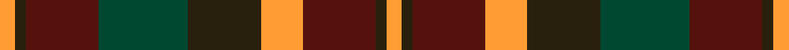

This page is one **sett** — a single exact thread-count. It belongs to the [tartan](/setts/lo3dg2dr14dgi17dg14lo8dr14dg2lo3/)
(the same proportion at any scale), whose colour order is pattern [YGBGGYBGY](/stripes/ygbggybgy/).

Sourced from house-of-tartan.  It is a [9 stripe tartan](/stripes/stripes9/).

Original link http://www.house-of-tartan.scotland.net/house/TartanViewjs.asp?colr=Def&tnam=2267

## Provenance

Earliest known date: 1996 One of a series of Irish District tartans designed by Polly Wittering of the House of Edgar, with colours reminiscent of the Country with soft warm colours dominating.

## Thread count
LO/6 DG4 DR28 DGi34 DG28 LO16 DR28 DG4 LO/6

One full sett is **296 threads**.

## Palette
<table><thead><tr><th>Colour</th><th>Shade</th><th>OKLCh</th></tr></thead><tbody><tr><td>DG</td><td><code style="background-color:#004830;">#004830</code> <small style="color:#888">#004830</small></td><td><small style="color:#888">oklch(35.5% 0.077 163.0)</small></td></tr><tr><td>DR</td><td><code style="background-color:#55120C;">#55120C</code> <small style="color:#888">#55120C</small></td><td><small style="color:#888">oklch(30.0% 0.099 29.3)</small></td></tr><tr><td>LO</td><td><code style="background-color:#FF9C34;">#FF9C34</code> <small style="color:#888">#FF9C34</small></td><td><small style="color:#888">oklch(77.9% 0.161 61.8)</small></td></tr><tr><td>DG</td><td><code style="background-color:#28200C;">#28200C</code> <small style="color:#888">#28200C</small></td><td><small style="color:#888">oklch(24.7% 0.035 87.9)</small></td></tr></tbody></table>

# Sample pattern

ID: /variants/s9/lo3dg2dr14dgi17dg14lo8dr14dg2lo3~x2~dg1001060-dgi1403171/
