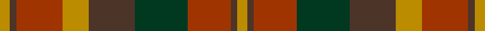

This page is one **sett** — a single exact thread-count. It belongs to the [tartan](/setts/lo3do2o14lo8do14dg16o13do2lo3/)
(the same proportion at any scale), whose colour order is pattern [YBRGBYRBY](/stripes/ybrgbyrby/).

Sourced from tartans-authority.  It is a [9 stripe tartan](/stripes/stripes9/).

Original link http://www.tartansauthority.com/tartan-ferret/display/2267/

## Register references

External register numbers recorded for this tartan.

- Scottish Tartans Authority (ITI): 2267

## Thread count
DY/6 T4 R28 DY16 T28 DG32 R26 T4 DY/6

One full sett is **288 threads**.

## Palette

Palette: <strong>Tartan Register</strong> <small style="color:#888">(3 of 4 colours)</small>
<table><thead><tr><th>Colour</th><th>Threads</th><th>Shade</th><th>Base</th><th>OKLCh</th></tr></thead><tbody><tr><td>DY/</td><td style="text-align:right;font-variant-numeric:tabular-nums">6</td><td><code style="background-color:#BC8C00;">#BC8C00</code> <small style="color:#888">#BC8C00</small></td><td>Y <code style="background-color:#F2BF00;">#F2BF00</code></td><td><small style="color:#888">oklch(66.8% 0.137 84.1)</small></td></tr><tr><td>T</td><td style="text-align:right;font-variant-numeric:tabular-nums">4</td><td><code style="background-color:#4C3428;">#4C3428</code> <small style="color:#888">#4C3428</small></td><td>B <code style="background-color:#2A418A;">#2A418A</code></td><td><small style="color:#888">oklch(34.9% 0.040 47.5)</small></td></tr><tr><td>R</td><td style="text-align:right;font-variant-numeric:tabular-nums">28</td><td><code style="background-color:#A03400;">#A03400</code> <small style="color:#888">#A03400</small></td><td>R <code style="background-color:#CC0000;">#CC0000</code></td><td><small style="color:#888">oklch(47.9% 0.152 39.6)</small></td></tr><tr><td>DY</td><td style="text-align:right;font-variant-numeric:tabular-nums">16</td><td><code style="background-color:#BC8C00;">#BC8C00</code> <small style="color:#888">#BC8C00</small></td><td>Y <code style="background-color:#F2BF00;">#F2BF00</code></td><td><small style="color:#888">oklch(66.8% 0.137 84.1)</small></td></tr><tr><td>T</td><td style="text-align:right;font-variant-numeric:tabular-nums">28</td><td><code style="background-color:#4C3428;">#4C3428</code> <small style="color:#888">#4C3428</small></td><td>B <code style="background-color:#2A418A;">#2A418A</code></td><td><small style="color:#888">oklch(34.9% 0.040 47.5)</small></td></tr><tr><td>DG</td><td style="text-align:right;font-variant-numeric:tabular-nums">32</td><td><code style="background-color:#003820;">#003820</code> <small style="color:#888">#003820</small></td><td>G <code style="background-color:#006100;">#006100</code></td><td><small style="color:#888">oklch(30.0% 0.070 158.3)</small></td></tr><tr><td>R</td><td style="text-align:right;font-variant-numeric:tabular-nums">26</td><td><code style="background-color:#A03400;">#A03400</code> <small style="color:#888">#A03400</small></td><td>R <code style="background-color:#CC0000;">#CC0000</code></td><td><small style="color:#888">oklch(47.9% 0.152 39.6)</small></td></tr><tr><td>T</td><td style="text-align:right;font-variant-numeric:tabular-nums">4</td><td><code style="background-color:#4C3428;">#4C3428</code> <small style="color:#888">#4C3428</small></td><td>B <code style="background-color:#2A418A;">#2A418A</code></td><td><small style="color:#888">oklch(34.9% 0.040 47.5)</small></td></tr><tr><td>DY/</td><td style="text-align:right;font-variant-numeric:tabular-nums">6</td><td><code style="background-color:#BC8C00;">#BC8C00</code> <small style="color:#888">#BC8C00</small></td><td>Y <code style="background-color:#F2BF00;">#F2BF00</code></td><td><small style="color:#888">oklch(66.8% 0.137 84.1)</small></td></tr></tbody></table>

## Nearest tartans

The nearest existing variants by ΔTartan distance, with this tartan at the top so the swatches line up against it.

ΔTartan

Tartan

Sett

—

<a href="/ttd/edit/#slug=lo3do2o14lo8do14dg16o13do2lo3~x2">Monaghan, County (District)</a> <a class="nn-out" href="/variants/s9/lo3do2o14lo8do14dg16o13do2lo3~x2/" title="open its dictionary page">↗</a>

0.67

<a href="/variants/s11/dyi6m2dyi2m4dyi13dy12o13m4o2m2o6~x2/">Glenmorangie #2</a>

0.95

<a href="/ttd/edit/#slug=lo3dy2o14dg17dy14lo8o14dy2lo3~x2&amp;base=lo3do2o14lo8do14dg16o13do2lo3~x2">Monaghan Irish County Tartan</a> <a class="nn-out" href="/variants/s9/lo3dy2o14dg17dy14lo8o14dy2lo3~x2/" title="open its dictionary page">↗</a>

0.97

<a href="/ttd/edit/#slug=lo3dr2o14g17dr14lo8o14dr2lo3~x2&amp;base=lo3do2o14lo8do14dg16o13do2lo3~x2">Monaghan</a> <a class="nn-out" href="/variants/s9/lo3dr2o14g17dr14lo8o14dr2lo3~x2/" title="open its dictionary page">↗</a>

1.21

<a href="/variants/s16/lo3do2o14lo8do14dg16o13do2lo3~x2/">Monaghan, County</a>

1.23

<a href="/ttd/edit/#slug=r3dy16g10r3g3lb2g3r3~x2&amp;base=lo3do2o14lo8do14dg16o13do2lo3~x2">Scott Htg (Clan)</a> <a class="nn-out" href="/variants/s8/r3dy16g10r3g3lb2g3r3~x2/" title="open its dictionary page">↗</a>

1.25

<a href="/variants/s10/dy1r7dy4g7dy1g1~x4/">Dewar</a>

1.27

<a href="/ttd/edit/#slug=dg2ly1dg6ri4r6k1r2~x4&amp;base=lo3do2o14lo8do14dg16o13do2lo3~x2">Unidentified Printing #3</a> <a class="nn-out" href="/variants/s7/dg2ly1dg6ri4r6k1r2~x4/" title="open its dictionary page">↗</a>

1.31

<a href="/ttd/edit/#slug=dg25db4r24db21dy25db4dg3~x2&amp;base=lo3do2o14lo8do14dg16o13do2lo3~x2">Orban-Prentice (Personal)</a> <a class="nn-out" href="/variants/s7/dg25db4r24db21dy25db4dg3~x2/" title="open its dictionary page">↗</a>

1.34

<a href="/ttd/edit/#slug=r10do10r4dg2r2do2r4dg12dp12dg3dp4~x2&amp;base=lo3do2o14lo8do14dg16o13do2lo3~x2">Hueg (Munich) Hunting (Personal)</a> <a class="nn-out" href="/variants/s11/r10do10r4dg2r2do2r4dg12dp12dg3dp4~x2/" title="open its dictionary page">↗</a>

1.36

<a href="/variants/s12/dg25db4r24db21dy25db4dg3~x2/">Orban-Prentice (Personal)</a>

## Neighbour map

Every grey dot is one of 14360 variants placed by the first two principal components of the ΔTartan feature space (44% of its variance). Red is this tartan; blue dots are its nearest — click one to open its page.

<svg viewBox="0 0 640 380" role="img" style="max-width:100%;height:auto;border:1px solid #e0e0e0;border-radius:4px;display:block" xmlns="http://www.w3.org/2000/svg"><image href="/nn/cloud.v1.png" width="640" height="380"/><a href="/variants/s11/dyi6m2dyi2m4dyi13dy12o13m4o2m2o6~x2/"><circle cx="181.7" cy="226.0" r="4" fill="#3465a4"><title>Glenmorangie #2</title></circle></a><a href="/variants/s9/lo3dy2o14dg17dy14lo8o14dy2lo3~x2/"><circle cx="186.7" cy="222.3" r="4" fill="#3465a4"><title>Monaghan Irish County Tartan</title></circle></a><a href="/variants/s9/lo3dr2o14g17dr14lo8o14dr2lo3~x2/"><circle cx="185.3" cy="221.4" r="4" fill="#3465a4"><title>Monaghan</title></circle></a><a href="/variants/s16/lo3do2o14lo8do14dg16o13do2lo3~x2/"><circle cx="198.6" cy="217.2" r="4" fill="#3465a4"><title>Monaghan, County</title></circle></a><a href="/variants/s8/r3dy16g10r3g3lb2g3r3~x2/"><circle cx="247.7" cy="227.3" r="4" fill="#3465a4"><title>Scott Htg (Clan)</title></circle></a><a href="/variants/s10/dy1r7dy4g7dy1g1~x4/"><circle cx="252.5" cy="255.1" r="4" fill="#3465a4"><title>Dewar</title></circle></a><a href="/variants/s7/dg2ly1dg6ri4r6k1r2~x4/"><circle cx="180.1" cy="236.2" r="4" fill="#3465a4"><title>Unidentified Printing #3</title></circle></a><a href="/variants/s7/dg25db4r24db21dy25db4dg3~x2/"><circle cx="170.3" cy="245.0" r="4" fill="#3465a4"><title>Orban-Prentice (Personal)</title></circle></a><a href="/variants/s11/r10do10r4dg2r2do2r4dg12dp12dg3dp4~x2/"><circle cx="175.1" cy="239.9" r="4" fill="#3465a4"><title>Hueg (Munich) Hunting (Personal)</title></circle></a><a href="/variants/s12/dg25db4r24db21dy25db4dg3~x2/"><circle cx="174.2" cy="221.2" r="4" fill="#3465a4"><title>Orban-Prentice (Personal)</title></circle></a><circle cx="201.7" cy="232.2" r="5" fill="#c00000"/></svg>

ID: /variants/s9/lo3do2o14lo8do14dg16o13do2lo3~x2/
