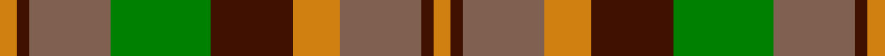

This page is one **sett** — a single exact thread-count. It belongs to the [tartan](/setts/lo3dr2o14g17dr14lo8o14dr2lo3/)
(the same proportion at any scale), whose colour order is pattern [YBRGBYRBY](/stripes/ybrgbyrby/).

Sourced from weddslist.  It is a [9 stripe tartan](/stripes/stripes9/).

Original link http://www.weddslist.com/cgi-bin/tartans/pg.pl?source=sts

## Thread count
O/6 DR4 LT28 G34 DR28 O16 LT28 DR4 O/6

One full sett is **296 threads**.

## Palette

Palette: <strong>custom</strong>
<table><thead><tr><th>Colour</th><th>Threads</th><th>Shade</th><th>Base</th><th>OKLCh</th></tr></thead><tbody><tr><td>O/</td><td style="text-align:right;font-variant-numeric:tabular-nums">6</td><td><code style="background-color:#D08010;">#D08010</code> <small style="color:#888">#D08010</small></td><td>Y <code style="background-color:#F2BF00;">#F2BF00</code></td><td><small style="color:#888">oklch(67.0% 0.145 66.1)</small></td></tr><tr><td>DR</td><td style="text-align:right;font-variant-numeric:tabular-nums">4</td><td><code style="background-color:#401000;">#401000</code> <small style="color:#888">#401000</small></td><td>B <code style="background-color:#2A418A;">#2A418A</code></td><td><small style="color:#888">oklch(25.3% 0.079 39.9)</small></td></tr><tr><td>LT</td><td style="text-align:right;font-variant-numeric:tabular-nums">28</td><td><code style="background-color:#806050;">#806050</code> <small style="color:#888">#806050</small></td><td>R <code style="background-color:#CC0000;">#CC0000</code></td><td><small style="color:#888">oklch(51.7% 0.049 47.8)</small></td></tr><tr><td>G</td><td style="text-align:right;font-variant-numeric:tabular-nums">34</td><td><code style="background-color:#008000;">#008000</code> <small style="color:#888">#008000</small></td><td>G <code style="background-color:#006100;">#006100</code></td><td><small style="color:#888">oklch(52.0% 0.177 142.5)</small></td></tr><tr><td>DR</td><td style="text-align:right;font-variant-numeric:tabular-nums">28</td><td><code style="background-color:#401000;">#401000</code> <small style="color:#888">#401000</small></td><td>B <code style="background-color:#2A418A;">#2A418A</code></td><td><small style="color:#888">oklch(25.3% 0.079 39.9)</small></td></tr><tr><td>O</td><td style="text-align:right;font-variant-numeric:tabular-nums">16</td><td><code style="background-color:#D08010;">#D08010</code> <small style="color:#888">#D08010</small></td><td>Y <code style="background-color:#F2BF00;">#F2BF00</code></td><td><small style="color:#888">oklch(67.0% 0.145 66.1)</small></td></tr><tr><td>LT</td><td style="text-align:right;font-variant-numeric:tabular-nums">28</td><td><code style="background-color:#806050;">#806050</code> <small style="color:#888">#806050</small></td><td>R <code style="background-color:#CC0000;">#CC0000</code></td><td><small style="color:#888">oklch(51.7% 0.049 47.8)</small></td></tr><tr><td>DR</td><td style="text-align:right;font-variant-numeric:tabular-nums">4</td><td><code style="background-color:#401000;">#401000</code> <small style="color:#888">#401000</small></td><td>B <code style="background-color:#2A418A;">#2A418A</code></td><td><small style="color:#888">oklch(25.3% 0.079 39.9)</small></td></tr><tr><td>O/</td><td style="text-align:right;font-variant-numeric:tabular-nums">6</td><td><code style="background-color:#D08010;">#D08010</code> <small style="color:#888">#D08010</small></td><td>Y <code style="background-color:#F2BF00;">#F2BF00</code></td><td><small style="color:#888">oklch(67.0% 0.145 66.1)</small></td></tr></tbody></table>

## Nearest tartans

The nearest existing variants by ΔTartan distance, with this tartan at the top so the swatches line up against it.

ΔTartan

Tartan

Sett

—

<a href="/ttd/edit/#slug=lo3dr2o14g17dr14lo8o14dr2lo3~x2">Monaghan</a> <a class="nn-out" href="/variants/s9/lo3dr2o14g17dr14lo8o14dr2lo3~x2/" title="open its dictionary page">↗</a>

0.92

<a href="/ttd/edit/#slug=o6k2g12lo8o5k2g3~x4&amp;base=lo3dr2o14g17dr14lo8o14dr2lo3~x2">Londonderry, County (District)</a> <a class="nn-out" href="/variants/s7/o6k2g12lo8o5k2g3~x4/" title="open its dictionary page">↗</a>

0.97

<a href="/ttd/edit/#slug=lo3do2o14lo8do14dg16o13do2lo3~x2&amp;base=lo3dr2o14g17dr14lo8o14dr2lo3~x2">Monaghan, County (District)</a> <a class="nn-out" href="/variants/s9/lo3do2o14lo8do14dg16o13do2lo3~x2/" title="open its dictionary page">↗</a>

1.00

<a href="/ttd/edit/#slug=lo3dy2o14dg17dy14lo8o14dy2lo3~x2&amp;base=lo3dr2o14g17dr14lo8o14dr2lo3~x2">Monaghan Irish County Tartan</a> <a class="nn-out" href="/variants/s9/lo3dy2o14dg17dy14lo8o14dy2lo3~x2/" title="open its dictionary page">↗</a>

1.18

<a href="/ttd/edit/#slug=dy9k2dy2r2g6k1ly1k1g6r3~x2&amp;base=lo3dr2o14g17dr14lo8o14dr2lo3~x2">MacAart Family Tartan</a> <a class="nn-out" href="/variants/s10/dy9k2dy2r2g6k1ly1k1g6r3~x2/" title="open its dictionary page">↗</a>

1.19

<a href="/ttd/edit/#slug=y30k4ly10k4o5ly5o15~x2&amp;base=lo3dr2o14g17dr14lo8o14dr2lo3~x2">Alister Grant 'Mohr', the Laird's Champion</a> <a class="nn-out" href="/variants/s7/y30k4ly10k4o5ly5o15~x2/" title="open its dictionary page">↗</a>

1.21

<a href="/ttd/edit/#slug=r3dy16g10r3g3lb2g3r3~x2&amp;base=lo3dr2o14g17dr14lo8o14dr2lo3~x2">Scott Htg (Clan)</a> <a class="nn-out" href="/variants/s8/r3dy16g10r3g3lb2g3r3~x2/" title="open its dictionary page">↗</a>

1.27

<a href="/ttd/edit/#slug=y6m2y2m4y13k12lo13m4lo2m2lo6~x2&amp;base=lo3dr2o14g17dr14lo8o14dr2lo3~x2">Glenmorangie (Corporate)</a> <a class="nn-out" href="/variants/s11/y6m2y2m4y13k12lo13m4lo2m2lo6~x2/" title="open its dictionary page">↗</a>

1.27

<a href="/ttd/edit/#slug=o6k2dg12lo8o5k2dg3~x4&amp;base=lo3dr2o14g17dr14lo8o14dr2lo3~x2">Londonderry, County</a> <a class="nn-out" href="/variants/s7/o6k2dg12lo8o5k2dg3~x4/" title="open its dictionary page">↗</a>

1.27

<a href="/variants/s11/dyi6m2dyi2m4dyi13dy12o13m4o2m2o6~x2/">Glenmorangie #2</a>

1.33

<a href="/ttd/edit/#slug=dg20r8lr2r8dg5ly8dg2ly8~x2&amp;base=lo3dr2o14g17dr14lo8o14dr2lo3~x2">Unidentified #57</a> <a class="nn-out" href="/variants/s8/dg20r8lr2r8dg5ly8dg2ly8~x2/" title="open its dictionary page">↗</a>

## Neighbour map

Every grey dot is one of 14360 variants placed by the first two principal components of the ΔTartan feature space (44% of its variance). Red is this tartan; blue dots are its nearest — click one to open its page.

<svg viewBox="0 0 640 380" role="img" style="max-width:100%;height:auto;border:1px solid #e0e0e0;border-radius:4px;display:block" xmlns="http://www.w3.org/2000/svg"><image href="/nn/cloud.v1.png" width="640" height="380"/><a href="/variants/s7/o6k2g12lo8o5k2g3~x4/"><circle cx="184.6" cy="249.3" r="4" fill="#3465a4"><title>Londonderry, County (District)</title></circle></a><a href="/variants/s9/lo3do2o14lo8do14dg16o13do2lo3~x2/"><circle cx="201.7" cy="232.2" r="4" fill="#3465a4"><title>Monaghan, County (District)</title></circle></a><a href="/variants/s9/lo3dy2o14dg17dy14lo8o14dy2lo3~x2/"><circle cx="186.7" cy="222.3" r="4" fill="#3465a4"><title>Monaghan Irish County Tartan</title></circle></a><a href="/variants/s10/dy9k2dy2r2g6k1ly1k1g6r3~x2/"><circle cx="190.3" cy="199.4" r="4" fill="#3465a4"><title>MacAart Family Tartan</title></circle></a><a href="/variants/s7/y30k4ly10k4o5ly5o15~x2/"><circle cx="213.4" cy="210.9" r="4" fill="#3465a4"><title>Alister Grant 'Mohr', the Laird's Champion</title></circle></a><a href="/variants/s8/r3dy16g10r3g3lb2g3r3~x2/"><circle cx="247.7" cy="227.3" r="4" fill="#3465a4"><title>Scott Htg (Clan)</title></circle></a><a href="/variants/s11/y6m2y2m4y13k12lo13m4lo2m2lo6~x2/"><circle cx="142.5" cy="203.6" r="4" fill="#3465a4"><title>Glenmorangie (Corporate)</title></circle></a><a href="/variants/s7/o6k2dg12lo8o5k2dg3~x4/"><circle cx="170.0" cy="241.7" r="4" fill="#3465a4"><title>Londonderry, County</title></circle></a><a href="/variants/s11/dyi6m2dyi2m4dyi13dy12o13m4o2m2o6~x2/"><circle cx="181.7" cy="226.0" r="4" fill="#3465a4"><title>Glenmorangie #2</title></circle></a><a href="/variants/s8/dg20r8lr2r8dg5ly8dg2ly8~x2/"><circle cx="223.3" cy="211.1" r="4" fill="#3465a4"><title>Unidentified #57</title></circle></a><circle cx="185.3" cy="221.4" r="5" fill="#c00000"/></svg>

ID: /variants/s9/lo3dr2o14g17dr14lo8o14dr2lo3~x2/
