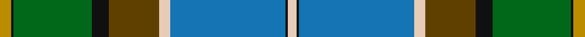

This page is one **sett** — a single exact thread-count. It belongs to the [tartan](/setts/lo4k1g28k6dy18lb4b41k1lb3/)
(the same proportion at any scale), whose colour order is pattern [WKBWGKGKY](/stripes/wkbwgkgky/).

Sourced from tartans-authority.  It is a [9 stripe tartan](/stripes/stripes9/).

Original link http://www.tartansauthority.com/tartan-ferret/display/8652/

## Register references

External register numbers recorded for this tartan.

- Scottish Register of Tartans: [8652](https://www.tartanregister.gov.uk/tartanDetails?ref=8652)
- Scottish Tartans Authority (ITI): 8652

## Thread count
DY/8 K2 G56 K12 T36 LR8 B82 K2 LR/6

One full sett is **410 threads**.

## Palette

Palette: <strong>Tartan Register</strong>
<table><thead><tr><th>Colour</th><th>Threads</th><th>Shade</th><th>Base</th><th>OKLCh</th></tr></thead><tbody><tr><td>DY/</td><td style="text-align:right;font-variant-numeric:tabular-nums">8</td><td><code style="background-color:#BC8C00;">#BC8C00</code> <small style="color:#888">#BC8C00</small></td><td>Y <code style="background-color:#F2BF00;">#F2BF00</code></td><td><small style="color:#888">oklch(66.8% 0.137 84.1)</small></td></tr><tr><td>K</td><td style="text-align:right;font-variant-numeric:tabular-nums">2</td><td><code style="background-color:#101010;">#101010</code> <small style="color:#888">#101010</small></td><td>K <code style="background-color:#000000;">#000000</code></td><td><small style="color:#888">oklch(17.3% 0.000 89.9)</small></td></tr><tr><td>G</td><td style="text-align:right;font-variant-numeric:tabular-nums">56</td><td><code style="background-color:#006818;">#006818</code> <small style="color:#888">#006818</small></td><td>G <code style="background-color:#006100;">#006100</code></td><td><small style="color:#888">oklch(45.0% 0.142 145.0)</small></td></tr><tr><td>K</td><td style="text-align:right;font-variant-numeric:tabular-nums">12</td><td><code style="background-color:#101010;">#101010</code> <small style="color:#888">#101010</small></td><td>K <code style="background-color:#000000;">#000000</code></td><td><small style="color:#888">oklch(17.3% 0.000 89.9)</small></td></tr><tr><td>T</td><td style="text-align:right;font-variant-numeric:tabular-nums">36</td><td><code style="background-color:#604000;">#604000</code> <small style="color:#888">#604000</small></td><td>G <code style="background-color:#006100;">#006100</code></td><td><small style="color:#888">oklch(39.8% 0.083 76.8)</small></td></tr><tr><td>LR</td><td style="text-align:right;font-variant-numeric:tabular-nums">8</td><td><code style="background-color:#E8CCB8;">#E8CCB8</code> <small style="color:#888">#E8CCB8</small></td><td>W <code style="background-color:#F7F7F7;">#F7F7F7</code></td><td><small style="color:#888">oklch(86.3% 0.042 57.7)</small></td></tr><tr><td>B</td><td style="text-align:right;font-variant-numeric:tabular-nums">82</td><td><code style="background-color:#1474B4;">#1474B4</code> <small style="color:#888">#1474B4</small></td><td>B <code style="background-color:#2A418A;">#2A418A</code></td><td><small style="color:#888">oklch(54.0% 0.129 245.1)</small></td></tr><tr><td>K</td><td style="text-align:right;font-variant-numeric:tabular-nums">2</td><td><code style="background-color:#101010;">#101010</code> <small style="color:#888">#101010</small></td><td>K <code style="background-color:#000000;">#000000</code></td><td><small style="color:#888">oklch(17.3% 0.000 89.9)</small></td></tr><tr><td>LR/</td><td style="text-align:right;font-variant-numeric:tabular-nums">6</td><td><code style="background-color:#E8CCB8;">#E8CCB8</code> <small style="color:#888">#E8CCB8</small></td><td>W <code style="background-color:#F7F7F7;">#F7F7F7</code></td><td><small style="color:#888">oklch(86.3% 0.042 57.7)</small></td></tr></tbody></table>

## Nearest tartans

The nearest existing variants by ΔTartan distance, with this tartan at the top so the swatches line up against it.

ΔTartan

Tartan

Sett

—

<a href="/ttd/edit/#slug=lo4k1g28k6dy18lb4b41k1lb3~x2">State Seal of Pennsylvania (Fashion)</a> <a class="nn-out" href="/variants/s9/lo4k1g28k6dy18lb4b41k1lb3~x2/" title="open its dictionary page">↗</a>

1.09

<a href="/ttd/edit/#slug=b6k1r4k1b38k17o12dy5o5dy25k1lo4~x2&amp;base=lo4k1g28k6dy18lb4b41k1lb3~x2">State Seal of New Jersey (Fashion)</a> <a class="nn-out" href="/variants/s12/b6k1r4k1b38k17o12dy5o5dy25k1lo4~x2/" title="open its dictionary page">↗</a>

1.14

<a href="/ttd/edit/#slug=db30r2db4w1o11g4ly2g22~x2&amp;base=lo4k1g28k6dy18lb4b41k1lb3~x2">Yorkland</a> <a class="nn-out" href="/variants/s8/db30r2db4w1o11g4ly2g22~x2/" title="open its dictionary page">↗</a>

1.21

<a href="/ttd/edit/#slug=db38dg1y11dg1w4dg1ly4dg1g20dg1t6~x2&amp;base=lo4k1g28k6dy18lb4b41k1lb3~x2">Manx, hunting</a> <a class="nn-out" href="/variants/s11/db38dg1y11dg1w4dg1ly4dg1g20dg1t6~x2/" title="open its dictionary page">↗</a>

1.22

<a href="/ttd/edit/#slug=do4yi26lyi1yi2lyi2do4lg26do4y3ly3~x2&amp;base=lo4k1g28k6dy18lb4b41k1lb3~x2">Carter (Savannah)</a> <a class="nn-out" href="/variants/s10/do4yi26lyi1yi2lyi2do4lg26do4y3ly3~x2/" title="open its dictionary page">↗</a>

1.25

<a href="/ttd/edit/#slug=db49dy19g5dg6g5dg6g35dg1lo4dg1g4~x2&amp;base=lo4k1g28k6dy18lb4b41k1lb3~x2">State Seal of Indiana (Fashion)</a> <a class="nn-out" href="/variants/s11/db49dy19g5dg6g5dg6g35dg1lo4dg1g4~x2/" title="open its dictionary page">↗</a>

1.30

<a href="/ttd/edit/#slug=y2dg9ri16r2b30y3dg6lb1~x2&amp;base=lo4k1g28k6dy18lb4b41k1lb3~x2">The Climb (Fashion)</a> <a class="nn-out" href="/variants/s8/y2dg9ri16r2b30y3dg6lb1~x2/" title="open its dictionary page">↗</a>

1.30

<a href="/ttd/edit/#slug=w4dg1g31ly1g4dg21dt4dg1dt36r2dt9w2~x2&amp;base=lo4k1g28k6dy18lb4b41k1lb3~x2">St. Ninian (Commemorative)</a> <a class="nn-out" href="/variants/s12/w4dg1g31ly1g4dg21dt4dg1dt36r2dt9w2~x2/" title="open its dictionary page">↗</a>

1.33

<a href="/ttd/edit/#slug=db16w3db1ly4g24r1g3r4g3r1t8~x2&amp;base=lo4k1g28k6dy18lb4b41k1lb3~x2">Currie</a> <a class="nn-out" href="/variants/s11/db16w3db1ly4g24r1g3r4g3r1t8~x2/" title="open its dictionary page">↗</a>

1.33

<a href="/ttd/edit/#slug=g4ly1t3dbi15g2r2g14db1t28dbi2~x2&amp;base=lo4k1g28k6dy18lb4b41k1lb3~x2">Heriot Watt University</a> <a class="nn-out" href="/variants/s10/g4ly1t3dbi15g2r2g14db1t28dbi2~x2/" title="open its dictionary page">↗</a>

1.34

<a href="/ttd/edit/#slug=lo4k1g10r2g10r4g10r2g10k16t28k1lb4~x2&amp;base=lo4k1g28k6dy18lb4b41k1lb3~x2">California State American District Tartan</a> <a class="nn-out" href="/variants/s13/lo4k1g10r2g10r4g10r2g10k16t28k1lb4~x2/" title="open its dictionary page">↗</a>

## Neighbour map

Every grey dot is one of 14360 variants placed by the first two principal components of the ΔTartan feature space (44% of its variance). Red is this tartan; blue dots are its nearest — click one to open its page.

<svg viewBox="0 0 640 380" role="img" style="max-width:100%;height:auto;border:1px solid #e0e0e0;border-radius:4px;display:block" xmlns="http://www.w3.org/2000/svg"><image href="/nn/cloud.v1.png" width="640" height="380"/><a href="/variants/s12/b6k1r4k1b38k17o12dy5o5dy25k1lo4~x2/"><circle cx="212.8" cy="92.0" r="4" fill="#3465a4"><title>State Seal of New Jersey (Fashion)</title></circle></a><a href="/variants/s8/db30r2db4w1o11g4ly2g22~x2/"><circle cx="276.1" cy="130.8" r="4" fill="#3465a4"><title>Yorkland</title></circle></a><a href="/variants/s11/db38dg1y11dg1w4dg1ly4dg1g20dg1t6~x2/"><circle cx="226.9" cy="64.0" r="4" fill="#3465a4"><title>Manx, hunting</title></circle></a><a href="/variants/s10/do4yi26lyi1yi2lyi2do4lg26do4y3ly3~x2/"><circle cx="235.8" cy="110.1" r="4" fill="#3465a4"><title>Carter (Savannah)</title></circle></a><a href="/variants/s11/db49dy19g5dg6g5dg6g35dg1lo4dg1g4~x2/"><circle cx="244.2" cy="93.4" r="4" fill="#3465a4"><title>State Seal of Indiana (Fashion)</title></circle></a><a href="/variants/s8/y2dg9ri16r2b30y3dg6lb1~x2/"><circle cx="266.5" cy="128.0" r="4" fill="#3465a4"><title>The Climb (Fashion)</title></circle></a><a href="/variants/s12/w4dg1g31ly1g4dg21dt4dg1dt36r2dt9w2~x2/"><circle cx="230.9" cy="84.6" r="4" fill="#3465a4"><title>St. Ninian (Commemorative)</title></circle></a><a href="/variants/s11/db16w3db1ly4g24r1g3r4g3r1t8~x2/"><circle cx="217.0" cy="104.3" r="4" fill="#3465a4"><title>Currie</title></circle></a><a href="/variants/s10/g4ly1t3dbi15g2r2g14db1t28dbi2~x2/"><circle cx="230.6" cy="102.8" r="4" fill="#3465a4"><title>Heriot Watt University</title></circle></a><a href="/variants/s13/lo4k1g10r2g10r4g10r2g10k16t28k1lb4~x2/"><circle cx="187.3" cy="107.8" r="4" fill="#3465a4"><title>California State American District Tartan</title></circle></a><circle cx="226.4" cy="101.9" r="5" fill="#c00000"/></svg>

ID: /variants/s9/lo4k1g28k6dy18lb4b41k1lb3~x2/
