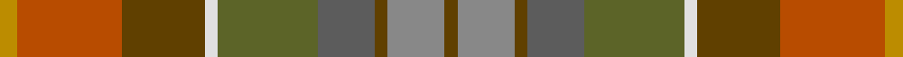

This page is one **sett** — a single exact thread-count. It belongs to the [tartan](/setts/lo4o24dy19w3y23n13dy3oi13dy3/)
(the same proportion at any scale), whose colour order is pattern [GRGBGWGRY](/stripes/grgbgwgry/).

Sourced from register-of-tartans.  It is a [9 stripe tartan](/stripes/stripes9/).

Original link https://www.tartanregister.gov.uk/tartanDetails.aspx?ref=4084

2 attestations — the source records this cloth was collapsed from (oldest owns this page)

<ul>
<li>undated — Teallach (Personal) (register-of-tartans, <a href="https://www.tartanregister.gov.uk/tartanDetails.aspx?ref=4084">record</a>)</li>
<li>Unknown — Teallach (Personal) (tartans-authority, <a href="http://www.tartansauthority.com/tartan-ferret/display/832/">record</a>)</li>
</ul>

## Register references

External register numbers recorded for this tartan.

- Scottish Register of Tartans: [4084](https://www.tartanregister.gov.uk/tartanDetails.aspx?ref=4084)
- Scottish Tartans Authority (ITI): 832
- Scottish Tartans World Register: 832

## Thread count
DY/8 DO48 T38 LN6 G46 N26 T6 Na26 T/6

One full sett is **406 threads**.

## Palette

Palette: <strong>Tartan Register</strong> <small style="color:#888">(5 of 7 colours)</small>
<table><thead><tr><th>Colour</th><th>Threads</th><th>Shade</th><th>Base</th><th>OKLCh</th></tr></thead><tbody><tr><td>DY/</td><td style="text-align:right;font-variant-numeric:tabular-nums">8</td><td><code style="background-color:#BC8C00;">#BC8C00</code> <small style="color:#888">#BC8C00</small></td><td>Y <code style="background-color:#F2BF00;">#F2BF00</code></td><td><small style="color:#888">oklch(66.8% 0.137 84.1)</small></td></tr><tr><td>DO</td><td style="text-align:right;font-variant-numeric:tabular-nums">48</td><td><code style="background-color:#B84C00;">#B84C00</code> <small style="color:#888">#B84C00</small></td><td>R <code style="background-color:#CC0000;">#CC0000</code></td><td><small style="color:#888">oklch(55.1% 0.156 45.5)</small></td></tr><tr><td>T</td><td style="text-align:right;font-variant-numeric:tabular-nums">38</td><td><code style="background-color:#604000;">#604000</code> <small style="color:#888">#604000</small></td><td>G <code style="background-color:#006100;">#006100</code></td><td><small style="color:#888">oklch(39.8% 0.083 76.8)</small></td></tr><tr><td>LN</td><td style="text-align:right;font-variant-numeric:tabular-nums">6</td><td><code style="background-color:#E0E0E0;">#E0E0E0</code> <small style="color:#888">#E0E0E0</small></td><td>W <code style="background-color:#F7F7F7;">#F7F7F7</code></td><td><small style="color:#888">oklch(90.7% 0.000 89.9)</small></td></tr><tr><td>G</td><td style="text-align:right;font-variant-numeric:tabular-nums">46</td><td><code style="background-color:#5C6428;">#5C6428</code> <small style="color:#888">#5C6428</small></td><td>G <code style="background-color:#006100;">#006100</code></td><td><small style="color:#888">oklch(48.3% 0.084 116.0)</small></td></tr><tr><td>N</td><td style="text-align:right;font-variant-numeric:tabular-nums">26</td><td><code style="background-color:#5C5C5C;">#5C5C5C</code> <small style="color:#888">#5C5C5C</small></td><td>B <code style="background-color:#2A418A;">#2A418A</code></td><td><small style="color:#888">oklch(47.5% 0.000 89.9)</small></td></tr><tr><td>T</td><td style="text-align:right;font-variant-numeric:tabular-nums">6</td><td><code style="background-color:#604000;">#604000</code> <small style="color:#888">#604000</small></td><td>G <code style="background-color:#006100;">#006100</code></td><td><small style="color:#888">oklch(39.8% 0.083 76.8)</small></td></tr><tr><td>Na</td><td style="text-align:right;font-variant-numeric:tabular-nums">26</td><td><code style="background-color:#888888;">#888888</code> <small style="color:#888">#888888</small></td><td>R <code style="background-color:#CC0000;">#CC0000</code></td><td><small style="color:#888">oklch(62.7% 0.000 89.9)</small></td></tr><tr><td>T/</td><td style="text-align:right;font-variant-numeric:tabular-nums">6</td><td><code style="background-color:#604000;">#604000</code> <small style="color:#888">#604000</small></td><td>G <code style="background-color:#006100;">#006100</code></td><td><small style="color:#888">oklch(39.8% 0.083 76.8)</small></td></tr></tbody></table>

## Nearest tartans

The nearest existing variants by ΔTartan distance, with this tartan at the top so the swatches line up against it.

ΔTartan

Tartan

Sett

—

<a href="/ttd/edit/#slug=lo4o24dy19w3y23n13dy3oi13dy3~x2">Teallach (Personal)</a> <a class="nn-out" href="/variants/s9/lo4o24dy19w3y23n13dy3oi13dy3~x2/" title="open its dictionary page">↗</a>

1.39

<a href="/ttd/edit/#slug=ly4r24dy19w3y23yi13dy3n13dy3~x2&amp;base=lo4o24dy19w3y23n13dy3oi13dy3~x2">Teallach</a> <a class="nn-out" href="/variants/s9/ly4r24dy19w3y23yi13dy3n13dy3~x2/" title="open its dictionary page">↗</a>

1.41

<a href="/ttd/edit/#slug=ly4r24dy19w3y23o13dy3n13dy3~x2&amp;base=lo4o24dy19w3y23n13dy3oi13dy3~x2">Teallach Family Tartan</a> <a class="nn-out" href="/variants/s9/ly4r24dy19w3y23o13dy3n13dy3~x2/" title="open its dictionary page">↗</a>

1.57

<a href="/ttd/edit/#slug=dr2lo12dr3lo3dr12yi12n12y12yi1ly2~x2&amp;base=lo4o24dy19w3y23n13dy3oi13dy3~x2">Auld Scotland</a> <a class="nn-out" href="/variants/s10/dr2lo12dr3lo3dr12yi12n12y12yi1ly2~x2/" title="open its dictionary page">↗</a>

1.76

<a href="/ttd/edit/#slug=lo5n2o14dy9dg8n3o3n3o3n3dg19ly3~x2&amp;base=lo4o24dy19w3y23n13dy3oi13dy3~x2">Meath Irish County Tartan</a> <a class="nn-out" href="/variants/s12/lo5n2o14dy9dg8n3o3n3o3n3dg19ly3~x2/" title="open its dictionary page">↗</a>

1.78

<a href="/ttd/edit/#slug=r4n19g10o10y15ly2~x2&amp;base=lo4o24dy19w3y23n13dy3oi13dy3~x2">Isle of Rona (District)</a> <a class="nn-out" href="/variants/s6/r4n19g10o10y15ly2~x2/" title="open its dictionary page">↗</a>

1.92

<a href="/ttd/edit/#slug=k2lo12dr3lo3dr12yi12n12y12yi1ly2~x2&amp;base=lo4o24dy19w3y23n13dy3oi13dy3~x2">Auld Scotland Weavers Tartan</a> <a class="nn-out" href="/variants/s10/k2lo12dr3lo3dr12yi12n12y12yi1ly2~x2/" title="open its dictionary page">↗</a>

2.00

<a href="/ttd/edit/#slug=do16r2do3r4do2n12dy18lb2dy18n12do12lo2r2lo2~x2&amp;base=lo4o24dy19w3y23n13dy3oi13dy3~x2">Allen - 2012 (Personal)</a> <a class="nn-out" href="/variants/s14/do16r2do3r4do2n12dy18lb2dy18n12do12lo2r2lo2~x2/" title="open its dictionary page">↗</a>

2.28

<a href="/ttd/edit/#slug=g7dy1lb1dy1lo1dy7n7dy1n7dy7g7dy1r1~x4&amp;base=lo4o24dy19w3y23n13dy3oi13dy3~x2">Hash House Harriers Hunting (Corp)</a> <a class="nn-out" href="/variants/s13/g7dy1lb1dy1lo1dy7n7dy1n7dy7g7dy1r1~x4/" title="open its dictionary page">↗</a>

2.32

<a href="/ttd/edit/#slug=o5lo3o19do6lo5do6dg12n5dg12n3~x2&amp;base=lo4o24dy19w3y23n13dy3oi13dy3~x2">Roscommon Irish County Tartan</a> <a class="nn-out" href="/variants/s10/o5lo3o19do6lo5do6dg12n5dg12n3~x2/" title="open its dictionary page">↗</a>

2.39

<a href="/ttd/edit/#slug=dy30k6dy6r6lo6o14k4o3n14k6n16~x2&amp;base=lo4o24dy19w3y23n13dy3oi13dy3~x2">Bracken (WCWM)</a> <a class="nn-out" href="/variants/s11/dy30k6dy6r6lo6o14k4o3n14k6n16~x2/" title="open its dictionary page">↗</a>

## Neighbour map

Every grey dot is one of 14360 variants placed by the first two principal components of the ΔTartan feature space (44% of its variance). Red is this tartan; blue dots are its nearest — click one to open its page.

<svg viewBox="0 0 640 380" role="img" style="max-width:100%;height:auto;border:1px solid #e0e0e0;border-radius:4px;display:block" xmlns="http://www.w3.org/2000/svg"><image href="/nn/cloud.v1.png" width="640" height="380"/><a href="/variants/s9/ly4r24dy19w3y23yi13dy3n13dy3~x2/"><circle cx="93.5" cy="182.5" r="4" fill="#3465a4"><title>Teallach</title></circle></a><a href="/variants/s9/ly4r24dy19w3y23o13dy3n13dy3~x2/"><circle cx="93.4" cy="181.7" r="4" fill="#3465a4"><title>Teallach Family Tartan</title></circle></a><a href="/variants/s10/dr2lo12dr3lo3dr12yi12n12y12yi1ly2~x2/"><circle cx="129.5" cy="189.7" r="4" fill="#3465a4"><title>Auld Scotland</title></circle></a><a href="/variants/s12/lo5n2o14dy9dg8n3o3n3o3n3dg19ly3~x2/"><circle cx="211.2" cy="194.6" r="4" fill="#3465a4"><title>Meath Irish County Tartan</title></circle></a><a href="/variants/s6/r4n19g10o10y15ly2~x2/"><circle cx="191.5" cy="253.5" r="4" fill="#3465a4"><title>Isle of Rona (District)</title></circle></a><a href="/variants/s10/k2lo12dr3lo3dr12yi12n12y12yi1ly2~x2/"><circle cx="79.4" cy="164.7" r="4" fill="#3465a4"><title>Auld Scotland Weavers Tartan</title></circle></a><a href="/variants/s14/do16r2do3r4do2n12dy18lb2dy18n12do12lo2r2lo2~x2/"><circle cx="216.6" cy="195.1" r="4" fill="#3465a4"><title>Allen - 2012 (Personal)</title></circle></a><a href="/variants/s13/g7dy1lb1dy1lo1dy7n7dy1n7dy7g7dy1r1~x4/"><circle cx="218.0" cy="214.4" r="4" fill="#3465a4"><title>Hash House Harriers Hunting (Corp)</title></circle></a><a href="/variants/s10/o5lo3o19do6lo5do6dg12n5dg12n3~x2/"><circle cx="166.8" cy="234.7" r="4" fill="#3465a4"><title>Roscommon Irish County Tartan</title></circle></a><a href="/variants/s11/dy30k6dy6r6lo6o14k4o3n14k6n16~x2/"><circle cx="149.4" cy="178.3" r="4" fill="#3465a4"><title>Bracken (WCWM)</title></circle></a><circle cx="126.3" cy="203.5" r="5" fill="#c00000"/></svg>

ID: /variants/s9/lo4o24dy19w3y23n13dy3oi13dy3~x2/
