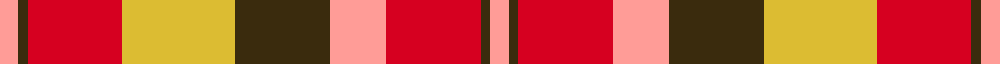

This page is one **sett** — a single exact thread-count. It belongs to the [tartan](/setts/lr2dy1r10ly12dy10lr6r10dy1lr2/)
(the same proportion at any scale), whose colour order is pattern [YGRYGYRGY](/stripes/ygrygyrgy/).

Sourced from register-of-tartans.  It is a [9 stripe tartan](/stripes/stripes9/).

Original link https://www.tartanregister.gov.uk/tartanDetails.aspx?ref=4382

## Register references

External register numbers recorded for this tartan.

- Scottish Register of Tartans: [4382](https://www.tartanregister.gov.uk/tartanDetails.aspx?ref=4382)
- Scottish Tartans World Register: 1876

## Thread count
LR/4 DY2 R20 LY24 DY20 LR12 R20 DY2 LR/4

One full sett is **208 threads**.

## Palette
<table><thead><tr><th>Colour</th><th>Shade</th><th>OKLCh</th></tr></thead><tbody><tr><td>LY</td><td><code style="background-color:#DCBC32;">#DCBC32</code> <small style="color:#888">#DCBC32</small></td><td><small style="color:#888">oklch(80.0% 0.150 95.2)</small></td></tr><tr><td>LR</td><td><code style="background-color:#FF9C97;">#FF9C97</code> <small style="color:#888">#FF9C97</small></td><td><small style="color:#888">oklch(79.3% 0.119 23.2)</small></td></tr><tr><td>R</td><td><code style="background-color:#D60020;">#D60020</code> <small style="color:#888">#D60020</small></td><td><small style="color:#888">oklch(55.2% 0.224 25.5)</small></td></tr><tr><td>DY</td><td><code style="background-color:#3A2B0D;">#3A2B0D</code> <small style="color:#888">#3A2B0D</small></td><td><small style="color:#888">oklch(30.0% 0.049 82.0)</small></td></tr></tbody></table>

# Sample pattern

## Nearest tartan variants

The nearest existing variants by ΔTartan distance, with this cloth at the top so the swatches line up against it.

ΔTartan

Threads

Variant

Sett

—

208

<a href="/variants/s9/lr2dy1r10ly12dy10lr6r10dy1lr2~x2/">Unidentified Sett</a>

<a href="/ttd/edit/#slug=r11db1r11db1w10o11db1o11~x2&amp;base=lr2dy1r10ly12dy10lr6r10dy1lr2~x2" title="compare in the TTD">1.92</a>

184

<a href="/variants/s8/r11db1r11db1w10o11db1o11~x2/">St Andrews</a>

<a href="/ttd/edit/#slug=dy24g2dy5r14g2r5lo17dy2~x2&amp;base=lr2dy1r10ly12dy10lr6r10dy1lr2~x2" title="compare in the TTD">2.84</a>

232

<a href="/variants/s8/dy24g2dy5r14g2r5lo17dy2~x2/">Loch Rannoch #2</a>

<a href="/ttd/edit/#slug=dp1r5g15r3dp9r10w1~x4&amp;base=lr2dy1r10ly12dy10lr6r10dy1lr2~x2" title="compare in the TTD">3.26</a>

344

<a href="/variants/s7/dp1r5g15r3dp9r10w1~x4/">Geddes</a>

<a href="/ttd/edit/#slug=do2r2do15r1w10o15r2o2~x2&amp;base=lr2dy1r10ly12dy10lr6r10dy1lr2~x2" title="compare in the TTD">3.28</a>

188

<a href="/variants/s8/do2r2do15r1w10o15r2o2~x2/">Bannockbane</a>

<a href="/ttd/edit/#slug=ly2do1o10oi12do10ly6o10do1ly2~x4~o1305035-oi2104072&amp;base=lr2dy1r10ly12dy10lr6r10dy1lr2~x2" title="compare in the TTD">3.32</a>

416

<a href="/variants/s9/ly2do1o10oi12do10ly6o10do1ly2~x4~o1305035-oi2104072/">Highland Village</a>

<a href="/ttd/edit/#slug=g12ri11dp12r3ri32dp8g8dp8~x2~ri2209032-r2208029&amp;base=lr2dy1r10ly12dy10lr6r10dy1lr2~x2" title="compare in the TTD">3.34</a>

336

<a href="/variants/s8/g12ri11dp12r3ri32dp8g8dp8~x2~ri2209032-r2208029/">Fiddes</a>

<a href="/ttd/edit/#slug=dr24n5o9n2o9w9~x4&amp;base=lr2dy1r10ly12dy10lr6r10dy1lr2~x2" title="compare in the TTD">3.39</a>

332

<a href="/variants/s6/dr24n5o9n2o9w9~x4/">Plaid Wine</a>

<a href="/ttd/edit/#slug=dr4w2dr1w18dr18r18ri3r4~x2~r1807033-ri2109032&amp;base=lr2dy1r10ly12dy10lr6r10dy1lr2~x2" title="compare in the TTD">3.48</a>

256

<a href="/variants/s8/dr4w2dr1w18dr18r18ri3r4~x2~r1807033-ri2109032/">Gigha, Cherry (Dance)</a>

<a href="/ttd/edit/#slug=db8y1g12r10ly2r6ly2r4~x4&amp;base=lr2dy1r10ly12dy10lr6r10dy1lr2~x2" title="compare in the TTD">3.53</a>

312

<a href="/variants/s8/db8y1g12r10ly2r6ly2r4~x4/">Indiana &quot;Cardinal&quot;</a>

<a href="/ttd/edit/#slug=dp28r26w2dp5w2r26g28r5w2r5~x2&amp;base=lr2dy1r10ly12dy10lr6r10dy1lr2~x2" title="compare in the TTD">3.60</a>

450

<a href="/variants/s10/dp28r26w2dp5w2r26g28r5w2r5~x2/">Glenfinnan</a>

## Neighbour map

Every grey dot is one of 13620 variants placed by the first two principal components of the ΔTartan feature space (42% of its variance). Red is this tartan; blue dots are its nearest — click one to open its page.

<svg viewBox="0 0 640 380" role="img" style="max-width:100%;height:auto;border:1px solid #e0e0e0;border-radius:4px;display:block" xmlns="http://www.w3.org/2000/svg"><image href="/nn/cloud.v1.png" width="640" height="380"/><a href="/variants/s8/r11db1r11db1w10o11db1o11~x2/"><circle cx="228.6" cy="213.1" r="4" fill="#3465a4"><title>St Andrews</title></circle></a><a href="/variants/s8/dy24g2dy5r14g2r5lo17dy2~x2/"><circle cx="243.9" cy="186.4" r="4" fill="#3465a4"><title>Loch Rannoch #2</title></circle></a><a href="/variants/s7/dp1r5g15r3dp9r10w1~x4/"><circle cx="247.2" cy="196.5" r="4" fill="#3465a4"><title>Geddes</title></circle></a><a href="/variants/s8/do2r2do15r1w10o15r2o2~x2/"><circle cx="196.7" cy="170.6" r="4" fill="#3465a4"><title>Bannockbane</title></circle></a><a href="/variants/s9/ly2do1o10oi12do10ly6o10do1ly2~x4~o1305035-oi2104072/"><circle cx="211.5" cy="207.4" r="4" fill="#3465a4"><title>Highland Village</title></circle></a><a href="/variants/s8/g12ri11dp12r3ri32dp8g8dp8~x2~ri2209032-r2208029/"><circle cx="258.0" cy="209.1" r="4" fill="#3465a4"><title>Fiddes</title></circle></a><a href="/variants/s6/dr24n5o9n2o9w9~x4/"><circle cx="222.3" cy="215.1" r="4" fill="#3465a4"><title>Plaid Wine</title></circle></a><a href="/variants/s8/dr4w2dr1w18dr18r18ri3r4~x2~r1807033-ri2109032/"><circle cx="189.6" cy="161.9" r="4" fill="#3465a4"><title>Gigha, Cherry (Dance)</title></circle></a><a href="/variants/s8/db8y1g12r10ly2r6ly2r4~x4/"><circle cx="209.6" cy="194.7" r="4" fill="#3465a4"><title>Indiana &quot;Cardinal&quot;</title></circle></a><a href="/variants/s10/dp28r26w2dp5w2r26g28r5w2r5~x2/"><circle cx="269.3" cy="168.5" r="4" fill="#3465a4"><title>Glenfinnan</title></circle></a><circle cx="198.7" cy="199.8" r="5" fill="#c00000"/><text x="320" y="376" text-anchor="middle" font-size="11" fill="#999">ground</text><text x="11" y="190" text-anchor="middle" font-size="11" fill="#999" transform="rotate(-90 11 190)">complexity</text></svg>

ID: /variants/s9/lr2dy1r10ly12dy10lr6r10dy1lr2~x2/
