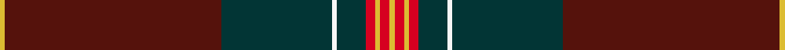

This is one **variant** — a specific cloth: this exact thread count and colourway, with its own
provenance below. It is one weaving of the [sett](/tartans/a/ar/arbroath-smokie/) (the scale-free proportion — the
same cloth at any scale or shade), whose colour order is pattern [YBBWBRYRY](/stripes/ybbwbryry/).

Part of the [Arbroath Smokie](/tartans/a/ar/arbroath-smokie/) tartan — the named design grouping this sett with its other cloths.

Sourced from register-of-tartans.  It is a [9 stripe tartan](/stripes/stripes9/).

Original link [https://www.tartanregister.gov.uk/tartanDetails.aspx?ref=105](https://www.tartanregister.gov.uk/tartanDetails.aspx?ref=105)

2 attestations — the source records this cloth was collapsed from (oldest owns this page)

<ul>
<li>01/01/2005 — Arbroath Smokie (register-of-tartans, <a href="https://www.tartanregister.gov.uk/tartanDetails.aspx?ref=105">record</a>)  <em>Designed by Heather Yellowly of the Strathmore Woollen Co, of Forfar for Campbell Scott of Arbroath Fisheries. The tartan celebrates the European protective geographical status being awarded to the Arbroath Smokie - one of only a few food products to have been awarded this status. Colours: red represents the sandstone of Arbroath Abbey where the Declaration of Independence was signed in 1320; blue and white represent the sea; the red glow of the smokie barrel and the golden yellow of the delicacy itself.</em></li>
<li>pre 2005 — Arbroath Smokie (Corporate) (tartans-authority, <a href="https://web.archive.org/web/*/http://www.tartansauthority.com/tartan-ferret/display/6596/*">record</a>)  <em>Designed by Heather Yellowly of the Strathmore Woollen Co., of Forfar for Campbell Scott of Arbroath Fisheries. The tartan celebrates the European protective geographical status being awarded to the Arbroath Smokie. One of only a few food products to have been awarded this status, the colours chosen represent the red sandstone of Arbroath Abbey where the Declaration of Independence was signed in 1320; the blue and white of the sea, the red glow of the smokie barrel and the golden yellow of the delicacy itself.</em></li>
</ul>

Dataset <small>— provenance for this record, inherited from the source manifest</small>

<dl class="dataset-prov">
<dt>source</dt><dd><a href="/sources/register-of-tartans/">Scottish Register of Tartans</a></dd>
<dt>data captured from</dt><dd><a href="https://github.com/thetartan/tartan-database/blob/master/data/register-of-tartans/data.csv">https://github.com/thetartan/tartan-database/blob/master/data/register-of-tartans/data.csv</a></dd>
<dt>data date</dt><dd>2005 <small>(this record)</small></dd>
<dt>licence</dt><dd><a href="https://www.tartanregister.gov.uk/copyright">Crown copyright</a></dd>
</dl>

Capture chain <small>— the hands this data passed through, oldest first; each capture carries its own licence</small>

<ol class="capture-chain">
<li><a href="https://www.tartanregister.gov.uk/">Scottish Register of Tartans</a> · <a href="https://www.tartanregister.gov.uk/copyright">Crown copyright</a> <small>the living register — still published by National Records of Scotland</small></li>
<li><a href="https://github.com/thetartan/tartan-database">thetartan/tartan-database</a> <small>2016-2017</small> · <a href="https://creativecommons.org/licenses/by-nc-nd/4.0/">CC BY-NC-ND 4.0</a> <small>Levko Kravets's frozen compilation — the capture we vendored, and where its CC licence text came from</small></li>
<li>this dictionary <small>captured 2026-06-10 · commit 5bf86c7566</small> <small>each re-capture is a git commit to data/sources</small></li>
</ol>

## Register references

External register numbers recorded for this tartan.

- Scottish Register of Tartans: [105](https://www.tartanregister.gov.uk/tartanDetails.aspx?ref=105)
- Scottish Tartans Authority (ITI): 6596

## Thread count
LY/2 DR90 DT46 W2 DT12 R4 LY2 R4 LY/2

One full sett is **324 threads**.

## Palette
<table><thead><tr><th>Colour</th><th>Shade</th><th>OKLCh</th></tr></thead><tbody><tr><td>DB</td><td><code style="background-color:#082077;">#082077</code> <small style="color:#888">#082077</small></td><td><small style="color:#888">oklch(30.0% 0.149 265.1)</small></td></tr><tr><td>DT</td><td><code style="background-color:#023535;">#023535</code> <small style="color:#888">#023535</small></td><td><small style="color:#888">oklch(29.8% 0.050 194.8)</small></td></tr><tr><td>DR</td><td><code style="background-color:#55120C;">#55120C</code> <small style="color:#888">#55120C</small></td><td><small style="color:#888">oklch(30.0% 0.099 29.3)</small></td></tr><tr><td>LY</td><td><code style="background-color:#DCBC32;">#DCBC32</code> <small style="color:#888">#DCBC32</small></td><td><small style="color:#888">oklch(80.0% 0.150 95.2)</small></td></tr><tr><td>W</td><td><code style="background-color:#F7F7F7;">#F7F7F7</code> <small style="color:#888">#F7F7F7</small></td><td><small style="color:#888">oklch(97.6% 0.000 89.9)</small></td></tr><tr><td>R</td><td><code style="background-color:#D60020;">#D60020</code> <small style="color:#888">#D60020</small></td><td><small style="color:#888">oklch(55.2% 0.224 25.5)</small></td></tr></tbody></table>

# Sample pattern

## Nearest tartan variants

The nearest existing variants by ΔTartan distance, with this cloth at the top so the swatches line up against it.

ΔTartan

Threads

Variant

Sett

—

324

<a href="/variants/s9/ly1dr45dt23w1dt6r2ly1r2ly1~x2/">Arbroath Smokie</a>

<a href="/ttd/edit/#slug=y3dg1g3dg16dr32dg1dy1db4g2~x2~dg1605139&amp;base=ly1dr45dt23w1dt6r2ly1r2ly1~x2" title="compare in the TTD">2.99</a>

242

<a href="/variants/s9/y3dg1g3dg16dr32dg1dy1db4g2~x2~dg1605139/">Connemara</a>

<a href="/ttd/edit/#slug=y3dg1g3dg16dr32dg1dy1db4g2~x2&amp;base=ly1dr45dt23w1dt6r2ly1r2ly1~x2" title="compare in the TTD">3.08</a>

242

<a href="/variants/s9/y3dg1g3dg16dr32dg1dy1db4g2~x2/">Connemara (District)</a>

<a href="/ttd/edit/#slug=dr50o6do7g2do2w2do2o16dr8do2dr9g3~x2&amp;base=ly1dr45dt23w1dt6r2ly1r2ly1~x2" title="compare in the TTD">3.11</a>

330

<a href="/variants/s12/dr50o6do7g2do2w2do2o16dr8do2dr9g3~x2/">Tyrone</a>

<a href="/ttd/edit/#slug=dy60db8o16db4lo8dy4r2db6w1~x2~o2007033-lo2905070&amp;base=ly1dr45dt23w1dt6r2ly1r2ly1~x2" title="compare in the TTD">3.31</a>

314

<a href="/variants/s9/dy60db8o16db4lo8dy4r2db6w1~x2~o2007033-lo2905070/">Wattenhofer (2016)</a>

<a href="/ttd/edit/#slug=db5g9r3db18dr80y3dr40db18r3g9db5w2~x2&amp;base=ly1dr45dt23w1dt6r2ly1r2ly1~x2" title="compare in the TTD">3.58</a>

766

<a href="/variants/s12/db5g9r3db18dr80y3dr40db18r3g9db5w2~x2/">Roseline</a>

<a href="/ttd/edit/#slug=dr50o6do7dg2do2lr2do2o14dr8do2dr9dg3~x2~do1001060-dg1603171&amp;base=ly1dr45dt23w1dt6r2ly1r2ly1~x2" title="compare in the TTD">3.70</a>

322

<a href="/variants/s12/dr50o6dg7dgi2dg2lr2dg2o14dr8dg2dr9dgi3~x2~dg1001060-dgi1603171/">Tyrone Irish County Tartan</a>

<a href="/ttd/edit/#slug=n4db2n7dt30n8dt7r5db1w2~x2~n1900000-w3600000&amp;base=ly1dr45dt23w1dt6r2ly1r2ly1~x2" title="compare in the TTD">3.81</a>

252

<a href="/variants/s9/n4db2n7dt30n8dt7r5db1w2~x2~n1900000-w3600000/">Hebridean Heather Fashion Tartan</a>

<a href="/ttd/edit/#slug=w3dr11db4dr6dg48o2dg3o2~x2&amp;base=ly1dr45dt23w1dt6r2ly1r2ly1~x2" title="compare in the TTD">3.85</a>

306

<a href="/variants/s8/w3dr11db4dr6dg48o2dg3o2~x2/">Hall, from Springbrook and Newtown (Personal)</a>

<a href="/ttd/edit/#slug=do64dr9o11dr4lb2lo2n5dr2lo13~x2&amp;base=ly1dr45dt23w1dt6r2ly1r2ly1~x2" title="compare in the TTD">3.86</a>

294

<a href="/variants/s9/do64dr9o11dr4lb2lo2n5dr2lo13~x2/">Down, County</a>

<a href="/ttd/edit/#slug=o64g4dy1g4dy1g4dy64do2dy2do8~x2&amp;base=ly1dr45dt23w1dt6r2ly1r2ly1~x2" title="compare in the TTD">3.86</a>

472

<a href="/variants/s10/o64g4dy1g4dy1g4dy64do2dy2do8~x2/">Connacht</a>

## Neighbour map

Every grey dot is one of 13656 variants placed by the first two principal components of the ΔTartan feature space (42% of its variance). Red is this tartan; blue dots are its nearest — click one to open its page. The map is a flat projection of a many-dimensional space — [how to read it](/posts/neighbourhood-maps/).

<svg viewBox="0 0 640 380" role="img" style="max-width:100%;height:auto;border:1px solid #e0e0e0;border-radius:4px;display:block" xmlns="http://www.w3.org/2000/svg"><image href="/nn/cloud.v1.png" width="640" height="380"/><a href="/variants/s9/y3dg1g3dg16dr32dg1dy1db4g2~x2~dg1605139/"><circle cx="409.9" cy="136.2" r="4" fill="#3465a4"><title>Connemara</title></circle></a><a href="/variants/s9/y3dg1g3dg16dr32dg1dy1db4g2~x2/"><circle cx="428.6" cy="142.4" r="4" fill="#3465a4"><title>Connemara (District)</title></circle></a><a href="/variants/s12/dr50o6do7g2do2w2do2o16dr8do2dr9g3~x2/"><circle cx="445.9" cy="122.8" r="4" fill="#3465a4"><title>Tyrone</title></circle></a><a href="/variants/s9/dy60db8o16db4lo8dy4r2db6w1~x2~o2007033-lo2905070/"><circle cx="391.7" cy="82.2" r="4" fill="#3465a4"><title>Wattenhofer (2016)</title></circle></a><a href="/variants/s12/db5g9r3db18dr80y3dr40db18r3g9db5w2~x2/"><circle cx="409.4" cy="85.1" r="4" fill="#3465a4"><title>Roseline</title></circle></a><a href="/variants/s12/dr50o6dg7dgi2dg2lr2dg2o14dr8dg2dr9dgi3~x2~dg1001060-dgi1603171/"><circle cx="476.1" cy="127.8" r="4" fill="#3465a4"><title>Tyrone Irish County Tartan</title></circle></a><a href="/variants/s9/n4db2n7dt30n8dt7r5db1w2~x2~n1900000-w3600000/"><circle cx="402.0" cy="148.7" r="4" fill="#3465a4"><title>Hebridean Heather Fashion Tartan</title></circle></a><a href="/variants/s8/w3dr11db4dr6dg48o2dg3o2~x2/"><circle cx="447.5" cy="135.2" r="4" fill="#3465a4"><title>Hall, from Springbrook and Newtown (Personal)</title></circle></a><a href="/variants/s9/do64dr9o11dr4lb2lo2n5dr2lo13~x2/"><circle cx="364.0" cy="95.2" r="4" fill="#3465a4"><title>Down, County</title></circle></a><a href="/variants/s10/o64g4dy1g4dy1g4dy64do2dy2do8~x2/"><circle cx="420.7" cy="118.5" r="4" fill="#3465a4"><title>Connacht</title></circle></a><circle cx="448.2" cy="108.6" r="5" fill="#c00000"/><text x="320" y="376" text-anchor="middle" font-size="11" fill="#999">ground</text><text x="11" y="190" text-anchor="middle" font-size="11" fill="#999" transform="rotate(-90 11 190)">complexity</text></svg>

ID: /variants/s9/ly1dr45dt23w1dt6r2ly1r2ly1~x2/
