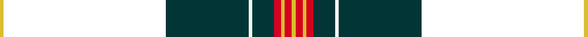

This page is one **sett** — a single exact thread-count. It belongs to the [tartan](/setts/ly1k45dt23w1dt6r2ly1r2ly1/)
(the same proportion at any scale), whose colour order is pattern [YKBWBRYRY](/stripes/ykbwbryry/).

Sourced from house-of-tartan.  It is a [9 stripe tartan](/stripes/stripes9/).

Original link http://www.house-of-tartan.scotland.net/house/TartanViewjs.asp?colr=Def&tnam=6596

## Provenance

Earliest known date: 01/01/2005 Designed by Heather Yellowly of the Strathmore Woollen Co, of Forfar for Campbell Scott of Arbroath Fisheries. The tartan celebrates the European protective geographical status being awarded to the Arbroath Smokie - one of only a few food products to have been awarded this status. Colours: red represents the sandstone of Arbroath Abbey where the Declaration of Independence was signed in 1320; blue and white represent the sea; the red glow of the smokie barrel and the golden yellow of the delicacy itself.

## Thread count
LY/2 K90 DT46 W2 DT12 R4 LY2 R4 LY/2

One full sett is **324 threads**.

## Palette
<table><thead><tr><th>Colour</th><th>Shade</th><th>OKLCh</th></tr></thead><tbody><tr><td>DB</td><td><code style="background-color:#082077;">#082077</code> <small style="color:#888">#082077</small></td><td><small style="color:#888">oklch(30.0% 0.149 265.1)</small></td></tr><tr><td>DT</td><td><code style="background-color:#023535;">#023535</code> <small style="color:#888">#023535</small></td><td><small style="color:#888">oklch(29.8% 0.050 194.8)</small></td></tr><tr><td>LY</td><td><code style="background-color:#DCBC32;">#DCBC32</code> <small style="color:#888">#DCBC32</small></td><td><small style="color:#888">oklch(80.0% 0.150 95.2)</small></td></tr><tr><td>W</td><td><code style="background-color:#F7F7F7;">#F7F7F7</code> <small style="color:#888">#F7F7F7</small></td><td><small style="color:#888">oklch(97.6% 0.000 89.9)</small></td></tr><tr><td>R</td><td><code style="background-color:#D60020;">#D60020</code> <small style="color:#888">#D60020</small></td><td><small style="color:#888">oklch(55.2% 0.224 25.5)</small></td></tr></tbody></table>

# Sample pattern

## Nearest variants

The nearest existing variants by ΔTartan distance, with this cloth at the top so the swatches line up against it.

ΔTartan

Threads

Variant

Sett

—

324

<a href="/variants/s9/ly1k45dt23w1dt6r2ly1r2ly1~x2/">Arbroath Smokie Corporate Tartan</a>

<a href="/ttd/edit/#slug=db10y2dg2w1dg18r1k45r2~x2&amp;base=ly1k45dt23w1dt6r2ly1r2ly1~x2" title="compare in the TTD">1.89</a>

300

<a href="/variants/s8/db10y2dg2w1dg18r1k45r2~x2/">Downs</a>

<a href="/ttd/edit/#slug=db1lb2k50dg50ly2r1~x2&amp;base=ly1k45dt23w1dt6r2ly1r2ly1~x2" title="compare in the TTD">2.78</a>

420

<a href="/variants/s6/db1lb2k50dg50ly2r1~x2/">Josse (Personal)</a>

<a href="/ttd/edit/#slug=k54n11g13y1db13w1~x2&amp;base=ly1k45dt23w1dt6r2ly1r2ly1~x2" title="compare in the TTD">2.91</a>

262

<a href="/variants/s6/k54n11g13y1db13w1~x2/">Kilmaine Saints</a>

## Neighbour map

Every grey dot is one of 13620 variants placed by the first two principal components of the ΔTartan feature space (42% of its variance). Red is this tartan; blue dots are its nearest — click one to open its page.

<svg viewBox="0 0 640 380" role="img" style="max-width:100%;height:auto;border:1px solid #e0e0e0;border-radius:4px;display:block" xmlns="http://www.w3.org/2000/svg"><image href="/nn/cloud.v1.png" width="640" height="380"/><a href="/variants/s8/db10y2dg2w1dg18r1k45r2~x2/"><circle cx="310.8" cy="65.0" r="4" fill="#3465a4"><title>Downs</title></circle></a><a href="/variants/s6/db1lb2k50dg50ly2r1~x2/"><circle cx="320.3" cy="87.4" r="4" fill="#3465a4"><title>Josse (Personal)</title></circle></a><a href="/variants/s6/k54n11g13y1db13w1~x2/"><circle cx="297.2" cy="82.7" r="4" fill="#3465a4"><title>Kilmaine Saints</title></circle></a><circle cx="337.4" cy="67.1" r="5" fill="#c00000"/><text x="320" y="376" text-anchor="middle" font-size="11" fill="#999">ground</text><text x="11" y="190" text-anchor="middle" font-size="11" fill="#999" transform="rotate(-90 11 190)">complexity</text></svg>

ID: /variants/s9/ly1k45dt23w1dt6r2ly1r2ly1~x2/
