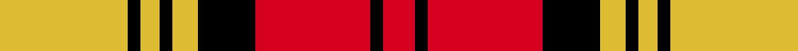

This page is one **sett** — a single exact thread-count. It belongs to the [tartan](/setts/ly20k2ly3k2ly4k9r18k2r5/)
(the same proportion at any scale), whose colour order is pattern [RKRKYKYKY](/stripes/rkrkykyky/).

Sourced from register-of-tartans.  It is a [9 stripe tartan](/stripes/stripes9/).

Original link https://www.tartanregister.gov.uk/tartanDetails.aspx?ref=127

2 attestations — the source records this cloth was collapsed from (oldest owns this page)

<ul>
<li>01/01/1992 — Aubigny (register-of-tartans, <a href="https://www.tartanregister.gov.uk/tartanDetails.aspx?ref=127">record</a>)  <em>Designed by Polly Wittering of House of Edgar for the French town of Aubigny-sur-Nere. Also recorded as Alliance France-Eccose, with a slightly different threadcount. The Alliance is said to be a French/Scottish Society located in La Maison des Associations (SIEGE), Orleans, France. Aubigny-sur-Nere is a short distance southeast of Orleans so these may be the same tartan but with some confusion as to the official title. Created using the Stewart of Atholl tartan and the colours of the Aubigny sur Nere town crest. The Stewart of Atholl tartan was used as the basis for this design because of the 16th century Chateau d'Aubigny-sur-Nere which was built by the Stewarts. The name arises from the Auld Alliance, a cultural and diplomatic treaty between Scotland and France, which was at its strongest during conflicts with England, the common enemy.</em></li>
<li>1992 — Aubigny (District) (tartans-authority, <a href="http://www.tartansauthority.com/tartan-ferret/display/2159/">record</a>)  <em>1992 design by Polly Wittering of House of Edgar in Perth, Scotland for the French town of Aubigny-sur-Nere. STA sample. This is also in the database as Alliance France-Eccose albeit with a slightly different thread count. The Alliance is said to be a French/Scottish Society located in La Maison des Associations (SIEGE), 45000, Orleans, France. Aubigny-sur-Nere is a short distance southeast of Orleans so these are obviously one and the same tartans but with some confusion as to the oficial title. Woven sample from Lasy Chrystel 18.5.15.</em></li>
</ul>

## Register references

External register numbers recorded for this tartan.

- Scottish Register of Tartans: [127](https://www.tartanregister.gov.uk/tartanDetails.aspx?ref=127)
- Scottish Tartans Authority (ITI): 2159
- Scottish Tartans World Register: 2159

## Thread count
LY/40 K4 LY6 K4 LY8 K18 R36 K4 R/10

One full sett is **210 threads**.

## Palette
<table><thead><tr><th>Colour</th><th>Shade</th><th>OKLCh</th></tr></thead><tbody><tr><td>R</td><td><code style="background-color:#D60020;">#D60020</code> <small style="color:#888">#D60020</small></td><td><small style="color:#888">oklch(55.2% 0.224 25.5)</small></td></tr><tr><td>LY</td><td><code style="background-color:#DCBC32;">#DCBC32</code> <small style="color:#888">#DCBC32</small></td><td><small style="color:#888">oklch(80.0% 0.150 95.2)</small></td></tr><tr><td>K</td><td><code style="background-color:#000000;">#000000</code> <small style="color:#888">#000000</small></td><td><small style="color:#888">oklch(0.0% 0.000 0.0)</small></td></tr></tbody></table>

# Sample pattern

## Nearest variants

The nearest existing variants by ΔTartan distance, with this cloth at the top so the swatches line up against it.

ΔTartan

Threads

Variant

Sett

—

210

<a href="/variants/s9/ly20k2ly3k2ly4k9r18k2r5~x2/">Aubigny</a>

<a href="/ttd/edit/#slug=db6k3r2k3r31k6ly2k6ly13k2ly2~x2&amp;base=ly20k2ly3k2ly4k9r18k2r5~x2" title="compare in the TTD">2.29</a>

288

<a href="/variants/s11/db6k3r2k3r31k6ly2k6ly13k2ly2~x2/">Rourke-Frew (Name)</a>

<a href="/ttd/edit/#slug=y20k2y3k2y4k9r18k2r5k2r9~x2&amp;base=ly20k2ly3k2ly4k9r18k2r5~x2" title="compare in the TTD">2.63</a>

246

<a href="/variants/s11/y20k2y3k2y4k9r18k2r5k2r9~x2/">Aubigny, Auld Alliance</a>

## Neighbour map

Every grey dot is one of 13620 variants placed by the first two principal components of the ΔTartan feature space (42% of its variance). Red is this tartan; blue dots are its nearest — click one to open its page.

<svg viewBox="0 0 640 380" role="img" style="max-width:100%;height:auto;border:1px solid #e0e0e0;border-radius:4px;display:block" xmlns="http://www.w3.org/2000/svg"><image href="/nn/cloud.v1.png" width="640" height="380"/><a href="/variants/s11/db6k3r2k3r31k6ly2k6ly13k2ly2~x2/"><circle cx="194.0" cy="111.7" r="4" fill="#3465a4"><title>Rourke-Frew (Name)</title></circle></a><a href="/variants/s11/y20k2y3k2y4k9r18k2r5k2r9~x2/"><circle cx="213.2" cy="168.9" r="4" fill="#3465a4"><title>Aubigny, Auld Alliance</title></circle></a><circle cx="191.0" cy="170.2" r="5" fill="#c00000"/><text x="320" y="376" text-anchor="middle" font-size="11" fill="#999">ground</text><text x="11" y="190" text-anchor="middle" font-size="11" fill="#999" transform="rotate(-90 11 190)">complexity</text></svg>

ID: /variants/s9/ly20k2ly3k2ly4k9r18k2r5~x2/
