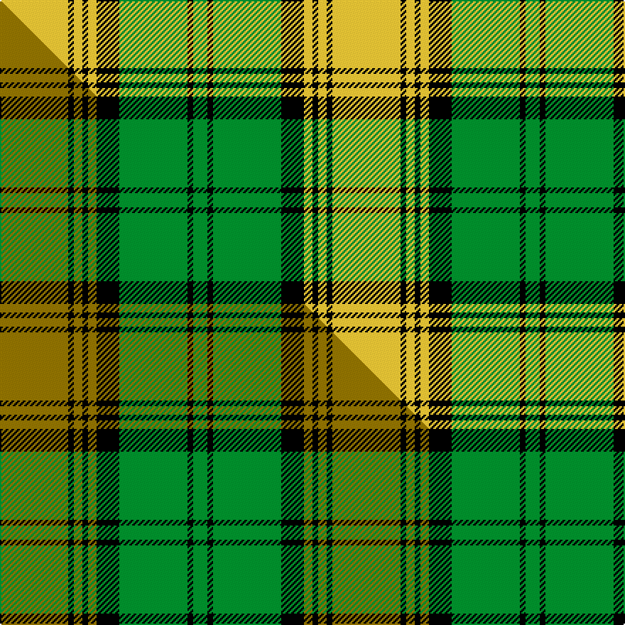

This is one **variant** — a specific cloth: this exact thread count and colourway, with its own
provenance below. It is one weaving of the [sett](/setts/ly24k2ly3k2ly3k8g24k2g5/) (the scale-free proportion — the
same cloth at any scale or shade), whose colour order is pattern [GKGKYKYKY](/stripes/gkgkykyky/).

Part of the [Jamaican National](/tartans/j/ja/jamaican-national/) tartan — the named design grouping this sett with its other cloths.

Sourced from tartans-authority.  It is a [9 stripe tartan](/stripes/stripes9/).

Original link [https://www.tartanregister.gov.uk/tartanDetails.aspx?ref=10545](https://www.tartanregister.gov.uk/tartanDetails.aspx?ref=10545)

Dataset <small>— provenance for this record, inherited from the source manifest</small>

<dl class="dataset-prov">
<dt>source</dt><dd><a href="/sources/tartans-authority/">Scottish Tartans Authority</a></dd>
<dt>data captured from</dt><dd><a href="https://github.com/thetartan/tartan-database/blob/master/data/tartans-authority/data.csv">https://github.com/thetartan/tartan-database/blob/master/data/tartans-authority/data.csv</a></dd>
<dt>data date</dt><dd>8/11/2011 <small>(this record)</small></dd>
<dt>licence</dt><dd><a href="https://creativecommons.org/licenses/by-nc-nd/4.0/">CC BY-NC-ND 4.0</a></dd>
</dl>

Capture chain <small>— the hands this data passed through, oldest first; each capture carries its own licence</small>

<ol class="capture-chain">
<li><a href="https://www.tartansauthority.com/">Scottish Tartans Authority</a> <small>the heritage body's archive — its tartan-ferret record browser is retired (links repaired to the SRT, above)</small></li>
<li><a href="https://github.com/thetartan/tartan-database">thetartan/tartan-database</a> <small>2016-2017</small> · <a href="https://creativecommons.org/licenses/by-nc-nd/4.0/">CC BY-NC-ND 4.0</a> <small>Levko Kravets's frozen compilation — the capture we vendored, and where its CC licence text came from</small></li>
<li>this dictionary <small>captured 2026-06-10 · commit 5bf86c7566</small> <small>each re-capture is a git commit to data/sources</small></li>
</ol>

## Register references

External register numbers recorded for this tartan.

- Scottish Register of Tartans: [10545](https://www.tartanregister.gov.uk/tartanDetails?ref=10545)
- Scottish Tartans Authority (ITI): 10545

## Thread count
LY/48 K4 LY6 K4 LY6 K16 G48 K4 G/10

One full sett is **234 threads**.

## Palette
<table><thead><tr><th>Colour</th><th>Shade</th><th>OKLCh</th></tr></thead><tbody><tr><td>G</td><td><code style="background-color:#008B2A;">#008B2A</code> <small style="color:#888">#008B2A</small></td><td><small style="color:#888">oklch(55.4% 0.170 145.9)</small></td></tr><tr><td>K</td><td><code style="background-color:#000000;">#000000</code> <small style="color:#888">#000000</small></td><td><small style="color:#888">oklch(0.0% 0.000 0.0)</small></td></tr><tr><td>LY</td><td><code style="background-color:#DCBC32;">#DCBC32</code> <small style="color:#888">#DCBC32</small></td><td><small style="color:#888">oklch(80.0% 0.150 95.2)</small></td></tr></tbody></table>

# Sample pattern

## Compared to the master

This cloth is one sett of its design; the master sett (the exemplar the design is anchored on) is below for comparison.

Its **ΔTartan distance** from the master is **0.16** — the same measure the nearest-tartans table ranks by (0 is identical; a re-scale of the same cloth is near 0, a recolour or a different proportion further).

<figure class="master-compare" style="margin:0">

this sett
master sett ★

<figcaption style="color:#888;font-size:smaller">One weave of this sett against the <a href="/setts/y24k2y3k2y3k8g24k2g5/">master sett ★</a>, split on the diagonal: a shared proportion runs seamlessly across it with only the shades shifting; a different proportion breaks on it.</figcaption>
</figure>

## Nearest tartan variants

The nearest existing variants by ΔTartan distance, with this cloth at the top so the swatches line up against it.

ΔTartan

Threads

Variant

Sett

—

234

<a href="/variants/s9/ly24k2ly3k2ly3k8g24k2g5~x2/">Jamaican National (District)</a>

<a href="/ttd/edit/#slug=y24k2y3k2y3k8g24k2g5~x2&amp;base=ly24k2ly3k2ly3k8g24k2g5~x2" title="compare in the TTD">0.16</a>

234

<a href="/variants/s9/y24k2y3k2y3k8g24k2g5~x2/">Jamaican National</a>

<a href="/ttd/edit/#slug=ly15k1ly2k1ly2k10g14w2~x2&amp;base=ly24k2ly3k2ly3k8g24k2g5~x2" title="compare in the TTD">2.46</a>

154

<a href="/variants/s8/ly15k1ly2k1ly2k10g14w2~x2/">Buccleuch (Fashion)</a>

<a href="/ttd/edit/#slug=r16k3r16g44k3g8k3ly20k4~x2&amp;base=ly24k2ly3k2ly3k8g24k2g5~x2" title="compare in the TTD">3.19</a>

428

<a href="/variants/s9/r16k3r16g44k3g8k3ly20k4~x2/">MacMillan Society of Glasgow</a>

<a href="/ttd/edit/#slug=g7k3g53k3g8k3dr24g8ly18k3ly18k3~x2&amp;base=ly24k2ly3k2ly3k8g24k2g5~x2" title="compare in the TTD">3.21</a>

584

<a href="/variants/s12/g7k3g53k3g8k3dr24g8ly18k3ly18k3~x2/">MacMillan - 1847 (Clan)</a>

<a href="/ttd/edit/#slug=ly5k2w16k5lg29k2ly2k2~x2&amp;base=ly24k2ly3k2ly3k8g24k2g5~x2" title="compare in the TTD">3.26</a>

238

<a href="/variants/s8/ly5k2w16k5lg29k2ly2k2~x2/">Children's Wish Foundation of Canada</a>

<a href="/ttd/edit/#slug=k1y12k2g1k2g3k1y1k1~x4&amp;base=ly24k2ly3k2ly3k8g24k2g5~x2" title="compare in the TTD">3.31</a>

184

<a href="/variants/s9/k1y12k2g1k2g3k1y1k1~x4/">Glen Carron (Fashion)</a>

<a href="/ttd/edit/#slug=r16k3r16g44k3g8k3y20k4~x2&amp;base=ly24k2ly3k2ly3k8g24k2g5~x2" title="compare in the TTD">3.51</a>

428

<a href="/variants/s9/r16k3r16g44k3g8k3y20k4~x2/">MacMillan, Society of Glasgow</a>

<a href="/ttd/edit/#slug=g6lo2g32k8w6lo20g5~x2&amp;base=ly24k2ly3k2ly3k8g24k2g5~x2" title="compare in the TTD">3.61</a>

294

<a href="/variants/s7/g6lo2g32k8w6lo20g5~x2/">Pollock (Name)</a>

<a href="/ttd/edit/#slug=ly12dg4ly24k9ly8dg36dr4&amp;base=ly24k2ly3k2ly3k8g24k2g5~x2" title="compare in the TTD">3.61</a>

178

<a href="/variants/s7/ly12dg4ly24k9ly8dg36dr4/">Harmer (Corporate)</a>

<a href="/ttd/edit/#slug=do1lr2k5do3k1ly4k1ly10k1ly1~x4&amp;base=ly24k2ly3k2ly3k8g24k2g5~x2" title="compare in the TTD">3.72</a>

224

<a href="/variants/s10/do1lr2k5do3k1ly4k1ly10k1ly1~x4/">Campbell 'Camel'</a>

## Neighbour map

Every grey dot is one of 13621 variants placed by the first two principal components of the ΔTartan feature space (42% of its variance). Red is this tartan; blue dots are its nearest — click one to open its page. The map is a flat projection of a many-dimensional space — [how to read it](/posts/neighbourhood-maps/).

<svg viewBox="0 0 640 380" role="img" style="max-width:100%;height:auto;border:1px solid #e0e0e0;border-radius:4px;display:block" xmlns="http://www.w3.org/2000/svg"><image href="/nn/cloud.v1.png" width="640" height="380"/><a href="/variants/s9/y24k2y3k2y3k8g24k2g5~x2/"><circle cx="239.3" cy="178.8" r="4" fill="#3465a4"><title>Jamaican National</title></circle></a><a href="/variants/s8/ly15k1ly2k1ly2k10g14w2~x2/"><circle cx="172.6" cy="157.5" r="4" fill="#3465a4"><title>Buccleuch (Fashion)</title></circle></a><a href="/variants/s9/r16k3r16g44k3g8k3ly20k4~x2/"><circle cx="200.3" cy="152.5" r="4" fill="#3465a4"><title>MacMillan Society of Glasgow</title></circle></a><a href="/variants/s12/g7k3g53k3g8k3dr24g8ly18k3ly18k3~x2/"><circle cx="235.7" cy="130.4" r="4" fill="#3465a4"><title>MacMillan - 1847 (Clan)</title></circle></a><a href="/variants/s8/ly5k2w16k5lg29k2ly2k2~x2/"><circle cx="202.9" cy="150.3" r="4" fill="#3465a4"><title>Children's Wish Foundation of Canada</title></circle></a><a href="/variants/s9/k1y12k2g1k2g3k1y1k1~x4/"><circle cx="280.4" cy="149.5" r="4" fill="#3465a4"><title>Glen Carron (Fashion)</title></circle></a><a href="/variants/s9/r16k3r16g44k3g8k3y20k4~x2/"><circle cx="219.1" cy="158.4" r="4" fill="#3465a4"><title>MacMillan, Society of Glasgow</title></circle></a><a href="/variants/s7/g6lo2g32k8w6lo20g5~x2/"><circle cx="257.4" cy="170.9" r="4" fill="#3465a4"><title>Pollock (Name)</title></circle></a><a href="/variants/s7/ly12dg4ly24k9ly8dg36dr4/"><circle cx="202.8" cy="199.0" r="4" fill="#3465a4"><title>Harmer (Corporate)</title></circle></a><a href="/variants/s10/do1lr2k5do3k1ly4k1ly10k1ly1~x4/"><circle cx="205.4" cy="157.2" r="4" fill="#3465a4"><title>Campbell 'Camel'</title></circle></a><circle cx="206.9" cy="169.4" r="5" fill="#c00000"/><text x="320" y="376" text-anchor="middle" font-size="11" fill="#999">ground</text><text x="11" y="190" text-anchor="middle" font-size="11" fill="#999" transform="rotate(-90 11 190)">complexity</text></svg>

ID: /variants/s9/ly24k2ly3k2ly3k8g24k2g5~x2/
