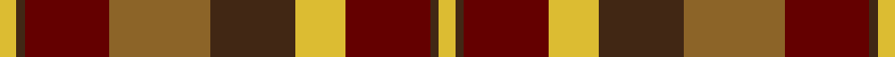

This page is one **sett** — a single exact thread-count. It belongs to the [tartan](/setts/ly2do1o10oi12do10ly6o10do1ly2/)
(the same proportion at any scale), whose colour order is pattern [YBRRBYRBY](/stripes/ybrrbyrby/).

Sourced from register-of-tartans.  It is a [9 stripe tartan](/stripes/stripes9/).

Original link https://www.tartanregister.gov.uk/tartanDetails.aspx?ref=1724

## Register references

External register numbers recorded for this tartan.

- Scottish Register of Tartans: [1724](https://www.tartanregister.gov.uk/tartanDetails.aspx?ref=1724)
- Scottish Tartans Authority (ITI): 5195

## Thread count
LY/8 DO4 O40 Oi48 DO40 LY24 O40 DO4 LY/8

One full sett is **416 threads**.

## Palette
<table><thead><tr><th>Colour</th><th>Shade</th><th>OKLCh</th></tr></thead><tbody><tr><td>O</td><td><code style="background-color:#640000;">#640000</code> <small style="color:#888">#640000</small></td><td><small style="color:#888">oklch(31.6% 0.130 29.2)</small></td></tr><tr><td>DO</td><td><code style="background-color:#412714;">#412714</code> <small style="color:#888">#412714</small></td><td><small style="color:#888">oklch(30.1% 0.050 55.7)</small></td></tr><tr><td>O</td><td><code style="background-color:#8C6428;">#8C6428</code> <small style="color:#888">#8C6428</small></td><td><small style="color:#888">oklch(53.3% 0.092 74.3)</small></td></tr><tr><td>LY</td><td><code style="background-color:#DCBC32;">#DCBC32</code> <small style="color:#888">#DCBC32</small></td><td><small style="color:#888">oklch(80.0% 0.150 95.2)</small></td></tr></tbody></table>

# Sample pattern

## Nearest tartan variants

The nearest existing variants by ΔTartan distance, with this cloth at the top so the swatches line up against it.

ΔTartan

Threads

Variant

Sett

—

416

<a href="/variants/s9/ly2do1o10oi12do10ly6o10do1ly2~x4~o1305035-oi2104072/">Highland Village</a>

<a href="/ttd/edit/#slug=ly3do2r14ly8do14dg16r13do2ly3~x2&amp;base=ly2do1o10oi12do10ly6o10do1ly2~x4~o1305035-oi2104072" title="compare in the TTD">1.40</a>

288

<a href="/variants/s9/ly3do2r14ly8do14dg16r13do2ly3~x2/">Monaghan, County</a>

<a href="/ttd/edit/#slug=dp9r4dp1r4g15ri4dp1~x2~r2208029-ri2209032&amp;base=ly2do1o10oi12do10ly6o10do1ly2~x4~o1305035-oi2104072" title="compare in the TTD">2.64</a>

132

<a href="/variants/s7/dp9r4dp1r4g15ri4dp1~x2~r2208029-ri2209032/">Logan Light</a>

<a href="/ttd/edit/#slug=dy16r16lr3dg16o2r1o2dy6r2~x4&amp;base=ly2do1o10oi12do10ly6o10do1ly2~x4~o1305035-oi2104072" title="compare in the TTD">2.85</a>

440

<a href="/variants/s9/dy16r16lr3dg16o2r1o2dy6r2~x4/">Henry, W. A.</a>

<a href="/ttd/edit/#slug=dy24g2dy5r14g2r5lo17dy2~x2&amp;base=ly2do1o10oi12do10ly6o10do1ly2~x4~o1305035-oi2104072" title="compare in the TTD">2.93</a>

232

<a href="/variants/s8/dy24g2dy5r14g2r5lo17dy2~x2/">Loch Rannoch #2</a>

<a href="/ttd/edit/#slug=o18dt2o2dt2o2dt14dr14ly3~x2&amp;base=ly2do1o10oi12do10ly6o10do1ly2~x4~o1305035-oi2104072" title="compare in the TTD">2.95</a>

186

<a href="/variants/s8/o18dt2o2dt2o2dt14dr14ly3~x2/">Talladale</a>

<a href="/ttd/edit/#slug=dp1r5g15r3dp9r10w1~x4&amp;base=ly2do1o10oi12do10ly6o10do1ly2~x4~o1305035-oi2104072" title="compare in the TTD">2.96</a>

344

<a href="/variants/s7/dp1r5g15r3dp9r10w1~x4/">Geddes</a>

<a href="/ttd/edit/#slug=dp8r3y1r3g14r3y1~x4&amp;base=ly2do1o10oi12do10ly6o10do1ly2~x4~o1305035-oi2104072" title="compare in the TTD">3.15</a>

228

<a href="/variants/s7/dp8r3y1r3g14r3y1~x4/">Logan with Yellow</a>

<a href="/ttd/edit/#slug=r2dp3ri2r15dp2g20dp20r15dp3ri2r2~x2~r2109032-ri2406019&amp;base=ly2do1o10oi12do10ly6o10do1ly2~x4~o1305035-oi2104072" title="compare in the TTD">3.22</a>

336

<a href="/variants/s11/r2dp3ri2r15dp2g20dp20r15dp3ri2r2~x2~r2109032-ri2406019/">Drumlithie</a>

<a href="/ttd/edit/#slug=r20dy2r2dy2r2dy15g13dy2w2dy2g13dy15r14dy2r2~x2&amp;base=ly2do1o10oi12do10ly6o10do1ly2~x4~o1305035-oi2104072" title="compare in the TTD">3.22</a>

388

<a href="/variants/s15/r20dy2r2dy2r2dy15g13dy2w2dy2g13dy15r14dy2r2~x2/">Mauthe Unidentified (Name?)</a>

<a href="/ttd/edit/#slug=r2dp3ri2r15dp3g19dp20r15dp3ri2r2~x2~r2109032-ri2406019&amp;base=ly2do1o10oi12do10ly6o10do1ly2~x4~o1305035-oi2104072" title="compare in the TTD">3.24</a>

336

<a href="/variants/s11/r2dp3ri2r15dp3g19dp20r15dp3ri2r2~x2~r2109032-ri2406019/">Drumlithie Rock and Wheel Tartan</a>

## Neighbour map

Every grey dot is one of 13620 variants placed by the first two principal components of the ΔTartan feature space (42% of its variance). Red is this tartan; blue dots are its nearest — click one to open its page.

<svg viewBox="0 0 640 380" role="img" style="max-width:100%;height:auto;border:1px solid #e0e0e0;border-radius:4px;display:block" xmlns="http://www.w3.org/2000/svg"><image href="/nn/cloud.v1.png" width="640" height="380"/><a href="/variants/s9/ly3do2r14ly8do14dg16r13do2ly3~x2/"><circle cx="166.9" cy="203.7" r="4" fill="#3465a4"><title>Monaghan, County</title></circle></a><a href="/variants/s7/dp9r4dp1r4g15ri4dp1~x2~r2208029-ri2209032/"><circle cx="243.3" cy="196.2" r="4" fill="#3465a4"><title>Logan Light</title></circle></a><a href="/variants/s9/dy16r16lr3dg16o2r1o2dy6r2~x4/"><circle cx="226.7" cy="171.7" r="4" fill="#3465a4"><title>Henry, W. A.</title></circle></a><a href="/variants/s8/dy24g2dy5r14g2r5lo17dy2~x2/"><circle cx="243.9" cy="186.4" r="4" fill="#3465a4"><title>Loch Rannoch #2</title></circle></a><a href="/variants/s8/o18dt2o2dt2o2dt14dr14ly3~x2/"><circle cx="267.5" cy="218.7" r="4" fill="#3465a4"><title>Talladale</title></circle></a><a href="/variants/s7/dp1r5g15r3dp9r10w1~x4/"><circle cx="247.2" cy="196.5" r="4" fill="#3465a4"><title>Geddes</title></circle></a><a href="/variants/s7/dp8r3y1r3g14r3y1~x4/"><circle cx="261.0" cy="192.9" r="4" fill="#3465a4"><title>Logan with Yellow</title></circle></a><a href="/variants/s11/r2dp3ri2r15dp2g20dp20r15dp3ri2r2~x2~r2109032-ri2406019/"><circle cx="243.9" cy="180.7" r="4" fill="#3465a4"><title>Drumlithie</title></circle></a><a href="/variants/s15/r20dy2r2dy2r2dy15g13dy2w2dy2g13dy15r14dy2r2~x2/"><circle cx="220.1" cy="173.9" r="4" fill="#3465a4"><title>Mauthe Unidentified (Name?)</title></circle></a><a href="/variants/s11/r2dp3ri2r15dp3g19dp20r15dp3ri2r2~x2~r2109032-ri2406019/"><circle cx="244.0" cy="182.7" r="4" fill="#3465a4"><title>Drumlithie Rock and Wheel Tartan</title></circle></a><circle cx="211.5" cy="207.4" r="5" fill="#c00000"/><text x="320" y="376" text-anchor="middle" font-size="11" fill="#999">ground</text><text x="11" y="190" text-anchor="middle" font-size="11" fill="#999" transform="rotate(-90 11 190)">complexity</text></svg>

ID: /variants/s9/ly2do1o10oi12do10ly6o10do1ly2~x4~o1305035-oi2104072/
