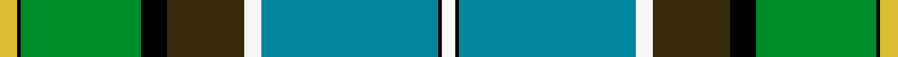

This is one **variant** — a specific cloth: this exact thread count and colourway, with its own
provenance below. It is one weaving of the [sett](/tartans/s/st/state-seal-of-pennsylvania/) (the scale-free proportion — the
same cloth at any scale or shade), whose colour order is pattern [WKBWGKGKY](/stripes/wkbwgkgky/).

Part of the [State Seal of Pennsylvania](/tartans/s/st/state-seal-of-pennsylvania/) tartan — the named design grouping this sett with its other cloths.

Sourced from tartans-authority.  It is a [9 stripe tartan](/stripes/stripes9/).

Original link <code>http://www.tartansauthority.com/tartan-ferret/display/8652/</code> — retired · [Internet Archive copy](https://web.archive.org/web/*/http://www.tartansauthority.com/tartan-ferret/display/8652/*)

Dataset <small>— provenance for this record, inherited from the source manifest</small>

<dl class="dataset-prov">
<dt>source</dt><dd><a href="/sources/tartans-authority/">Scottish Tartans Authority</a></dd>
<dt>data captured from</dt><dd><a href="https://github.com/thetartan/tartan-database/blob/master/data/tartans-authority/data.csv">https://github.com/thetartan/tartan-database/blob/master/data/tartans-authority/data.csv</a></dd>
<dt>data date</dt><dd>April 2013 <small>(this record)</small></dd>
<dt>licence</dt><dd><a href="https://creativecommons.org/licenses/by-nc-nd/4.0/">CC BY-NC-ND 4.0</a></dd>
</dl>

Capture chain <small>— the hands this data passed through, oldest first; each capture carries its own licence</small>

<ol class="capture-chain">
<li><a href="https://www.tartansauthority.com/">Scottish Tartans Authority</a> <small>the heritage body’s archive — its tartan-ferret record browser is retired; dead record links are shown unlinked, with an Internet Archive copy (ITI numbers are not SRT references)</small></li>
<li><a href="https://github.com/thetartan/tartan-database">thetartan/tartan-database</a> <small>2016-2017</small> · <a href="https://creativecommons.org/licenses/by-nc-nd/4.0/">CC BY-NC-ND 4.0</a> <small>Levko Kravets's frozen compilation — the capture we vendored, and where its CC licence text came from</small></li>
<li>this dictionary <small>captured 2026-06-10 · commit 5bf86c7566</small> <small>each re-capture is a git commit to data/sources</small></li>
</ol>

## Register references

External register numbers recorded for this tartan.

- Scottish Register of Tartans: [8652](https://www.tartanregister.gov.uk/tartanDetails?ref=8652)
- Scottish Tartans Authority (ITI): 8652

## Thread count
LY/8 K2 G56 K12 DY36 W8 T82 K2 W/6

One full sett is **410 threads**.

## Palette
<table><thead><tr><th>Colour</th><th>Shade</th><th>OKLCh</th></tr></thead><tbody><tr><td>T</td><td><code style="background-color:#00879F;">#00879F</code> <small style="color:#888">#00879F</small></td><td><small style="color:#888">oklch(57.4% 0.102 216.1)</small></td></tr><tr><td>LY</td><td><code style="background-color:#DCBC32;">#DCBC32</code> <small style="color:#888">#DCBC32</small></td><td><small style="color:#888">oklch(80.0% 0.150 95.2)</small></td></tr><tr><td>G</td><td><code style="background-color:#008B2A;">#008B2A</code> <small style="color:#888">#008B2A</small></td><td><small style="color:#888">oklch(55.4% 0.170 145.9)</small></td></tr><tr><td>K</td><td><code style="background-color:#000000;">#000000</code> <small style="color:#888">#000000</small></td><td><small style="color:#888">oklch(0.0% 0.000 0.0)</small></td></tr><tr><td>W</td><td><code style="background-color:#F7F7F7;">#F7F7F7</code> <small style="color:#888">#F7F7F7</small></td><td><small style="color:#888">oklch(97.6% 0.000 89.9)</small></td></tr><tr><td>DY</td><td><code style="background-color:#3A2B0D;">#3A2B0D</code> <small style="color:#888">#3A2B0D</small></td><td><small style="color:#888">oklch(30.0% 0.049 82.0)</small></td></tr></tbody></table>

# Sample pattern

## Nearest tartan variants

The nearest existing variants by ΔTartan distance, with this cloth at the top so the swatches line up against it.

ΔTartan

Threads

Variant

Sett

—

410

<a href="/variants/s9/ly4k1g28k6dy18w4t41k1w3~x2/">State Seal of Pennsylvania (Fashion)</a>

<a href="/ttd/edit/#slug=k1g30dy2y4dy2w12r2t6k1~x2~g2203152&amp;base=ly4k1g28k6dy18w4t41k1w3~x2" title="compare in the TTD">2.44</a>

236

<a href="/variants/s9/k1g30dy2y4dy2w12r2t6k1~x2~g2203152/">Nor'Westers</a>

<a href="/ttd/edit/#slug=k1g30dy2y4dy2w12r2t6k1~x2&amp;base=ly4k1g28k6dy18w4t41k1w3~x2" title="compare in the TTD">2.46</a>

236

<a href="/variants/s9/k1g30dy2y4dy2w12r2t6k1~x2/">Nor'Westers (District)</a>

<a href="/ttd/edit/#slug=dr4w6k10db5k3y16k3g33k1w4~x2&amp;base=ly4k1g28k6dy18w4t41k1w3~x2" title="compare in the TTD">2.51</a>

324

<a href="/variants/s10/dr4w6k10db5k3y16k3g33k1w4~x2/">Fermanagh County, Crest Range</a>

<a href="/ttd/edit/#slug=w4k1r2k1g9k2t24k2r6k2g12y2~x2&amp;base=ly4k1g28k6dy18w4t41k1w3~x2" title="compare in the TTD">2.51</a>

256

<a href="/variants/s12/w4k1r2k1g9k2t24k2r6k2g12y2~x2/">Tait #2</a>

<a href="/ttd/edit/#slug=dr4w6k10db5k3ly16k3g33k1w4~x2&amp;base=ly4k1g28k6dy18w4t41k1w3~x2" title="compare in the TTD">2.56</a>

324

<a href="/variants/s10/dr4w6k10db5k3ly16k3g33k1w4~x2/">Fermanagh County Crest (Fashion)</a>

<a href="/ttd/edit/#slug=w4k1db16k1g32dr6k6lo6g4lo2g1~x2&amp;base=ly4k1g28k6dy18w4t41k1w3~x2" title="compare in the TTD">2.66</a>

306

<a href="/variants/s11/w4k1db16k1g32dr6k6lo6g4lo2g1~x2/">Zambia</a>

<a href="/ttd/edit/#slug=w3t38lb2k4dp4k4g30y1g1y2~x2&amp;base=ly4k1g28k6dy18w4t41k1w3~x2" title="compare in the TTD">2.68</a>

346

<a href="/variants/s10/w3t38lb2k4dp4k4g30y1g1y2~x2/">Pinewoods Jubilee</a>

<a href="/ttd/edit/#slug=y4k1g10r2g10r4g10r2g10k16t28k1lb4~x2~t2503227-lb3103284&amp;base=ly4k1g28k6dy18w4t41k1w3~x2" title="compare in the TTD">2.73</a>

392

<a href="/variants/s13/y4k1g10r2g10r4g10r2g10k16t28k1lb4~x2~t2503227-lb3103284/">California State</a>

<a href="/ttd/edit/#slug=y1k6g32k12r12b9k6w1~x2&amp;base=ly4k1g28k6dy18w4t41k1w3~x2" title="compare in the TTD">2.74</a>

312

<a href="/variants/s8/y1k6g32k12r12b9k6w1~x2/">McGeachie (Personal)</a>

<a href="/ttd/edit/#slug=y1k6g32k12dr12dp9db6w1~x2&amp;base=ly4k1g28k6dy18w4t41k1w3~x2" title="compare in the TTD">2.78</a>

312

<a href="/variants/s8/y1k6g32k12dr12dp9db6w1~x2/">Fujitsu</a>

## Neighbour map

Every grey dot is one of 13657 variants placed by the first two principal components of the ΔTartan feature space (42% of its variance). Red is this tartan; blue dots are its nearest — click one to open its page. The map is a flat projection of a many-dimensional space — [how to read it](/posts/neighbourhood-maps/).

<svg viewBox="0 0 640 380" role="img" style="max-width:100%;height:auto;border:1px solid #e0e0e0;border-radius:4px;display:block" xmlns="http://www.w3.org/2000/svg"><image href="/nn/cloud.v1.png" width="640" height="380"/><a href="/variants/s9/k1g30dy2y4dy2w12r2t6k1~x2~g2203152/"><circle cx="218.0" cy="70.0" r="4" fill="#3465a4"><title>Nor'Westers</title></circle></a><a href="/variants/s9/k1g30dy2y4dy2w12r2t6k1~x2/"><circle cx="208.1" cy="70.0" r="4" fill="#3465a4"><title>Nor'Westers (District)</title></circle></a><a href="/variants/s10/dr4w6k10db5k3y16k3g33k1w4~x2/"><circle cx="141.0" cy="86.6" r="4" fill="#3465a4"><title>Fermanagh County, Crest Range</title></circle></a><a href="/variants/s12/w4k1r2k1g9k2t24k2r6k2g12y2~x2/"><circle cx="145.0" cy="92.3" r="4" fill="#3465a4"><title>Tait #2</title></circle></a><a href="/variants/s10/dr4w6k10db5k3ly16k3g33k1w4~x2/"><circle cx="133.4" cy="84.8" r="4" fill="#3465a4"><title>Fermanagh County Crest (Fashion)</title></circle></a><a href="/variants/s11/w4k1db16k1g32dr6k6lo6g4lo2g1~x2/"><circle cx="193.8" cy="76.3" r="4" fill="#3465a4"><title>Zambia</title></circle></a><a href="/variants/s10/w3t38lb2k4dp4k4g30y1g1y2~x2/"><circle cx="223.1" cy="66.3" r="4" fill="#3465a4"><title>Pinewoods Jubilee</title></circle></a><a href="/variants/s13/y4k1g10r2g10r4g10r2g10k16t28k1lb4~x2~t2503227-lb3103284/"><circle cx="149.5" cy="99.2" r="4" fill="#3465a4"><title>California State</title></circle></a><a href="/variants/s8/y1k6g32k12r12b9k6w1~x2/"><circle cx="159.1" cy="101.4" r="4" fill="#3465a4"><title>McGeachie (Personal)</title></circle></a><a href="/variants/s8/y1k6g32k12dr12dp9db6w1~x2/"><circle cx="147.7" cy="94.7" r="4" fill="#3465a4"><title>Fujitsu</title></circle></a><circle cx="186.1" cy="91.3" r="5" fill="#c00000"/><text x="320" y="376" text-anchor="middle" font-size="11" fill="#999">ground</text><text x="11" y="190" text-anchor="middle" font-size="11" fill="#999" transform="rotate(-90 11 190)">complexity</text></svg>

ID: /variants/s9/ly4k1g28k6dy18w4t41k1w3~x2/
