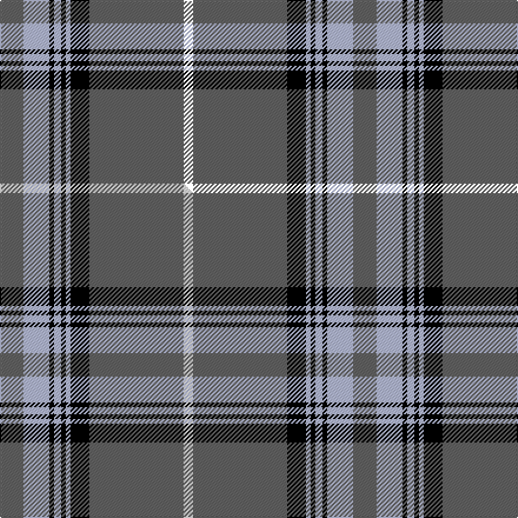

This is one **variant** — a specific cloth: this exact thread count and colourway, with its own
provenance below. It is one weaving of the [sett](/tartans/d/do/doune/) (the scale-free proportion — the
same cloth at any scale or shade), whose colour order is pattern [BWKWKWKBK](/stripes/bwkwkwkbk/).

Part of the [Doune](/tartans/d/do/doune/) tartan — the named design grouping this sett with its other cloths.

Sourced from house-of-tartan.  It is a [9 stripe tartan](/stripes/stripes9/).

Original link [http://www.house-of-tartan.scotland.net/house/TartanViewjs.asp?colr=Def&tnam=4707](http://www.house-of-tartan.scotland.net/house/TartanViewjs.asp?colr=Def&tnam=4707)

## Provenance

Earliest known date: 01/01/2002 A colour variation of Stewart Bute.

Dataset <small>— provenance for this record, inherited from the source manifest</small>

<dl class="dataset-prov">
<dt>source</dt><dd><a href="/sources/house-of-tartan/">House of Tartan</a></dd>
<dt>data captured from</dt><dd><a href="https://github.com/thetartan/tartan-database/blob/master/data/house-of-tartan/data.csv">https://github.com/thetartan/tartan-database/blob/master/data/house-of-tartan/data.csv</a></dd>
<dt>data date</dt><dd>01/01/2002 <small>(this record)</small></dd>
<dt>licence</dt><dd><a href="https://creativecommons.org/licenses/by-nc-nd/4.0/">CC BY-NC-ND 4.0</a></dd>
</dl>

Capture chain <small>— the hands this data passed through, oldest first; each capture carries its own licence</small>

<ol class="capture-chain">
<li><a href="http://www.house-of-tartan.scotland.net/">House of Tartan</a> <small>the weaver/retailer's database — the site is now offline; the URL is kept as the ultimate source's identity</small></li>
<li><a href="https://github.com/thetartan/tartan-database">thetartan/tartan-database</a> <small>2016-2017</small> · <a href="https://creativecommons.org/licenses/by-nc-nd/4.0/">CC BY-NC-ND 4.0</a> <small>Levko Kravets's frozen compilation — the capture we vendored, and where its CC licence text came from</small></li>
<li>this dictionary <small>captured 2026-06-10 · commit 5bf86c7566</small> <small>each re-capture is a git commit to data/sources</small></li>
</ol>

## Thread count
N/20 LB22 K4 LB6 K4 LB4 K16 N80 K/8

One full sett is **300 threads**.

## Palette
<table><thead><tr><th>Colour</th><th>Shade</th><th>OKLCh</th></tr></thead><tbody><tr><td>LB</td><td><code style="background-color:#B5BBDE;">#B5BBDE</code> <small style="color:#888">#B5BBDE</small></td><td><small style="color:#888">oklch(79.9% 0.050 277.6)</small></td></tr><tr><td>K</td><td><code style="background-color:#000000;">#000000</code> <small style="color:#888">#000000</small></td><td><small style="color:#888">oklch(0.0% 0.000 0.0)</small></td></tr><tr><td>O</td><td><code style="background-color:#A65C11;">#A65C11</code> <small style="color:#888">#A65C11</small></td><td><small style="color:#888">oklch(55.0% 0.125 58.3)</small></td></tr><tr><td>N</td><td><code style="background-color:#636363;">#636363</code> <small style="color:#888">#636363</small></td><td><small style="color:#888">oklch(50.0% 0.000 89.9)</small></td></tr></tbody></table>

# Sample pattern

## Compared to the master

This cloth is one sett of its design; the master sett (the exemplar the design is anchored on) is below for comparison.

Its **ΔTartan distance** from the master is **2.02** — the same measure the nearest-tartans table ranks by (0 is identical; a re-scale of the same cloth is near 0, a recolour or a different proportion further).

<figure class="master-compare" style="margin:0">

this sett
master sett ★

<figcaption style="color:#888;font-size:smaller">One weave of this sett against the <a href="/setts/n10lb11k2lb3k2lb2k8n40w4/">master sett ★</a>, split on the diagonal: a shared proportion runs seamlessly across it with only the shades shifting; a different proportion breaks on it.</figcaption>
</figure>

## Nearest tartan variants

The nearest existing variants by ΔTartan distance, with this cloth at the top so the swatches line up against it.

ΔTartan

Threads

Variant

Sett

—

300

<a href="/variants/s9/n10lb11k2lb3k2lb2k8n40k4~x2/">Doune District Tartan</a>

<a href="/ttd/edit/#slug=ly16k2ly2k2ly2db32r3db32ly16k2ly2~x2&amp;base=n10lb11k2lb3k2lb2k8n40k4~x2" title="compare in the TTD">2.00</a>

408

<a href="/variants/s11/ly16k2ly2k2ly2db32r3db32ly16k2ly2~x2/">MacLachlan, Gold Dress (Fashion)</a>

<a href="/ttd/edit/#slug=n10lb11k2lb3k2lb2k8n40w4~x2&amp;base=n10lb11k2lb3k2lb2k8n40k4~x2" title="compare in the TTD">2.02</a>

300

<a href="/variants/s9/n10lb11k2lb3k2lb2k8n40w4~x2/">Doune (District)</a>

<a href="/ttd/edit/#slug=lb30r2lb2k5lb3dy2lb3dy22lb3k2lb3~x2&amp;base=n10lb11k2lb3k2lb2k8n40k4~x2" title="compare in the TTD">2.52</a>

242

<a href="/variants/s11/lb30r2lb2k5lb3dy2lb3dy22lb3k2lb3~x2/">Dunbarton Weft</a>

<a href="/ttd/edit/#slug=db32k2db4k2db8ly29w2k2&amp;base=n10lb11k2lb3k2lb2k8n40k4~x2" title="compare in the TTD">2.54</a>

128

<a href="/variants/s8/db32k2db4k2db8ly29w2k2/">Southern Lakes</a>

<a href="/ttd/edit/#slug=dr6k3n4k10n5lb2k2n31w1n2w2~x2&amp;base=n10lb11k2lb3k2lb2k8n40k4~x2" title="compare in the TTD">2.71</a>

256

<a href="/variants/s11/dr6k3n4k10n5lb2k2n31w1n2w2~x2/">William Glen and Son</a>

<a href="/ttd/edit/#slug=r3g2k9lg2k2lg24y2lg2y1~x4~g6019141-lg7203228&amp;base=n10lb11k2lb3k2lb2k8n40k4~x2" title="compare in the TTD">2.72</a>

360

<a href="/variants/s9/r3g2k9lg2k2lg24y2lg2y1~x4~g6019141-lg7203228/">Bell of the Borders</a>

<a href="/ttd/edit/#slug=db3n10db3k3w10r4n28k2~x2~db2616276-n5004237&amp;base=n10lb11k2lb3k2lb2k8n40k4~x2" title="compare in the TTD">2.80</a>

242

<a href="/variants/s8/db3n10db3k3w10r4n28k2~x2~db2616276-n5004237/">Moorpark Primary School (Corporate)</a>

<a href="/ttd/edit/#slug=lb3k3lb3k3n15dr1~x4&amp;base=n10lb11k2lb3k2lb2k8n40k4~x2" title="compare in the TTD">2.93</a>

208

<a href="/variants/s6/lb3k3lb3k3n15dr1~x4/">Tiree Grey</a>

<a href="/ttd/edit/#slug=lb26k7g1k1lb1k1g5dp3k1dp2lb1~x4&amp;base=n10lb11k2lb3k2lb2k8n40k4~x2" title="compare in the TTD">2.98</a>

284

<a href="/variants/s11/lb26k7g1k1lb1k1g5dp3k1dp2lb1~x4/">Grotto Dove</a>

<a href="/ttd/edit/#slug=r3dg2k9lb2k2lb24y2lb2y1~x2&amp;base=n10lb11k2lb3k2lb2k8n40k4~x2" title="compare in the TTD">3.02</a>

180

<a href="/variants/s9/r3dg2k9lb2k2lb24y2lb2y1~x2/">Bell Family Tartan</a>

## Neighbour map

Every grey dot is one of 13662 variants placed by the first two principal components of the ΔTartan feature space (42% of its variance). Red is this tartan; blue dots are its nearest — click one to open its page. The map is a flat projection of a many-dimensional space — [how to read it](/posts/neighbourhood-maps/).

<svg viewBox="0 0 640 380" role="img" style="max-width:100%;height:auto;border:1px solid #e0e0e0;border-radius:4px;display:block" xmlns="http://www.w3.org/2000/svg"><image href="/nn/cloud.v1.png" width="640" height="380"/><a href="/variants/s11/ly16k2ly2k2ly2db32r3db32ly16k2ly2~x2/"><circle cx="291.5" cy="127.6" r="4" fill="#3465a4"><title>MacLachlan, Gold Dress (Fashion)</title></circle></a><a href="/variants/s9/n10lb11k2lb3k2lb2k8n40w4~x2/"><circle cx="324.7" cy="123.4" r="4" fill="#3465a4"><title>Doune (District)</title></circle></a><a href="/variants/s11/lb30r2lb2k5lb3dy2lb3dy22lb3k2lb3~x2/"><circle cx="294.5" cy="122.7" r="4" fill="#3465a4"><title>Dunbarton Weft</title></circle></a><a href="/variants/s8/db32k2db4k2db8ly29w2k2/"><circle cx="274.8" cy="135.7" r="4" fill="#3465a4"><title>Southern Lakes</title></circle></a><a href="/variants/s11/dr6k3n4k10n5lb2k2n31w1n2w2~x2/"><circle cx="325.2" cy="79.0" r="4" fill="#3465a4"><title>William Glen and Son</title></circle></a><a href="/variants/s9/r3g2k9lg2k2lg24y2lg2y1~x4~g6019141-lg7203228/"><circle cx="285.6" cy="90.6" r="4" fill="#3465a4"><title>Bell of the Borders</title></circle></a><a href="/variants/s8/db3n10db3k3w10r4n28k2~x2~db2616276-n5004237/"><circle cx="275.7" cy="139.8" r="4" fill="#3465a4"><title>Moorpark Primary School (Corporate)</title></circle></a><a href="/variants/s6/lb3k3lb3k3n15dr1~x4/"><circle cx="267.2" cy="164.5" r="4" fill="#3465a4"><title>Tiree Grey</title></circle></a><a href="/variants/s11/lb26k7g1k1lb1k1g5dp3k1dp2lb1~x4/"><circle cx="288.4" cy="80.6" r="4" fill="#3465a4"><title>Grotto Dove</title></circle></a><a href="/variants/s9/r3dg2k9lb2k2lb24y2lb2y1~x2/"><circle cx="281.5" cy="87.3" r="4" fill="#3465a4"><title>Bell Family Tartan</title></circle></a><circle cx="322.3" cy="121.2" r="5" fill="#c00000"/><text x="320" y="376" text-anchor="middle" font-size="11" fill="#999">ground</text><text x="11" y="190" text-anchor="middle" font-size="11" fill="#999" transform="rotate(-90 11 190)">complexity</text></svg>

ID: /variants/s9/n10lb11k2lb3k2lb2k8n40k4~x2/
