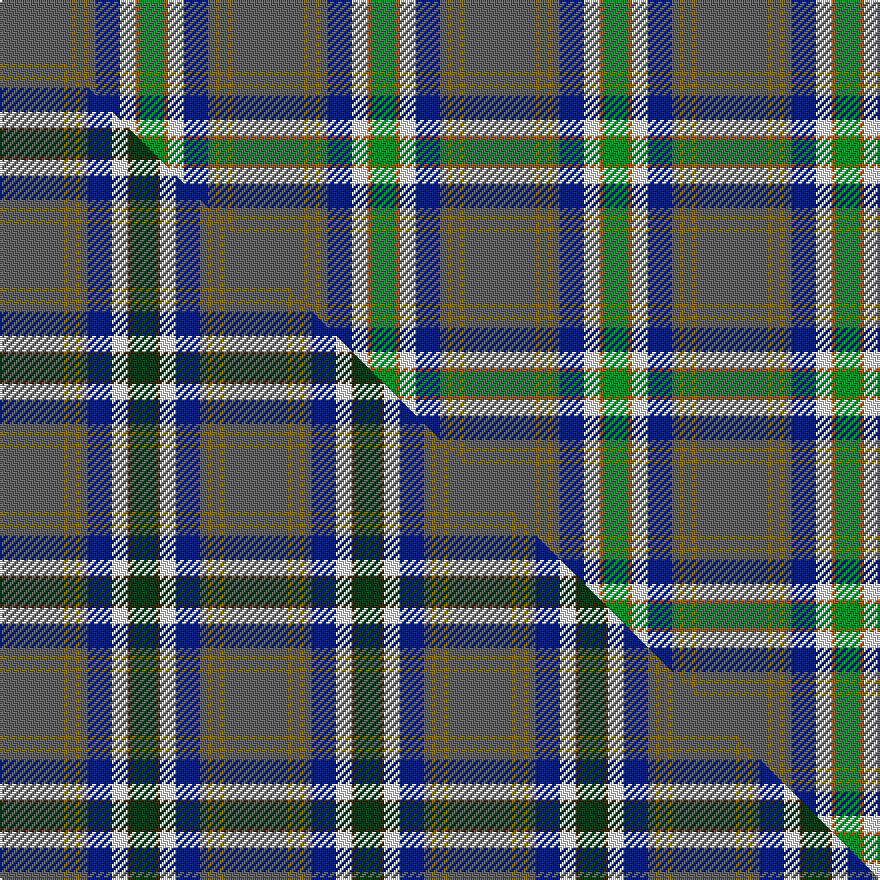

This is one **variant** — a specific cloth: this exact thread count and colourway, with its own
provenance below. It is one weaving of the [sett](/setts/n18y1n2y1n2db6w4o1g6/) (the scale-free proportion — the
same cloth at any scale or shade), whose colour order is pattern [BGBGBBWRG](/stripes/bgbgbbwrg/).

Part of the [Nickel Lodge Centennial](/tartans/nickel-lodge-centennial/) tartan — the named design grouping this sett with its other cloths.

Sourced from weddslist.  It is a [9 stripe tartan](/stripes/stripes9/).

Original link [http://www.weddslist.com/cgi-bin/tartans/pg.pl?source=sts](http://www.weddslist.com/cgi-bin/tartans/pg.pl?source=sts)

Dataset <small>— provenance for this record, inherited from the source manifest</small>

<dl class="dataset-prov">
<dt>source</dt><dd><a href="/sources/weddslist/">Weddslist</a></dd>
<dt>data captured from</dt><dd><a href="https://github.com/thetartan/tartan-database/blob/master/data/weddslist/data.csv">https://github.com/thetartan/tartan-database/blob/master/data/weddslist/data.csv</a></dd>
<dt>data date</dt><dd>2016-11-17 <small>(dataset default)</small></dd>
<dt>licence</dt><dd><a href="https://creativecommons.org/licenses/by-nc-nd/4.0/">CC BY-NC-ND 4.0</a></dd>
</dl>

Capture chain <small>— the hands this data passed through, oldest first; each capture carries its own licence</small>

<ol class="capture-chain">
<li><a href="https://www.weddslist.com/tartans/">Weddslist</a> <small>the living privately compiled reference</small></li>
<li><a href="https://github.com/thetartan/tartan-database">thetartan/tartan-database</a> <small>2016-2017</small> · <a href="https://creativecommons.org/licenses/by-nc-nd/4.0/">CC BY-NC-ND 4.0</a> <small>Levko Kravets's frozen compilation — the capture we vendored, and where its CC licence text came from</small></li>
<li>this dictionary <small>captured 2026-06-10 · commit 5bf86c7566</small> <small>each re-capture is a git commit to data/sources</small></li>
</ol>

## Thread count
N/36 Y2 N4 Y2 N4 DB12 W8 O2 G/12

One full sett is **116 threads**.

## Palette
<table><thead><tr><th>Colour</th><th>Shade</th><th>OKLCh</th></tr></thead><tbody><tr><td>DB</td><td><code style="background-color:#082077;">#082077</code> <small style="color:#888">#082077</small></td><td><small style="color:#888">oklch(30.0% 0.149 265.1)</small></td></tr><tr><td>G</td><td><code style="background-color:#008B2A;">#008B2A</code> <small style="color:#888">#008B2A</small></td><td><small style="color:#888">oklch(55.4% 0.170 145.9)</small></td></tr><tr><td>W</td><td><code style="background-color:#F7F7F7;">#F7F7F7</code> <small style="color:#888">#F7F7F7</small></td><td><small style="color:#888">oklch(97.6% 0.000 89.9)</small></td></tr><tr><td>O</td><td><code style="background-color:#A65C11;">#A65C11</code> <small style="color:#888">#A65C11</small></td><td><small style="color:#888">oklch(55.0% 0.125 58.3)</small></td></tr><tr><td>N</td><td><code style="background-color:#636363;">#636363</code> <small style="color:#888">#636363</small></td><td><small style="color:#888">oklch(50.0% 0.000 89.9)</small></td></tr><tr><td>Y</td><td><code style="background-color:#8B6E00;">#8B6E00</code> <small style="color:#888">#8B6E00</small></td><td><small style="color:#888">oklch(55.1% 0.113 90.4)</small></td></tr></tbody></table>

# Sample pattern

## Compared to the master

This cloth is one sett of its design; the master sett (the exemplar the design is anchored on) is below for comparison.

Its **ΔTartan distance** from the master is **1.00** — the same measure the nearest-tartans table ranks by (0 is identical; a re-scale of the same cloth is near 0, a recolour or a different proportion further).

<figure class="master-compare" style="margin:0">

this sett
master sett ★

<figcaption style="color:#888;font-size:smaller">One weave of this sett against the <a href="/setts/n16y1n2y1n2db6w4dy1dg6/">master sett ★</a>, split on the diagonal: a shared proportion runs seamlessly across it with only the shades shifting; a different proportion breaks on it.</figcaption>
</figure>

## Nearest tartan variants

The nearest existing variants by ΔTartan distance, with this cloth at the top so the swatches line up against it.

ΔTartan

Threads

Variant

Sett

—

116

<a href="/variants/s9/n18y1n2y1n2db6w4o1g6~x2/">Nickel Lodge, Centennial</a>

<a href="/ttd/edit/#slug=n18y1n2y1n2db6w4dy1g6~x2&amp;base=n18y1n2y1n2db6w4o1g6~x2" title="compare in the TTD">0.90</a>

116

<a href="/variants/s9/n18y1n2y1n2db6w4dy1g6~x2/">Nickel Lodge Centennial Corporate Tartan</a>

<a href="/ttd/edit/#slug=n16y1n2y1n2db6w4dy1dg6~x2&amp;base=n18y1n2y1n2db6w4o1g6~x2" title="compare in the TTD">1.00</a>

112

<a href="/variants/s9/n16y1n2y1n2db6w4dy1dg6~x2/">Nickel Lodge Centennial</a>

<a href="/ttd/edit/#slug=n36y2n1y2n4db12w8dy2g12~x2&amp;base=n18y1n2y1n2db6w4o1g6~x2" title="compare in the TTD">1.41</a>

220

<a href="/variants/s9/n36y2n1y2n4db12w8dy2g12~x2/">Nickel Lodge Centennial (Corporate)</a>

<a href="/ttd/edit/#slug=db5r3g2r3dg12t34g2w2~x2&amp;base=n18y1n2y1n2db6w4o1g6~x2" title="compare in the TTD">1.96</a>

238

<a href="/variants/s8/db5r3g2r3dg12t34g2w2~x2/">Moran (Wedding) (Personal)</a>

<a href="/ttd/edit/#slug=dy6y3t42w4dg18y2t12r3~x2&amp;base=n18y1n2y1n2db6w4o1g6~x2" title="compare in the TTD">2.60</a>

342

<a href="/variants/s8/dy6y3t42w4dg18y2t12r3~x2/">Glasgow High (School)</a>

<a href="/ttd/edit/#slug=db40r4db10dg10g22ly3g4lyi3g4~x2~dg1806142-g1903114-ly2705081-lyi3407090&amp;base=n18y1n2y1n2db6w4o1g6~x2" title="compare in the TTD">2.65</a>

312

<a href="/variants/s9/db40r4db10dg10g22ly3g4lyi3g4~x2~dg1806142-g1903114-ly2705081-lyi3407090/">Keith Stanhope Society (Commem.)</a>

<a href="/ttd/edit/#slug=t33w2r3w2db14ri3g15t20r2t3~x2~r2109032-ri2806019&amp;base=n18y1n2y1n2db6w4o1g6~x2" title="compare in the TTD">2.68</a>

316

<a href="/variants/s10/t33w2r3w2db14ri3g15t20r2t3~x2~r2109032-ri2806019/">Kansai St Andrews Society (Corp)</a>

<a href="/ttd/edit/#slug=dt28r2dt3w2dt17y8lb16ly3lb3~x2~dt1700000-y2400000&amp;base=n18y1n2y1n2db6w4o1g6~x2" title="compare in the TTD">2.73</a>

266

<a href="/variants/s9/n28r2n3w2n17y8lb16ly3lb3~x2~n1700000-y2400000/">Guszcza, The (Personal)</a>

<a href="/ttd/edit/#slug=db5r3g2r3dg12t34g2w2~x2~dg1804158&amp;base=n18y1n2y1n2db6w4o1g6~x2" title="compare in the TTD">2.80</a>

238

<a href="/variants/s8/db5r3g2r3dg12t34g2w2~x2~dg1804158/">Moran (Drummond) Personal Tartan</a>

<a href="/ttd/edit/#slug=o38db4o8ly2o4w3o4dr14n7o2n4w2~x2~o2500000-n1900000&amp;base=n18y1n2y1n2db6w4o1g6~x2" title="compare in the TTD">2.92</a>

288

<a href="/variants/s12/o38db4o8ly2o4w3o4dr14n7o2n4w2~x2~o2500000-n1900000/">Portree Check</a>

## Neighbour map

Every grey dot is one of 13621 variants placed by the first two principal components of the ΔTartan feature space (42% of its variance). Red is this tartan; blue dots are its nearest — click one to open its page.

<svg viewBox="0 0 640 380" role="img" style="max-width:100%;height:auto;border:1px solid #e0e0e0;border-radius:4px;display:block" xmlns="http://www.w3.org/2000/svg"><image href="/nn/cloud.v1.png" width="640" height="380"/><a href="/variants/s9/n18y1n2y1n2db6w4dy1g6~x2/"><circle cx="310.8" cy="153.0" r="4" fill="#3465a4"><title>Nickel Lodge Centennial Corporate Tartan</title></circle></a><a href="/variants/s9/n16y1n2y1n2db6w4dy1dg6~x2/"><circle cx="281.7" cy="158.8" r="4" fill="#3465a4"><title>Nickel Lodge Centennial</title></circle></a><a href="/variants/s9/n36y2n1y2n4db12w8dy2g12~x2/"><circle cx="322.4" cy="123.0" r="4" fill="#3465a4"><title>Nickel Lodge Centennial (Corporate)</title></circle></a><a href="/variants/s8/db5r3g2r3dg12t34g2w2~x2/"><circle cx="302.6" cy="136.9" r="4" fill="#3465a4"><title>Moran (Wedding) (Personal)</title></circle></a><a href="/variants/s8/dy6y3t42w4dg18y2t12r3~x2/"><circle cx="347.0" cy="142.1" r="4" fill="#3465a4"><title>Glasgow High (School)</title></circle></a><a href="/variants/s9/db40r4db10dg10g22ly3g4lyi3g4~x2~dg1806142-g1903114-ly2705081-lyi3407090/"><circle cx="277.1" cy="157.6" r="4" fill="#3465a4"><title>Keith Stanhope Society (Commem.)</title></circle></a><a href="/variants/s10/t33w2r3w2db14ri3g15t20r2t3~x2~r2109032-ri2806019/"><circle cx="318.0" cy="151.9" r="4" fill="#3465a4"><title>Kansai St Andrews Society (Corp)</title></circle></a><a href="/variants/s9/n28r2n3w2n17y8lb16ly3lb3~x2~n1700000-y2400000/"><circle cx="322.8" cy="161.6" r="4" fill="#3465a4"><title>Guszcza, The (Personal)</title></circle></a><a href="/variants/s8/db5r3g2r3dg12t34g2w2~x2~dg1804158/"><circle cx="332.9" cy="148.8" r="4" fill="#3465a4"><title>Moran (Drummond) Personal Tartan</title></circle></a><a href="/variants/s12/o38db4o8ly2o4w3o4dr14n7o2n4w2~x2~o2500000-n1900000/"><circle cx="355.6" cy="118.7" r="4" fill="#3465a4"><title>Portree Check</title></circle></a><circle cx="293.1" cy="140.4" r="5" fill="#c00000"/><text x="320" y="376" text-anchor="middle" font-size="11" fill="#999">ground</text><text x="11" y="190" text-anchor="middle" font-size="11" fill="#999" transform="rotate(-90 11 190)">complexity</text></svg>

ID: /variants/s9/n18y1n2y1n2db6w4o1g6~x2/
