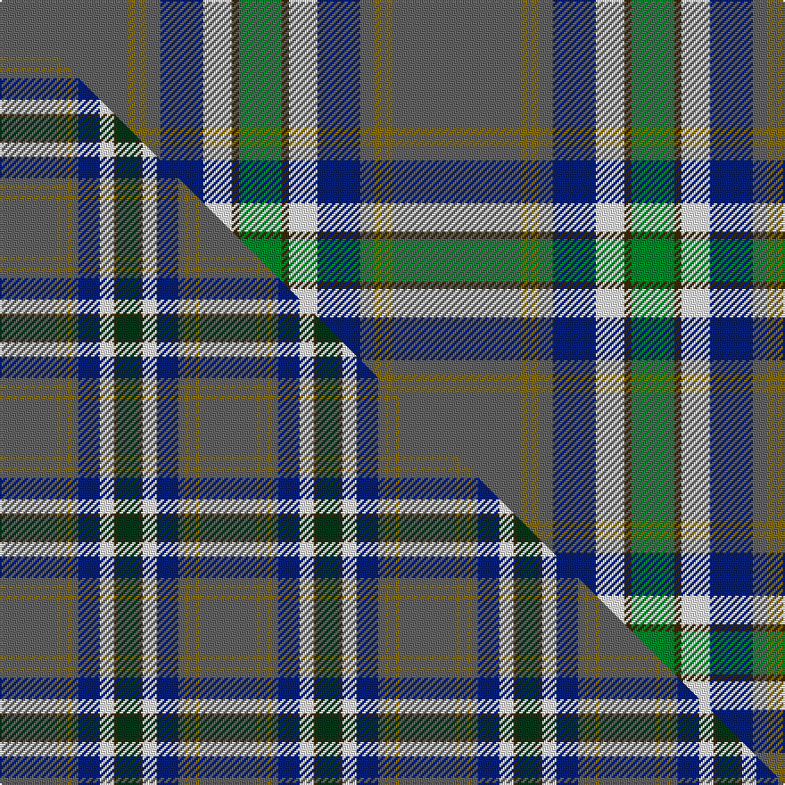

This page is one **sett** — a single exact thread-count. It belongs to the [tartan](/setts/n36y2n1y2n4db12w8dy2g12/)
(the same proportion at any scale), whose colour order is pattern [BGBGBBWGG](/stripes/bgbgbbwgg/).

Part of the [Nickel Lodge Centennial](/tartans/nickel-lodge-centennial/) tartan — the named design grouping this sett with its other cloths.

Sourced from tartans-authority.  It is a [9 stripe tartan](/stripes/stripes9/).

Original link [https://www.tartanregister.gov.uk/tartanDetails.aspx?ref=920](https://www.tartanregister.gov.uk/tartanDetails.aspx?ref=920)

Dataset <small>— provenance for this record, inherited from the source manifest</small>

<dl class="dataset-prov">
<dt>source</dt><dd><a href="/sources/tartans-authority/">Scottish Tartans Authority</a></dd>
<dt>data captured from</dt><dd><a href="https://github.com/thetartan/tartan-database/blob/master/data/tartans-authority/data.csv">https://github.com/thetartan/tartan-database/blob/master/data/tartans-authority/data.csv</a></dd>
<dt>data date</dt><dd>Sept. 1988 <small>(this record)</small></dd>
<dt>licence</dt><dd><a href="https://creativecommons.org/licenses/by-nc-nd/4.0/">CC BY-NC-ND 4.0</a></dd>
</dl>

Capture chain <small>— the hands this data passed through, oldest first; each capture carries its own licence</small>

<ol class="capture-chain">
<li><a href="https://www.tartansauthority.com/">Scottish Tartans Authority</a> <small>the heritage body's archive — its tartan-ferret record browser is retired (links repaired to the SRT, above)</small></li>
<li><a href="https://github.com/thetartan/tartan-database">thetartan/tartan-database</a> <small>2016-2017</small> · <a href="https://creativecommons.org/licenses/by-nc-nd/4.0/">CC BY-NC-ND 4.0</a> <small>Levko Kravets's frozen compilation — the capture we vendored, and where its CC licence text came from</small></li>
<li>this dictionary <small>captured 2026-06-10 · commit 5bf86c7566</small> <small>each re-capture is a git commit to data/sources</small></li>
</ol>

## Register references

External register numbers recorded for this tartan.

- Scottish Tartans Authority (ITI): 920

## Thread count
N/72 Y4 N2 Y4 N8 DB24 W16 DY4 G/24

One full sett is **220 threads**.

## Palette
<table><thead><tr><th>Colour</th><th>Shade</th><th>OKLCh</th></tr></thead><tbody><tr><td>DB</td><td><code style="background-color:#082077;">#082077</code> <small style="color:#888">#082077</small></td><td><small style="color:#888">oklch(30.0% 0.149 265.1)</small></td></tr><tr><td>G</td><td><code style="background-color:#008B2A;">#008B2A</code> <small style="color:#888">#008B2A</small></td><td><small style="color:#888">oklch(55.4% 0.170 145.9)</small></td></tr><tr><td>W</td><td><code style="background-color:#F7F7F7;">#F7F7F7</code> <small style="color:#888">#F7F7F7</small></td><td><small style="color:#888">oklch(97.6% 0.000 89.9)</small></td></tr><tr><td>N</td><td><code style="background-color:#636363;">#636363</code> <small style="color:#888">#636363</small></td><td><small style="color:#888">oklch(50.0% 0.000 89.9)</small></td></tr><tr><td>DY</td><td><code style="background-color:#3A2B0D;">#3A2B0D</code> <small style="color:#888">#3A2B0D</small></td><td><small style="color:#888">oklch(30.0% 0.049 82.0)</small></td></tr><tr><td>Y</td><td><code style="background-color:#8B6E00;">#8B6E00</code> <small style="color:#888">#8B6E00</small></td><td><small style="color:#888">oklch(55.1% 0.113 90.4)</small></td></tr></tbody></table>

# Sample pattern

## Compared to the master

This cloth is one sett of its design; the master sett (the exemplar the design is anchored on) is below for comparison.

Its **ΔTartan distance** from the master is **0.56** — the same measure the nearest-tartans table ranks by (0 is identical; a re-scale of the same cloth is near 0, a recolour or a different proportion further).

<figure class="master-compare" style="margin:0">

this sett
master sett ★

<figcaption style="color:#888;font-size:smaller">One weave of this sett against the <a href="/setts/n16y1n2y1n2db6w4dy1dg6/">master sett ★</a>, split on the diagonal: a shared proportion runs seamlessly across it with only the shades shifting; a different proportion breaks on it.</figcaption>
</figure>

## Nearest tartan variants

The nearest existing variants by ΔTartan distance, with this cloth at the top so the swatches line up against it.

ΔTartan

Threads

Variant

Sett

—

220

<a href="/variants/s9/n36y2n1y2n4db12w8dy2g12~x2/">Nickel Lodge Centennial (Corporate)</a>

<a href="/ttd/edit/#slug=n18y1n2y1n2db6w4dy1g6~x2&amp;base=n36y2n1y2n4db12w8dy2g12~x2" title="compare in the TTD">0.51</a>

116

<a href="/variants/s9/n18y1n2y1n2db6w4dy1g6~x2/">Nickel Lodge Centennial Corporate Tartan</a>

<a href="/ttd/edit/#slug=n16y1n2y1n2db6w4dy1dg6~x2&amp;base=n36y2n1y2n4db12w8dy2g12~x2" title="compare in the TTD">0.56</a>

112

<a href="/variants/s9/n16y1n2y1n2db6w4dy1dg6~x2/">Nickel Lodge Centennial</a>

<a href="/ttd/edit/#slug=n18y1n2y1n2db6w4o1g6~x2&amp;base=n36y2n1y2n4db12w8dy2g12~x2" title="compare in the TTD">1.41</a>

116

<a href="/variants/s9/n18y1n2y1n2db6w4o1g6~x2/">Nickel Lodge, Centennial</a>

<a href="/ttd/edit/#slug=db3dbi3db1g26db10dt1db3dp5dbi4ly2~x2~db1004274-dbi1406275&amp;base=n36y2n1y2n4db12w8dy2g12~x2" title="compare in the TTD">2.62</a>

222

<a href="/variants/s10/db3dbi3db1g26db10dt1db3dp5dbi4ly2~x2~db1004274-dbi1406275/">Rikaco Heirloom (Fashion)</a>

<a href="/ttd/edit/#slug=ly4lyi2ly39dt10n4dt4dr4dt25w3~x2~ly2602166-lyi3307090&amp;base=n36y2n1y2n4db12w8dy2g12~x2" title="compare in the TTD">2.71</a>

366

<a href="/variants/s9/y4ly2y39dt10n4dt4dr4dt25w3~x2~y2602166-ly3307090/">Blue Blas Alba</a>

<a href="/ttd/edit/#slug=db23w1r3w1db12y9g40dp3~x2&amp;base=n36y2n1y2n4db12w8dy2g12~x2" title="compare in the TTD">2.94</a>

316

<a href="/variants/s8/db23w1r3w1db12y9g40dp3~x2/">Pictou County</a>

<a href="/ttd/edit/#slug=g1n8lb5n23lb5db3lb5dp3lb5g5lb3w1~x2&amp;base=n36y2n1y2n4db12w8dy2g12~x2" title="compare in the TTD">2.95</a>

264

<a href="/variants/s12/g1n8lb5n23lb5db3lb5dp3lb5g5lb3w1~x2/">Hand, Edinburgh</a>

<a href="/ttd/edit/#slug=dg1n8lb5n23lb5db3lb5dp3lb5dg5lb3w1~x2&amp;base=n36y2n1y2n4db12w8dy2g12~x2" title="compare in the TTD">3.00</a>

264

<a href="/variants/s12/dg1n8lb5n23lb5db3lb5dp3lb5dg5lb3w1~x2/">Hand Name Tartan</a>

<a href="/ttd/edit/#slug=w5dt38y3db11y1db11y3dt4w5lo1~x2~dt1700000-y2400000&amp;base=n36y2n1y2n4db12w8dy2g12~x2" title="compare in the TTD">3.04</a>

316

<a href="/variants/s10/w5n38y3db11y1db11y3n4w5lo1~x2~n1700000-y2400000/">Ballarat</a>

<a href="/ttd/edit/#slug=g2dg9dr16r2t30g3dg6w1~x2&amp;base=n36y2n1y2n4db12w8dy2g12~x2" title="compare in the TTD">3.15</a>

270

<a href="/variants/s8/g2dg9dr16r2t30g3dg6w1~x2/">The Climb (Fashion)</a>

## Neighbour map

Every grey dot is one of 13621 variants placed by the first two principal components of the ΔTartan feature space (42% of its variance). Red is this tartan; blue dots are its nearest — click one to open its page.

<svg viewBox="0 0 640 380" role="img" style="max-width:100%;height:auto;border:1px solid #e0e0e0;border-radius:4px;display:block" xmlns="http://www.w3.org/2000/svg"><image href="/nn/cloud.v1.png" width="640" height="380"/><a href="/variants/s9/n18y1n2y1n2db6w4dy1g6~x2/"><circle cx="310.8" cy="153.1" r="4" fill="#3465a4"><title>Nickel Lodge Centennial Corporate Tartan</title></circle></a><a href="/variants/s9/n16y1n2y1n2db6w4dy1dg6~x2/"><circle cx="281.7" cy="158.9" r="4" fill="#3465a4"><title>Nickel Lodge Centennial</title></circle></a><a href="/variants/s9/n18y1n2y1n2db6w4o1g6~x2/"><circle cx="293.1" cy="140.5" r="4" fill="#3465a4"><title>Nickel Lodge, Centennial</title></circle></a><a href="/variants/s10/db3dbi3db1g26db10dt1db3dp5dbi4ly2~x2~db1004274-dbi1406275/"><circle cx="280.2" cy="131.6" r="4" fill="#3465a4"><title>Rikaco Heirloom (Fashion)</title></circle></a><a href="/variants/s9/y4ly2y39dt10n4dt4dr4dt25w3~x2~y2602166-ly3307090/"><circle cx="295.5" cy="150.3" r="4" fill="#3465a4"><title>Blue Blas Alba</title></circle></a><a href="/variants/s8/db23w1r3w1db12y9g40dp3~x2/"><circle cx="278.3" cy="120.9" r="4" fill="#3465a4"><title>Pictou County</title></circle></a><a href="/variants/s12/g1n8lb5n23lb5db3lb5dp3lb5g5lb3w1~x2/"><circle cx="293.4" cy="146.9" r="4" fill="#3465a4"><title>Hand, Edinburgh</title></circle></a><a href="/variants/s12/dg1n8lb5n23lb5db3lb5dp3lb5dg5lb3w1~x2/"><circle cx="282.0" cy="142.0" r="4" fill="#3465a4"><title>Hand Name Tartan</title></circle></a><a href="/variants/s10/w5n38y3db11y1db11y3n4w5lo1~x2~n1700000-y2400000/"><circle cx="336.4" cy="119.2" r="4" fill="#3465a4"><title>Ballarat</title></circle></a><a href="/variants/s8/g2dg9dr16r2t30g3dg6w1~x2/"><circle cx="272.2" cy="136.3" r="4" fill="#3465a4"><title>The Climb (Fashion)</title></circle></a><circle cx="322.4" cy="123.2" r="5" fill="#c00000"/><text x="320" y="376" text-anchor="middle" font-size="11" fill="#999">ground</text><text x="11" y="190" text-anchor="middle" font-size="11" fill="#999" transform="rotate(-90 11 190)">complexity</text></svg>

ID: /variants/s9/n36y2n1y2n4db12w8dy2g12~x2/
