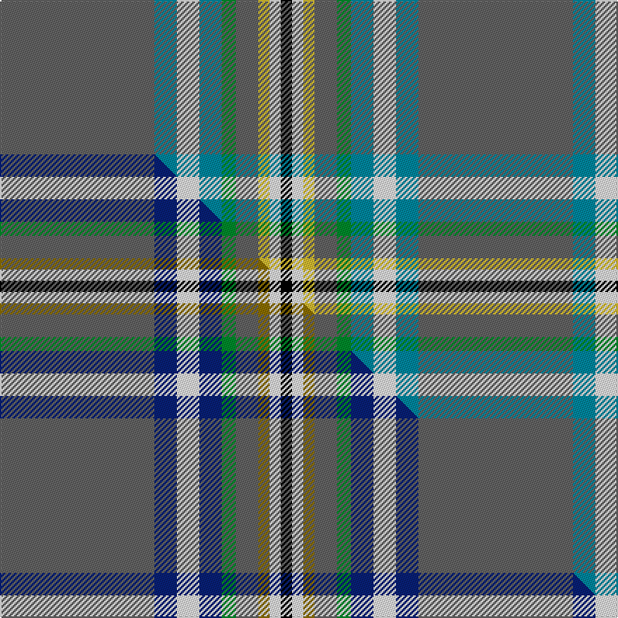

This is one **variant** — a specific cloth: this exact thread count and colourway, with its own
provenance below. It is one weaving of the [sett](/tartans/o/of/ofsharick-matthew/) (the scale-free proportion — the
same cloth at any scale or shade), whose colour order is pattern [BBWBGBYWK](/stripes/bbwbgbywk/).

Part of the [Ofsharick, Matthew](/tartans/o/of/ofsharick-matthew/) tartan — the named design grouping this sett with its other cloths.

Sourced from tartans-authority.  It is a [9 stripe tartan](/stripes/stripes9/).

Original link <code>http://www.tartansauthority.com/tartan-ferret/display/11209/</code> — retired · [Internet Archive copy](https://web.archive.org/web/*/http://www.tartansauthority.com/tartan-ferret/display/11209/*)

Dataset <small>— provenance for this record, inherited from the source manifest</small>

<dl class="dataset-prov">
<dt>source</dt><dd><a href="/sources/tartans-authority/">Scottish Tartans Authority</a></dd>
<dt>data captured from</dt><dd><a href="https://github.com/thetartan/tartan-database/blob/master/data/tartans-authority/data.csv">https://github.com/thetartan/tartan-database/blob/master/data/tartans-authority/data.csv</a></dd>
<dt>data date</dt><dd>2015 <small>(this record)</small></dd>
<dt>licence</dt><dd><a href="https://creativecommons.org/licenses/by-nc-nd/4.0/">CC BY-NC-ND 4.0</a></dd>
</dl>

Capture chain <small>— the hands this data passed through, oldest first; each capture carries its own licence</small>

<ol class="capture-chain">
<li><a href="https://www.tartansauthority.com/">Scottish Tartans Authority</a> <small>the heritage body’s archive — its tartan-ferret record browser is retired; dead record links are shown unlinked, with an Internet Archive copy (ITI numbers are not SRT references)</small></li>
<li><a href="https://github.com/thetartan/tartan-database">thetartan/tartan-database</a> <small>2016-2017</small> · <a href="https://creativecommons.org/licenses/by-nc-nd/4.0/">CC BY-NC-ND 4.0</a> <small>Levko Kravets's frozen compilation — the capture we vendored, and where its CC licence text came from</small></li>
<li>this dictionary <small>captured 2026-06-10 · commit 5bf86c7566</small> <small>each re-capture is a git commit to data/sources</small></li>
</ol>

## Register references

External register numbers recorded for this tartan.

- Scottish Register of Tartans: [11209](https://www.tartanregister.gov.uk/tartanDetails?ref=11209)
- Scottish Tartans Authority (ITI): 11209

## Thread count
N/110 T16 W16 T16 G10 N16 LY8 W8 K/8

One full sett is **298 threads**.

## Palette
<table><thead><tr><th>Colour</th><th>Shade</th><th>OKLCh</th></tr></thead><tbody><tr><td>T</td><td><code style="background-color:#00879F;">#00879F</code> <small style="color:#888">#00879F</small></td><td><small style="color:#888">oklch(57.4% 0.102 216.1)</small></td></tr><tr><td>G</td><td><code style="background-color:#008B2A;">#008B2A</code> <small style="color:#888">#008B2A</small></td><td><small style="color:#888">oklch(55.4% 0.170 145.9)</small></td></tr><tr><td>K</td><td><code style="background-color:#000000;">#000000</code> <small style="color:#888">#000000</small></td><td><small style="color:#888">oklch(0.0% 0.000 0.0)</small></td></tr><tr><td>N</td><td><code style="background-color:#636363;">#636363</code> <small style="color:#888">#636363</small></td><td><small style="color:#888">oklch(50.0% 0.000 89.9)</small></td></tr><tr><td>W</td><td><code style="background-color:#F7F7F7;">#F7F7F7</code> <small style="color:#888">#F7F7F7</small></td><td><small style="color:#888">oklch(97.6% 0.000 89.9)</small></td></tr><tr><td>LY</td><td><code style="background-color:#DCBC32;">#DCBC32</code> <small style="color:#888">#DCBC32</small></td><td><small style="color:#888">oklch(80.0% 0.150 95.2)</small></td></tr></tbody></table>

# Sample pattern

## Compared to the master

This cloth is one sett of its design; the master sett (the exemplar the design is anchored on) is below for comparison.

Its **ΔTartan distance** from the master is **0.11** — the same measure the nearest-tartans table ranks by (0 is identical; a re-scale of the same cloth is near 0, a recolour or a different proportion further).

<figure class="master-compare" style="margin:0">

this sett
master sett ★

<figcaption style="color:#888;font-size:smaller">One weave of this sett against the <a href="/setts/n55db8w8db8g5n8y4w4k4/">master sett ★</a>, split on the diagonal: a shared proportion runs seamlessly across it with only the shades shifting; a different proportion breaks on it.</figcaption>
</figure>

## Nearest tartan variants

The nearest existing variants by ΔTartan distance, with this cloth at the top so the swatches line up against it.

ΔTartan

Threads

Variant

Sett

—

298

<a href="/variants/s9/n55t8w8t8g5n8ly4w4k4~x2/">Ofsharick, Matthew (Personal)</a>

<a href="/ttd/edit/#slug=n55db8w8db8g5n8y4w4k4~x2&amp;base=n55t8w8t8g5n8ly4w4k4~x2" title="compare in the TTD">0.11</a>

298

<a href="/variants/s9/n55db8w8db8g5n8y4w4k4~x2/">Ofsharick, Matthew (Personal)</a>

<a href="/ttd/edit/#slug=dp8g8w3g8dp8w3t40r3k3t40w3~x2&amp;base=n55t8w8t8g5n8ly4w4k4~x2" title="compare in the TTD">2.77</a>

486

<a href="/variants/s11/dp8g8w3g8dp8w3t40r3k3t40w3~x2/">World Peace (Fashion)</a>

<a href="/ttd/edit/#slug=n68k4n18o20k3w3k10lb8lr4~n1900000-o2500000&amp;base=n55t8w8t8g5n8ly4w4k4~x2" title="compare in the TTD">2.82</a>

204

<a href="/variants/s9/n68k4n18o20k3w3k10lb8lr4~n1900000-o2500000/">Carbon (Corporate)</a>

<a href="/ttd/edit/#slug=n18y1n2y1n2db6w4o1g6~x2&amp;base=n55t8w8t8g5n8ly4w4k4~x2" title="compare in the TTD">3.16</a>

116

<a href="/variants/s9/n18y1n2y1n2db6w4o1g6~x2/">Nickel Lodge, Centennial</a>

<a href="/ttd/edit/#slug=t46dp3r3dp3r4dp12w3k3~x2&amp;base=n55t8w8t8g5n8ly4w4k4~x2" title="compare in the TTD">3.18</a>

210

<a href="/variants/s8/t46dp3r3dp3r4dp12w3k3~x2/">Edinburgh Festival</a>

<a href="/ttd/edit/#slug=b24w2b6g9r6b3r6g35k2ly2~x2&amp;base=n55t8w8t8g5n8ly4w4k4~x2" title="compare in the TTD">3.25</a>

328

<a href="/variants/s10/b24w2b6g9r6b3r6g35k2ly2~x2/">O'Donohue Personal)</a>

<a href="/ttd/edit/#slug=db5r3g2r3dg12t34g2w2~x2&amp;base=n55t8w8t8g5n8ly4w4k4~x2" title="compare in the TTD">3.28</a>

238

<a href="/variants/s8/db5r3g2r3dg12t34g2w2~x2/">Moran (Wedding) (Personal)</a>

<a href="/ttd/edit/#slug=t50r3t4k8n4k2y3k2r12w2r4t4~x2&amp;base=n55t8w8t8g5n8ly4w4k4~x2" title="compare in the TTD">3.35</a>

284

<a href="/variants/s12/t50r3t4k8n4k2y3k2r12w2r4t4~x2/">City of Barrie</a>

<a href="/ttd/edit/#slug=y18k1r1w1r4db4y4g4r1g1r1g1r1g1~x4~y2502222-db1406275&amp;base=n55t8w8t8g5n8ly4w4k4~x2" title="compare in the TTD">3.42</a>

268

<a href="/variants/s14/t18k1r1w1r4db4t4g4r1g1r1g1r1g1~x4~t2502222-db1406275/">Hill 70</a>

<a href="/ttd/edit/#slug=db5w5n36y3n3r3n3y3n9dg8w3db3w3dg3~x2&amp;base=n55t8w8t8g5n8ly4w4k4~x2" title="compare in the TTD">3.44</a>

344

<a href="/variants/s14/db5w5n36y3n3r3n3y3n9dg8w3db3w3dg3~x2/">Freiburg</a>

## Neighbour map

Every grey dot is one of 13657 variants placed by the first two principal components of the ΔTartan feature space (42% of its variance). Red is this tartan; blue dots are its nearest — click one to open its page. The map is a flat projection of a many-dimensional space — [how to read it](/posts/neighbourhood-maps/).

<svg viewBox="0 0 640 380" role="img" style="max-width:100%;height:auto;border:1px solid #e0e0e0;border-radius:4px;display:block" xmlns="http://www.w3.org/2000/svg"><image href="/nn/cloud.v1.png" width="640" height="380"/><a href="/variants/s9/n55db8w8db8g5n8y4w4k4~x2/"><circle cx="295.3" cy="114.0" r="4" fill="#3465a4"><title>Ofsharick, Matthew (Personal)</title></circle></a><a href="/variants/s11/dp8g8w3g8dp8w3t40r3k3t40w3~x2/"><circle cx="303.1" cy="121.2" r="4" fill="#3465a4"><title>World Peace (Fashion)</title></circle></a><a href="/variants/s9/n68k4n18o20k3w3k10lb8lr4~n1900000-o2500000/"><circle cx="315.8" cy="93.1" r="4" fill="#3465a4"><title>Carbon (Corporate)</title></circle></a><a href="/variants/s9/n18y1n2y1n2db6w4o1g6~x2/"><circle cx="293.1" cy="140.4" r="4" fill="#3465a4"><title>Nickel Lodge, Centennial</title></circle></a><a href="/variants/s8/t46dp3r3dp3r4dp12w3k3~x2/"><circle cx="326.8" cy="122.0" r="4" fill="#3465a4"><title>Edinburgh Festival</title></circle></a><a href="/variants/s10/b24w2b6g9r6b3r6g35k2ly2~x2/"><circle cx="236.8" cy="124.4" r="4" fill="#3465a4"><title>O'Donohue Personal)</title></circle></a><a href="/variants/s8/db5r3g2r3dg12t34g2w2~x2/"><circle cx="302.5" cy="137.0" r="4" fill="#3465a4"><title>Moran (Wedding) (Personal)</title></circle></a><a href="/variants/s12/t50r3t4k8n4k2y3k2r12w2r4t4~x2/"><circle cx="292.8" cy="61.7" r="4" fill="#3465a4"><title>City of Barrie</title></circle></a><a href="/variants/s14/t18k1r1w1r4db4t4g4r1g1r1g1r1g1~x4~t2502222-db1406275/"><circle cx="267.4" cy="91.6" r="4" fill="#3465a4"><title>Hill 70</title></circle></a><a href="/variants/s14/db5w5n36y3n3r3n3y3n9dg8w3db3w3dg3~x2/"><circle cx="285.7" cy="121.6" r="4" fill="#3465a4"><title>Freiburg</title></circle></a><circle cx="309.7" cy="121.1" r="5" fill="#c00000"/><text x="320" y="376" text-anchor="middle" font-size="11" fill="#999">ground</text><text x="11" y="190" text-anchor="middle" font-size="11" fill="#999" transform="rotate(-90 11 190)">complexity</text></svg>

ID: /variants/s9/n55t8w8t8g5n8ly4w4k4~x2/
