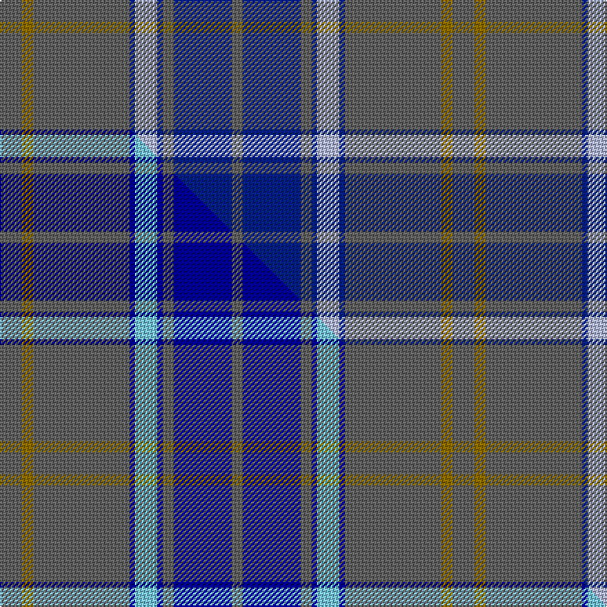

This page is one **sett** — a single exact thread-count. It belongs to the [tartan](/setts/n8y4n35db2lb8db2n4db21n4/)
(the same proportion at any scale), whose colour order is pattern [BBBBWBBGB](/stripes/bbbbwbbgb/).

Part of the [Bedford Academy](/tartans/bedford-academy/) tartan — the named design grouping this sett with its other cloths.

Sourced from tartans-authority.  It is a [9 stripe tartan](/stripes/stripes9/).

Original link http://www.tartansauthority.com/tartan-ferret/display/10226/

## Register references

External register numbers recorded for this tartan.

- Scottish Register of Tartans: [10226](https://www.tartanregister.gov.uk/tartanDetails?ref=10226)
- Scottish Tartans Authority (ITI): 10226

## Thread count
N/16 Y8 N70 DB4 LB16 DB4 N8 DB42 N/8

One full sett is **328 threads**.

## Palette
<table><thead><tr><th>Colour</th><th>Shade</th><th>OKLCh</th></tr></thead><tbody><tr><td>LB</td><td><code style="background-color:#B5BBDE;">#B5BBDE</code> <small style="color:#888">#B5BBDE</small></td><td><small style="color:#888">oklch(79.9% 0.050 277.6)</small></td></tr><tr><td>DB</td><td><code style="background-color:#082077;">#082077</code> <small style="color:#888">#082077</small></td><td><small style="color:#888">oklch(30.0% 0.149 265.1)</small></td></tr><tr><td>N</td><td><code style="background-color:#636363;">#636363</code> <small style="color:#888">#636363</small></td><td><small style="color:#888">oklch(50.0% 0.000 89.9)</small></td></tr><tr><td>Y</td><td><code style="background-color:#8B6E00;">#8B6E00</code> <small style="color:#888">#8B6E00</small></td><td><small style="color:#888">oklch(55.1% 0.113 90.4)</small></td></tr></tbody></table>

# Sample pattern

## Compared to the master

This cloth is one sett of its design; the master sett (the exemplar the design is anchored on) is below for comparison.

Its **ΔTartan distance** from the master is **0.52** — the same measure the nearest-tartans table ranks by (0 is identical; a re-scale of the same cloth is near 0, a recolour or a different proportion further).

<figure class="master-compare" style="margin:0">

this sett
master sett ★

<figcaption style="color:#888;font-size:smaller">One weave of this sett against the <a href="/setts/n8y4n35db2lt8db2n4db21n4/">master sett ★</a>, split on the diagonal: a shared proportion runs seamlessly across it with only the shades shifting; a different proportion breaks on it.</figcaption>
</figure>

## Nearest tartan variants

The nearest existing variants by ΔTartan distance, with this cloth at the top so the swatches line up against it.

ΔTartan

Threads

Variant

Sett

—

328

<a href="/variants/s9/n8y4n35db2lb8db2n4db21n4~x2/">Bedford Academy (Corporate)</a>

<a href="/ttd/edit/#slug=n8y4n35db2lt8db2n4db21n4~x2~db1108266-lt3103227&amp;base=n8y4n35db2lb8db2n4db21n4~x2" title="compare in the TTD">0.00</a>

328

<a href="/variants/s9/n8y4n35db2lt8db2n4db21n4~x2~db1108266-lt3103227/">Bedford Academy</a>

<a href="/ttd/edit/#slug=n37db4n7db4n9db40lb2db4n2&amp;base=n8y4n35db2lb8db2n4db21n4~x2" title="compare in the TTD">2.22</a>

179

<a href="/variants/s9/n37db4n7db4n9db40lb2db4n2/">Edwards</a>

<a href="/ttd/edit/#slug=r3n32db2n3db4n2db16w1db1~x2&amp;base=n8y4n35db2lb8db2n4db21n4~x2" title="compare in the TTD">2.61</a>

248

<a href="/variants/s9/r3n32db2n3db4n2db16w1db1~x2/">Dauphinee, Andrew Hunter (Personal)</a>

## Neighbour map

Every grey dot is one of 13620 variants placed by the first two principal components of the ΔTartan feature space (42% of its variance). Red is this tartan; blue dots are its nearest — click one to open its page.

<svg viewBox="0 0 640 380" role="img" style="max-width:100%;height:auto;border:1px solid #e0e0e0;border-radius:4px;display:block" xmlns="http://www.w3.org/2000/svg"><image href="/nn/cloud.v1.png" width="640" height="380"/><a href="/variants/s9/n8y4n35db2lt8db2n4db21n4~x2~db1108266-lt3103227/"><circle cx="399.0" cy="187.6" r="4" fill="#3465a4"><title>Bedford Academy</title></circle></a><a href="/variants/s9/n37db4n7db4n9db40lb2db4n2/"><circle cx="490.9" cy="220.0" r="4" fill="#3465a4"><title>Edwards</title></circle></a><a href="/variants/s9/r3n32db2n3db4n2db16w1db1~x2/"><circle cx="454.1" cy="141.9" r="4" fill="#3465a4"><title>Dauphinee, Andrew Hunter (Personal)</title></circle></a><circle cx="420.3" cy="194.3" r="5" fill="#c00000"/><text x="320" y="376" text-anchor="middle" font-size="11" fill="#999">ground</text><text x="11" y="190" text-anchor="middle" font-size="11" fill="#999" transform="rotate(-90 11 190)">complexity</text></svg>

ID: /variants/s9/n8y4n35db2lb8db2n4db21n4~x2/
