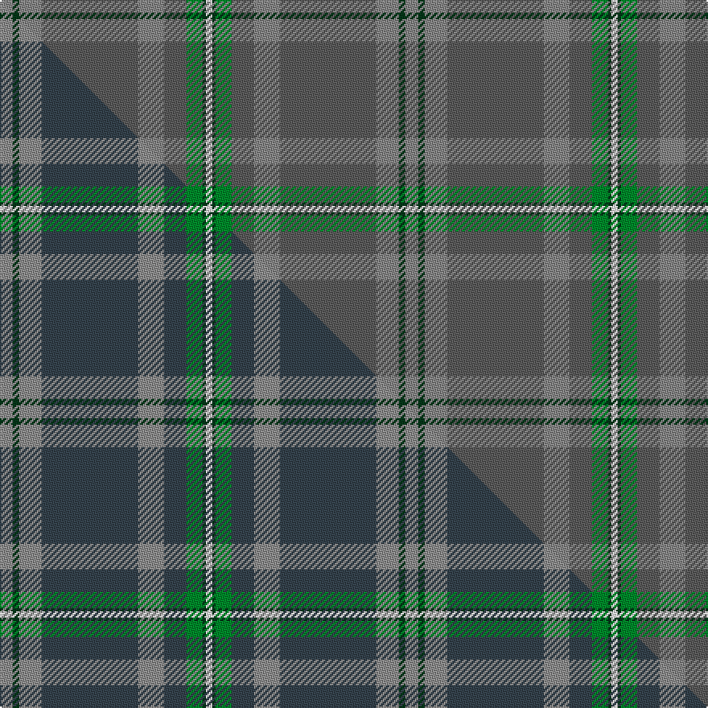

This page is one **sett** — a single exact thread-count. It belongs to the [tartan](/setts/o4dg2o7n30o8n7g5dg1w2/)
(the same proportion at any scale), whose colour order is pattern [RGRBRBGGW](/stripes/rgrbrbggw/).

Part of the [Inchforth](/tartans/inchforth/) tartan — the named design grouping this sett with its other cloths.

Sourced from tartans-authority.  It is a [9 stripe tartan](/stripes/stripes9/).

Original link [https://www.tartanregister.gov.uk/tartanDetails.aspx?ref=10575](https://www.tartanregister.gov.uk/tartanDetails.aspx?ref=10575)

Dataset <small>— provenance for this record, inherited from the source manifest</small>

<dl class="dataset-prov">
<dt>source</dt><dd><a href="/sources/tartans-authority/">Scottish Tartans Authority</a></dd>
<dt>data captured from</dt><dd><a href="https://github.com/thetartan/tartan-database/blob/master/data/tartans-authority/data.csv">https://github.com/thetartan/tartan-database/blob/master/data/tartans-authority/data.csv</a></dd>
<dt>data date</dt><dd>26/02/2012 <small>(this record)</small></dd>
<dt>licence</dt><dd><a href="https://creativecommons.org/licenses/by-nc-nd/4.0/">CC BY-NC-ND 4.0</a></dd>
</dl>

Capture chain <small>— the hands this data passed through, oldest first; each capture carries its own licence</small>

<ol class="capture-chain">
<li><a href="https://www.tartansauthority.com/">Scottish Tartans Authority</a> <small>the heritage body's archive — its tartan-ferret record browser is retired (links repaired to the SRT, above)</small></li>
<li><a href="https://github.com/thetartan/tartan-database">thetartan/tartan-database</a> <small>2016-2017</small> · <a href="https://creativecommons.org/licenses/by-nc-nd/4.0/">CC BY-NC-ND 4.0</a> <small>Levko Kravets's frozen compilation — the capture we vendored, and where its CC licence text came from</small></li>
<li>this dictionary <small>captured 2026-06-10 · commit 5bf86c7566</small> <small>each re-capture is a git commit to data/sources</small></li>
</ol>

## Register references

External register numbers recorded for this tartan.

- Scottish Register of Tartans: [10575](https://www.tartanregister.gov.uk/tartanDetails?ref=10575)
- Scottish Tartans Authority (ITI): 10575

## Thread count
O/8 DG4 O14 N60 O16 N14 G10 DG2 W/4

One full sett is **252 threads**.

## Palette
<table><thead><tr><th>Colour</th><th>Shade</th><th>OKLCh</th></tr></thead><tbody><tr><td>DG</td><td><code style="background-color:#053819;">#053819</code> <small style="color:#888">#053819</small></td><td><small style="color:#888">oklch(30.0% 0.075 151.3)</small></td></tr><tr><td>G</td><td><code style="background-color:#008B2A;">#008B2A</code> <small style="color:#888">#008B2A</small></td><td><small style="color:#888">oklch(55.4% 0.170 145.9)</small></td></tr><tr><td>N</td><td><code style="background-color:#5C5C5C;">#5C5C5C</code> <small style="color:#888">#5C5C5C</small></td><td><small style="color:#888">oklch(47.5% 0.000 89.9)</small></td></tr><tr><td>O</td><td><code style="background-color:#888888;">#888888</code> <small style="color:#888">#888888</small></td><td><small style="color:#888">oklch(62.7% 0.000 89.9)</small></td></tr><tr><td>W</td><td><code style="background-color:#F7F7F7;">#F7F7F7</code> <small style="color:#888">#F7F7F7</small></td><td><small style="color:#888">oklch(97.6% 0.000 89.9)</small></td></tr></tbody></table>

# Sample pattern

## Compared to the master

This cloth is one sett of its design; the master sett (the exemplar the design is anchored on) is below for comparison.

Its **ΔTartan distance** from the master is **5.75** — the same measure the nearest-tartans table ranks by (0 is identical; a re-scale of the same cloth is near 0, a recolour or a different proportion further).

<figure class="master-compare" style="margin:0">

this sett
master sett ★

<figcaption style="color:#888;font-size:smaller">One weave of this sett against the <a href="/setts/o4dg2o7dt30o8dt7g5dg1w2/">master sett ★</a>, split on the diagonal: a shared proportion runs seamlessly across it with only the shades shifting; a different proportion breaks on it.</figcaption>
</figure>

## Nearest tartan variants

The nearest existing variants by ΔTartan distance, with this cloth at the top so the swatches line up against it.

ΔTartan

Threads

Variant

Sett

—

252

<a href="/variants/s9/o4dg2o7n30o8n7g5dg1w2~x2~o2500000-n1900000/">Inchforth (Personal)</a>

<a href="/ttd/edit/#slug=ly4dg2ly7dt30ly8dt7g5dg1w2~x2~ly2600000-dt1501240&amp;base=o4dg2o7n30o8n7g5dg1w2~x2~o2500000-n1900000" title="compare in the TTD">0.12</a>

252

<a href="/variants/s9/o4dg2o7dt30o8dt7g5dg1w2~x2~o2600000-dt1501240/">Inchforth (Personal)</a>

<a href="/ttd/edit/#slug=o4dp2o7n30o8n7dpi5dp1w2~x2~o2500000-dp1105325-n1900000-dpi1607327&amp;base=o4dg2o7n30o8n7g5dg1w2~x2~o2500000-n1900000" title="compare in the TTD">0.90</a>

252

<a href="/variants/s9/o4dp2o7n30o8n7dpi5dp1w2~x2~o2500000-dp1105325-n1900000-dpi1607327/">Hebridean Thistle (Fashion)</a>

<a href="/ttd/edit/#slug=n44o8n8o22lb4o4lb11o2w2~x2~n1900000-o2500000&amp;base=o4dg2o7n30o8n7g5dg1w2~x2~o2500000-n1900000" title="compare in the TTD">2.66</a>

328

<a href="/variants/s9/n44o8n8o22lb4o4lb11o2w2~x2~n1900000-o2500000/">Titanium (Fashion)</a>

<a href="/ttd/edit/#slug=n8o4w2o4n1o12g9n24dr4~x2~n1900000-o2500000&amp;base=o4dg2o7n30o8n7g5dg1w2~x2~o2500000-n1900000" title="compare in the TTD">2.74</a>

248

<a href="/variants/s9/n8o4w2o4n1o12g9n24dr4~x2~n1900000-o2500000/">Willsher Wedding (Personal)</a>

<a href="/ttd/edit/#slug=dg1n8o5n23o5db3o5dp3o5dg5o3w1~x2~n1900000-o2500000&amp;base=o4dg2o7n30o8n7g5dg1w2~x2~o2500000-n1900000" title="compare in the TTD">3.62</a>

264

<a href="/variants/s12/dg1n8o5n23o5db3o5dp3o5dg5o3w1~x2~n1900000-o2500000/">Hand (Personal)</a>

<a href="/ttd/edit/#slug=dp3n24dt10n2g11n8lb3~x2~n1900000-dt1700000&amp;base=o4dg2o7n30o8n7g5dg1w2~x2~o2500000-n1900000" title="compare in the TTD">3.78</a>

232

<a href="/variants/s7/dp3ni24n10ni2g11ni8lb3~x2~ni1900000-n1700000/">Hesco</a>

<a href="/ttd/edit/#slug=dt5o4dt4o38n34dt4n4lb2n2y2n4dt4n34o38dt4o4dt2~o2500000-n1900000&amp;base=o4dg2o7n30o8n7g5dg1w2~x2~o2500000-n1900000" title="compare in the TTD">3.95</a>

371

<a href="/variants/s17/dt5o4dt4o38n34dt4n4lb2n2y2n4dt4n34o38dt4o4dt2~o2500000-n1900000/">Great Glen (Fashion)</a>

<a href="/ttd/edit/#slug=n65dp3g3dp3g16do8g3do3b4~x2&amp;base=o4dg2o7n30o8n7g5dg1w2~x2~o2500000-n1900000" title="compare in the TTD">3.98</a>

294

<a href="/variants/s9/n65dp3g3dp3g16do8g3do3b4~x2/">Scottish National (hunting)</a>

<a href="/ttd/edit/#slug=n60lb5n8y2n4w2n4g16o8n2o4w2~x2&amp;base=o4dg2o7n30o8n7g5dg1w2~x2~o2500000-n1900000" title="compare in the TTD">3.98</a>

344

<a href="/variants/s12/n60lb5n8y2n4w2n4g16o8n2o4w2~x2/">Stuart / Stewart, Silver</a>

<a href="/ttd/edit/#slug=t52y23g6dg5w1r1~x2~g2408144-dg1806142&amp;base=o4dg2o7n30o8n7g5dg1w2~x2~o2500000-n1900000" title="compare in the TTD">3.99</a>

246

<a href="/variants/s6/t52y23g6dg5w1r1~x2~g2408144-dg1806142/">College of New Caledonia (Corporate)</a>

## Neighbour map

Every grey dot is one of 13621 variants placed by the first two principal components of the ΔTartan feature space (42% of its variance). Red is this tartan; blue dots are its nearest — click one to open its page.

<svg viewBox="0 0 640 380" role="img" style="max-width:100%;height:auto;border:1px solid #e0e0e0;border-radius:4px;display:block" xmlns="http://www.w3.org/2000/svg"><image href="/nn/cloud.v1.png" width="640" height="380"/><a href="/variants/s9/o4dg2o7dt30o8dt7g5dg1w2~x2~o2600000-dt1501240/"><circle cx="376.5" cy="139.4" r="4" fill="#3465a4"><title>Inchforth (Personal)</title></circle></a><a href="/variants/s9/o4dp2o7n30o8n7dpi5dp1w2~x2~o2500000-dp1105325-n1900000-dpi1607327/"><circle cx="439.1" cy="159.5" r="4" fill="#3465a4"><title>Hebridean Thistle (Fashion)</title></circle></a><a href="/variants/s9/n44o8n8o22lb4o4lb11o2w2~x2~n1900000-o2500000/"><circle cx="423.9" cy="193.5" r="4" fill="#3465a4"><title>Titanium (Fashion)</title></circle></a><a href="/variants/s9/n8o4w2o4n1o12g9n24dr4~x2~n1900000-o2500000/"><circle cx="375.5" cy="191.6" r="4" fill="#3465a4"><title>Willsher Wedding (Personal)</title></circle></a><a href="/variants/s12/dg1n8o5n23o5db3o5dp3o5dg5o3w1~x2~n1900000-o2500000/"><circle cx="340.8" cy="154.6" r="4" fill="#3465a4"><title>Hand (Personal)</title></circle></a><a href="/variants/s7/dp3ni24n10ni2g11ni8lb3~x2~ni1900000-n1700000/"><circle cx="451.0" cy="262.4" r="4" fill="#3465a4"><title>Hesco</title></circle></a><a href="/variants/s17/dt5o4dt4o38n34dt4n4lb2n2y2n4dt4n34o38dt4o4dt2~o2500000-n1900000/"><circle cx="408.3" cy="163.3" r="4" fill="#3465a4"><title>Great Glen (Fashion)</title></circle></a><a href="/variants/s9/n65dp3g3dp3g16do8g3do3b4~x2/"><circle cx="504.0" cy="169.8" r="4" fill="#3465a4"><title>Scottish National (hunting)</title></circle></a><a href="/variants/s12/n60lb5n8y2n4w2n4g16o8n2o4w2~x2/"><circle cx="493.8" cy="111.5" r="4" fill="#3465a4"><title>Stuart / Stewart, Silver</title></circle></a><a href="/variants/s6/t52y23g6dg5w1r1~x2~g2408144-dg1806142/"><circle cx="497.1" cy="155.4" r="4" fill="#3465a4"><title>College of New Caledonia (Corporate)</title></circle></a><circle cx="453.2" cy="167.4" r="5" fill="#c00000"/><text x="320" y="376" text-anchor="middle" font-size="11" fill="#999">ground</text><text x="11" y="190" text-anchor="middle" font-size="11" fill="#999" transform="rotate(-90 11 190)">complexity</text></svg>

ID: /variants/s9/o4dg2o7n30o8n7g5dg1w2~x2~o2500000-n1900000/
