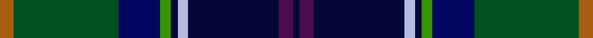

This page is one **sett** — a single exact thread-count. It belongs to the [tartan](/setts/o4dg30db12g3k2lb3k26dp4k2/)
(the same proportion at any scale), whose colour order is pattern [KBKWKGBGR](/stripes/kbkwkgbgr/).

Sourced from register-of-tartans.  It is a [9 stripe tartan](/stripes/stripes9/).

Original link https://www.tartanregister.gov.uk/tartanDetails.aspx?ref=10723

## Provenance

Earliest known date: 22 October 2012 Designed for Melissa McNulty and her Begg family to commemorate the Begg family name. The base of the tartan design reflects an historical association with Clan Macdonald as well as Scarfskerry in Caithness where the branch of the family comes from. Inspiration for the new design was taken from the Macdonald and Sinclair (Caithness regional tartan) setts. Colours: green signifies the toil and labour of previous generations of Begg family crofters working the bleak wilds of Caithness; blue is for the sea. Working the land was simply not enough for many crofting families to survive on, and many of Melissa McNulty’s ancestors went to sea. Two in particular were, firstly, Sinclair Begg OBE, who worked his way up from cabin boy to be Master of a whaling ship and served with distinction in both World Wars. He was awarded an OBE for his actions in the Second World War, when his ship was torpedoed by Germans just off the Outer Hebrides. Sinclair Begg also went on the Antarctic Surveys of 1955-57 and became the first man to bring penguins back to the UK. Secondly, Sinclair’s older brother, John, served with Christian Salvesen Shipping as a Master Mariner during the First World War, and on two separate occasions faced down German U-Boats. In the first instance he won the DSC for himself and on the second he won the Lloyds Silver Award for Meritorious Sea Service. Purple represents the gentle heather-swept hills of Caithness which were considered ‘home’ for many years after the family had moved to Edinburgh. However, on a more personal note, Melissa McNulty’s Great-Grandmother, from whom her strand of the Begg blood comes, was said to have beautiful, vibrant violet-coloured eyes. This tartan represents Melissa McNulty's personal heritage and that of her remaining family.

2 attestations — the source records this cloth was collapsed from (oldest owns this page)

<ul>
<li>03/05/2012 — Begg (Scarfskerry) (register-of-tartans, <a href="https://www.tartanregister.gov.uk/tartanDetails.aspx?ref=10723">record</a>)  <em>Designed for Melissa McNulty and her Begg family to commemorate the Begg family name. The base of the tartan design reflects an historical association with Clan Macdonald as well as Scarfskerry in Caithness where the branch of the family comes from. Inspiration for the new design was taken from the Macdonald and Sinclair (Caithness regional tartan) setts. Colours: green signifies the toil and labour of previous generations of Begg family crofters working the bleak wilds of Caithness; blue is for the sea. Working the land was simply not enough for many crofting families to survive on, and many of Melissa McNulty’s ancestors went to sea. Two in particular were, firstly, Sinclair Begg OBE, who worked his way up from cabin boy to be Master of a whaling ship and served with distinction in both World Wars. He was awarded an OBE for his actions in the Second World War, when his ship was torpedoed by Germans just off the Outer Hebrides. Sinclair Begg also went on the Antarctic Surveys of 1955-57 and became the first man to bring penguins back to the UK. Secondly, Sinclair’s older brother, John, served with Christian Salvesen Shipping as a Master Mariner during the First World War, and on two separate occasions faced down German U-Boats. In the first instance he won the DSC for himself and on the second he won the Lloyds Silver Award for Meritorious Sea Service. Purple represents the gentle heather-swept hills of Caithness which were considered ‘home’ for many years after the family had moved to Edinburgh. However, on a more personal note, Melissa McNulty’s Great-Grandmother, from whom her strand of the Begg blood comes, was said to have beautiful, vibrant violet-coloured eyes. This tartan represents Melissa McNulty's personal heritage and that of her remaining family.</em></li>
<li>undated — Begg (Scarfskerry) Name Tartan (house-of-tartan, <a href="http://www.house-of-tartan.scotland.net/house/TartanViewjs.asp?colr=Def&tnam=10723">record</a>) </li>
</ul>

## Register references

External register numbers recorded for this tartan.

- Scottish Register of Tartans: [10723](https://www.tartanregister.gov.uk/tartanDetails.aspx?ref=10723)

## Thread count
O/4 DG30 DB12 G3 K2 LB3 K26 DP4 K/2

One full sett is **166 threads**.

## Palette
<table><thead><tr><th>Colour</th><th>Shade</th><th>OKLCh</th></tr></thead><tbody><tr><td>DB</td><td><code style="background-color:#020660;">#020660</code> <small style="color:#888">#020660</small></td><td><small style="color:#888">oklch(23.0% 0.147 265.2)</small></td></tr><tr><td>LB</td><td><code style="background-color:#B5BBDE;">#B5BBDE</code> <small style="color:#888">#B5BBDE</small></td><td><small style="color:#888">oklch(79.9% 0.050 277.6)</small></td></tr><tr><td>K</td><td><code style="background-color:#050738;">#050738</code> <small style="color:#888">#050738</small></td><td><small style="color:#888">oklch(17.6% 0.092 269.9)</small></td></tr><tr><td>DP</td><td><code style="background-color:#4B0B4F;">#4B0B4F</code> <small style="color:#888">#4B0B4F</small></td><td><small style="color:#888">oklch(30.1% 0.125 325.4)</small></td></tr><tr><td>DG</td><td><code style="background-color:#005020;">#005020</code> <small style="color:#888">#005020</small></td><td><small style="color:#888">oklch(37.7% 0.105 149.6)</small></td></tr><tr><td>G</td><td><code style="background-color:#379404;">#379404</code> <small style="color:#888">#379404</small></td><td><small style="color:#888">oklch(58.7% 0.183 138.7)</small></td></tr><tr><td>O</td><td><code style="background-color:#A65C11;">#A65C11</code> <small style="color:#888">#A65C11</small></td><td><small style="color:#888">oklch(55.0% 0.125 58.3)</small></td></tr></tbody></table>

# Sample pattern

## Nearest tartan variants

The nearest existing variants by ΔTartan distance, with this cloth at the top so the swatches line up against it.

ΔTartan

Threads

Variant

Sett

—

166

<a href="/variants/s9/o4dg30db12g3k2lb3k26dp4k2~dg1504144-db0906265-g2307139-k0704274/">Begg (Scarfskerry)</a>

<a href="/ttd/edit/#slug=db3r2db18k6dg18y2g3~x2&amp;base=o4dg30db12g3k2lb3k26dp4k2~dg1504144-db0906265-g2307139-k0704274" title="compare in the TTD">2.73</a>

196

<a href="/variants/s7/db3r2db18k6dg18y2g3~x2/">McComb</a>

<a href="/ttd/edit/#slug=db3r2db18k6dg18y2g3~x2~dg1806142-g2203152&amp;base=o4dg30db12g3k2lb3k26dp4k2~dg1504144-db0906265-g2307139-k0704274" title="compare in the TTD">2.73</a>

196

<a href="/variants/s7/db3r2db18k6dg18y2g3~x2~dg1806142-g2203152/">McComb (Personal)</a>

<a href="/ttd/edit/#slug=db4k3db28w2dp6dg28n2dg4dp4~x2~dg1806142-n1805302&amp;base=o4dg30db12g3k2lb3k26dp4k2~dg1504144-db0906265-g2307139-k0704274" title="compare in the TTD">2.74</a>

308

<a href="/variants/s9/db4k3db28w2dp6dg28n2dg4dp4~x2~dg1806142-n1805302/">Canmore</a>

<a href="/ttd/edit/#slug=db3b2db21k12dg24r1ly3~x2~db0806265-k0700000&amp;base=o4dg30db12g3k2lb3k26dp4k2~dg1504144-db0906265-g2307139-k0704274" title="compare in the TTD">2.93</a>

252

<a href="/variants/s7/db3b2db21k12dg24r1ly3~x2~db0806265-k0700000/">Nova Scotia Int. Tattoo (Corporate)</a>

## Neighbour map

Every grey dot is one of 13620 variants placed by the first two principal components of the ΔTartan feature space (42% of its variance). Red is this tartan; blue dots are its nearest — click one to open its page.

<svg viewBox="0 0 640 380" role="img" style="max-width:100%;height:auto;border:1px solid #e0e0e0;border-radius:4px;display:block" xmlns="http://www.w3.org/2000/svg"><image href="/nn/cloud.v1.png" width="640" height="380"/><a href="/variants/s7/db3r2db18k6dg18y2g3~x2/"><circle cx="200.8" cy="181.3" r="4" fill="#3465a4"><title>McComb</title></circle></a><a href="/variants/s7/db3r2db18k6dg18y2g3~x2~dg1806142-g2203152/"><circle cx="176.5" cy="174.9" r="4" fill="#3465a4"><title>McComb (Personal)</title></circle></a><a href="/variants/s9/db4k3db28w2dp6dg28n2dg4dp4~x2~dg1806142-n1805302/"><circle cx="220.6" cy="140.3" r="4" fill="#3465a4"><title>Canmore</title></circle></a><a href="/variants/s7/db3b2db21k12dg24r1ly3~x2~db0806265-k0700000/"><circle cx="237.3" cy="150.2" r="4" fill="#3465a4"><title>Nova Scotia Int. Tattoo (Corporate)</title></circle></a><circle cx="174.6" cy="128.4" r="5" fill="#c00000"/><text x="320" y="376" text-anchor="middle" font-size="11" fill="#999">ground</text><text x="11" y="190" text-anchor="middle" font-size="11" fill="#999" transform="rotate(-90 11 190)">complexity</text></svg>

ID: /variants/s9/o4dg30db12g3k2lb3k26dp4k2~dg1504144-db0906265-g2307139-k0704274/
