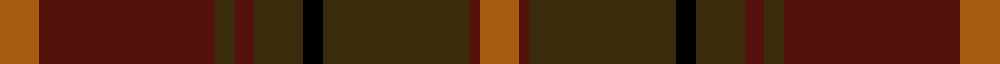

This is one **variant** — a specific cloth: this exact thread count and colourway, with its own
provenance below. It is one weaving of the [sett](/tartans/r/re/redwoods/) (the scale-free proportion — the
same cloth at any scale or shade), whose colour order is pattern [RBGBGKGBR](/stripes/rbgbgkgbr/).

Part of the [Redwoods](/tartans/r/re/redwoods/) tartan — the named design grouping this sett with its other cloths.

Sourced from register-of-tartans.  It is a [9 stripe tartan](/stripes/stripes9/).

Original link [https://www.tartanregister.gov.uk/tartanDetails.aspx?ref=3484](https://www.tartanregister.gov.uk/tartanDetails.aspx?ref=3484)

2 attestations — the source records this cloth was collapsed from (oldest owns this page)

<ul>
<li>01/01/1972 — Redwoods (register-of-tartans, <a href="https://www.tartanregister.gov.uk/tartanDetails.aspx?ref=3484">record</a>)  <em>Sample in Scottish Tartans Authority's Johnston Collection.</em></li>
<li>pre 1972 — Redwoods (Fashion) (tartans-authority, <a href="https://web.archive.org/web/*/http://www.tartansauthority.com/tartan-ferret/display/5422/*">record</a>)  <em>Sample in STA Johnston Collection.</em></li>
</ul>

Dataset <small>— provenance for this record, inherited from the source manifest</small>

<dl class="dataset-prov">
<dt>source</dt><dd><a href="/sources/register-of-tartans/">Scottish Register of Tartans</a></dd>
<dt>data captured from</dt><dd><a href="https://github.com/thetartan/tartan-database/blob/master/data/register-of-tartans/data.csv">https://github.com/thetartan/tartan-database/blob/master/data/register-of-tartans/data.csv</a></dd>
<dt>data date</dt><dd>1972 <small>(this record)</small></dd>
<dt>licence</dt><dd><a href="https://www.tartanregister.gov.uk/copyright">Crown copyright</a></dd>
</dl>

Capture chain <small>— the hands this data passed through, oldest first; each capture carries its own licence</small>

<ol class="capture-chain">
<li><a href="https://www.tartanregister.gov.uk/">Scottish Register of Tartans</a> · <a href="https://www.tartanregister.gov.uk/copyright">Crown copyright</a> <small>the living register — still published by National Records of Scotland</small></li>
<li><a href="https://github.com/thetartan/tartan-database">thetartan/tartan-database</a> <small>2016-2017</small> · <a href="https://creativecommons.org/licenses/by-nc-nd/4.0/">CC BY-NC-ND 4.0</a> <small>Levko Kravets's frozen compilation — the capture we vendored, and where its CC licence text came from</small></li>
<li>this dictionary <small>captured 2026-06-10 · commit 5bf86c7566</small> <small>each re-capture is a git commit to data/sources</small></li>
</ol>

## Register references

External register numbers recorded for this tartan.

- Scottish Register of Tartans: [3484](https://www.tartanregister.gov.uk/tartanDetails.aspx?ref=3484)
- Scottish Tartans Authority (ITI): 5422

## Thread count
O/8 DR36 DY4 DR4 DY10 K4 DY30 DR2 O/8

One full sett is **196 threads**.

## Palette
<table><thead><tr><th>Colour</th><th>Shade</th><th>OKLCh</th></tr></thead><tbody><tr><td>DR</td><td><code style="background-color:#55120C;">#55120C</code> <small style="color:#888">#55120C</small></td><td><small style="color:#888">oklch(30.0% 0.099 29.3)</small></td></tr><tr><td>K</td><td><code style="background-color:#000000;">#000000</code> <small style="color:#888">#000000</small></td><td><small style="color:#888">oklch(0.0% 0.000 0.0)</small></td></tr><tr><td>O</td><td><code style="background-color:#A65C11;">#A65C11</code> <small style="color:#888">#A65C11</small></td><td><small style="color:#888">oklch(55.0% 0.125 58.3)</small></td></tr><tr><td>DY</td><td><code style="background-color:#3A2B0D;">#3A2B0D</code> <small style="color:#888">#3A2B0D</small></td><td><small style="color:#888">oklch(30.0% 0.049 82.0)</small></td></tr></tbody></table>

# Sample pattern

## Nearest tartan variants

The nearest existing variants by ΔTartan distance, with this cloth at the top so the swatches line up against it.

ΔTartan

Threads

Variant

Sett

—

196

<a href="/variants/s9/o4dr18dy2dr2dy5k2dy15dr1o4~x2/">Redwoods</a>

<a href="/ttd/edit/#slug=do24g2do5oi14g2oi5o17do2~x2~oi2104058-o2102055&amp;base=o4dr18dy2dr2dy5k2dy15dr1o4~x2" title="compare in the TTD">3.58</a>

232

<a href="/variants/s8/do24g2do5oi14g2oi5o17do2~x2~oi2104058-o2102055/">Loch Rannoch</a>

<a href="/ttd/edit/#slug=do44oii5o8oii2o2oii2o2oii14oi9o2oi4oii2~x2~oii2104058-o1604043-oi2102055&amp;base=o4dr18dy2dr2dy5k2dy15dr1o4~x2" title="compare in the TTD">3.90</a>

292

<a href="/variants/s12/do44oii5o8oii2o2oii2o2oii14oi9o2oi4oii2~x2~oii2104058-o1604043-oi2102055/">Waverly, Check</a>

## Neighbour map

Every grey dot is one of 13656 variants placed by the first two principal components of the ΔTartan feature space (42% of its variance). Red is this tartan; blue dots are its nearest — click one to open its page. The map is a flat projection of a many-dimensional space — [how to read it](/posts/neighbourhood-maps/).

<svg viewBox="0 0 640 380" role="img" style="max-width:100%;height:auto;border:1px solid #e0e0e0;border-radius:4px;display:block" xmlns="http://www.w3.org/2000/svg"><image href="/nn/cloud.v1.png" width="640" height="380"/><a href="/variants/s8/do24g2do5oi14g2oi5o17do2~x2~oi2104058-o2102055/"><circle cx="371.7" cy="236.5" r="4" fill="#3465a4"><title>Loch Rannoch</title></circle></a><a href="/variants/s12/do44oii5o8oii2o2oii2o2oii14oi9o2oi4oii2~x2~oii2104058-o1604043-oi2102055/"><circle cx="452.1" cy="175.9" r="4" fill="#3465a4"><title>Waverly, Check</title></circle></a><circle cx="394.4" cy="202.2" r="5" fill="#c00000"/><text x="320" y="376" text-anchor="middle" font-size="11" fill="#999">ground</text><text x="11" y="190" text-anchor="middle" font-size="11" fill="#999" transform="rotate(-90 11 190)">complexity</text></svg>

ID: /variants/s9/o4dr18dy2dr2dy5k2dy15dr1o4~x2/
