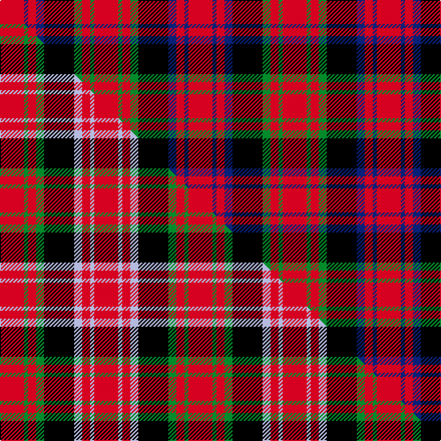

This is one **variant** — a specific cloth: this exact thread count and colourway, with its own
provenance below. It is one weaving of the [sett](/tartans/a/al/alexander-2/) (the scale-free proportion — the
same cloth at any scale or shade), whose colour order is pattern [RBRBKGRGR](/stripes/rbrbkgrgr/).

Part of the [Alexander](/tartans/a/al/alexander-2/) tartan — the named design grouping this sett with its other cloths.

Sourced from house-of-tartan.  It is a [9 stripe tartan](/stripes/stripes9/).

Original link [http://www.house-of-tartan.scotland.net/house/TartanViewjs.asp?colr=Def&tnam=1405](http://www.house-of-tartan.scotland.net/house/TartanViewjs.asp?colr=Def&tnam=1405)

## Provenance

Earliest known date: 1984 The weaving and wearing of this tartan is 'Restricted'. This is not a legal definition and is applied by the Scottish Tartans Society irrespective of Design Patent or Copyright, in the spirit of a gentlemans agreement. Interested parties should contact the person listed under 'Source:' in this document.

3 attestations — the source records this cloth was collapsed from (oldest owns this page)

<ul>
<li>1984 — Alexander Family Tartan (house-of-tartan, <a href="http://www.house-of-tartan.scotland.net/house/TartanViewjs.asp?colr=Def&tnam=1405">record</a>) </li>
<li>pre 1985 — Alexander - 1985 (Name) (tartans-authority, <a href="https://web.archive.org/web/*/http://www.tartansauthority.com/tartan-ferret/display/1405/*">record</a>)  <em>Originally designed for the personal use of Mr T L Alexander but now (2005) regarded by Peter MacDonald as a tartan for all of the name.. See also #411. Sample in STA Dalgety Collection.</em></li>
<li>undated — Alexander (weddslist, <a href="http://www.weddslist.com/cgi-bin/tartans/pg.pl?source=sts">record</a>) </li>
</ul>

Dataset <small>— provenance for this record, inherited from the source manifest</small>

<dl class="dataset-prov">
<dt>source</dt><dd><a href="/sources/house-of-tartan/">House of Tartan</a></dd>
<dt>data captured from</dt><dd><a href="https://github.com/thetartan/tartan-database/blob/master/data/house-of-tartan/data.csv">https://github.com/thetartan/tartan-database/blob/master/data/house-of-tartan/data.csv</a></dd>
<dt>data date</dt><dd>1984 <small>(this record)</small></dd>
<dt>licence</dt><dd><a href="https://creativecommons.org/licenses/by-nc-nd/4.0/">CC BY-NC-ND 4.0</a></dd>
</dl>

Capture chain <small>— the hands this data passed through, oldest first; each capture carries its own licence</small>

<ol class="capture-chain">
<li><a href="http://www.house-of-tartan.scotland.net/">House of Tartan</a> <small>the weaver/retailer's database — the site is now offline; the URL is kept as the ultimate source's identity</small></li>
<li><a href="https://github.com/thetartan/tartan-database">thetartan/tartan-database</a> <small>2016-2017</small> · <a href="https://creativecommons.org/licenses/by-nc-nd/4.0/">CC BY-NC-ND 4.0</a> <small>Levko Kravets's frozen compilation — the capture we vendored, and where its CC licence text came from</small></li>
<li>this dictionary <small>captured 2026-06-10 · commit 5bf86c7566</small> <small>each re-capture is a git commit to data/sources</small></li>
</ol>

## Register references

External register numbers recorded for this tartan.

- Scottish Tartans Authority (ITI): 1405

## Thread count
R/24 DB4 R8 DB8 K30 G8 R8 G4 R/24

One full sett is **188 threads**.

## Palette
<table><thead><tr><th>Colour</th><th>Shade</th><th>OKLCh</th></tr></thead><tbody><tr><td>DB</td><td><code style="background-color:#082077;">#082077</code> <small style="color:#888">#082077</small></td><td><small style="color:#888">oklch(30.0% 0.149 265.1)</small></td></tr><tr><td>G</td><td><code style="background-color:#008B2A;">#008B2A</code> <small style="color:#888">#008B2A</small></td><td><small style="color:#888">oklch(55.4% 0.170 145.9)</small></td></tr><tr><td>K</td><td><code style="background-color:#000000;">#000000</code> <small style="color:#888">#000000</small></td><td><small style="color:#888">oklch(0.0% 0.000 0.0)</small></td></tr><tr><td>R</td><td><code style="background-color:#D60020;">#D60020</code> <small style="color:#888">#D60020</small></td><td><small style="color:#888">oklch(55.2% 0.224 25.5)</small></td></tr></tbody></table>

# Sample pattern

[Sample sheet (PDF)](swatch.pdf) — the woven sample, thread count and palette on one printable A4, rendered on demand (the same sheet the TTD print page downloads).

## Compared to the master

This cloth is one sett of its design; the master sett (the exemplar the design is anchored on) is below for comparison.

Its **ΔTartan distance** from the master is **0.10** — the same measure the nearest-tartans table ranks by (0 is identical; a re-scale of the same cloth is near 0, a recolour or a different proportion further).

<figure class="master-compare" style="margin:0">

this sett
master sett ★

<figcaption style="color:#888;font-size:smaller">One weave of this sett against the <a href="/setts/r12g2r4g4k15lb4r4lb2r12/">master sett ★</a>, split on the diagonal: a shared proportion runs seamlessly across it with only the shades shifting; a different proportion breaks on it.</figcaption>
</figure>

## Nearest tartan variants

The nearest existing variants by ΔTartan distance, with this cloth at the top so the swatches line up against it.

ΔTartan

Threads

Variant

Sett

—

188

<a href="/variants/s9/r12db2r4db4k15g4r4g2r12~x2/">Alexander Family Tartan</a>

<a href="/ttd/edit/#slug=r12g2r4g4k15lb4r4lb2r12~x2&amp;base=r12db2r4db4k15g4r4g2r12~x2" title="compare in the TTD">0.10</a>

188

<a href="/variants/s9/r12g2r4g4k15lb4r4lb2r12~x2/">Alexander (Personal)</a>

<a href="/ttd/edit/#slug=r6g3r6db1w1db1r2db8r4~x4&amp;base=r12db2r4db4k15g4r4g2r12~x2" title="compare in the TTD">1.94</a>

216

<a href="/variants/s9/r6g3r6db1w1db1r2db8r4~x4/">Cameron of Locheil #2</a>

<a href="/ttd/edit/#slug=r6g3r6db1w1db1r2db8r4&amp;base=r12db2r4db4k15g4r4g2r12~x2" title="compare in the TTD">1.94</a>

54

<a href="/variants/s9/r6g3r6db1w1db1r2db8r4/">Cameron of Locheil</a>

<a href="/ttd/edit/#slug=r6g3r6db1w1db1r2db8r4~x2&amp;base=r12db2r4db4k15g4r4g2r12~x2" title="compare in the TTD">1.94</a>

108

<a href="/variants/s9/r6g3r6db1w1db1r2db8r4~x2/">Cameron of Lochiel (Smith) Clan Tartan</a>

<a href="/ttd/edit/#slug=w2r12k3r3k16r3k3r12ly2~x2&amp;base=r12db2r4db4k15g4r4g2r12~x2" title="compare in the TTD">1.98</a>

216

<a href="/variants/s9/w2r12k3r3k16r3k3r12ly2~x2/">MacIver (Clan)</a>

<a href="/ttd/edit/#slug=r24db8r23k4w4k4r10k32r8&amp;base=r12db2r4db4k15g4r4g2r12~x2" title="compare in the TTD">2.11</a>

202

<a href="/variants/s9/r24db8r23k4w4k4r10k32r8/">Cameron of Locheil #3</a>

<a href="/ttd/edit/#slug=db24r3db4r6g8r3g8r30k3~x2&amp;base=r12db2r4db4k15g4r4g2r12~x2" title="compare in the TTD">2.35</a>

302

<a href="/variants/s9/db24r3db4r6g8r3g8r30k3~x2/">Gates</a>

<a href="/ttd/edit/#slug=r36db9k12dg17r10k3r10~x2&amp;base=r12db2r4db4k15g4r4g2r12~x2" title="compare in the TTD">2.38</a>

296

<a href="/variants/s7/r36db9k12dg17r10k3r10~x2/">MacDuff - 1819 (Clan)</a>

<a href="/ttd/edit/#slug=r36db9k12g17r10k3r10~x2&amp;base=r12db2r4db4k15g4r4g2r12~x2" title="compare in the TTD">2.39</a>

296

<a href="/variants/s7/r36db9k12g17r10k3r10~x2/">MacDuff #6</a>

<a href="/ttd/edit/#slug=k2r10g2r10g13r2k6lb2k8r10g2r10k2~x2&amp;base=r12db2r4db4k15g4r4g2r12~x2" title="compare in the TTD">2.40</a>

308

<a href="/variants/s13/k2r10g2r10g13r2k6lb2k8r10g2r10k2~x2/">MacNicol D</a>

## Neighbour map

Every grey dot is one of 13662 variants placed by the first two principal components of the ΔTartan feature space (42% of its variance). Red is this tartan; blue dots are its nearest — click one to open its page. The map is a flat projection of a many-dimensional space — [how to read it](/posts/neighbourhood-maps/).

<svg viewBox="0 0 640 380" role="img" style="max-width:100%;height:auto;border:1px solid #e0e0e0;border-radius:4px;display:block" xmlns="http://www.w3.org/2000/svg"><image href="/nn/cloud.v1.png" width="640" height="380"/><a href="/variants/s9/r12g2r4g4k15lb4r4lb2r12~x2/"><circle cx="212.9" cy="182.6" r="4" fill="#3465a4"><title>Alexander (Personal)</title></circle></a><a href="/variants/s9/r6g3r6db1w1db1r2db8r4~x4/"><circle cx="280.8" cy="204.1" r="4" fill="#3465a4"><title>Cameron of Locheil #2</title></circle></a><a href="/variants/s9/r6g3r6db1w1db1r2db8r4/"><circle cx="280.8" cy="204.1" r="4" fill="#3465a4"><title>Cameron of Locheil</title></circle></a><a href="/variants/s9/r6g3r6db1w1db1r2db8r4~x2/"><circle cx="280.8" cy="204.1" r="4" fill="#3465a4"><title>Cameron of Lochiel (Smith) Clan Tartan</title></circle></a><a href="/variants/s9/w2r12k3r3k16r3k3r12ly2~x2/"><circle cx="235.1" cy="163.8" r="4" fill="#3465a4"><title>MacIver (Clan)</title></circle></a><a href="/variants/s9/r24db8r23k4w4k4r10k32r8/"><circle cx="235.8" cy="170.1" r="4" fill="#3465a4"><title>Cameron of Locheil #3</title></circle></a><a href="/variants/s9/db24r3db4r6g8r3g8r30k3~x2/"><circle cx="230.7" cy="163.5" r="4" fill="#3465a4"><title>Gates</title></circle></a><a href="/variants/s7/r36db9k12dg17r10k3r10~x2/"><circle cx="265.1" cy="177.8" r="4" fill="#3465a4"><title>MacDuff - 1819 (Clan)</title></circle></a><a href="/variants/s7/r36db9k12g17r10k3r10~x2/"><circle cx="258.2" cy="177.5" r="4" fill="#3465a4"><title>MacDuff #6</title></circle></a><a href="/variants/s13/k2r10g2r10g13r2k6lb2k8r10g2r10k2~x2/"><circle cx="189.4" cy="177.6" r="4" fill="#3465a4"><title>MacNicol D</title></circle></a><circle cx="217.9" cy="184.0" r="5" fill="#c00000"/><text x="320" y="376" text-anchor="middle" font-size="11" fill="#999">ground</text><text x="11" y="190" text-anchor="middle" font-size="11" fill="#999" transform="rotate(-90 11 190)">complexity</text></svg>

ID: /variants/s9/r12db2r4db4k15g4r4g2r12~x2/
