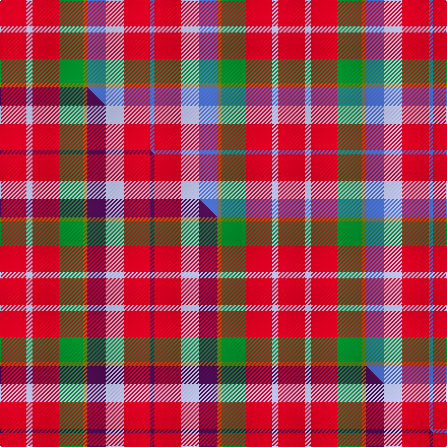

This is one **variant** — a specific cloth: this exact thread count and colourway, with its own
provenance below. It is one weaving of the [sett](/setts/r13lb3r13g12y2b9lb9r13b2/) (the scale-free proportion — the
same cloth at any scale or shade), whose colour order is pattern [BRWBGGRWR](/stripes/brwbggrwr/).

Part of the [Caledonia No 3](/tartans/caledonia-no-3/) tartan — the named design grouping this sett with its other cloths.

Sourced from weddslist.  It is a [9 stripe tartan](/stripes/stripes9/).

Original link [http://www.weddslist.com/cgi-bin/tartans/pg.pl?source=sts](http://www.weddslist.com/cgi-bin/tartans/pg.pl?source=sts)

Dataset <small>— provenance for this record, inherited from the source manifest</small>

<dl class="dataset-prov">
<dt>source</dt><dd><a href="/sources/weddslist/">Weddslist</a></dd>
<dt>data captured from</dt><dd><a href="https://github.com/thetartan/tartan-database/blob/master/data/weddslist/data.csv">https://github.com/thetartan/tartan-database/blob/master/data/weddslist/data.csv</a></dd>
<dt>data date</dt><dd>2016-11-17 <small>(dataset default)</small></dd>
<dt>licence</dt><dd><a href="https://creativecommons.org/licenses/by-nc-nd/4.0/">CC BY-NC-ND 4.0</a></dd>
</dl>

Capture chain <small>— the hands this data passed through, oldest first; each capture carries its own licence</small>

<ol class="capture-chain">
<li><a href="https://www.weddslist.com/tartans/">Weddslist</a> <small>the living privately compiled reference</small></li>
<li><a href="https://github.com/thetartan/tartan-database">thetartan/tartan-database</a> <small>2016-2017</small> · <a href="https://creativecommons.org/licenses/by-nc-nd/4.0/">CC BY-NC-ND 4.0</a> <small>Levko Kravets's frozen compilation — the capture we vendored, and where its CC licence text came from</small></li>
<li>this dictionary <small>captured 2026-06-10 · commit 5bf86c7566</small> <small>each re-capture is a git commit to data/sources</small></li>
</ol>

## Thread count
R/26 LB6 R26 G24 Y4 B18 LB18 R26 B/4

One full sett is **274 threads**.

## Palette
<table><thead><tr><th>Colour</th><th>Shade</th><th>OKLCh</th></tr></thead><tbody><tr><td>LB</td><td><code style="background-color:#B5BBDE;">#B5BBDE</code> <small style="color:#888">#B5BBDE</small></td><td><small style="color:#888">oklch(79.9% 0.050 277.6)</small></td></tr><tr><td>B</td><td><code style="background-color:#466CC8;">#466CC8</code> <small style="color:#888">#466CC8</small></td><td><small style="color:#888">oklch(55.1% 0.149 265.0)</small></td></tr><tr><td>G</td><td><code style="background-color:#008B2A;">#008B2A</code> <small style="color:#888">#008B2A</small></td><td><small style="color:#888">oklch(55.4% 0.170 145.9)</small></td></tr><tr><td>R</td><td><code style="background-color:#D60020;">#D60020</code> <small style="color:#888">#D60020</small></td><td><small style="color:#888">oklch(55.2% 0.224 25.5)</small></td></tr><tr><td>Y</td><td><code style="background-color:#8B6E00;">#8B6E00</code> <small style="color:#888">#8B6E00</small></td><td><small style="color:#888">oklch(55.1% 0.113 90.4)</small></td></tr></tbody></table>

# Sample pattern

## Compared to the master

This cloth is one sett of its design; the master sett (the exemplar the design is anchored on) is below for comparison.

Its **ΔTartan distance** from the master is **2.27** — the same measure the nearest-tartans table ranks by (0 is identical; a re-scale of the same cloth is near 0, a recolour or a different proportion further).

<figure class="master-compare" style="margin:0">

this sett
master sett ★

<figcaption style="color:#888;font-size:smaller">One weave of this sett against the <a href="/setts/r13lb3r13g12y2dp9lb9r13dp2/">master sett ★</a>, split on the diagonal: a shared proportion runs seamlessly across it with only the shades shifting; a different proportion breaks on it.</figcaption>
</figure>

## Nearest tartan variants

The nearest existing variants by ΔTartan distance, with this cloth at the top so the swatches line up against it.

ΔTartan

Threads

Variant

Sett

—

274

<a href="/variants/s9/r13lb3r13g12y2b9lb9r13b2~x2/">Caledonia No 3</a>

<a href="/ttd/edit/#slug=r13lb3r13g12y2dp9lb9r13dp2~x2&amp;base=r13lb3r13g12y2b9lb9r13b2~x2" title="compare in the TTD">2.27</a>

274

<a href="/variants/s9/r13lb3r13g12y2dp9lb9r13dp2~x2/">Caledonia No 3</a>

<a href="/ttd/edit/#slug=b2r11lb9b11y2g13r21w2~x2&amp;base=r13lb3r13g12y2b9lb9r13b2~x2" title="compare in the TTD">2.43</a>

276

<a href="/variants/s8/b2r11lb9b11y2g13r21w2~x2/">Wilson's, No 2</a>

<a href="/ttd/edit/#slug=n4dp3n13dg8r12g4r12n4r5w4r4~x2~n2203265-dp1502305&amp;base=r13lb3r13g12y2b9lb9r13b2~x2" title="compare in the TTD">2.81</a>

276

<a href="/variants/s11/n4dp3n13dg8r12g4r12n4r5w4r4~x2~n2203265-dp1502305/">Hueg (Munich) Formal (Personal)</a>

<a href="/ttd/edit/#slug=r29t12lg15r8lg15t12r29w4~x2&amp;base=r13lb3r13g12y2b9lb9r13b2~x2" title="compare in the TTD">2.83</a>

430

<a href="/variants/s8/r29t12lg15r8lg15t12r29w4~x2/">Snowbird</a>

<a href="/ttd/edit/#slug=r4w4r5t4r12dg4r12g8t13db3t4~x2&amp;base=r13lb3r13g12y2b9lb9r13b2~x2" title="compare in the TTD">3.26</a>

276

<a href="/variants/s11/r4w4r5t4r12dg4r12g8t13db3t4~x2/">Hueg (Formal) (Personal)</a>

<a href="/ttd/edit/#slug=db8y1g12r10ly2r6ly2r4~x4&amp;base=r13lb3r13g12y2b9lb9r13b2~x2" title="compare in the TTD">3.37</a>

312

<a href="/variants/s8/db8y1g12r10ly2r6ly2r4~x4/">Indiana &quot;Cardinal&quot;</a>

<a href="/ttd/edit/#slug=r6w1r6db2r6g12y1db8lb4r4~x2&amp;base=r13lb3r13g12y2b9lb9r13b2~x2" title="compare in the TTD">3.38</a>

180

<a href="/variants/s10/r6w1r6db2r6g12y1db8lb4r4~x2/">Unnamed No 57 Tartan</a>

<a href="/ttd/edit/#slug=r1do1r9g6lb2t3r2ly1~x4&amp;base=r13lb3r13g12y2b9lb9r13b2~x2" title="compare in the TTD">3.39</a>

192

<a href="/variants/s8/r1do1r9g6lb2t3r2ly1~x4/">Battle of Bannockburn, The</a>

<a href="/ttd/edit/#slug=y18r18dg30r12db55r42dg6r18dg6r42g44r12dg12&amp;base=r13lb3r13g12y2b9lb9r13b2~x2" title="compare in the TTD">3.45</a>

600

<a href="/variants/s13/y18r18dg30r12db55r42dg6r18dg6r42g44r12dg12/">Unidentified Plaid #4</a>

<a href="/ttd/edit/#slug=r1dy1r9g6lg2gi3r2y1~x4~lg2803208-gi2203208&amp;base=r13lb3r13g12y2b9lb9r13b2~x2" title="compare in the TTD">3.49</a>

192

<a href="/variants/s8/r1dy1r9g6lg2t3r2y1~x4~lg2803208-t2203208/">Battle of Bannockburn, The</a>

## Neighbour map

Every grey dot is one of 13621 variants placed by the first two principal components of the ΔTartan feature space (42% of its variance). Red is this tartan; blue dots are its nearest — click one to open its page.

<svg viewBox="0 0 640 380" role="img" style="max-width:100%;height:auto;border:1px solid #e0e0e0;border-radius:4px;display:block" xmlns="http://www.w3.org/2000/svg"><image href="/nn/cloud.v1.png" width="640" height="380"/><a href="/variants/s9/r13lb3r13g12y2dp9lb9r13dp2~x2/"><circle cx="221.0" cy="226.2" r="4" fill="#3465a4"><title>Caledonia No 3</title></circle></a><a href="/variants/s8/b2r11lb9b11y2g13r21w2~x2/"><circle cx="203.9" cy="188.4" r="4" fill="#3465a4"><title>Wilson's, No 2</title></circle></a><a href="/variants/s11/n4dp3n13dg8r12g4r12n4r5w4r4~x2~n2203265-dp1502305/"><circle cx="166.7" cy="224.0" r="4" fill="#3465a4"><title>Hueg (Munich) Formal (Personal)</title></circle></a><a href="/variants/s8/r29t12lg15r8lg15t12r29w4~x2/"><circle cx="262.9" cy="244.3" r="4" fill="#3465a4"><title>Snowbird</title></circle></a><a href="/variants/s11/r4w4r5t4r12dg4r12g8t13db3t4~x2/"><circle cx="152.8" cy="222.6" r="4" fill="#3465a4"><title>Hueg (Formal) (Personal)</title></circle></a><a href="/variants/s8/db8y1g12r10ly2r6ly2r4~x4/"><circle cx="209.6" cy="195.1" r="4" fill="#3465a4"><title>Indiana &quot;Cardinal&quot;</title></circle></a><a href="/variants/s10/r6w1r6db2r6g12y1db8lb4r4~x2/"><circle cx="173.6" cy="173.1" r="4" fill="#3465a4"><title>Unnamed No 57 Tartan</title></circle></a><a href="/variants/s8/r1do1r9g6lb2t3r2ly1~x4/"><circle cx="234.6" cy="182.1" r="4" fill="#3465a4"><title>Battle of Bannockburn, The</title></circle></a><a href="/variants/s13/y18r18dg30r12db55r42dg6r18dg6r42g44r12dg12/"><circle cx="196.6" cy="190.3" r="4" fill="#3465a4"><title>Unidentified Plaid #4</title></circle></a><a href="/variants/s8/r1dy1r9g6lg2t3r2y1~x4~lg2803208-t2203208/"><circle cx="247.2" cy="186.3" r="4" fill="#3465a4"><title>Battle of Bannockburn, The</title></circle></a><circle cx="232.5" cy="232.6" r="5" fill="#c00000"/><text x="320" y="376" text-anchor="middle" font-size="11" fill="#999">ground</text><text x="11" y="190" text-anchor="middle" font-size="11" fill="#999" transform="rotate(-90 11 190)">complexity</text></svg>

ID: /variants/s9/r13lb3r13g12y2b9lb9r13b2~x2/
