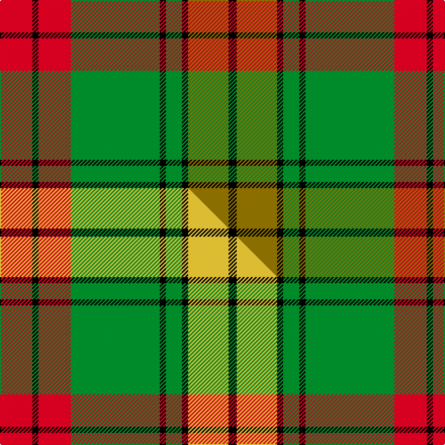

This page is one **sett** — a single exact thread-count. It belongs to the [tartan](/setts/r16k3r16g44k3g8k3y20k4/)
(the same proportion at any scale), whose colour order is pattern [KGKGKGRKR](/stripes/kgkgkgrkr/).

Part of the [MacMillan Society of Glasgow](/tartans/macmillan-society-of-glasgow/) tartan — the named design grouping this sett with its other cloths.

Sourced from weddslist.  It is a [9 stripe tartan](/stripes/stripes9/).

Original link http://www.weddslist.com/cgi-bin/tartans/pg.pl?source=sts

## Thread count
R/32 K6 R32 G88 K6 G16 K6 Y40 K/8

One full sett is **428 threads**.

## Palette
<table><thead><tr><th>Colour</th><th>Shade</th><th>OKLCh</th></tr></thead><tbody><tr><td>G</td><td><code style="background-color:#008B2A;">#008B2A</code> <small style="color:#888">#008B2A</small></td><td><small style="color:#888">oklch(55.4% 0.170 145.9)</small></td></tr><tr><td>K</td><td><code style="background-color:#000000;">#000000</code> <small style="color:#888">#000000</small></td><td><small style="color:#888">oklch(0.0% 0.000 0.0)</small></td></tr><tr><td>R</td><td><code style="background-color:#D60020;">#D60020</code> <small style="color:#888">#D60020</small></td><td><small style="color:#888">oklch(55.2% 0.224 25.5)</small></td></tr><tr><td>Y</td><td><code style="background-color:#8B6E00;">#8B6E00</code> <small style="color:#888">#8B6E00</small></td><td><small style="color:#888">oklch(55.1% 0.113 90.4)</small></td></tr></tbody></table>

# Sample pattern

## Compared to the master

This cloth is one sett of its design; the master sett (the exemplar the design is anchored on) is below for comparison.

Its **ΔTartan distance** from the master is **0.64** — the same measure the nearest-tartans table ranks by (0 is identical; a re-scale of the same cloth is near 0, a recolour or a different proportion further).

<figure class="master-compare" style="margin:0">

this sett
master sett ★

<figcaption style="color:#888;font-size:smaller">One weave of this sett against the <a href="/setts/r16k3r16g44k3g8k3ly20k4/">master sett ★</a>, split on the diagonal: a shared proportion runs seamlessly across it with only the shades shifting; a different proportion breaks on it.</figcaption>
</figure>

## Nearest tartan variants

The nearest existing variants by ΔTartan distance, with this cloth at the top so the swatches line up against it.

ΔTartan

Threads

Variant

Sett

—

428

<a href="/variants/s9/r16k3r16g44k3g8k3y20k4~x2/">MacMillan, Society of Glasgow</a>

<a href="/ttd/edit/#slug=r16k3r16g44k3g8k3ly20k4~x2&amp;base=r16k3r16g44k3g8k3y20k4~x2" title="compare in the TTD">0.00</a>

428

<a href="/variants/s9/r16k3r16g44k3g8k3ly20k4~x2/">MacMillan Society of Glasgow</a>

<a href="/ttd/edit/#slug=g24k3g2k3g4k4r20k3r6~x2&amp;base=r16k3r16g44k3g8k3y20k4~x2" title="compare in the TTD">1.56</a>

216

<a href="/variants/s9/g24k3g2k3g4k4r20k3r6~x2/">Alma College (Corporate)</a>

<a href="/ttd/edit/#slug=g22k1g2k1g3k8r20k1r3~x4&amp;base=r16k3r16g44k3g8k3y20k4~x2" title="compare in the TTD">1.63</a>

388

<a href="/variants/s9/g22k1g2k1g3k8r20k1r3~x4/">Stewart of Atholl (Clan)</a>

<a href="/ttd/edit/#slug=g22k1g2k1g3k8r20k1r6~x2&amp;base=r16k3r16g44k3g8k3y20k4~x2" title="compare in the TTD">1.66</a>

200

<a href="/variants/s9/g22k1g2k1g3k8r20k1r6~x2/">Stewart of Atholl</a>

<a href="/ttd/edit/#slug=r20k2r2k2r2k8g24db2g3~x2&amp;base=r16k3r16g44k3g8k3y20k4~x2" title="compare in the TTD">2.07</a>

214

<a href="/variants/s9/r20k2r2k2r2k8g24db2g3~x2/">Mostyn</a>

<a href="/ttd/edit/#slug=g12lb6g6r15k1r1k2~x4&amp;base=r16k3r16g44k3g8k3y20k4~x2" title="compare in the TTD">2.34</a>

288

<a href="/variants/s7/g12lb6g6r15k1r1k2~x4/">McCook/Cook (Name)</a>

<a href="/ttd/edit/#slug=g12lb6g6r15k1r1k2~x2&amp;base=r16k3r16g44k3g8k3y20k4~x2" title="compare in the TTD">2.34</a>

144

<a href="/variants/s7/g12lb6g6r15k1r1k2~x2/">(2) Cook</a>

<a href="/ttd/edit/#slug=dg12g6dg6r15k1r1k2~x2&amp;base=r16k3r16g44k3g8k3y20k4~x2" title="compare in the TTD">2.34</a>

144

<a href="/variants/s7/dg12g6dg6r15k1r1k2~x2/">Cook (Name)</a>

<a href="/ttd/edit/#slug=g28db3g3k10r2k10r20y4~x2&amp;base=r16k3r16g44k3g8k3y20k4~x2" title="compare in the TTD">2.43</a>

256

<a href="/variants/s8/g28db3g3k10r2k10r20y4~x2/">Garvock (2015)</a>

<a href="/ttd/edit/#slug=k2r7k6g12y1g1k2~x4&amp;base=r16k3r16g44k3g8k3y20k4~x2" title="compare in the TTD">2.74</a>

232

<a href="/variants/s7/k2r7k6g12y1g1k2~x4/">Blackstock Hunting</a>

## Neighbour map

Every grey dot is one of 13620 variants placed by the first two principal components of the ΔTartan feature space (42% of its variance). Red is this tartan; blue dots are its nearest — click one to open its page.

<svg viewBox="0 0 640 380" role="img" style="max-width:100%;height:auto;border:1px solid #e0e0e0;border-radius:4px;display:block" xmlns="http://www.w3.org/2000/svg"><image href="/nn/cloud.v1.png" width="640" height="380"/><a href="/variants/s9/r16k3r16g44k3g8k3ly20k4~x2/"><circle cx="200.3" cy="152.2" r="4" fill="#3465a4"><title>MacMillan Society of Glasgow</title></circle></a><a href="/variants/s9/g24k3g2k3g4k4r20k3r6~x2/"><circle cx="224.9" cy="164.8" r="4" fill="#3465a4"><title>Alma College (Corporate)</title></circle></a><a href="/variants/s9/g22k1g2k1g3k8r20k1r3~x4/"><circle cx="255.8" cy="133.1" r="4" fill="#3465a4"><title>Stewart of Atholl (Clan)</title></circle></a><a href="/variants/s9/g22k1g2k1g3k8r20k1r6~x2/"><circle cx="248.6" cy="137.6" r="4" fill="#3465a4"><title>Stewart of Atholl</title></circle></a><a href="/variants/s9/r20k2r2k2r2k8g24db2g3~x2/"><circle cx="201.1" cy="144.1" r="4" fill="#3465a4"><title>Mostyn</title></circle></a><a href="/variants/s7/g12lb6g6r15k1r1k2~x4/"><circle cx="210.2" cy="173.7" r="4" fill="#3465a4"><title>McCook/Cook (Name)</title></circle></a><a href="/variants/s7/g12lb6g6r15k1r1k2~x2/"><circle cx="210.2" cy="173.7" r="4" fill="#3465a4"><title>(2) Cook</title></circle></a><a href="/variants/s7/dg12g6dg6r15k1r1k2~x2/"><circle cx="222.5" cy="174.9" r="4" fill="#3465a4"><title>Cook (Name)</title></circle></a><a href="/variants/s8/g28db3g3k10r2k10r20y4~x2/"><circle cx="147.0" cy="148.2" r="4" fill="#3465a4"><title>Garvock (2015)</title></circle></a><a href="/variants/s7/k2r7k6g12y1g1k2~x4/"><circle cx="175.4" cy="171.0" r="4" fill="#3465a4"><title>Blackstock Hunting</title></circle></a><circle cx="219.1" cy="158.1" r="5" fill="#c00000"/><text x="320" y="376" text-anchor="middle" font-size="11" fill="#999">ground</text><text x="11" y="190" text-anchor="middle" font-size="11" fill="#999" transform="rotate(-90 11 190)">complexity</text></svg>

ID: /variants/s9/r16k3r16g44k3g8k3y20k4~x2/
