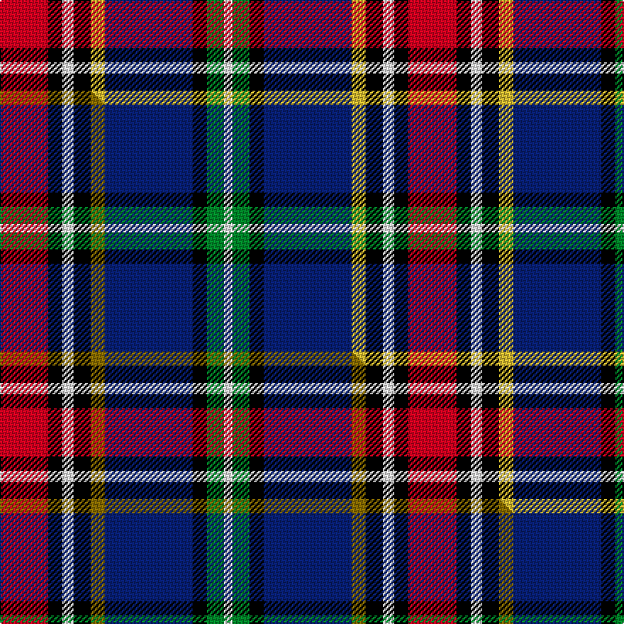

This page is one **sett** — a single exact thread-count. It belongs to the [tartan](/setts/r17k5w4k6ly5db31k5g6w3/)
(the same proportion at any scale), whose colour order is pattern [RKWKYBKGW](/stripes/rkwkybkgw/).

Part of the [Dean/Dundas](/tartans/dean-dundas/) tartan — the named design grouping this sett with its other cloths.

Sourced from tartans-authority.  It is a [9 stripe tartan](/stripes/stripes9/).

Original link http://www.tartansauthority.com/tartan-ferret/display/10444/

## Register references

External register numbers recorded for this tartan.

- Scottish Register of Tartans: [10444](https://www.tartanregister.gov.uk/tartanDetails?ref=10444)
- Scottish Tartans Authority (ITI): 10444

## Thread count
R/34 K10 W8 K12 LY10 DB62 K10 G12 W/6

One full sett is **288 threads**.

## Palette
<table><thead><tr><th>Colour</th><th>Shade</th><th>OKLCh</th></tr></thead><tbody><tr><td>DB</td><td><code style="background-color:#082077;">#082077</code> <small style="color:#888">#082077</small></td><td><small style="color:#888">oklch(30.0% 0.149 265.1)</small></td></tr><tr><td>G</td><td><code style="background-color:#008B2A;">#008B2A</code> <small style="color:#888">#008B2A</small></td><td><small style="color:#888">oklch(55.4% 0.170 145.9)</small></td></tr><tr><td>K</td><td><code style="background-color:#000000;">#000000</code> <small style="color:#888">#000000</small></td><td><small style="color:#888">oklch(0.0% 0.000 0.0)</small></td></tr><tr><td>W</td><td><code style="background-color:#F7F7F7;">#F7F7F7</code> <small style="color:#888">#F7F7F7</small></td><td><small style="color:#888">oklch(97.6% 0.000 89.9)</small></td></tr><tr><td>R</td><td><code style="background-color:#D60020;">#D60020</code> <small style="color:#888">#D60020</small></td><td><small style="color:#888">oklch(55.2% 0.224 25.5)</small></td></tr><tr><td>LY</td><td><code style="background-color:#DCBC32;">#DCBC32</code> <small style="color:#888">#DCBC32</small></td><td><small style="color:#888">oklch(80.0% 0.150 95.2)</small></td></tr></tbody></table>

# Sample pattern

## Compared to the master

This cloth is one sett of its design; the master sett (the exemplar the design is anchored on) is below for comparison.

Its **ΔTartan distance** from the master is **0.16** — the same measure the nearest-tartans table ranks by (0 is identical; a re-scale of the same cloth is near 0, a recolour or a different proportion further).

<figure class="master-compare" style="margin:0">

this sett
master sett ★

<figcaption style="color:#888;font-size:smaller">One weave of this sett against the <a href="/setts/r17k5w4k6y5db31k5g6w3/">master sett ★</a>, split on the diagonal: a shared proportion runs seamlessly across it with only the shades shifting; a different proportion breaks on it.</figcaption>
</figure>

## Nearest variants

The nearest existing variants by ΔTartan distance, with this cloth at the top so the swatches line up against it.

ΔTartan

Threads

Variant

Sett

—

288

<a href="/variants/s9/r17k5w4k6ly5db31k5g6w3~x2/">Dean/Dundas (Personal)</a>

<a href="/ttd/edit/#slug=r17k5w4k6y5db31k5g6w3~x2&amp;base=r17k5w4k6ly5db31k5g6w3~x2" title="compare in the TTD">0.00</a>

288

<a href="/variants/s9/r17k5w4k6y5db31k5g6w3~x2/">Dean/Dundas (Melbourne, Australia) (Personal)</a>

<a href="/ttd/edit/#slug=k6w3k2db30r9k4g20dy3~x2~g2408144&amp;base=r17k5w4k6ly5db31k5g6w3~x2" title="compare in the TTD">2.64</a>

290

<a href="/variants/s8/k6w3k2db30r9k4g20dy3~x2~g2408144/">Minnesota American District Tartan</a>

<a href="/ttd/edit/#slug=k6w3k2db30r9k4g20dy3~x2&amp;base=r17k5w4k6ly5db31k5g6w3~x2" title="compare in the TTD">2.64</a>

290

<a href="/variants/s8/k6w3k2db30r9k4g20dy3~x2/">Minnesota (District)</a>

<a href="/ttd/edit/#slug=w8db50k4r8k6r12g17dp7k4&amp;base=r17k5w4k6ly5db31k5g6w3~x2" title="compare in the TTD">2.72</a>

220

<a href="/variants/s9/w8db50k4r8k6r12g17dp7k4/">Edinburgh</a>

<a href="/ttd/edit/#slug=w3db22k2r3k2r5g7b2k2~x2&amp;base=r17k5w4k6ly5db31k5g6w3~x2" title="compare in the TTD">2.78</a>

182

<a href="/variants/s9/w3db22k2r3k2r5g7b2k2~x2/">Edinburgh</a>

<a href="/ttd/edit/#slug=w5k26ly4lb24dp8k3r4~x2&amp;base=r17k5w4k6ly5db31k5g6w3~x2" title="compare in the TTD">2.79</a>

278

<a href="/variants/s7/w5k26ly4lb24dp8k3r4~x2/">Pengelly, The Cornish</a>

<a href="/ttd/edit/#slug=w2r5k2ly3k4db28r4dg14k4w2~x2&amp;base=r17k5w4k6ly5db31k5g6w3~x2" title="compare in the TTD">2.89</a>

264

<a href="/variants/s10/w2r5k2ly3k4db28r4dg14k4w2~x2/">Loch Lomond &amp; the Trossachs (Fashion</a>

## Neighbour map

Every grey dot is one of 13620 variants placed by the first two principal components of the ΔTartan feature space (42% of its variance). Red is this tartan; blue dots are its nearest — click one to open its page.

<svg viewBox="0 0 640 380" role="img" style="max-width:100%;height:auto;border:1px solid #e0e0e0;border-radius:4px;display:block" xmlns="http://www.w3.org/2000/svg"><image href="/nn/cloud.v1.png" width="640" height="380"/><a href="/variants/s9/r17k5w4k6y5db31k5g6w3~x2/"><circle cx="102.3" cy="134.2" r="4" fill="#3465a4"><title>Dean/Dundas (Melbourne, Australia) (Personal)</title></circle></a><a href="/variants/s8/k6w3k2db30r9k4g20dy3~x2~g2408144/"><circle cx="129.0" cy="127.8" r="4" fill="#3465a4"><title>Minnesota American District Tartan</title></circle></a><a href="/variants/s8/k6w3k2db30r9k4g20dy3~x2/"><circle cx="134.4" cy="129.2" r="4" fill="#3465a4"><title>Minnesota (District)</title></circle></a><a href="/variants/s9/w8db50k4r8k6r12g17dp7k4/"><circle cx="141.2" cy="120.0" r="4" fill="#3465a4"><title>Edinburgh</title></circle></a><a href="/variants/s9/w3db22k2r3k2r5g7b2k2~x2/"><circle cx="156.1" cy="119.2" r="4" fill="#3465a4"><title>Edinburgh</title></circle></a><a href="/variants/s7/w5k26ly4lb24dp8k3r4~x2/"><circle cx="100.7" cy="151.8" r="4" fill="#3465a4"><title>Pengelly, The Cornish</title></circle></a><a href="/variants/s10/w2r5k2ly3k4db28r4dg14k4w2~x2/"><circle cx="145.5" cy="109.9" r="4" fill="#3465a4"><title>Loch Lomond &amp; the Trossachs (Fashion</title></circle></a><circle cx="98.4" cy="133.1" r="5" fill="#c00000"/><text x="320" y="376" text-anchor="middle" font-size="11" fill="#999">ground</text><text x="11" y="190" text-anchor="middle" font-size="11" fill="#999" transform="rotate(-90 11 190)">complexity</text></svg>

ID: /variants/s9/r17k5w4k6ly5db31k5g6w3~x2/
