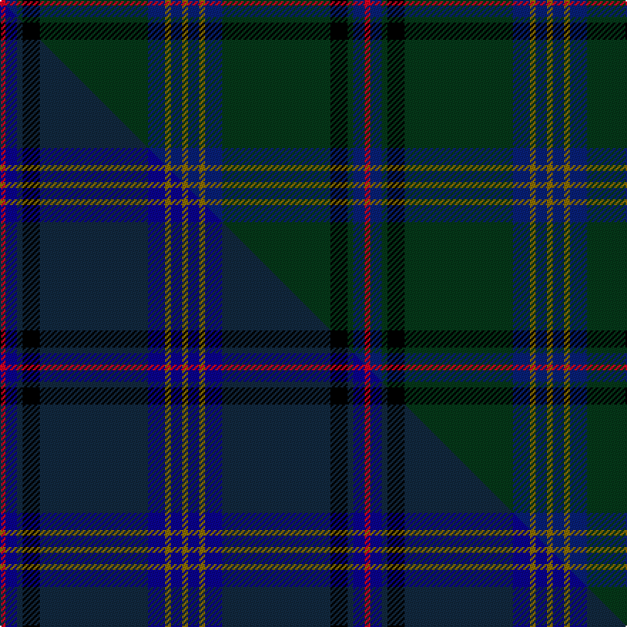

This is one **variant** — a specific cloth: this exact thread count and colourway, with its own
provenance below. It is one weaving of the [sett](/setts/r1db2dg1k3dg19db3y1db2y1/) (the scale-free proportion — the
same cloth at any scale or shade), whose colour order is pattern [GBGBGKGBR](/stripes/gbgbgkgbr/).

Part of the [Pagus Wasia](/tartans/p/pa/pagus-wasia-2/) tartan — the named design grouping this sett with its other cloths.

Sourced from tartans-authority.  It is a [9 stripe tartan](/stripes/stripes9/).

Original link [https://www.tartanregister.gov.uk/tartanDetails.aspx?ref=10962](https://www.tartanregister.gov.uk/tartanDetails.aspx?ref=10962)

Dataset <small>— provenance for this record, inherited from the source manifest</small>

<dl class="dataset-prov">
<dt>source</dt><dd><a href="/sources/tartans-authority/">Scottish Tartans Authority</a></dd>
<dt>data captured from</dt><dd><a href="https://github.com/thetartan/tartan-database/blob/master/data/tartans-authority/data.csv">https://github.com/thetartan/tartan-database/blob/master/data/tartans-authority/data.csv</a></dd>
<dt>data date</dt><dd>2013 <small>(this record)</small></dd>
<dt>licence</dt><dd><a href="https://creativecommons.org/licenses/by-nc-nd/4.0/">CC BY-NC-ND 4.0</a></dd>
</dl>

Capture chain <small>— the hands this data passed through, oldest first; each capture carries its own licence</small>

<ol class="capture-chain">
<li><a href="https://www.tartansauthority.com/">Scottish Tartans Authority</a> <small>the heritage body's archive — its tartan-ferret record browser is retired (links repaired to the SRT, above)</small></li>
<li><a href="https://github.com/thetartan/tartan-database">thetartan/tartan-database</a> <small>2016-2017</small> · <a href="https://creativecommons.org/licenses/by-nc-nd/4.0/">CC BY-NC-ND 4.0</a> <small>Levko Kravets's frozen compilation — the capture we vendored, and where its CC licence text came from</small></li>
<li>this dictionary <small>captured 2026-06-10 · commit 5bf86c7566</small> <small>each re-capture is a git commit to data/sources</small></li>
</ol>

## Register references

External register numbers recorded for this tartan.

- Scottish Register of Tartans: [10962](https://www.tartanregister.gov.uk/tartanDetails?ref=10962)
- Scottish Tartans Authority (ITI): 10962

## Thread count
R/4 DB8 DG4 K12 DG76 DB12 Y4 DB8 Y/4

One full sett is **256 threads**.

## Palette
<table><thead><tr><th>Colour</th><th>Shade</th><th>OKLCh</th></tr></thead><tbody><tr><td>K</td><td><code style="background-color:#000000;">#000000</code> <small style="color:#888">#000000</small></td><td><small style="color:#888">oklch(0.0% 0.000 0.0)</small></td></tr><tr><td>DB</td><td><code style="background-color:#082077;">#082077</code> <small style="color:#888">#082077</small></td><td><small style="color:#888">oklch(30.0% 0.149 265.1)</small></td></tr><tr><td>DG</td><td><code style="background-color:#053819;">#053819</code> <small style="color:#888">#053819</small></td><td><small style="color:#888">oklch(30.0% 0.075 151.3)</small></td></tr><tr><td>R</td><td><code style="background-color:#D60020;">#D60020</code> <small style="color:#888">#D60020</small></td><td><small style="color:#888">oklch(55.2% 0.224 25.5)</small></td></tr><tr><td>Y</td><td><code style="background-color:#8B6E00;">#8B6E00</code> <small style="color:#888">#8B6E00</small></td><td><small style="color:#888">oklch(55.1% 0.113 90.4)</small></td></tr></tbody></table>

# Sample pattern

## Compared to the master

This cloth is one sett of its design; the master sett (the exemplar the design is anchored on) is below for comparison.

Its **ΔTartan distance** from the master is **3.03** — the same measure the nearest-tartans table ranks by (0 is identical; a re-scale of the same cloth is near 0, a recolour or a different proportion further).

<figure class="master-compare" style="margin:0">

this sett
master sett ★

<figcaption style="color:#888;font-size:smaller">One weave of this sett against the <a href="/setts/r1db2dt1k3dt19db3y1db2y1/">master sett ★</a>, split on the diagonal: a shared proportion runs seamlessly across it with only the shades shifting; a different proportion breaks on it.</figcaption>
</figure>

## Nearest tartan variants

The nearest existing variants by ΔTartan distance, with this cloth at the top so the swatches line up against it.

ΔTartan

Threads

Variant

Sett

—

256

<a href="/variants/s9/r1db2dg1k3dg19db3y1db2y1~x4/">Pagus Wasia</a>

<a href="/ttd/edit/#slug=dg47y2dg5y2dg4k15db19r2~x2&amp;base=r1db2dg1k3dg19db3y1db2y1~x4" title="compare in the TTD">1.77</a>

286

<a href="/variants/s8/dg47y2dg5y2dg4k15db19r2~x2/">Unidentified, Toy Bear</a>

<a href="/ttd/edit/#slug=r4dg4k2dg29db21k3db3y3~x2&amp;base=r1db2dg1k3dg19db3y1db2y1~x4" title="compare in the TTD">2.13</a>

262

<a href="/variants/s8/r4dg4k2dg29db21k3db3y3~x2/">Peter of Lee (Chief) (Personal)</a>

<a href="/ttd/edit/#slug=dg30db6r2db2dy2db15w2~x2&amp;base=r1db2dg1k3dg19db3y1db2y1~x4" title="compare in the TTD">2.34</a>

172

<a href="/variants/s7/dg30db6r2db2dy2db15w2~x2/">Hydesville Tower (Corporate)</a>

<a href="/ttd/edit/#slug=r4dg3k2dg38db30k3db3k3~x2&amp;base=r1db2dg1k3dg19db3y1db2y1~x4" title="compare in the TTD">2.55</a>

330

<a href="/variants/s8/r4dg3k2dg38db30k3db3k3~x2/">Peter of Lee Family Tartan</a>

<a href="/ttd/edit/#slug=k8r2k13dy2dg48db6~x2&amp;base=r1db2dg1k3dg19db3y1db2y1~x4" title="compare in the TTD">2.81</a>

288

<a href="/variants/s6/k8r2k13dy2dg48db6~x2/">Green Swamp Youth Campers</a>

<a href="/ttd/edit/#slug=dg24lb4dg3db11dp8db37k3db2o4~x2&amp;base=r1db2dg1k3dg19db3y1db2y1~x4" title="compare in the TTD">2.84</a>

328

<a href="/variants/s9/dg24lb4dg3db11dp8db37k3db2o4~x2/">Stewmann (2009) (Personal)</a>

<a href="/ttd/edit/#slug=dg68k2dg2k2dg2dy8r8k8dy2db7~x2&amp;base=r1db2dg1k3dg19db3y1db2y1~x4" title="compare in the TTD">2.88</a>

286

<a href="/variants/s10/dg68k2dg2k2dg2dy8r8k8dy2db7~x2/">Moran Family Ubique</a>

<a href="/ttd/edit/#slug=r1db2dt1k3dt19db3y1db2y1~x4~db1208266-dt1102249&amp;base=r1db2dg1k3dg19db3y1db2y1~x4" title="compare in the TTD">2.92</a>

256

<a href="/variants/s9/r1db2dt1k3dt19db3y1db2y1~x4~db1208266-dt1102249/">Pagus Wasia</a>

<a href="/ttd/edit/#slug=dg39k2dg2k2dg2k3dt13k2w4k2dt13k3dg24y3~x2~dg1703152-dt1602249-w3500000&amp;base=r1db2dg1k3dg19db3y1db2y1~x4" title="compare in the TTD">3.00</a>

372

<a href="/variants/s14/dg39k2dg2k2dg2k3dt13k2lb4k2dt13k3dg24y3~x2~dg1703152-dt1602249-lb3500000/">Proctor Name Tartan</a>

<a href="/ttd/edit/#slug=k8r2k13y2dg48db6~x2&amp;base=r1db2dg1k3dg19db3y1db2y1~x4" title="compare in the TTD">3.08</a>

288

<a href="/variants/s6/k8r2k13y2dg48db6~x2/">Green Swamp Youth Campers</a>

## Neighbour map

Every grey dot is one of 13656 variants placed by the first two principal components of the ΔTartan feature space (42% of its variance). Red is this tartan; blue dots are its nearest — click one to open its page. The map is a flat projection of a many-dimensional space — [how to read it](/posts/neighbourhood-maps/).

<svg viewBox="0 0 640 380" role="img" style="max-width:100%;height:auto;border:1px solid #e0e0e0;border-radius:4px;display:block" xmlns="http://www.w3.org/2000/svg"><image href="/nn/cloud.v1.png" width="640" height="380"/><a href="/variants/s8/dg47y2dg5y2dg4k15db19r2~x2/"><circle cx="366.5" cy="136.0" r="4" fill="#3465a4"><title>Unidentified, Toy Bear</title></circle></a><a href="/variants/s8/r4dg4k2dg29db21k3db3y3~x2/"><circle cx="302.0" cy="161.7" r="4" fill="#3465a4"><title>Peter of Lee (Chief) (Personal)</title></circle></a><a href="/variants/s7/dg30db6r2db2dy2db15w2~x2/"><circle cx="357.7" cy="179.2" r="4" fill="#3465a4"><title>Hydesville Tower (Corporate)</title></circle></a><a href="/variants/s8/r4dg3k2dg38db30k3db3k3~x2/"><circle cx="351.0" cy="159.2" r="4" fill="#3465a4"><title>Peter of Lee Family Tartan</title></circle></a><a href="/variants/s6/k8r2k13dy2dg48db6~x2/"><circle cx="387.5" cy="140.3" r="4" fill="#3465a4"><title>Green Swamp Youth Campers</title></circle></a><a href="/variants/s9/dg24lb4dg3db11dp8db37k3db2o4~x2/"><circle cx="310.4" cy="142.0" r="4" fill="#3465a4"><title>Stewmann (2009) (Personal)</title></circle></a><a href="/variants/s10/dg68k2dg2k2dg2dy8r8k8dy2db7~x2/"><circle cx="450.2" cy="88.8" r="4" fill="#3465a4"><title>Moran Family Ubique</title></circle></a><a href="/variants/s9/r1db2dt1k3dt19db3y1db2y1~x4~db1208266-dt1102249/"><circle cx="403.0" cy="129.6" r="4" fill="#3465a4"><title>Pagus Wasia</title></circle></a><a href="/variants/s14/dg39k2dg2k2dg2k3dt13k2lb4k2dt13k3dg24y3~x2~dg1703152-dt1602249-lb3500000/"><circle cx="343.3" cy="114.7" r="4" fill="#3465a4"><title>Proctor Name Tartan</title></circle></a><a href="/variants/s6/k8r2k13y2dg48db6~x2/"><circle cx="376.1" cy="136.4" r="4" fill="#3465a4"><title>Green Swamp Youth Campers</title></circle></a><circle cx="390.8" cy="127.3" r="5" fill="#c00000"/><text x="320" y="376" text-anchor="middle" font-size="11" fill="#999">ground</text><text x="11" y="190" text-anchor="middle" font-size="11" fill="#999" transform="rotate(-90 11 190)">complexity</text></svg>

ID: /variants/s9/r1db2dg1k3dg19db3y1db2y1~x4/
