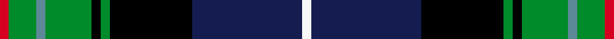

This is one **variant** — a specific cloth: this exact thread count and colourway, with its own
provenance below. It is one weaving of the [sett](/setts/r1g3t1g5k1g1k9db12w1/) (the scale-free proportion — the
same cloth at any scale or shade), whose colour order is pattern [RGBGKGKBW](/stripes/rgbgkgkbw/).

Part of the [St Andrews Golf Club](/tartans/s/st/st-andrews-golf-club/) tartan — the named design grouping this sett with its other cloths.

Sourced from register-of-tartans.  It is a [9 stripe tartan](/stripes/stripes9/).

Original link [https://www.tartanregister.gov.uk/tartanDetails.aspx?ref=10643](https://www.tartanregister.gov.uk/tartanDetails.aspx?ref=10643)

## Provenance

Earliest known date: 18/10/2011 The pattern for this tartan was created by the Secretary and Chairman with the assistance of the designers at House of Tartan. The colours are taken from the club's crest.

2 attestations — the source records this cloth was collapsed from (oldest owns this page)

<ul>
<li>18/10/2011 — St Andrews Golf Club (register-of-tartans, <a href="https://www.tartanregister.gov.uk/tartanDetails.aspx?ref=10643">record</a>)  <em>The pattern for this tartan was created by the Secretary and Chairman with the assistance of the designers at House of Tartan. The colours are taken from the club's crest.</em></li>
<li>18/10/2011 — St Andrews Golf Club Corporate Tartan (house-of-tartan, <a href="http://www.house-of-tartan.scotland.net/house/TartanViewjs.asp?colr=Def&tnam=10643">record</a>) </li>
</ul>

Dataset <small>— provenance for this record, inherited from the source manifest</small>

<dl class="dataset-prov">
<dt>source</dt><dd><a href="/sources/register-of-tartans/">Scottish Register of Tartans</a></dd>
<dt>data captured from</dt><dd><a href="https://github.com/thetartan/tartan-database/blob/master/data/register-of-tartans/data.csv">https://github.com/thetartan/tartan-database/blob/master/data/register-of-tartans/data.csv</a></dd>
<dt>data date</dt><dd>18/10/2011 <small>(this record)</small></dd>
<dt>licence</dt><dd><a href="https://www.tartanregister.gov.uk/copyright">Crown copyright</a></dd>
</dl>

Capture chain <small>— the hands this data passed through, oldest first; each capture carries its own licence</small>

<ol class="capture-chain">
<li><a href="https://www.tartanregister.gov.uk/">Scottish Register of Tartans</a> · <a href="https://www.tartanregister.gov.uk/copyright">Crown copyright</a> <small>the living register — still published by National Records of Scotland</small></li>
<li><a href="https://github.com/thetartan/tartan-database">thetartan/tartan-database</a> <small>2016-2017</small> · <a href="https://creativecommons.org/licenses/by-nc-nd/4.0/">CC BY-NC-ND 4.0</a> <small>Levko Kravets's frozen compilation — the capture we vendored, and where its CC licence text came from</small></li>
<li>this dictionary <small>captured 2026-06-10 · commit 5bf86c7566</small> <small>each re-capture is a git commit to data/sources</small></li>
</ol>

## Register references

External register numbers recorded for this tartan.

- Scottish Register of Tartans: [10643](https://www.tartanregister.gov.uk/tartanDetails.aspx?ref=10643)

## Thread count
R/4 G12 T4 G20 K4 G4 K36 DB48 W/4

One full sett is **264 threads**.

## Palette
<table><thead><tr><th>Colour</th><th>Shade</th><th>OKLCh</th></tr></thead><tbody><tr><td>T</td><td><code style="background-color:#5C8898;">#5C8898</code> <small style="color:#888">#5C8898</small></td><td><small style="color:#888">oklch(60.1% 0.054 222.7)</small></td></tr><tr><td>DB</td><td><code style="background-color:#141C50;">#141C50</code> <small style="color:#888">#141C50</small></td><td><small style="color:#888">oklch(25.6% 0.095 271.3)</small></td></tr><tr><td>K</td><td><code style="background-color:#000000;">#000000</code> <small style="color:#888">#000000</small></td><td><small style="color:#888">oklch(0.0% 0.000 0.0)</small></td></tr><tr><td>W</td><td><code style="background-color:#F7F7F7;">#F7F7F7</code> <small style="color:#888">#F7F7F7</small></td><td><small style="color:#888">oklch(97.6% 0.000 89.9)</small></td></tr><tr><td>G</td><td><code style="background-color:#008B2A;">#008B2A</code> <small style="color:#888">#008B2A</small></td><td><small style="color:#888">oklch(55.4% 0.170 145.9)</small></td></tr><tr><td>R</td><td><code style="background-color:#D60020;">#D60020</code> <small style="color:#888">#D60020</small></td><td><small style="color:#888">oklch(55.2% 0.224 25.5)</small></td></tr></tbody></table>

# Sample pattern

## Nearest tartan variants

The nearest existing variants by ΔTartan distance, with this cloth at the top so the swatches line up against it.

ΔTartan

Threads

Variant

Sett

—

264

<a href="/variants/s9/r1g3t1g5k1g1k9db12w1~x4~t2402222-db1004274/">St Andrews Golf Club</a>

<a href="/ttd/edit/#slug=w1db12k9dg1k1dg5lb1dg3lo1~x4&amp;base=r1g3t1g5k1g1k9db12w1~x4~t2402222-db1004274" title="compare in the TTD">0.41</a>

264

<a href="/variants/s9/w1db12k9dg1k1dg5lb1dg3lo1~x4/">St. Andrews Golf Club (Corporate)</a>

<a href="/ttd/edit/#slug=o4k7o2db25k19w2g13k2y3~x2&amp;base=r1g3t1g5k1g1k9db12w1~x4~t2402222-db1004274" title="compare in the TTD">1.25</a>

294

<a href="/variants/s9/o4k7o2db25k19w2g13k2y3~x2/">Leung (Personal)</a>

<a href="/ttd/edit/#slug=y3k2r3db20k24g20r3k2lb3~x2&amp;base=r1g3t1g5k1g1k9db12w1~x4~t2402222-db1004274" title="compare in the TTD">1.38</a>

308

<a href="/variants/s9/y3k2r3db20k24g20r3k2lb3~x2/">Loch Awe</a>

<a href="/ttd/edit/#slug=ly3k2r3db20k24g20r3k2lb3~x2&amp;base=r1g3t1g5k1g1k9db12w1~x4~t2402222-db1004274" title="compare in the TTD">1.38</a>

308

<a href="/variants/s9/ly3k2r3db20k24g20r3k2lb3~x2/">Loch Awe</a>

<a href="/ttd/edit/#slug=r3k2g18k18db3k3db3k3db18y2w3~x2&amp;base=r1g3t1g5k1g1k9db12w1~x4~t2402222-db1004274" title="compare in the TTD">1.45</a>

292

<a href="/variants/s11/r3k2g18k18db3k3db3k3db18y2w3~x2/">Tindal</a>

<a href="/ttd/edit/#slug=r3k2g18k18db3k3db3k3db18dy2w3~x2&amp;base=r1g3t1g5k1g1k9db12w1~x4~t2402222-db1004274" title="compare in the TTD">1.46</a>

292

<a href="/variants/s11/r3k2g18k18db3k3db3k3db18dy2w3~x2/">Tindal</a>

<a href="/ttd/edit/#slug=r2k8y1k8g13db13lo1r2~x2&amp;base=r1g3t1g5k1g1k9db12w1~x4~t2402222-db1004274" title="compare in the TTD">1.73</a>

184

<a href="/variants/s8/r2k8y1k8g13db13lo1r2~x2/">Sey (Name)</a>

<a href="/ttd/edit/#slug=r2y2t9k10dg12k1y1k1dy1~x4&amp;base=r1g3t1g5k1g1k9db12w1~x4~t2402222-db1004274" title="compare in the TTD">1.84</a>

300

<a href="/variants/s9/r2y2t9k10dg12k1y1k1dy1~x4/">Trades House</a>

<a href="/ttd/edit/#slug=r3g2db27k19g27dp2y3~x2&amp;base=r1g3t1g5k1g1k9db12w1~x4~t2402222-db1004274" title="compare in the TTD">1.91</a>

320

<a href="/variants/s7/r3g2db27k19g27dp2y3~x2/">Christian Hunting (Personal)</a>

<a href="/ttd/edit/#slug=db10w5db48k35g5k5g35r5g5dp5&amp;base=r1g3t1g5k1g1k9db12w1~x4~t2402222-db1004274" title="compare in the TTD">1.96</a>

301

<a href="/variants/s10/db10w5db48k35g5k5g35r5g5dp5/">Big Rory (Corporate)</a>

## Neighbour map

Every grey dot is one of 13621 variants placed by the first two principal components of the ΔTartan feature space (42% of its variance). Red is this tartan; blue dots are its nearest — click one to open its page. The map is a flat projection of a many-dimensional space — [how to read it](/posts/neighbourhood-maps/).

<svg viewBox="0 0 640 380" role="img" style="max-width:100%;height:auto;border:1px solid #e0e0e0;border-radius:4px;display:block" xmlns="http://www.w3.org/2000/svg"><image href="/nn/cloud.v1.png" width="640" height="380"/><a href="/variants/s9/w1db12k9dg1k1dg5lb1dg3lo1~x4/"><circle cx="139.4" cy="135.6" r="4" fill="#3465a4"><title>St. Andrews Golf Club (Corporate)</title></circle></a><a href="/variants/s9/o4k7o2db25k19w2g13k2y3~x2/"><circle cx="117.7" cy="133.7" r="4" fill="#3465a4"><title>Leung (Personal)</title></circle></a><a href="/variants/s9/y3k2r3db20k24g20r3k2lb3~x2/"><circle cx="105.8" cy="130.1" r="4" fill="#3465a4"><title>Loch Awe</title></circle></a><a href="/variants/s9/ly3k2r3db20k24g20r3k2lb3~x2/"><circle cx="101.9" cy="129.0" r="4" fill="#3465a4"><title>Loch Awe</title></circle></a><a href="/variants/s11/r3k2g18k18db3k3db3k3db18y2w3~x2/"><circle cx="96.3" cy="135.6" r="4" fill="#3465a4"><title>Tindal</title></circle></a><a href="/variants/s11/r3k2g18k18db3k3db3k3db18dy2w3~x2/"><circle cx="97.6" cy="135.9" r="4" fill="#3465a4"><title>Tindal</title></circle></a><a href="/variants/s8/r2k8y1k8g13db13lo1r2~x2/"><circle cx="99.1" cy="148.0" r="4" fill="#3465a4"><title>Sey (Name)</title></circle></a><a href="/variants/s9/r2y2t9k10dg12k1y1k1dy1~x4/"><circle cx="111.1" cy="139.2" r="4" fill="#3465a4"><title>Trades House</title></circle></a><a href="/variants/s7/r3g2db27k19g27dp2y3~x2/"><circle cx="134.7" cy="149.1" r="4" fill="#3465a4"><title>Christian Hunting (Personal)</title></circle></a><a href="/variants/s10/db10w5db48k35g5k5g35r5g5dp5/"><circle cx="117.0" cy="138.1" r="4" fill="#3465a4"><title>Big Rory (Corporate)</title></circle></a><circle cx="124.5" cy="132.1" r="5" fill="#c00000"/><text x="320" y="376" text-anchor="middle" font-size="11" fill="#999">ground</text><text x="11" y="190" text-anchor="middle" font-size="11" fill="#999" transform="rotate(-90 11 190)">complexity</text></svg>

ID: /variants/s9/r1g3t1g5k1g1k9db12w1~x4~t2402222-db1004274/
