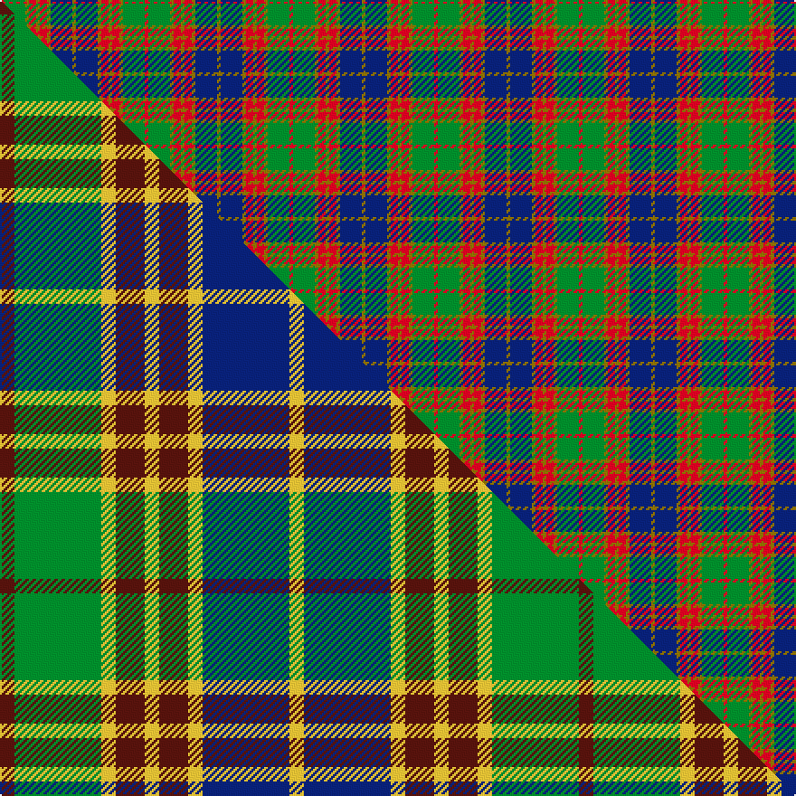

This is one **variant** — a specific cloth: this exact thread count and colourway, with its own
provenance below. It is one weaving of the [sett](/tartans/s/st/stevenson-2/) (the scale-free proportion — the
same cloth at any scale or shade), whose colour order is pattern [GBGRGRGGR](/stripes/gbgrgrggr/).

Part of the [Stevenson](/tartans/s/st/stevenson-2/) tartan — the named design grouping this sett with its other cloths.

Sourced from weddslist.  It is a [9 stripe tartan](/stripes/stripes9/).

Original link [http://www.weddslist.com/cgi-bin/tartans/pg.pl?source=sts](http://www.weddslist.com/cgi-bin/tartans/pg.pl?source=sts)

Dataset <small>— provenance for this record, inherited from the source manifest</small>

<dl class="dataset-prov">
<dt>source</dt><dd><a href="/sources/weddslist/">Weddslist</a></dd>
<dt>data captured from</dt><dd><a href="https://github.com/thetartan/tartan-database/blob/master/data/weddslist/data.csv">https://github.com/thetartan/tartan-database/blob/master/data/weddslist/data.csv</a></dd>
<dt>data date</dt><dd>2016-11-17 <small>(dataset default)</small></dd>
<dt>licence</dt><dd><a href="https://creativecommons.org/licenses/by-nc-nd/4.0/">CC BY-NC-ND 4.0</a></dd>
</dl>

Capture chain <small>— the hands this data passed through, oldest first; each capture carries its own licence</small>

<ol class="capture-chain">
<li><a href="https://www.weddslist.com/tartans/">Weddslist</a> <small>the living privately compiled reference</small></li>
<li><a href="https://github.com/thetartan/tartan-database">thetartan/tartan-database</a> <small>2016-2017</small> · <a href="https://creativecommons.org/licenses/by-nc-nd/4.0/">CC BY-NC-ND 4.0</a> <small>Levko Kravets's frozen compilation — the capture we vendored, and where its CC licence text came from</small></li>
<li>this dictionary <small>captured 2026-06-10 · commit 5bf86c7566</small> <small>each re-capture is a git commit to data/sources</small></li>
</ol>

## Thread count
R/2 G12 Y2 R4 Y2 R4 Y2 DB12 Y/2

One full sett is **80 threads**.

## Palette
<table><thead><tr><th>Colour</th><th>Shade</th><th>OKLCh</th></tr></thead><tbody><tr><td>DB</td><td><code style="background-color:#082077;">#082077</code> <small style="color:#888">#082077</small></td><td><small style="color:#888">oklch(30.0% 0.149 265.1)</small></td></tr><tr><td>G</td><td><code style="background-color:#008B2A;">#008B2A</code> <small style="color:#888">#008B2A</small></td><td><small style="color:#888">oklch(55.4% 0.170 145.9)</small></td></tr><tr><td>R</td><td><code style="background-color:#D60020;">#D60020</code> <small style="color:#888">#D60020</small></td><td><small style="color:#888">oklch(55.2% 0.224 25.5)</small></td></tr><tr><td>Y</td><td><code style="background-color:#8B6E00;">#8B6E00</code> <small style="color:#888">#8B6E00</small></td><td><small style="color:#888">oklch(55.1% 0.113 90.4)</small></td></tr></tbody></table>

# Sample pattern

## Compared to the master

This cloth is one sett of its design; the master sett (the exemplar the design is anchored on) is below for comparison.

Its **ΔTartan distance** from the master is **0.17** — the same measure the nearest-tartans table ranks by (0 is identical; a re-scale of the same cloth is near 0, a recolour or a different proportion further).

<figure class="master-compare" style="margin:0">

this sett
master sett ★

<figcaption style="color:#888;font-size:smaller">One weave of this sett against the <a href="/setts/dr1g6ly1dr2ly1dr2ly1db6ly1/">master sett ★</a>, split on the diagonal: a shared proportion runs seamlessly across it with only the shades shifting; a different proportion breaks on it.</figcaption>
</figure>

## Nearest tartan variants

The nearest existing variants by ΔTartan distance, with this cloth at the top so the swatches line up against it.

ΔTartan

Threads

Variant

Sett

—

80

<a href="/variants/s9/r1g6y1r2y1r2y1db6y1~x2/">Stevenson</a>

<a href="/ttd/edit/#slug=dr1g6ly1dr2ly1dr2ly1db6ly1~x8&amp;base=r1g6y1r2y1r2y1db6y1~x2" title="compare in the TTD">0.17</a>

320

<a href="/variants/s9/dr1g6ly1dr2ly1dr2ly1db6ly1~x8/">Stevenson (Name)</a>

<a href="/ttd/edit/#slug=r1g8y1r2y1r2y1db8y1~x4&amp;base=r1g6y1r2y1r2y1db6y1~x2" title="compare in the TTD">0.21</a>

192

<a href="/variants/s9/r1g8y1r2y1r2y1db8y1~x4/">Stevenson Family Tartan</a>

<a href="/ttd/edit/#slug=dp11o2dp2o2dp2o11g14w2~x2&amp;base=r1g6y1r2y1r2y1db6y1~x2" title="compare in the TTD">1.58</a>

158

<a href="/variants/s8/dp11o2dp2o2dp2o11g14w2~x2/">Lamont</a>

<a href="/ttd/edit/#slug=dr6db3o3dr24db20g24o3g3o3g3o6&amp;base=r1g6y1r2y1r2y1db6y1~x2" title="compare in the TTD">2.09</a>

184

<a href="/variants/s11/dr6db3o3dr24db20g24o3g3o3g3o6/">Bonnie Brae School</a>

<a href="/ttd/edit/#slug=r2y1db8r1g7y1r2~x6&amp;base=r1g6y1r2y1r2y1db6y1~x2" title="compare in the TTD">2.26</a>

240

<a href="/variants/s7/r2y1db8r1g7y1r2~x6/">Cercle de Fermières de Saint-Élie d'Orford</a>

<a href="/ttd/edit/#slug=r2ly1t8r1g7ly1r2~x6&amp;base=r1g6y1r2y1r2y1db6y1~x2" title="compare in the TTD">2.32</a>

240

<a href="/variants/s7/r2ly1t8r1g7ly1r2~x6/">Cercle de Fermieres de St-Elie . . .</a>

<a href="/ttd/edit/#slug=db9r3y1r3g9r3y1~x2&amp;base=r1g6y1r2y1r2y1db6y1~x2" title="compare in the TTD">2.41</a>

96

<a href="/variants/s7/db9r3y1r3g9r3y1~x2/">Logan #2</a>

<a href="/ttd/edit/#slug=dr21r3dr3r3dr3db19g22lb3~x2&amp;base=r1g6y1r2y1r2y1db6y1~x2" title="compare in the TTD">2.66</a>

260

<a href="/variants/s8/dr21r3dr3r3dr3db19g22lb3~x2/">Akins Clan (Personal)</a>

<a href="/ttd/edit/#slug=db3o14g14o2db14o2db14o2g14o14r3~x2&amp;base=r1g6y1r2y1r2y1db6y1~x2" title="compare in the TTD">2.71</a>

372

<a href="/variants/s11/db3o14g14o2db14o2db14o2g14o14r3~x2/">Buchanan, hunting</a>

<a href="/ttd/edit/#slug=dr21r3dr3r3dr3db19g22b3~x2&amp;base=r1g6y1r2y1r2y1db6y1~x2" title="compare in the TTD">2.79</a>

260

<a href="/variants/s8/dr21r3dr3r3dr3db19g22b3~x2/">Akins</a>

## Neighbour map

Every grey dot is one of 13656 variants placed by the first two principal components of the ΔTartan feature space (42% of its variance). Red is this tartan; blue dots are its nearest — click one to open its page. The map is a flat projection of a many-dimensional space — [how to read it](/posts/neighbourhood-maps/).

<svg viewBox="0 0 640 380" role="img" style="max-width:100%;height:auto;border:1px solid #e0e0e0;border-radius:4px;display:block" xmlns="http://www.w3.org/2000/svg"><image href="/nn/cloud.v1.png" width="640" height="380"/><a href="/variants/s9/dr1g6ly1dr2ly1dr2ly1db6ly1~x8/"><circle cx="156.6" cy="234.9" r="4" fill="#3465a4"><title>Stevenson (Name)</title></circle></a><a href="/variants/s9/r1g8y1r2y1r2y1db8y1~x4/"><circle cx="189.9" cy="201.0" r="4" fill="#3465a4"><title>Stevenson Family Tartan</title></circle></a><a href="/variants/s8/dp11o2dp2o2dp2o11g14w2~x2/"><circle cx="197.7" cy="222.3" r="4" fill="#3465a4"><title>Lamont</title></circle></a><a href="/variants/s11/dr6db3o3dr24db20g24o3g3o3g3o6/"><circle cx="192.9" cy="202.9" r="4" fill="#3465a4"><title>Bonnie Brae School</title></circle></a><a href="/variants/s7/r2y1db8r1g7y1r2~x6/"><circle cx="200.1" cy="214.1" r="4" fill="#3465a4"><title>Cercle de Fermières de Saint-Élie d'Orford</title></circle></a><a href="/variants/s7/r2ly1t8r1g7ly1r2~x6/"><circle cx="241.6" cy="233.6" r="4" fill="#3465a4"><title>Cercle de Fermieres de St-Elie . . .</title></circle></a><a href="/variants/s7/db9r3y1r3g9r3y1~x2/"><circle cx="182.7" cy="221.5" r="4" fill="#3465a4"><title>Logan #2</title></circle></a><a href="/variants/s8/dr21r3dr3r3dr3db19g22lb3~x2/"><circle cx="180.4" cy="204.3" r="4" fill="#3465a4"><title>Akins Clan (Personal)</title></circle></a><a href="/variants/s11/db3o14g14o2db14o2db14o2g14o14r3~x2/"><circle cx="190.7" cy="230.4" r="4" fill="#3465a4"><title>Buchanan, hunting</title></circle></a><a href="/variants/s8/dr21r3dr3r3dr3db19g22b3~x2/"><circle cx="189.5" cy="207.5" r="4" fill="#3465a4"><title>Akins</title></circle></a><circle cx="159.8" cy="224.3" r="5" fill="#c00000"/><text x="320" y="376" text-anchor="middle" font-size="11" fill="#999">ground</text><text x="11" y="190" text-anchor="middle" font-size="11" fill="#999" transform="rotate(-90 11 190)">complexity</text></svg>

ID: /variants/s9/r1g6y1r2y1r2y1db6y1~x2/
