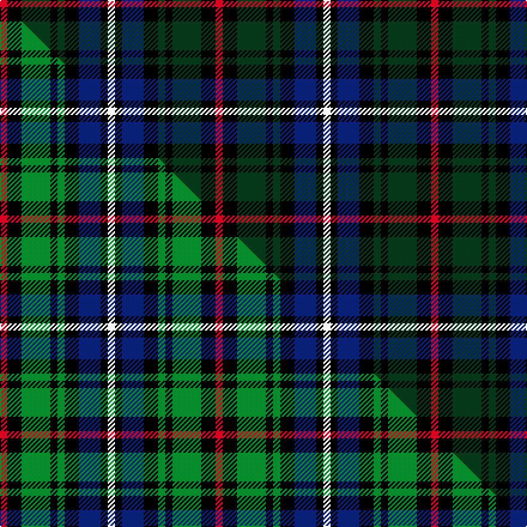

This page is one **sett** — a single exact thread-count. It belongs to the [tartan](/setts/r1k2dg4k1dg1k2db3k1w1/)
(the same proportion at any scale), whose colour order is pattern [RKGKGKBKW](/stripes/rkgkgkbkw/).

Part of the [MacKean Dress](/tartans/mackean-dress/) tartan — the named design grouping this sett with its other cloths.

Sourced from weddslist.  It is a [9 stripe tartan](/stripes/stripes9/).

Original link http://www.weddslist.com/cgi-bin/tartans/pg.pl?source=sts

## Thread count
R/6 K12 DG24 K6 DG6 K12 DB18 K6 W/6

One full sett is **180 threads**.

## Palette
<table><thead><tr><th>Colour</th><th>Shade</th><th>OKLCh</th></tr></thead><tbody><tr><td>DB</td><td><code style="background-color:#082077;">#082077</code> <small style="color:#888">#082077</small></td><td><small style="color:#888">oklch(30.0% 0.149 265.1)</small></td></tr><tr><td>DG</td><td><code style="background-color:#053819;">#053819</code> <small style="color:#888">#053819</small></td><td><small style="color:#888">oklch(30.0% 0.075 151.3)</small></td></tr><tr><td>K</td><td><code style="background-color:#000000;">#000000</code> <small style="color:#888">#000000</small></td><td><small style="color:#888">oklch(0.0% 0.000 0.0)</small></td></tr><tr><td>W</td><td><code style="background-color:#F7F7F7;">#F7F7F7</code> <small style="color:#888">#F7F7F7</small></td><td><small style="color:#888">oklch(97.6% 0.000 89.9)</small></td></tr><tr><td>R</td><td><code style="background-color:#D60020;">#D60020</code> <small style="color:#888">#D60020</small></td><td><small style="color:#888">oklch(55.2% 0.224 25.5)</small></td></tr></tbody></table>

# Sample pattern

## Compared to the master

This cloth is one sett of its design; the master sett (the exemplar the design is anchored on) is below for comparison.

Its **ΔTartan distance** from the master is **0.14** — the same measure the nearest-tartans table ranks by (0 is identical; a re-scale of the same cloth is near 0, a recolour or a different proportion further).

<figure class="master-compare" style="margin:0">

this sett
master sett ★

<figcaption style="color:#888;font-size:smaller">One weave of this sett against the <a href="/setts/r1k2g4k1g1k2db3k1w1/">master sett ★</a>, split on the diagonal: a shared proportion runs seamlessly across it with only the shades shifting; a different proportion breaks on it.</figcaption>
</figure>

## Nearest tartan variants

The nearest existing variants by ΔTartan distance, with this cloth at the top so the swatches line up against it.

ΔTartan

Threads

Variant

Sett

—

180

<a href="/variants/s9/r1k2dg4k1dg1k2db3k1w1~x6/">MacKean dress</a>

<a href="/ttd/edit/#slug=r1k2g4k1g1k2db3k1w1~x6&amp;base=r1k2dg4k1dg1k2db3k1w1~x6" title="compare in the TTD">0.14</a>

180

<a href="/variants/s9/r1k2g4k1g1k2db3k1w1~x6/">MacKean Dress (Personal)</a>

<a href="/ttd/edit/#slug=db8k4lo2k3dr2k3lo2k4g8~x4&amp;base=r1k2dg4k1dg1k2db3k1w1~x6" title="compare in the TTD">1.51</a>

224

<a href="/variants/s9/db8k4lo2k3dr2k3lo2k4g8~x4/">Vosko</a>

<a href="/ttd/edit/#slug=dg12k14db11r3db3r3db11k14dg12y3~x2~dg1605139&amp;base=r1k2dg4k1dg1k2db3k1w1~x6" title="compare in the TTD">1.60</a>

314

<a href="/variants/s10/dg12k14db11r3db3r3db11k14dg12y3~x2~dg1605139/">Wilson's No.112 (Blue)</a>

<a href="/ttd/edit/#slug=db25k12y4k9r6k9y4k12g25~x2&amp;base=r1k2dg4k1dg1k2db3k1w1~x6" title="compare in the TTD">1.91</a>

324

<a href="/variants/s9/db25k12y4k9r6k9y4k12g25~x2/">Vosko</a>

<a href="/ttd/edit/#slug=k14g14k8y4k4g14k14db14dp5db4dp5db14~x2&amp;base=r1k2dg4k1dg1k2db3k1w1~x6" title="compare in the TTD">2.01</a>

400

<a href="/variants/s12/k14g14k8y4k4g14k14db14dp5db4dp5db14~x2/">Price-Powell (Personal)</a>

<a href="/ttd/edit/#slug=db10r7db31k25g23k8db7k8y5~x2&amp;base=r1k2dg4k1dg1k2db3k1w1~x6" title="compare in the TTD">2.07</a>

466

<a href="/variants/s9/db10r7db31k25g23k8db7k8y5~x2/">MacCallum, of Berwick</a>

<a href="/ttd/edit/#slug=k3w2k3g8k8db8r2db3&amp;base=r1k2dg4k1dg1k2db3k1w1~x6" title="compare in the TTD">2.24</a>

68

<a href="/variants/s8/k3w2k3g8k8db8r2db3/">Davidson Double</a>

<a href="/ttd/edit/#slug=k3w2k3g8k8db8r2db3~x2&amp;base=r1k2dg4k1dg1k2db3k1w1~x6" title="compare in the TTD">2.24</a>

136

<a href="/variants/s8/k3w2k3g8k8db8r2db3~x2/">Davidson, Double</a>

<a href="/ttd/edit/#slug=db10r7db31k25dg23k8db7r8ly5~x2&amp;base=r1k2dg4k1dg1k2db3k1w1~x6" title="compare in the TTD">2.25</a>

466

<a href="/variants/s9/db10r7db31k25dg23k8db7r8ly5~x2/">MacAllum of Berwick (Clan?)</a>

<a href="/ttd/edit/#slug=db20k10lo3k7dr4k7lo3k8g20~x2&amp;base=r1k2dg4k1dg1k2db3k1w1~x6" title="compare in the TTD">2.26</a>

248

<a href="/variants/s9/db20k10lo3k7dr4k7lo3k8g20~x2/">Scottish Tartan Society</a>

## Neighbour map

Every grey dot is one of 13620 variants placed by the first two principal components of the ΔTartan feature space (42% of its variance). Red is this tartan; blue dots are its nearest — click one to open its page.

<svg viewBox="0 0 640 380" role="img" style="max-width:100%;height:auto;border:1px solid #e0e0e0;border-radius:4px;display:block" xmlns="http://www.w3.org/2000/svg"><image href="/nn/cloud.v1.png" width="640" height="380"/><a href="/variants/s9/r1k2g4k1g1k2db3k1w1~x6/"><circle cx="65.5" cy="220.7" r="4" fill="#3465a4"><title>MacKean Dress (Personal)</title></circle></a><a href="/variants/s9/db8k4lo2k3dr2k3lo2k4g8~x4/"><circle cx="71.3" cy="223.6" r="4" fill="#3465a4"><title>Vosko</title></circle></a><a href="/variants/s10/dg12k14db11r3db3r3db11k14dg12y3~x2~dg1605139/"><circle cx="85.9" cy="226.8" r="4" fill="#3465a4"><title>Wilson's No.112 (Blue)</title></circle></a><a href="/variants/s9/db25k12y4k9r6k9y4k12g25~x2/"><circle cx="101.4" cy="197.7" r="4" fill="#3465a4"><title>Vosko</title></circle></a><a href="/variants/s12/k14g14k8y4k4g14k14db14dp5db4dp5db14~x2/"><circle cx="59.4" cy="234.0" r="4" fill="#3465a4"><title>Price-Powell (Personal)</title></circle></a><a href="/variants/s9/db10r7db31k25g23k8db7k8y5~x2/"><circle cx="119.8" cy="200.8" r="4" fill="#3465a4"><title>MacCallum, of Berwick</title></circle></a><a href="/variants/s8/k3w2k3g8k8db8r2db3/"><circle cx="75.8" cy="226.9" r="4" fill="#3465a4"><title>Davidson Double</title></circle></a><a href="/variants/s8/k3w2k3g8k8db8r2db3~x2/"><circle cx="75.8" cy="226.9" r="4" fill="#3465a4"><title>Davidson, Double</title></circle></a><a href="/variants/s9/db10r7db31k25dg23k8db7r8ly5~x2/"><circle cx="121.9" cy="201.6" r="4" fill="#3465a4"><title>MacAllum of Berwick (Clan?)</title></circle></a><a href="/variants/s9/db20k10lo3k7dr4k7lo3k8g20~x2/"><circle cx="105.7" cy="193.7" r="4" fill="#3465a4"><title>Scottish Tartan Society</title></circle></a><circle cx="84.9" cy="223.7" r="5" fill="#c00000"/><text x="320" y="376" text-anchor="middle" font-size="11" fill="#999">ground</text><text x="11" y="190" text-anchor="middle" font-size="11" fill="#999" transform="rotate(-90 11 190)">complexity</text></svg>

ID: /variants/s9/r1k2dg4k1dg1k2db3k1w1~x6/
