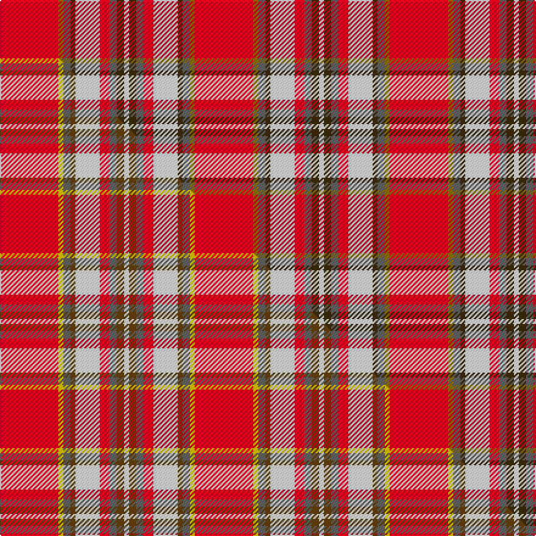

This page is one **sett** — a single exact thread-count. It belongs to the [tartan](/setts/r24y2n3dy2w10r4n3dy3w2/)
(the same proportion at any scale), whose colour order is pattern [RGBGWRBGW](/stripes/rgbgwrbgw/).

Part of the [Manx Laxey](/tartans/manx-laxey/) tartan — the named design grouping this sett with its other cloths.

Sourced from house-of-tartan.  It is a [9 stripe tartan](/stripes/stripes9/).

Original link http://www.house-of-tartan.scotland.net/house/TartanViewjs.asp?colr=Def&tnam=1721

## Provenance

Earliest known date: 1981 Presented by Dr. D.G. Teall in 1981

## Thread count
R/48 Y4 N6 DY4 W20 R8 N6 DY6 W/4

One full sett is **160 threads**.

## Palette
<table><thead><tr><th>Colour</th><th>Shade</th><th>OKLCh</th></tr></thead><tbody><tr><td>W</td><td><code style="background-color:#F7F7F7;">#F7F7F7</code> <small style="color:#888">#F7F7F7</small></td><td><small style="color:#888">oklch(97.6% 0.000 89.9)</small></td></tr><tr><td>N</td><td><code style="background-color:#636363;">#636363</code> <small style="color:#888">#636363</small></td><td><small style="color:#888">oklch(50.0% 0.000 89.9)</small></td></tr><tr><td>R</td><td><code style="background-color:#D60020;">#D60020</code> <small style="color:#888">#D60020</small></td><td><small style="color:#888">oklch(55.2% 0.224 25.5)</small></td></tr><tr><td>DY</td><td><code style="background-color:#3A2B0D;">#3A2B0D</code> <small style="color:#888">#3A2B0D</small></td><td><small style="color:#888">oklch(30.0% 0.049 82.0)</small></td></tr><tr><td>Y</td><td><code style="background-color:#8B6E00;">#8B6E00</code> <small style="color:#888">#8B6E00</small></td><td><small style="color:#888">oklch(55.1% 0.113 90.4)</small></td></tr></tbody></table>

# Sample pattern

## Compared to the master

This cloth is one sett of its design; the master sett (the exemplar the design is anchored on) is below for comparison.

Its **ΔTartan distance** from the master is **0.90** — the same measure the nearest-tartans table ranks by (0 is identical; a re-scale of the same cloth is near 0, a recolour or a different proportion further).

<figure class="master-compare" style="margin:0">

this sett
master sett ★

<figcaption style="color:#888;font-size:smaller">One weave of this sett against the <a href="/setts/r24ly2n3dy2w10r4n3dy3w2/">master sett ★</a>, split on the diagonal: a shared proportion runs seamlessly across it with only the shades shifting; a different proportion breaks on it.</figcaption>
</figure>

## Nearest tartan variants

The nearest existing variants by ΔTartan distance, with this cloth at the top so the swatches line up against it.

ΔTartan

Threads

Variant

Sett

—

160

<a href="/variants/s9/r24y2n3dy2w10r4n3dy3w2~x2/">Manx Laxey Red District Tartan</a>

<a href="/ttd/edit/#slug=r24ly2n3dy2w10r4n3dy3w2~x2~ly3307090-dy1603076&amp;base=r24y2n3dy2w10r4n3dy3w2~x2" title="compare in the TTD">0.90</a>

160

<a href="/variants/s9/r24ly2n3dy2w10r4n3dy3w2~x2~ly3307090-dy1603076/">Manx Laxey (Red)</a>

<a href="/ttd/edit/#slug=r24y2n3o2w10r4n3o3w2~x2&amp;base=r24y2n3dy2w10r4n3dy3w2~x2" title="compare in the TTD">0.90</a>

160

<a href="/variants/s9/r24y2n3o2w10r4n3o3w2~x2/">Manx Laxey, Red</a>

<a href="/ttd/edit/#slug=r41y3n7db3w24r10n7db7w3~x2&amp;base=r24y2n3dy2w10r4n3dy3w2~x2" title="compare in the TTD">1.31</a>

332

<a href="/variants/s9/r41y3n7db3w24r10n7db7w3~x2/">Drummond of Perth Dress #2</a>

<a href="/ttd/edit/#slug=r67y3n6lb3w25r10n6lb7w3~x2&amp;base=r24y2n3dy2w10r4n3dy3w2~x2" title="compare in the TTD">1.42</a>

380

<a href="/variants/s9/r67y3n6lb3w25r10n6lb7w3~x2/">Drummond of Perth Dress #3</a>

<a href="/ttd/edit/#slug=ly1g1db2r2g2r12lb2g1r2g1ly1~x4&amp;base=r24y2n3dy2w10r4n3dy3w2~x2" title="compare in the TTD">2.48</a>

208

<a href="/variants/s11/ly1g1db2r2g2r12lb2g1r2g1ly1~x4/">West Virginia Old Shawl</a>

<a href="/ttd/edit/#slug=r3lo15g4db6w2r30db6ly3~x2&amp;base=r24y2n3dy2w10r4n3dy3w2~x2" title="compare in the TTD">2.56</a>

264

<a href="/variants/s8/r3lo15g4db6w2r30db6ly3~x2/">Round Table Sweden</a>

<a href="/ttd/edit/#slug=r35db2w2db2r4dr10w25r3~x2&amp;base=r24y2n3dy2w10r4n3dy3w2~x2" title="compare in the TTD">2.68</a>

256

<a href="/variants/s8/r35db2w2db2r4dr10w25r3~x2/">Longniddry Dress, Red (Dance)</a>

<a href="/ttd/edit/#slug=r26lb2r6n2r2n2ly2n9w5ri2w4ly2~x2~r2109032-ri2406019&amp;base=r24y2n3dy2w10r4n3dy3w2~x2" title="compare in the TTD">2.72</a>

200

<a href="/variants/s12/r26lb2r6n2r2n2ly2n9w5ri2w4ly2~x2~r2109032-ri2406019/">Rathmore Family Tartan</a>

<a href="/ttd/edit/#slug=r67y3b6dg3w25r10b6dg7w3~x2&amp;base=r24y2n3dy2w10r4n3dy3w2~x2" title="compare in the TTD">2.79</a>

380

<a href="/variants/s9/r67y3b6dg3w25r10b6dg7w3~x2/">Drummond of Perth, dress</a>

<a href="/ttd/edit/#slug=r26b2r6n2r2n2o2n9w5dg2w4o2~x2&amp;base=r24y2n3dy2w10r4n3dy3w2~x2" title="compare in the TTD">2.84</a>

200

<a href="/variants/s12/r26b2r6n2r2n2o2n9w5dg2w4o2~x2/">Rathmore</a>

## Neighbour map

Every grey dot is one of 13620 variants placed by the first two principal components of the ΔTartan feature space (42% of its variance). Red is this tartan; blue dots are its nearest — click one to open its page.

<svg viewBox="0 0 640 380" role="img" style="max-width:100%;height:auto;border:1px solid #e0e0e0;border-radius:4px;display:block" xmlns="http://www.w3.org/2000/svg"><image href="/nn/cloud.v1.png" width="640" height="380"/><a href="/variants/s9/r24ly2n3dy2w10r4n3dy3w2~x2~ly3307090-dy1603076/"><circle cx="280.5" cy="145.6" r="4" fill="#3465a4"><title>Manx Laxey (Red)</title></circle></a><a href="/variants/s9/r24y2n3o2w10r4n3o3w2~x2/"><circle cx="289.7" cy="147.4" r="4" fill="#3465a4"><title>Manx Laxey, Red</title></circle></a><a href="/variants/s9/r41y3n7db3w24r10n7db7w3~x2/"><circle cx="240.2" cy="145.0" r="4" fill="#3465a4"><title>Drummond of Perth Dress #2</title></circle></a><a href="/variants/s9/r67y3n6lb3w25r10n6lb7w3~x2/"><circle cx="352.7" cy="109.0" r="4" fill="#3465a4"><title>Drummond of Perth Dress #3</title></circle></a><a href="/variants/s11/ly1g1db2r2g2r12lb2g1r2g1ly1~x4/"><circle cx="327.9" cy="134.6" r="4" fill="#3465a4"><title>West Virginia Old Shawl</title></circle></a><a href="/variants/s8/r3lo15g4db6w2r30db6ly3~x2/"><circle cx="239.5" cy="138.6" r="4" fill="#3465a4"><title>Round Table Sweden</title></circle></a><a href="/variants/s8/r35db2w2db2r4dr10w25r3~x2/"><circle cx="284.7" cy="139.6" r="4" fill="#3465a4"><title>Longniddry Dress, Red (Dance)</title></circle></a><a href="/variants/s12/r26lb2r6n2r2n2ly2n9w5ri2w4ly2~x2~r2109032-ri2406019/"><circle cx="280.6" cy="119.7" r="4" fill="#3465a4"><title>Rathmore Family Tartan</title></circle></a><a href="/variants/s9/r67y3b6dg3w25r10b6dg7w3~x2/"><circle cx="337.1" cy="104.2" r="4" fill="#3465a4"><title>Drummond of Perth, dress</title></circle></a><a href="/variants/s12/r26b2r6n2r2n2o2n9w5dg2w4o2~x2/"><circle cx="277.5" cy="116.0" r="4" fill="#3465a4"><title>Rathmore</title></circle></a><circle cx="272.6" cy="141.8" r="5" fill="#c00000"/><text x="320" y="376" text-anchor="middle" font-size="11" fill="#999">ground</text><text x="11" y="190" text-anchor="middle" font-size="11" fill="#999" transform="rotate(-90 11 190)">complexity</text></svg>

ID: /variants/s9/r24y2n3dy2w10r4n3dy3w2~x2/
