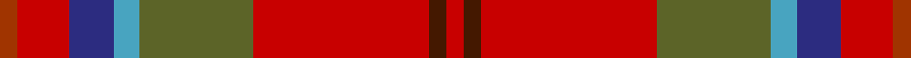

This page is one **sett** — a single exact thread-count. It belongs to the [tartan](/setts/r2do2r20y13lg3db5r2r4o2/)
(the same proportion at any scale), whose colour order is pattern [RBRGYBRRR](/stripes/rbrgybrrr/).

Part of the [Flowers of the Forest, The](/tartans/flowers-of-the-forest-the/) tartan — the named design grouping this sett with its other cloths.

Sourced from tartans-authority.  It is a [9 stripe tartan](/stripes/stripes9/).

Original link http://www.tartansauthority.com/tartan-ferret/display/10895/

## Register references

External register numbers recorded for this tartan.

- Scottish Register of Tartans: [10895](https://www.tartanregister.gov.uk/tartanDetails?ref=10895)
- Scottish Tartans Authority (ITI): 10895

## Thread count
R/4 Ra8 Ra4 DB10 B6 G26 Ra40 DR4 Ra/4

One full sett is **204 threads**.

## Palette

Palette: <strong>Tartan Register</strong> <small style="color:#888">(5 of 6 colours)</small>
<table><thead><tr><th>Colour</th><th>Threads</th><th>Shade</th><th>Base</th><th>OKLCh</th></tr></thead><tbody><tr><td>R/</td><td style="text-align:right;font-variant-numeric:tabular-nums">4</td><td><code style="background-color:#A03400;">#A03400</code> <small style="color:#888">#A03400</small></td><td>R <code style="background-color:#CC0000;">#CC0000</code></td><td><small style="color:#888">oklch(47.9% 0.152 39.6)</small></td></tr><tr><td>Ra</td><td style="text-align:right;font-variant-numeric:tabular-nums">8</td><td><code style="background-color:#C80000;">#C80000</code> <small style="color:#888">#C80000</small></td><td>R <code style="background-color:#CC0000;">#CC0000</code></td><td><small style="color:#888">oklch(52.3% 0.215 29.2)</small></td></tr><tr><td>Ra</td><td style="text-align:right;font-variant-numeric:tabular-nums">4</td><td><code style="background-color:#C80000;">#C80000</code> <small style="color:#888">#C80000</small></td><td>R <code style="background-color:#CC0000;">#CC0000</code></td><td><small style="color:#888">oklch(52.3% 0.215 29.2)</small></td></tr><tr><td>DB</td><td style="text-align:right;font-variant-numeric:tabular-nums">10</td><td><code style="background-color:#2C2C80;">#2C2C80</code> <small style="color:#888">#2C2C80</small></td><td>B <code style="background-color:#2A418A;">#2A418A</code></td><td><small style="color:#888">oklch(35.0% 0.138 276.6)</small></td></tr><tr><td>B</td><td style="text-align:right;font-variant-numeric:tabular-nums">6</td><td><code style="background-color:#48A4C0;">#48A4C0</code> <small style="color:#888">#48A4C0</small></td><td>Y <code style="background-color:#F2BF00;">#F2BF00</code></td><td><small style="color:#888">oklch(67.5% 0.096 221.0)</small></td></tr><tr><td>G</td><td style="text-align:right;font-variant-numeric:tabular-nums">26</td><td><code style="background-color:#5C6428;">#5C6428</code> <small style="color:#888">#5C6428</small></td><td>G <code style="background-color:#006100;">#006100</code></td><td><small style="color:#888">oklch(48.3% 0.084 116.0)</small></td></tr><tr><td>Ra</td><td style="text-align:right;font-variant-numeric:tabular-nums">40</td><td><code style="background-color:#C80000;">#C80000</code> <small style="color:#888">#C80000</small></td><td>R <code style="background-color:#CC0000;">#CC0000</code></td><td><small style="color:#888">oklch(52.3% 0.215 29.2)</small></td></tr><tr><td>DR</td><td style="text-align:right;font-variant-numeric:tabular-nums">4</td><td><code style="background-color:#441800;">#441800</code> <small style="color:#888">#441800</small></td><td>B <code style="background-color:#2A418A;">#2A418A</code></td><td><small style="color:#888">oklch(27.3% 0.076 46.3)</small></td></tr><tr><td>Ra/</td><td style="text-align:right;font-variant-numeric:tabular-nums">4</td><td><code style="background-color:#C80000;">#C80000</code> <small style="color:#888">#C80000</small></td><td>R <code style="background-color:#CC0000;">#CC0000</code></td><td><small style="color:#888">oklch(52.3% 0.215 29.2)</small></td></tr></tbody></table>

## Compared to the master

This cloth is one sett of its design; the master sett (the exemplar the design is anchored on) is below for comparison.

<figure style="margin:0"><figcaption style="color:#888;font-size:smaller">this sett</figcaption></figure>
<figure style="margin:0"><figcaption style="color:#888;font-size:smaller"><a href="/setts/b8t4do5r1do5r1do5r1do16b1/">master sett →</a></figcaption></figure>

## Nearest tartans

The nearest existing variants by ΔTartan distance, with this tartan at the top so the swatches line up against it.

ΔTartan

Tartan

Sett

—

<a href="/ttd/edit/#slug=r2do2r20y13lg3db5r2r4o2~x2">Flowers of the Forest, The</a> <a class="nn-out" href="/variants/s9/r2do2r20y13lg3db5r2r4o2~x2/" title="open its dictionary page">↗</a>

0.96

<a href="/ttd/edit/#slug=r15dp3dy2do2dy3r3lo3dy3g3r4g2~x2&amp;base=r2do2r20y13lg3db5r2r4o2~x2">Unidentified Chair Covering</a> <a class="nn-out" href="/variants/s11/r15dp3dy2do2dy3r3lo3dy3g3r4g2~x2/" title="open its dictionary page">↗</a>

1.06

<a href="/ttd/edit/#slug=r15dp3dy2do2dy3r3y3dy3g3r4g2~x2&amp;base=r2do2r20y13lg3db5r2r4o2~x2">Unidentified, chair covering</a> <a class="nn-out" href="/variants/s11/r15dp3dy2do2dy3r3y3dy3g3r4g2~x2/" title="open its dictionary page">↗</a>

1.25

<a href="/ttd/edit/#slug=w6r25o2g3o30k3o2r30ly6~x2&amp;base=r2do2r20y13lg3db5r2r4o2~x2">Virginia Military Institute, New Market</a> <a class="nn-out" href="/variants/s9/w6r25o2g3o30k3o2r30ly6~x2/" title="open its dictionary page">↗</a>

1.26

<a href="/ttd/edit/#slug=k2g6dy4t1r18dy5lo1~x4&amp;base=r2do2r20y13lg3db5r2r4o2~x2">Snelgrove (Name)</a> <a class="nn-out" href="/variants/s7/k2g6dy4t1r18dy5lo1~x4/" title="open its dictionary page">↗</a>

1.30

<a href="/ttd/edit/#slug=ri10lbi1ri2n1ri1n1lo1n4lb2r1lb2lo1~x8&amp;base=r2do2r20y13lg3db5r2r4o2~x2">Rathmore</a> <a class="nn-out" href="/variants/s12/ri10lbi1ri2n1ri1n1lo1n4lb2r1lb2lo1~x8/" title="open its dictionary page">↗</a>

1.31

<a href="/ttd/edit/#slug=r1do1r9g6t2b3r2lo1~x4&amp;base=r2do2r20y13lg3db5r2r4o2~x2">Battle of Bannockburn, The</a> <a class="nn-out" href="/variants/s8/r1do1r9g6t2b3r2lo1~x4/" title="open its dictionary page">↗</a>

1.33

<a href="/ttd/edit/#slug=r1dy1r9y6lg2t3r2ly1~x4&amp;base=r2do2r20y13lg3db5r2r4o2~x2">Battle of Bannockburn, The</a> <a class="nn-out" href="/variants/s8/r1dy1r9y6lg2t3r2ly1~x4/" title="open its dictionary page">↗</a>

1.34

<a href="/ttd/edit/#slug=ri26b2ri6y2ri2y2o2y9w5r2w4o2~x2&amp;base=r2do2r20y13lg3db5r2r4o2~x2">Rathmore</a> <a class="nn-out" href="/variants/s12/ri26b2ri6y2ri2y2o2y9w5r2w4o2~x2/" title="open its dictionary page">↗</a>

1.36

<a href="/ttd/edit/#slug=w6r25y2g3y30k3y2r30ly6~x2&amp;base=r2do2r20y13lg3db5r2r4o2~x2">Virginia Military Institute, New Market</a> <a class="nn-out" href="/variants/s9/w6r25y2g3y30k3y2r30ly6~x2/" title="open its dictionary page">↗</a>

1.40

<a href="/ttd/edit/#slug=w2r14k1n5k1n5do8r10lo2~x4&amp;base=r2do2r20y13lg3db5r2r4o2~x2">East Kilbride #2</a> <a class="nn-out" href="/variants/s9/w2r14k1n5k1n5do8r10lo2~x4/" title="open its dictionary page">↗</a>

## Neighbour map

Every grey dot is one of 14360 variants placed by the first two principal components of the ΔTartan feature space (44% of its variance). Red is this tartan; blue dots are its nearest — click one to open its page.

<svg viewBox="0 0 640 380" role="img" style="max-width:100%;height:auto;border:1px solid #e0e0e0;border-radius:4px;display:block" xmlns="http://www.w3.org/2000/svg"><image href="/nn/cloud.v1.png" width="640" height="380"/><a href="/variants/s11/r15dp3dy2do2dy3r3lo3dy3g3r4g2~x2/"><circle cx="258.2" cy="171.5" r="4" fill="#3465a4"><title>Unidentified Chair Covering</title></circle></a><a href="/variants/s11/r15dp3dy2do2dy3r3y3dy3g3r4g2~x2/"><circle cx="249.8" cy="169.2" r="4" fill="#3465a4"><title>Unidentified, chair covering</title></circle></a><a href="/variants/s9/w6r25o2g3o30k3o2r30ly6~x2/"><circle cx="281.0" cy="125.6" r="4" fill="#3465a4"><title>Virginia Military Institute, New Market</title></circle></a><a href="/variants/s7/k2g6dy4t1r18dy5lo1~x4/"><circle cx="287.5" cy="139.1" r="4" fill="#3465a4"><title>Snelgrove (Name)</title></circle></a><a href="/variants/s12/ri10lbi1ri2n1ri1n1lo1n4lb2r1lb2lo1~x8/"><circle cx="229.9" cy="122.9" r="4" fill="#3465a4"><title>Rathmore</title></circle></a><a href="/variants/s8/r1do1r9g6t2b3r2lo1~x4/"><circle cx="222.2" cy="166.5" r="4" fill="#3465a4"><title>Battle of Bannockburn, The</title></circle></a><a href="/variants/s8/r1dy1r9y6lg2t3r2ly1~x4/"><circle cx="223.6" cy="159.7" r="4" fill="#3465a4"><title>Battle of Bannockburn, The</title></circle></a><a href="/variants/s12/ri26b2ri6y2ri2y2o2y9w5r2w4o2~x2/"><circle cx="288.0" cy="104.0" r="4" fill="#3465a4"><title>Rathmore</title></circle></a><a href="/variants/s9/w6r25y2g3y30k3y2r30ly6~x2/"><circle cx="273.1" cy="123.1" r="4" fill="#3465a4"><title>Virginia Military Institute, New Market</title></circle></a><a href="/variants/s9/w2r14k1n5k1n5do8r10lo2~x4/"><circle cx="278.9" cy="173.9" r="4" fill="#3465a4"><title>East Kilbride #2</title></circle></a><circle cx="290.2" cy="154.2" r="5" fill="#c00000"/></svg>

ID: /variants/s9/r2do2r20y13lg3db5r2r4o2~x2/
